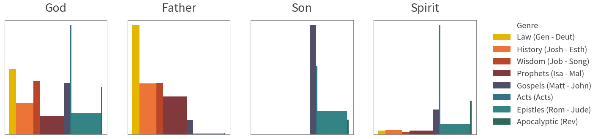
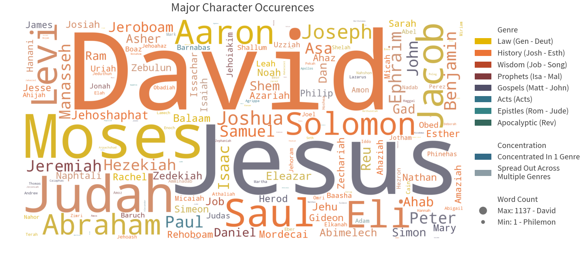
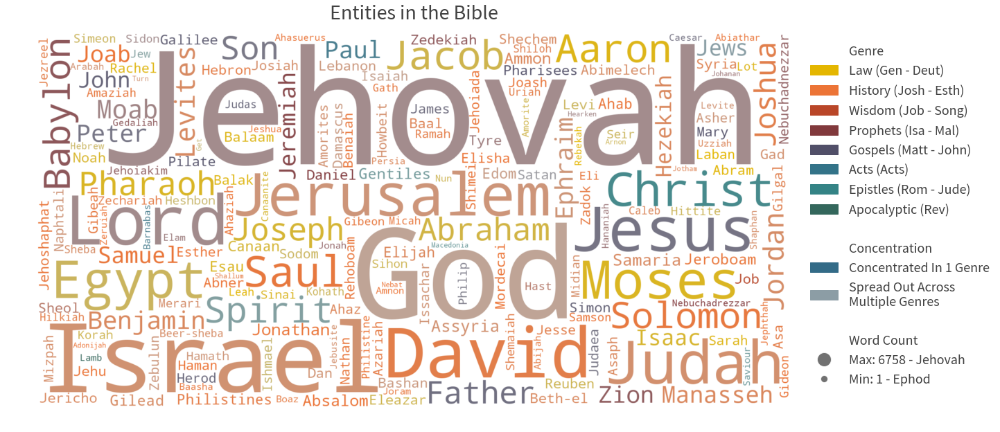

## Package Requirements

### Mac/Ubuntu Operating System
- Other OS-es have not been tested, and may cause unexpected errors.

### Git LFS
- If there exists a cache folder, you may need to install Git LFS
to pull files > 100 MB. Please follow instructions [here](https://github.com/git-lfs/git-lfs/wiki/Installation).
- After Git LFS is installed, type `git lfs pull` to download the large files in the project.
## Cloning the Repository

Cloning the repository is not as straightforward due to the presence of git submodules.

Please replicate the steps below in Terminal to ensure success.

``` sh
# Clone the repo as usual
git clone https://github.com/lemuelkumarga/bible-network

# Initialize submodule
cd bible-network
git submodule init
git submodule update

# When cloned, submodules are detached from the HEAD. We attempt to rectify this issue to prevent problems in git
cd shared
git checkout -b tmp
git checkout master
git merge tmp
git branch -d tmp

# Return to original folder if desired
cd ../../
```


# Constructing Social Networks in the Bible

### <i>Lemuel Kumarga</i>


## Problem Description

Our social circles are huge parts of our lives. They represent who we interact with, and how much we interact with them. With the digitization of communication and socialization, finding out this circle within each individual is an easier task than before. A simple glimpse into social networking sites such as Facebook and LinkedIn allows us to see who our friends are, whilst the frequency of digital communication can be used as a proxy of our closeness with them.

However, such information was not easily quantifiable in the pre-technology era. By attempting to model past lives using modern concepts, we could potentially gain further information about the past. For this project, we will use Natural Language Processing (NLP) concepts to <b>construct a social network for the bible, with the aim to depeen our understanding of the gospel.</b>


## Preliminaries

First load the necessary modules for this exercise.


```python
import sys
sys.path.append('shared/')
import defaults as _d

# Load All Main Modules
_d.load({"pd":"pandas",
         "math":"math",
         "cl":"collections",
         "np":"numpy",
         "sp":"scipy",
         "re":"re",
         "mpl":"matplotlib",
         "plotly":"plotly",
         "nltk":"nltk",
         "wordcloud":"wordcloud",
         "PIL":"PIL",
         "operator":"operator",
         "nx":"networkx",
         "pck":"pickle",
         "os":"os"},
         globals())

# Load All Submodules
from collections import OrderedDict
import matplotlib.pyplot as plt
import matplotlib.lines as mlines
import matplotlib.patches as mpatches
import plotly.offline as py
import plotly.graph_objs as py_go

# If you can't find the module, run nltk.download() in python
from nltk import sent_tokenize, word_tokenize

_d.stylize()
```


<script>requirejs.config({paths: { 'plotly': ['https://cdn.plot.ly/plotly-latest.min']},});if(!window.Plotly) {{require(['plotly'],function(plotly) {window.Plotly=plotly;});}}</script>


<link href="shared/css/defaults.css" rel="stylesheet"><link href="../../shared/css/definitions.css" rel="stylesheet"><link href="../../shared/css/general.css" rel="stylesheet"><link href="shared/css/python.css" rel="stylesheet"><script src="https://ajax.googleapis.com/ajax/libs/jquery/3.3.1/jquery.min.js"></script><script src="https://maxcdn.bootstrapcdn.com/bootstrap/3.3.7/js/bootstrap.min.js"></script><script src="shared/js/styles.js"></script><script src="shared/js/popover.js"></script>


We will also construct helper functions to be used later on.


```python
# -------------------------------------
# Genre-Related Functions
# -------------------------------------
def __get_genre_groups():
    global _genre_group
    if "_genre_group" not in globals():
        _genre_group = bible.groupby("Genre",sort=False)
    return _genre_group

def __get_genre_colors():
    global _genre_colors
    if "_genre_colors" not in globals():
        color_pal = _d.get_color("palette")(len(__get_genre_groups()))
        color_dict = dict()
        ind = 0
        for name, _ in __get_genre_groups():
            color_dict[name] = color_pal[ind]
            ind += 1
        _genre_colors = color_dict
    return _genre_colors

def __get_genre_legends(rev = True):
    global _genre_legends
    global _genre_legends_rev
    if "_genre_legends" not in globals():
        _genre_legends = [mpatches.Patch(color=_d.bg_color,label="Genre")]
        for name, group in __get_genre_groups():
            legend_text = name + " (" + group.index[0]
            if (len(group.index) > 1):
                legend_text += " - " + group.index[-1]
            legend_text += ")"
            _genre_legends.append(mpatches.Patch(color=__get_genre_colors()[name], label=legend_text))
        _genre_legends_rev = _genre_legends[:0:-1]
        _genre_legends_rev.insert(0,_genre_legends[0])
    
    if rev:
        return _genre_legends_rev
    else:
        return _genre_legends

# -------------------------------------
# Word-Cloud Related Functions
# -------------------------------------
def __word_cloud(input, fig_size = (20,10), image = None, colors = None):
    
    # Step 1: If there is an image specified, we need to create a mask
    mask = None
    if (image != None):
        mask = np.array(PIL.Image.open(image))
        if (colors == "image_colors"):
            colors = wordcloud.ImageColorGenerator(mask)
    
    # Step 2: Set up default colors
    def_colors = mpl.colors.ListedColormap(_d.get_color())
    
    # Step 3: Generate Word Cloud
    #https://stackoverflow.com/questions/43043437/wordcloud-python-with-generate-from-frequencies
    wc = wordcloud.WordCloud(height=fig_size[1]*100,
                             width=fig_size[0]*100,
                             background_color=_d.bg_color,
                             mask = mask,
                             colormap = def_colors,
                             color_func = colors).generate_from_frequencies(input)

    # Step 4: Plot Word Cloud
    plt.figure(figsize=fig_size)
    plt.imshow(wc, interpolation='bilinear')
    plt.axis("off")

__get_legend_separator = mpatches.Patch(color=_d.bg_color,label="")    
    
def __get_minmax_legends(input, title, key_format = "{:.2f}"):
    output = []
    output.append(mpatches.Patch(color=_d.bg_color,label=title))
    max_item = max(input.items(), key=operator.itemgetter(1))
    output.append(mlines.Line2D([0], [0], marker='o', color=_d.bg_color, label="Max: " + key_format.format(max_item[1]) + " - " + max_item[0],
                      markerfacecolor=_d.ltxt_color, markersize=20))
    min_item = min(input.items(), key=operator.itemgetter(1))
    output.append(mlines.Line2D([0], [0], marker='o', color=_d.bg_color, label="Min: " + key_format.format(min_item[1]) + " - " + min_item[0],
                      markerfacecolor=_d.ltxt_color, markersize=10))
    return output

__min_color = _d.pollute_color(_d.bg_color,_d.txt_color,0.4)
def __get_saturate_legends(title):
    output = []
    output.append(mpatches.Patch(color=_d.bg_color,label=title))
    output.append(mpatches.Patch(color=_d.get_color(0),label="Concentrated In 1 Genre"))
    output.append(mpatches.Patch(color=_d.pollute_color(__min_color,_d.get_color(0),0.3), label="Spread Out Across\nMultiple Genres"))
    return output
    
```

## Exploration

### Loading the Data

For this exercise, we will be using the bible <a data-toggle="popover" title="" data-content="A collection of texts" data-original-title="Corpus">corpus</a> from <a href="https://www.kaggle.com/oswinrh/bible/data" target="_blank">Kaggle.</a> The data will be stored in abbreviated book keys, with each book containing the following attributes:

* <span class="hl">Book Name</span>: Full name of the book
* <span class="hl">Testament</span>: New (NT) or old (OT)
* <span class="hl">Genre</span>: Genre of the book
* <span class="hl">Chapters</span>: Number of chapters
* <span class="hl">Verses</span>: Total number of verses
* <span class="hl">Text</span>: The actual text of the book


```python
# Get all book statistics
abb = pd.read_csv("data/key_abbreviations_english.csv")\
        .query('p == 1')[["a","b"]]\
        .rename(columns={"a" : "Key"})
ot_nt = pd.read_csv("data/key_english.csv")\
          .rename(columns={"n" : "Name", "t" : "Testament"})
genres = pd.read_csv("data/key_genre_english.csv")\
           .rename(columns={"n" : "Genre"})

# Load the main biblical text
bible = pd.read_csv("data/t_asv.csv")\
          .groupby("b", as_index=False)\
          .agg({"c": pd.Series.nunique, "v": "size", "t":" ".join})\
          .rename(columns={"c": "Chapters","v": "Verses","t": "Text"})
# Perform some cleaning
bible['Text'] = bible['Text'].apply(lambda t: re.sub("[`']","",t))

# Join the remaining book statistics
bible = bible.join(abb.set_index('b'), on='b')\
             .join(ot_nt.set_index('b'), on='b')\
             .join(genres.set_index('g'), on='g')\
             .drop(['b', 'g'], axis=1)\
             .set_index('Key')\
             [["Name","Testament","Genre","Chapters","Verses","Text"]]
            
# Show the first few lines
bible.head(5)
```


<div>
<style scoped>
    .dataframe tbody tr th:only-of-type {
        vertical-align: middle;
    }

    .dataframe tbody tr th {
        vertical-align: top;
    }

    .dataframe thead th {
        text-align: right;
    }
</style>
<table border="1" class="dataframe">
  <thead>
    <tr style="text-align: right;">
      <th></th>
      <th>Name</th>
      <th>Testament</th>
      <th>Genre</th>
      <th>Chapters</th>
      <th>Verses</th>
      <th>Text</th>
    </tr>
    <tr>
      <th>Key</th>
      <th></th>
      <th></th>
      <th></th>
      <th></th>
      <th></th>
      <th></th>
    </tr>
  </thead>
  <tbody>
    <tr>
      <th>Gen</th>
      <td>Genesis</td>
      <td>OT</td>
      <td>Law</td>
      <td>50</td>
      <td>1533</td>
      <td>In the beginning God created the heavens and t...</td>
    </tr>
    <tr>
      <th>Exo</th>
      <td>Exodus</td>
      <td>OT</td>
      <td>Law</td>
      <td>40</td>
      <td>1213</td>
      <td>Now these are the names of the sons of Israel,...</td>
    </tr>
    <tr>
      <th>Lev</th>
      <td>Leviticus</td>
      <td>OT</td>
      <td>Law</td>
      <td>27</td>
      <td>859</td>
      <td>And Jehovah called unto Moses, and spake unto ...</td>
    </tr>
    <tr>
      <th>Num</th>
      <td>Numbers</td>
      <td>OT</td>
      <td>Law</td>
      <td>36</td>
      <td>1288</td>
      <td>And Jehovah spake unto Moses in the wilderness...</td>
    </tr>
    <tr>
      <th>Deut</th>
      <td>Deuteronomy</td>
      <td>OT</td>
      <td>Law</td>
      <td>34</td>
      <td>959</td>
      <td>These are the words which Moses spake unto all...</td>
    </tr>
  </tbody>
</table>
</div>


### About the Data

We will also derive some language statistics from each book, mainly:

* <span class="hl">Sentences</span>: Number of sentences in each book.
* <span class="hl">Words</span>: Number of words in each book.


```python
# Add Sentences and Words columns
bible["Sentences"] = pd.Series(0, index=bible.index)
bible["Words"] = pd.Series(0, index=bible.index)

# Save Tokens
sent_tokens = OrderedDict()
word_tokens = OrderedDict()

for i, r in bible[["Text"]].iterrows():
    txt = r.str.cat()
    sent_tokens[i] = sent_tokenize(txt)
    word_tokens[i] = word_tokenize(txt)
    bible.at[i,'Sentences'] = len(sent_tokens[i])
    # Remove Punctuation
    bible.at[i,'Words'] = len([w for w in word_tokens[i] if re.match('\w+',w)])

# Show
bible[["Name","Testament","Genre","Chapters","Verses","Sentences","Words"]].head(5)
```


<div>
<style scoped>
    .dataframe tbody tr th:only-of-type {
        vertical-align: middle;
    }

    .dataframe tbody tr th {
        vertical-align: top;
    }

    .dataframe thead th {
        text-align: right;
    }
</style>
<table border="1" class="dataframe">
  <thead>
    <tr style="text-align: right;">
      <th></th>
      <th>Name</th>
      <th>Testament</th>
      <th>Genre</th>
      <th>Chapters</th>
      <th>Verses</th>
      <th>Sentences</th>
      <th>Words</th>
    </tr>
    <tr>
      <th>Key</th>
      <th></th>
      <th></th>
      <th></th>
      <th></th>
      <th></th>
      <th></th>
      <th></th>
    </tr>
  </thead>
  <tbody>
    <tr>
      <th>Gen</th>
      <td>Genesis</td>
      <td>OT</td>
      <td>Law</td>
      <td>50</td>
      <td>1533</td>
      <td>1756</td>
      <td>38097</td>
    </tr>
    <tr>
      <th>Exo</th>
      <td>Exodus</td>
      <td>OT</td>
      <td>Law</td>
      <td>40</td>
      <td>1213</td>
      <td>1116</td>
      <td>32177</td>
    </tr>
    <tr>
      <th>Lev</th>
      <td>Leviticus</td>
      <td>OT</td>
      <td>Law</td>
      <td>27</td>
      <td>859</td>
      <td>664</td>
      <td>23830</td>
    </tr>
    <tr>
      <th>Num</th>
      <td>Numbers</td>
      <td>OT</td>
      <td>Law</td>
      <td>36</td>
      <td>1288</td>
      <td>996</td>
      <td>32034</td>
    </tr>
    <tr>
      <th>Deut</th>
      <td>Deuteronomy</td>
      <td>OT</td>
      <td>Law</td>
      <td>34</td>
      <td>959</td>
      <td>745</td>
      <td>27952</td>
    </tr>
  </tbody>
</table>
</div>


#### Book Length

One of the most intuitive ways to understand the books' uneven distribution is to assume that we are doing devotions of each chapter a day. Under such a scenario, we will have the following timeline:   


```python
plt.figure(figsize=(20,5))
    
# Create Plots
yticks = []
ylabels = []
x_progress = 0
x_length = sum(bible["Chapters"])
y_progress = 0
y_length = len(bible["Chapters"])               
for name, group in __get_genre_groups():

    row_ids = [ bible.index.get_loc(i) for i in group.index ]

    # Part 1: Bars When Genre Is Still Being Read
    length = 0
    # For each book in the genre
    for idx in row_ids:

        # If we are reading this book in the anniversary 
        if (math.floor((x_progress + length)/365) < math.floor((x_progress + length + bible["Chapters"][idx])/365)):
            yticks.append(idx + 1)
            ylabels.append("{} ({}%)".format(bible.index[idx],round(idx/y_length * 100)))

        plt.broken_barh([(x_progress + length, bible["Chapters"][idx])],
                        (y_progress, (idx + 1) - y_progress),
                        facecolors = __get_genre_colors()[name])
        length += bible["Chapters"][idx]
    
    
    # Part 2: Bars When Genre has Been Read
    plt.broken_barh([(x_progress + length, x_length - x_progress - length)],
                    (y_progress, max(row_ids) + 1 - y_progress), 
                    facecolors = __get_genre_colors()[name])
    
    x_progress += length
    y_progress = max(row_ids) + 1
    

# Add Titles and Grid
plt.title("Chapter Distribution by Book")
plt.grid(color=_d.fade_color(_d.ltxt_color,0.5), linestyle='dashed')

# Add X-Axis Details
plt.xlabel("Time Since Start")
xticks = [365, 2 * 365, 3 * 365 ,sum(bible["Chapters"])]
xlabels = [ "Year 1", "Year 2", "Year 3", "Year 3\nMonth 3" ]
plt.xticks(xticks, xlabels)
plt.xlim(0,x_length)

# Add Y-Axis Details
yticks.append(y_length)
ylabels.append("{} ({}%)".format(bible.index[-1],round(1 * 100)))
plt.ylabel("% of Books Completed")
plt.yticks(yticks, ylabels)
plt.ylim(0, y_length)

# Add Legends
plt.legend(handles=__get_genre_legends(), bbox_to_anchor=[1.3, 1.0])

plt.show()
```


By the 1st year, we will have only completed 18% of the books on the bible. If this is not discouraging enough, after a further year, we would still not have completed the Old Testament (<span class="yellow-text">Law</span> to <span class="red-text">Prophets</span>). However, upon reaching the New Testament (<span class="blue-text">Gospels</span> to <span class="green-text">Apocalyptic</span>), we could complete the whole set of books within 9 months. The Old Testament is at least 3 times longer than the New Testament!

####  Chapter Length

Assuming that the average human reads <a href="http://www.readingsoft.com/" target="_blank">200 words per minute</a>, we can also estimate how long it will take to read 1 chapter every day:


```python
bible["Minutes_p_Chapter"] = bible["Words"] / bible["Chapters"] / 200.
inputs = []

deg_incr = 360. / len(bible.index)
for name, group in __get_genre_groups():
    
    # Insert Legend Item
    inputs.append(
        py_go.Scatterpolar(
            r = [0, 0, 0, 0],
            theta = [0, 0, 0, 0],
            name = name,
            legendgroup = name,
            mode = 'none',
            fill = 'toself',
            fillcolor = __get_genre_colors()[name],
            showlegend = True
        )
    
    )    
    
    # Insert Each Book
    for key, val in group["Minutes_p_Chapter"].items():
        inputs.append(
            py_go.Scatterpolar(
                r = [0, val, val, 0],
                theta = [0,bible.index.get_loc(key)*deg_incr,(bible.index.get_loc(key)+1)*deg_incr,0],
                name = bible["Name"][key],
                legendgroup = name,
                mode = 'none',
                hoverinfo ='text',
                text=bible["Name"][key] + ": " + "{:.1f}".format(val) + " min",
                fill = 'toself',
                fillcolor = __get_genre_colors()[name],
                showlegend = False
            )
        )


layout = py_go.Layout(_d.py_layout)
layout["autosize"] = False
layout["width"] = 450
layout["height"] = 350
layout["margin"] = dict(t=80,l=0,r=0,b=20)
layout["title"] = "Minutes Required to Read a Chapter"
layout["polar"]["angularaxis"]["visible"]=False

fig = py_go.Figure(data=inputs, layout=layout)
py.iplot(fig, config=_d.py_config)
```


<div id="949034db-619f-45c3-9bea-8fdd8695bd93" style="height: 350px; width: 450px;" class="plotly-graph-div"></div><script type="text/javascript">require(["plotly"], function(Plotly) { window.PLOTLYENV=window.PLOTLYENV || {};window.PLOTLYENV.BASE_URL="https://plot.ly";Plotly.newPlot("949034db-619f-45c3-9bea-8fdd8695bd93", [{"fill": "toself", "name": "Law", "showlegend": true, "legendgroup": "Law", "mode": "none", "r": [0, 0, 0, 0], "type": "scatterpolar", "fillcolor": "#e4b600", "theta": [0, 0, 0, 0]}, {"fill": "toself", "name": "Genesis", "showlegend": false, "r": [0, 3.8097000000000003, 3.8097000000000003, 0], "text": "Genesis: 3.8 min", "legendgroup": "Law", "mode": "none", "hoverinfo": "text", "type": "scatterpolar", "fillcolor": "#e4b600", "theta": [0, 0.0, 5.454545454545454, 0]}, {"fill": "toself", "name": "Exodus", "showlegend": false, "r": [0, 4.022125, 4.022125, 0], "text": "Exodus: 4.0 min", "legendgroup": "Law", "mode": "none", "hoverinfo": "text", "type": "scatterpolar", "fillcolor": "#e4b600", "theta": [0, 5.454545454545454, 10.909090909090908, 0]}, {"fill": "toself", "name": "Leviticus", "showlegend": false, "r": [0, 4.412962962962963, 4.412962962962963, 0], "text": "Leviticus: 4.4 min", "legendgroup": "Law", "mode": "none", "hoverinfo": "text", "type": "scatterpolar", "fillcolor": "#e4b600", "theta": [0, 10.909090909090908, 16.363636363636363, 0]}, {"fill": "toself", "name": "Numbers", "showlegend": false, "r": [0, 4.449166666666667, 4.449166666666667, 0], "text": "Numbers: 4.4 min", "legendgroup": "Law", "mode": "none", "hoverinfo": "text", "type": "scatterpolar", "fillcolor": "#e4b600", "theta": [0, 16.363636363636363, 21.818181818181817, 0]}, {"fill": "toself", "name": "Deuteronomy", "showlegend": false, "r": [0, 4.110588235294117, 4.110588235294117, 0], "text": "Deuteronomy: 4.1 min", "legendgroup": "Law", "mode": "none", "hoverinfo": "text", "type": "scatterpolar", "fillcolor": "#e4b600", "theta": [0, 21.818181818181817, 27.27272727272727, 0]}, {"fill": "toself", "name": "History", "showlegend": true, "legendgroup": "History", "mode": "none", "r": [0, 0, 0, 0], "type": "scatterpolar", "fillcolor": "#ec7436", "theta": [0, 0, 0, 0]}, {"fill": "toself", "name": "Joshua", "showlegend": false, "r": [0, 3.892916666666667, 3.892916666666667, 0], "text": "Joshua: 3.9 min", "legendgroup": "History", "mode": "none", "hoverinfo": "text", "type": "scatterpolar", "fillcolor": "#ec7436", "theta": [0, 27.27272727272727, 32.72727272727273, 0]}, {"fill": "toself", "name": "Judges", "showlegend": false, "r": [0, 4.486190476190476, 4.486190476190476, 0], "text": "Judges: 4.5 min", "legendgroup": "History", "mode": "none", "hoverinfo": "text", "type": "scatterpolar", "fillcolor": "#ec7436", "theta": [0, 32.72727272727273, 38.18181818181818, 0]}, {"fill": "toself", "name": "Ruth", "showlegend": false, "r": [0, 3.15625, 3.15625, 0], "text": "Ruth: 3.2 min", "legendgroup": "History", "mode": "none", "hoverinfo": "text", "type": "scatterpolar", "fillcolor": "#ec7436", "theta": [0, 38.18181818181818, 43.63636363636363, 0]}, {"fill": "toself", "name": "1 Samuel", "showlegend": false, "r": [0, 4.005483870967742, 4.005483870967742, 0], "text": "1 Samuel: 4.0 min", "legendgroup": "History", "mode": "none", "hoverinfo": "text", "type": "scatterpolar", "fillcolor": "#ec7436", "theta": [0, 43.63636363636363, 49.090909090909086, 0]}, {"fill": "toself", "name": "2 Samuel", "showlegend": false, "r": [0, 4.287083333333333, 4.287083333333333, 0], "text": "2 Samuel: 4.3 min", "legendgroup": "History", "mode": "none", "hoverinfo": "text", "type": "scatterpolar", "fillcolor": "#ec7436", "theta": [0, 49.090909090909086, 54.54545454545454, 0]}, {"fill": "toself", "name": "1 Kings", "showlegend": false, "r": [0, 5.52, 5.52, 0], "text": "1 Kings: 5.5 min", "legendgroup": "History", "mode": "none", "hoverinfo": "text", "type": "scatterpolar", "fillcolor": "#ec7436", "theta": [0, 54.54545454545454, 59.99999999999999, 0]}, {"fill": "toself", "name": "2 Kings", "showlegend": false, "r": [0, 4.6642, 4.6642, 0], "text": "2 Kings: 4.7 min", "legendgroup": "History", "mode": "none", "hoverinfo": "text", "type": "scatterpolar", "fillcolor": "#ec7436", "theta": [0, 59.99999999999999, 65.45454545454545, 0]}, {"fill": "toself", "name": "1 Chronicles", "showlegend": false, "r": [0, 3.4732758620689657, 3.4732758620689657, 0], "text": "1 Chronicles: 3.5 min", "legendgroup": "History", "mode": "none", "hoverinfo": "text", "type": "scatterpolar", "fillcolor": "#ec7436", "theta": [0, 65.45454545454545, 70.9090909090909, 0]}, {"fill": "toself", "name": "2 Chronicles", "showlegend": false, "r": [0, 3.5845833333333332, 3.5845833333333332, 0], "text": "2 Chronicles: 3.6 min", "legendgroup": "History", "mode": "none", "hoverinfo": "text", "type": "scatterpolar", "fillcolor": "#ec7436", "theta": [0, 70.9090909090909, 76.36363636363636, 0]}, {"fill": "toself", "name": "Ezra", "showlegend": false, "r": [0, 3.6885000000000003, 3.6885000000000003, 0], "text": "Ezra: 3.7 min", "legendgroup": "History", "mode": "none", "hoverinfo": "text", "type": "scatterpolar", "fillcolor": "#ec7436", "theta": [0, 76.36363636363636, 81.81818181818181, 0]}, {"fill": "toself", "name": "Nehemiah", "showlegend": false, "r": [0, 4.032692307692308, 4.032692307692308, 0], "text": "Nehemiah: 4.0 min", "legendgroup": "History", "mode": "none", "hoverinfo": "text", "type": "scatterpolar", "fillcolor": "#ec7436", "theta": [0, 81.81818181818181, 87.27272727272727, 0]}, {"fill": "toself", "name": "Esther", "showlegend": false, "r": [0, 2.8510000000000004, 2.8510000000000004, 0], "text": "Esther: 2.9 min", "legendgroup": "History", "mode": "none", "hoverinfo": "text", "type": "scatterpolar", "fillcolor": "#ec7436", "theta": [0, 87.27272727272727, 92.72727272727272, 0]}, {"fill": "toself", "name": "Wisdom", "showlegend": true, "legendgroup": "Wisdom", "mode": "none", "r": [0, 0, 0, 0], "type": "scatterpolar", "fillcolor": "#b94628", "theta": [0, 0, 0, 0]}, {"fill": "toself", "name": "Job", "showlegend": false, "r": [0, 2.176547619047619, 2.176547619047619, 0], "text": "Job: 2.2 min", "legendgroup": "Wisdom", "mode": "none", "hoverinfo": "text", "type": "scatterpolar", "fillcolor": "#b94628", "theta": [0, 92.72727272727272, 98.18181818181817, 0]}, {"fill": "toself", "name": "Psalms", "showlegend": false, "r": [0, 1.4546999999999999, 1.4546999999999999, 0], "text": "Psalms: 1.5 min", "legendgroup": "Wisdom", "mode": "none", "hoverinfo": "text", "type": "scatterpolar", "fillcolor": "#b94628", "theta": [0, 98.18181818181817, 103.63636363636363, 0]}, {"fill": "toself", "name": "Proverbs", "showlegend": false, "r": [0, 2.439516129032258, 2.439516129032258, 0], "text": "Proverbs: 2.4 min", "legendgroup": "Wisdom", "mode": "none", "hoverinfo": "text", "type": "scatterpolar", "fillcolor": "#b94628", "theta": [0, 103.63636363636363, 109.09090909090908, 0]}, {"fill": "toself", "name": "Ecclesiastes", "showlegend": false, "r": [0, 2.335, 2.335, 0], "text": "Ecclesiastes: 2.3 min", "legendgroup": "Wisdom", "mode": "none", "hoverinfo": "text", "type": "scatterpolar", "fillcolor": "#b94628", "theta": [0, 109.09090909090908, 114.54545454545453, 0]}, {"fill": "toself", "name": "Song of Solomon", "showlegend": false, "r": [0, 1.67375, 1.67375, 0], "text": "Song of Solomon: 1.7 min", "legendgroup": "Wisdom", "mode": "none", "hoverinfo": "text", "type": "scatterpolar", "fillcolor": "#b94628", "theta": [0, 114.54545454545453, 119.99999999999999, 0]}, {"fill": "toself", "name": "Prophets", "showlegend": true, "legendgroup": "Prophets", "mode": "none", "r": [0, 0, 0, 0], "type": "scatterpolar", "fillcolor": "#81393c", "theta": [0, 0, 0, 0]}, {"fill": "toself", "name": "Isaiah", "showlegend": false, "r": [0, 2.7772727272727273, 2.7772727272727273, 0], "text": "Isaiah: 2.8 min", "legendgroup": "Prophets", "mode": "none", "hoverinfo": "text", "type": "scatterpolar", "fillcolor": "#81393c", "theta": [0, 119.99999999999999, 125.45454545454544, 0]}, {"fill": "toself", "name": "Jeremiah", "showlegend": false, "r": [0, 4.06375, 4.06375, 0], "text": "Jeremiah: 4.1 min", "legendgroup": "Prophets", "mode": "none", "hoverinfo": "text", "type": "scatterpolar", "fillcolor": "#81393c", "theta": [0, 125.45454545454544, 130.9090909090909, 0]}, {"fill": "toself", "name": "Lamentations", "showlegend": false, "r": [0, 3.424, 3.424, 0], "text": "Lamentations: 3.4 min", "legendgroup": "Prophets", "mode": "none", "hoverinfo": "text", "type": "scatterpolar", "fillcolor": "#81393c", "theta": [0, 130.9090909090909, 136.36363636363635, 0]}, {"fill": "toself", "name": "Ezekiel", "showlegend": false, "r": [0, 4.0934375, 4.0934375, 0], "text": "Ezekiel: 4.1 min", "legendgroup": "Prophets", "mode": "none", "hoverinfo": "text", "type": "scatterpolar", "fillcolor": "#81393c", "theta": [0, 136.36363636363635, 141.8181818181818, 0]}, {"fill": "toself", "name": "Daniel", "showlegend": false, "r": [0, 4.86875, 4.86875, 0], "text": "Daniel: 4.9 min", "legendgroup": "Prophets", "mode": "none", "hoverinfo": "text", "type": "scatterpolar", "fillcolor": "#81393c", "theta": [0, 141.8181818181818, 147.27272727272725, 0]}, {"fill": "toself", "name": "Hosea", "showlegend": false, "r": [0, 1.8496428571428571, 1.8496428571428571, 0], "text": "Hosea: 1.8 min", "legendgroup": "Prophets", "mode": "none", "hoverinfo": "text", "type": "scatterpolar", "fillcolor": "#81393c", "theta": [0, 147.27272727272725, 152.72727272727272, 0]}, {"fill": "toself", "name": "Joel", "showlegend": false, "r": [0, 3.3033333333333332, 3.3033333333333332, 0], "text": "Joel: 3.3 min", "legendgroup": "Prophets", "mode": "none", "hoverinfo": "text", "type": "scatterpolar", "fillcolor": "#81393c", "theta": [0, 152.72727272727272, 158.18181818181816, 0]}, {"fill": "toself", "name": "Amos", "showlegend": false, "r": [0, 2.312222222222222, 2.312222222222222, 0], "text": "Amos: 2.3 min", "legendgroup": "Prophets", "mode": "none", "hoverinfo": "text", "type": "scatterpolar", "fillcolor": "#81393c", "theta": [0, 158.18181818181816, 163.63636363636363, 0]}, {"fill": "toself", "name": "Obadiah", "showlegend": false, "r": [0, 3.235, 3.235, 0], "text": "Obadiah: 3.2 min", "legendgroup": "Prophets", "mode": "none", "hoverinfo": "text", "type": "scatterpolar", "fillcolor": "#81393c", "theta": [0, 163.63636363636363, 169.09090909090907, 0]}, {"fill": "toself", "name": "Jonah", "showlegend": false, "r": [0, 1.6425, 1.6425, 0], "text": "Jonah: 1.6 min", "legendgroup": "Prophets", "mode": "none", "hoverinfo": "text", "type": "scatterpolar", "fillcolor": "#81393c", "theta": [0, 169.09090909090907, 174.54545454545453, 0]}, {"fill": "toself", "name": "Micah", "showlegend": false, "r": [0, 2.225714285714286, 2.225714285714286, 0], "text": "Micah: 2.2 min", "legendgroup": "Prophets", "mode": "none", "hoverinfo": "text", "type": "scatterpolar", "fillcolor": "#81393c", "theta": [0, 174.54545454545453, 180.0, 0]}, {"fill": "toself", "name": "Nahum", "showlegend": false, "r": [0, 2.0533333333333332, 2.0533333333333332, 0], "text": "Nahum: 2.1 min", "legendgroup": "Prophets", "mode": "none", "hoverinfo": "text", "type": "scatterpolar", "fillcolor": "#81393c", "theta": [0, 180.0, 185.45454545454544, 0]}, {"fill": "toself", "name": "Habakkuk", "showlegend": false, "r": [0, 2.4016666666666664, 2.4016666666666664, 0], "text": "Habakkuk: 2.4 min", "legendgroup": "Prophets", "mode": "none", "hoverinfo": "text", "type": "scatterpolar", "fillcolor": "#81393c", "theta": [0, 185.45454545454544, 190.9090909090909, 0]}, {"fill": "toself", "name": "Zephaniah", "showlegend": false, "r": [0, 2.663333333333333, 2.663333333333333, 0], "text": "Zephaniah: 2.7 min", "legendgroup": "Prophets", "mode": "none", "hoverinfo": "text", "type": "scatterpolar", "fillcolor": "#81393c", "theta": [0, 190.9090909090909, 196.36363636363635, 0]}, {"fill": "toself", "name": "Haggai", "showlegend": false, "r": [0, 2.7275, 2.7275, 0], "text": "Haggai: 2.7 min", "legendgroup": "Prophets", "mode": "none", "hoverinfo": "text", "type": "scatterpolar", "fillcolor": "#81393c", "theta": [0, 196.36363636363635, 201.8181818181818, 0]}, {"fill": "toself", "name": "Zechariah", "showlegend": false, "r": [0, 2.2578571428571426, 2.2578571428571426, 0], "text": "Zechariah: 2.3 min", "legendgroup": "Prophets", "mode": "none", "hoverinfo": "text", "type": "scatterpolar", "fillcolor": "#81393c", "theta": [0, 201.8181818181818, 207.27272727272725, 0]}, {"fill": "toself", "name": "Malachi", "showlegend": false, "r": [0, 2.16125, 2.16125, 0], "text": "Malachi: 2.2 min", "legendgroup": "Prophets", "mode": "none", "hoverinfo": "text", "type": "scatterpolar", "fillcolor": "#81393c", "theta": [0, 207.27272727272725, 212.72727272727272, 0]}, {"fill": "toself", "name": "Gospels", "showlegend": true, "legendgroup": "Gospels", "mode": "none", "r": [0, 0, 0, 0], "type": "scatterpolar", "fillcolor": "#514f68", "theta": [0, 0, 0, 0]}, {"fill": "toself", "name": "Matthew", "showlegend": false, "r": [0, 4.186964285714286, 4.186964285714286, 0], "text": "Matthew: 4.2 min", "legendgroup": "Gospels", "mode": "none", "hoverinfo": "text", "type": "scatterpolar", "fillcolor": "#514f68", "theta": [0, 212.72727272727272, 218.18181818181816, 0]}, {"fill": "toself", "name": "Mark", "showlegend": false, "r": [0, 4.6634375, 4.6634375, 0], "text": "Mark: 4.7 min", "legendgroup": "Gospels", "mode": "none", "hoverinfo": "text", "type": "scatterpolar", "fillcolor": "#514f68", "theta": [0, 218.18181818181816, 223.63636363636363, 0]}, {"fill": "toself", "name": "Luke", "showlegend": false, "r": [0, 5.3525, 5.3525, 0], "text": "Luke: 5.4 min", "legendgroup": "Gospels", "mode": "none", "hoverinfo": "text", "type": "scatterpolar", "fillcolor": "#514f68", "theta": [0, 223.63636363636363, 229.09090909090907, 0]}, {"fill": "toself", "name": "John", "showlegend": false, "r": [0, 4.536904761904762, 4.536904761904762, 0], "text": "John: 4.5 min", "legendgroup": "Gospels", "mode": "none", "hoverinfo": "text", "type": "scatterpolar", "fillcolor": "#514f68", "theta": [0, 229.09090909090907, 234.54545454545453, 0]}, {"fill": "toself", "name": "Acts", "showlegend": true, "legendgroup": "Acts", "mode": "none", "r": [0, 0, 0, 0], "type": "scatterpolar", "fillcolor": "#337388", "theta": [0, 0, 0, 0]}, {"fill": "toself", "name": "Acts", "showlegend": false, "r": [0, 4.3307142857142855, 4.3307142857142855, 0], "text": "Acts: 4.3 min", "legendgroup": "Acts", "mode": "none", "hoverinfo": "text", "type": "scatterpolar", "fillcolor": "#337388", "theta": [0, 234.54545454545453, 239.99999999999997, 0]}, {"fill": "toself", "name": "Epistles", "showlegend": true, "legendgroup": "Epistles", "mode": "none", "r": [0, 0, 0, 0], "type": "scatterpolar", "fillcolor": "#348385", "theta": [0, 0, 0, 0]}, {"fill": "toself", "name": "Romans", "showlegend": false, "r": [0, 2.9634375, 2.9634375, 0], "text": "Romans: 3.0 min", "legendgroup": "Epistles", "mode": "none", "hoverinfo": "text", "type": "scatterpolar", "fillcolor": "#348385", "theta": [0, 239.99999999999997, 245.45454545454544, 0]}, {"fill": "toself", "name": "1 Corinthians", "showlegend": false, "r": [0, 2.9409375, 2.9409375, 0], "text": "1 Corinthians: 2.9 min", "legendgroup": "Epistles", "mode": "none", "hoverinfo": "text", "type": "scatterpolar", "fillcolor": "#348385", "theta": [0, 245.45454545454544, 250.90909090909088, 0]}, {"fill": "toself", "name": "2 Corinthians", "showlegend": false, "r": [0, 2.3723076923076922, 2.3723076923076922, 0], "text": "2 Corinthians: 2.4 min", "legendgroup": "Epistles", "mode": "none", "hoverinfo": "text", "type": "scatterpolar", "fillcolor": "#348385", "theta": [0, 250.90909090909088, 256.3636363636363, 0]}, {"fill": "toself", "name": "Galatians", "showlegend": false, "r": [0, 2.605, 2.605, 0], "text": "Galatians: 2.6 min", "legendgroup": "Epistles", "mode": "none", "hoverinfo": "text", "type": "scatterpolar", "fillcolor": "#348385", "theta": [0, 256.3636363636363, 261.8181818181818, 0]}, {"fill": "toself", "name": "Ephesians", "showlegend": false, "r": [0, 2.5583333333333336, 2.5583333333333336, 0], "text": "Ephesians: 2.6 min", "legendgroup": "Epistles", "mode": "none", "hoverinfo": "text", "type": "scatterpolar", "fillcolor": "#348385", "theta": [0, 261.8181818181818, 267.27272727272725, 0]}, {"fill": "toself", "name": "Philippians", "showlegend": false, "r": [0, 2.78875, 2.78875, 0], "text": "Philippians: 2.8 min", "legendgroup": "Epistles", "mode": "none", "hoverinfo": "text", "type": "scatterpolar", "fillcolor": "#348385", "theta": [0, 267.27272727272725, 272.7272727272727, 0]}, {"fill": "toself", "name": "Colossians", "showlegend": false, "r": [0, 2.5, 2.5, 0], "text": "Colossians: 2.5 min", "legendgroup": "Epistles", "mode": "none", "hoverinfo": "text", "type": "scatterpolar", "fillcolor": "#348385", "theta": [0, 272.7272727272727, 278.1818181818182, 0]}, {"fill": "toself", "name": "1 Thessalonians", "showlegend": false, "r": [0, 1.837, 1.837, 0], "text": "1 Thessalonians: 1.8 min", "legendgroup": "Epistles", "mode": "none", "hoverinfo": "text", "type": "scatterpolar", "fillcolor": "#348385", "theta": [0, 278.1818181818182, 283.6363636363636, 0]}, {"fill": "toself", "name": "2 Thessalonians", "showlegend": false, "r": [0, 1.75, 1.75, 0], "text": "2 Thessalonians: 1.8 min", "legendgroup": "Epistles", "mode": "none", "hoverinfo": "text", "type": "scatterpolar", "fillcolor": "#348385", "theta": [0, 283.6363636363636, 289.09090909090907, 0]}, {"fill": "toself", "name": "1 Timothy", "showlegend": false, "r": [0, 1.9016666666666666, 1.9016666666666666, 0], "text": "1 Timothy: 1.9 min", "legendgroup": "Epistles", "mode": "none", "hoverinfo": "text", "type": "scatterpolar", "fillcolor": "#348385", "theta": [0, 289.09090909090907, 294.5454545454545, 0]}, {"fill": "toself", "name": "2 Timothy", "showlegend": false, "r": [0, 2.00625, 2.00625, 0], "text": "2 Timothy: 2.0 min", "legendgroup": "Epistles", "mode": "none", "hoverinfo": "text", "type": "scatterpolar", "fillcolor": "#348385", "theta": [0, 294.5454545454545, 300.0, 0]}, {"fill": "toself", "name": "Titus", "showlegend": false, "r": [0, 1.4983333333333335, 1.4983333333333335, 0], "text": "Titus: 1.5 min", "legendgroup": "Epistles", "mode": "none", "hoverinfo": "text", "type": "scatterpolar", "fillcolor": "#348385", "theta": [0, 300.0, 305.45454545454544, 0]}, {"fill": "toself", "name": "Philemon", "showlegend": false, "r": [0, 2.19, 2.19, 0], "text": "Philemon: 2.2 min", "legendgroup": "Epistles", "mode": "none", "hoverinfo": "text", "type": "scatterpolar", "fillcolor": "#348385", "theta": [0, 305.45454545454544, 310.9090909090909, 0]}, {"fill": "toself", "name": "Hebrews", "showlegend": false, "r": [0, 2.7053846153846153, 2.7053846153846153, 0], "text": "Hebrews: 2.7 min", "legendgroup": "Epistles", "mode": "none", "hoverinfo": "text", "type": "scatterpolar", "fillcolor": "#348385", "theta": [0, 310.9090909090909, 316.3636363636363, 0]}, {"fill": "toself", "name": "James", "showlegend": false, "r": [0, 2.3040000000000003, 2.3040000000000003, 0], "text": "James: 2.3 min", "legendgroup": "Epistles", "mode": "none", "hoverinfo": "text", "type": "scatterpolar", "fillcolor": "#348385", "theta": [0, 316.3636363636363, 321.8181818181818, 0]}, {"fill": "toself", "name": "1 Peter", "showlegend": false, "r": [0, 2.419, 2.419, 0], "text": "1 Peter: 2.4 min", "legendgroup": "Epistles", "mode": "none", "hoverinfo": "text", "type": "scatterpolar", "fillcolor": "#348385", "theta": [0, 321.8181818181818, 327.27272727272725, 0]}, {"fill": "toself", "name": "2 Peter", "showlegend": false, "r": [0, 2.57, 2.57, 0], "text": "2 Peter: 2.6 min", "legendgroup": "Epistles", "mode": "none", "hoverinfo": "text", "type": "scatterpolar", "fillcolor": "#348385", "theta": [0, 327.27272727272725, 332.7272727272727, 0]}, {"fill": "toself", "name": "1 John", "showlegend": false, "r": [0, 2.484, 2.484, 0], "text": "1 John: 2.5 min", "legendgroup": "Epistles", "mode": "none", "hoverinfo": "text", "type": "scatterpolar", "fillcolor": "#348385", "theta": [0, 332.7272727272727, 338.18181818181813, 0]}, {"fill": "toself", "name": "2 John", "showlegend": false, "r": [0, 1.495, 1.495, 0], "text": "2 John: 1.5 min", "legendgroup": "Epistles", "mode": "none", "hoverinfo": "text", "type": "scatterpolar", "fillcolor": "#348385", "theta": [0, 338.18181818181813, 343.6363636363636, 0]}, {"fill": "toself", "name": "3 John", "showlegend": false, "r": [0, 1.495, 1.495, 0], "text": "3 John: 1.5 min", "legendgroup": "Epistles", "mode": "none", "hoverinfo": "text", "type": "scatterpolar", "fillcolor": "#348385", "theta": [0, 343.6363636363636, 349.09090909090907, 0]}, {"fill": "toself", "name": "Jude", "showlegend": false, "r": [0, 3.145, 3.145, 0], "text": "Jude: 3.1 min", "legendgroup": "Epistles", "mode": "none", "hoverinfo": "text", "type": "scatterpolar", "fillcolor": "#348385", "theta": [0, 349.09090909090907, 354.5454545454545, 0]}, {"fill": "toself", "name": "Apocalyptic", "showlegend": true, "legendgroup": "Apocalyptic", "mode": "none", "r": [0, 0, 0, 0], "type": "scatterpolar", "fillcolor": "#34675c", "theta": [0, 0, 0, 0]}, {"fill": "toself", "name": "Revelation", "showlegend": false, "r": [0, 2.7590909090909093, 2.7590909090909093, 0], "text": "Revelation: 2.8 min", "legendgroup": "Apocalyptic", "mode": "none", "hoverinfo": "text", "type": "scatterpolar", "fillcolor": "#34675c", "theta": [0, 354.5454545454545, 360.0, 0]}], {"margin": {"l": 0, "b": 20, "r": 0, "t": 80}, "title": "Minutes Required to Read a Chapter", "xaxis": {"color": "#424242bf"}, "polar": {"radialaxis": {"color": "#424242bf"}, "angularaxis": {"direction": "clockwise", "visible": false, "color": "#424242bf"}, "bgcolor": "#ffffff"}, "autosize": false, "yaxis": {"color": "#424242bf"}, "font": {"color": "#424242", "family": "Source Sans Pro"}, "width": 450, "height": 350, "plot_bgcolor": "#ffffff", "paper_bgcolor": "#ffffff"}, {"modeBarButtonsToRemove": ["toImage", "select2d", "lasso2d", "zoomIn2d", "zoomOut2d", "autoScale2d", "toggleSpikelines", "hoverClosestCartesian", "hoverCompareCartesian", "toggleHover", "sendDataToCloud"], "linkText": "Export to plot.ly", "showLink": true})});</script>


From the chart above, we conclude that chapter lengths across books are varied as well. For example, a chapter in <span class="hl orange-text">1 Kings</span> will take around 5.5 minutes to read, whilst a chapter in <span class="hl red-text">Psalms</span> will take around 1.5 minutes to read. 

### Preliminary Insights

After obtaining an overview of the bible as a text, we will proceed to investigate the occurences of various characters in the bible.

#### The Trinity

The first point of interest is how much God appears at different book in the bible:


```python
def find_occurence(regex):
    output = OrderedDict()
    for name, group in __get_genre_groups():
        l = [len(re.findall(regex,wt.str.cat())) for _, wt in group[["Text"]].iterrows()]
        output[name] = (len(l),sum(l)/len(l))
    return output

entityToSearch = OrderedDict([('God', 'God|Lord|GOD|LORD'),
                              ('Father','Jehovah|Father'),
                              ('Son','Jesus|Christ|Emmanuel'),
                              ('Spirit','Spirit')])

ind = 0
# Construct Plots for Each Entity
f, splt = plt.subplots(1,len(entityToSearch.items()), figsize=(20,5))
for title, regex in entityToSearch.items():
    occurences = find_occurence(regex)
    splt[ind].set_title(title)
    splt[ind].set_xticks([])
    splt[ind].set_yticks([])
    x = 0
    for n, v in occurences.items():
        splt[ind].bar([x + v[0]/2],
                      [v[1]],
                      color = __get_genre_colors()[n],
                      width = v[0])
        x += v[0]
    ind += 1

# Insert Legends
plt.legend(handles=__get_genre_legends(False), bbox_to_anchor = [2.2, 1.05])

plt.show()
```





Unsurprisingly, words associated with God the Father (Jehovah/Father) appears prominently in the Old Testament, while words associated with God the Son (Jesus/Christ) hits a high frequency in the Gospel narratives. Word counts of the Spirit appears the highest in Acts. This sequence is in line with the story of the Gospel, where the events first transcribed were between God the Father and His people, followed by Jesus Christ and his believers, and finally with the Holy Spirit and the church.

(Note: The limitation of such an approach is the failure to capture regular words meant to symbolize God. For example, words such as "Lamb" in Revelations correspond to Christ, but such symbols were excluded as they would introduce false positives.)

#### Major Characters

Using <a href="http://bibleblender.com/2014/biblical-lessons/biblical-history/complete-list-of-major-minor-characters-in-bible" target="_blank">external sources</a>, we can also obtain a list of the major characters in the bible. This list can then be used as a reference to detect names within the bible:


```python
# Characters obtained from http://bibleblender.com/2014/biblical-lessons/biblical-history/complete-list-of-major-minor-characters-in-bible
characters_regex = 'Adam|Seth|Enos|Kenan|Mahalalel|Jared|Enoch|Methuselah|Lamech|Noah|Shem|Adam|Cain|Enoch|Irad|Mehujael|Methusael|Lamech|Tubal-cain|Arpachshad|Shelah|Eber|Peleg|Reu|Serug|Nahor|Terah|Abraham|Isaac|Jacob|Judah|Perez|Hezron|Ram|Amminadab|Nahshon|Salmon|Boaz|Obed|Jesse|David|Abel|Kenan|Enoch|Noah |Abraham|Isaac|Jacob|Joseph|Sarah|Rebecca|Rachel|Leah|Moses|Aaron|Miriam|Eldad|Medad|Phinehas|Joshua|Deborah|Gideon|Eli|Elkanah|Hannah|Abigail|Samuel|Gad|Nathan|David|Solomon|Jeduthun|Ahijah|Elijah|Elisha|Shemaiah|Iddo|Hanani|Jehu|Micaiah|Jahaziel|Eliezer|Zechariah|Huldah|Isaiah|Jeremiah|Ezekiel|Daniel|Hosea|Joel|Amos|Obadiah|Jonah|Micah|Nahum|Habakkuk|Zephaniah|Haggai|Zechariah|Malachi|Beor|Balaam|Job|Amoz|Beeri|Baruch|Agur|Uriah|Buzi|Mordecai|Esther|Oded|Azariah|Abimelech|Saul|Ish-boseth|David|Solomon|Jeroboam|Nadab|Baasha|Elah|Zimri|Tibni|Omri|Ahab|Ahaziah|Jehoram|Jehu|Jehoahaz|Jehoash|Jeroboam|Zechariah|Shallum|Menahem|Pekahiah|Pekah|Hoshea|Rehoboam|Abijam|Asa|Jehoshaphat|Jehoram|Ahaziah|Athaliah|Jehoash|Amaziah|Uzziah|Jotham|Ahaz|Hezekiah|Manasseh|Amon|Josiah|Jehoahaz|Jehoiakim|Jeconiah|Zedekiah|Simon|John|Aristobulus|Alexander|Hyrcanus|Aristobulus|Antigonus|Herod|Herod|Herod|Philip|Salome|Agrippa|Agrippa|Simon|Aaron|Eleazar|Eli|Phinehas|Asher|Benjamin|Dan|Gad|Issachar|Joseph|Ephraim|Manasseh|Judah|Levi|Naphtali|Reuben|Simeon|Zebulun|Jesus|Mary|Joseph|James|Jude|Joses|Simon|Peter|Andrew|James|John|Philip|Bartholomew|Thomas|Matthew|James|Judas|Simon|Judas|Matthias|Paul|Barnabas|James|Jude|Caiaphas|Annas|Zechariah|Agabus|Anna|Simeon|John|Apollos|Aquila|Dionysius|Epaphras|Joseph|Lazarus|Luke|Mark|Martha|Mary|Mary|Nicodemus|Onesimus|Philemon'
character_freq = []
for name, group in __get_genre_groups():
    names = [re.findall(characters_regex,wt.str.cat()) for _, wt in group[["Text"]].iterrows()]
    l = [(w,name) for l in names for w in l]
    character_freq.extend(l)

# The frequency of each character occurence by genre
character_freq = nltk.ConditionalFreqDist(character_freq)

# Create color functions to determine the genre most associated with the character
def color_func(word, font_size, position, orientation, **kwargs):
    most_common_genre = character_freq[word].most_common(1)[0][0]
    intensity = 1. * character_freq[word][most_common_genre] / sum(character_freq[word].values())
    return _d.pollute_color(__min_color, __get_genre_colors()[most_common_genre],intensity)

# Plot word cloud for each name
inputs = {}
for n, fd in character_freq.items():
    inputs[n] = sum(fd.values())
__word_cloud(inputs, colors=color_func)

# Titles
plt.title("Major Character Occurences")

# Legends
legend_cloud = list(__get_genre_legends(False))
legend_cloud.append(__get_legend_separator)
legend_cloud.extend(__get_saturate_legends("Concentration"))
legend_cloud.append(__get_legend_separator)
legend_cloud.extend(__get_minmax_legends(inputs, "Word Count","{:d}"))
plt.legend(handles=legend_cloud, bbox_to_anchor = [1.28, 1.])
plt.show()


```





Based on the list, we conclude that <span class="hl orange-text">David</span> appears the most in the bible. In addition, his appearances seem to be concentrated within the <span class="hl orange-text">History</span> genre. This is in stark-contrast to <span class="hl">Jesus</span>, whose name appeared across multiple genres (in particular across the New Testament).

(Note: One limitation of this approach is the assumption that there is a 1-1 mapping for most names to the person. To improve the accuracy of the results, we would need to perform some name disambiguation - i.e. Does Saul refer to King Saul or Paul aka Saul? Does John refer to the disciple or the Baptist?. Unfortunately, such analysis are not within the scope of this project.) 

## Preparation

In order to construct a social network, we first need to identify the relevant entities in the bible. One approach is to find a list of characters from external sources, and then using that list to identify the entity. However, this method is <span class="hl">unscalable</span>. To illustrate this, suppose that we would like to construct a similar network for "Oliver Twist". Then, we would need to find a list of names associated with the book. But what happens if we are not able to find such a list? The project would come to a dead end.

As such, to reduce reliance on external sources, we need to develop a more robust approach in identifying the relevant characters in the bible.

### Finding the Entities

Fortunately, we are able to capture names due to the nature of English linguistics. Names fall under the category of "Proper Nouns", which we can detect using <a href="https://en.wikipedia.org/wiki/Part-of-speech_tagging" target="_blank">Part-of-Speech (POS) tagging</a>:


```python
tagged_word_tokens = OrderedDict((n, nltk.tag.pos_tag(wt)) for n, wt in word_tokens.items())
# Extract Only Proper Nouns and Add Index
proper_noun_tokens = OrderedDict((n, [(i, w[0]) for i, w in enumerate(wt) if w[1] == "NNP"]) for n, wt in tagged_word_tokens.items())
# Print 100 Most Common Words
noun_freq = nltk.FreqDist(w for n,wt in proper_noun_tokens.items() for i, w in wt)
", ".join([n for n, v in noun_freq.most_common(50)])
```


    'Jehovah, God, Israel, Lord, David, O, Jesus, Judah, Jerusalem, Thou, Moses, Egypt, Behold, Christ, Saul, Jacob, Aaron, Spirit, Babylon, Solomon, Son, Father, Abraham, Joseph, Joshua, Pharaoh, Jordan, Levites, Go, Thy, Ye, Moab, Psalm, Benjamin, Ephraim, My, Holy, A, Paul, Peter, Jews, Yea, Zion, Manasseh, Samuel, Jeremiah, Joab, John, Hezekiah, Isaac'


Based on the above, we have captured a majority of names by tagging them under Proper Nouns. However, there are also some false positive words such as <span class="hl">O, Go, Thy, Ye</span> that have to be removed. It is also interesting to see entities other than people. (For example, there are words such as <span class="hl">Jerusalem, Babylon</span> representing countries.) In the next section, we will determine how to handle each case.

### Managing the Cases

The first case to handle is the occurence of words which are not proper nouns (<span class="hl">O, Go, Thy, Ye</span>). To solve this, we simply need to exclude such words from consideration:


```python
false_npp = ['O','Thou','Behold','Go','Thy','Ye','My','A','Yea','Thus','Come',
             'Therefore','Wherefore','Be','So','Hear','ye','Psalm','Selah','Arise','Woe','King','Speak',
             'Almighty','Who','How','Chief','thy','Fear','Musician','Which','High','Take','Most',
             'Shall','Lo','Let','Praise','Make','Nay','Say','River','Art','Amen','South','Lest',
             'Bring','Oh','Remember','Did','Teacher','Sea','Whosoever','Do','Every','Unto','Know',
             'Are','Mine','See','Tell','Whoso','Gods','Wilt','Red','Holy','[',']','Mount', 'TR','Please',
             'Tent','Man','Passover','Meeting','Will','Again','Whoever','Savior','Ai','No','May','Heaven',
             'Whose','unto','Ah','Bless','Ascribe','Return','Seek']
# Extract Only Proper Nouns and Add Index
proper_noun_tokens = OrderedDict((n, [(i, w) for i, w in wt if w not in false_npp]) for n, wt in proper_noun_tokens.items())
# Print 100 Most Common Words after excluding False Proper Nouns
noun_freq = nltk.FreqDist(w for n,wt in proper_noun_tokens.items() for i, w in wt)
", ".join([n for n, v in noun_freq.most_common(50)])
```


    'Jehovah, God, Israel, Lord, David, Jesus, Judah, Jerusalem, Moses, Egypt, Christ, Saul, Jacob, Aaron, Spirit, Babylon, Solomon, Son, Father, Abraham, Joseph, Joshua, Pharaoh, Jordan, Levites, Moab, Benjamin, Ephraim, Paul, Peter, Jews, Zion, Manasseh, Samuel, Jeremiah, Joab, John, Hezekiah, Isaac, Assyria, Samaria, Jonathan, Ammon, Jehovahs, Absalom, Gentiles, Jeroboam, Gilead, Philistines, Elijah'


The second case to consider is non-human entities. Some examples of these are nations (<span class="hl">Jerusalem, Babylon</span>), locations (<span class="hl">Galilee</span>) and false idols (<span class="hl">Baal</span>). Since the relationships between non-human entities can also yield useful insights, we will not be excluding such words.

The third case is symbols referencing to an entity (<span class="hl">Lord, Father, Son</span>). We will be including such words as well for the same reason as the second case.

### The Entity Cloud

Using the <span class="hl">Proper Noun</span> approach, we can subsequently plot these entities into a word cloud:


```python
# The frequency of each character occurence by genre
character_freq = nltk.ConditionalFreqDist((w[1],bible["Genre"][n]) for n,wt in proper_noun_tokens.items() for w in wt)

# Create color functions to determine the genre most associated with the character
def color_func(word, font_size, position, orientation, **kwargs):
    most_common_genre = character_freq[word].most_common(1)[0][0]
    intensity = 1. * character_freq[word][most_common_genre] / sum(character_freq[word].values())
    return _d.pollute_color(__min_color, __get_genre_colors()[most_common_genre],intensity)

# Plot word cloud for each name
inputs = {}
for n, fd in character_freq.items():
    inputs[n] = sum(fd.values())
__word_cloud(inputs, colors=color_func)

# Titles
plt.title("Entities in the Bible")

# Legends
legend_cloud = list(__get_genre_legends(False))
legend_cloud.append(__get_legend_separator)
legend_cloud.extend(__get_saturate_legends("Concentration"))
legend_cloud.append(__get_legend_separator)
legend_cloud.extend(__get_minmax_legends(inputs, "Word Count","{:d}"))
plt.legend(handles=legend_cloud, bbox_to_anchor = [1.28, 1.])
plt.show()
```





As can be seen, we have now expanded the word cloud of major characters (<span class="orange-text">David</span>, <span class="purple-text">Jesus</span>) into a larger entity of names, nations, symbols (amongst others). There are also some interesting patterns starting to emerge. For once, the word <span class="purple-text hl">Jesus</span> is dispersed across multiple genres, while the word <span class="cyan-text hl">Christ</span> is concentrated within the Epistles!

## Constructing the Network

Now that we have obtained the list of entities in the bible, we can begin constructing the network.

### Vertices and Edges

The first step is to determine the building blocks of the network. Vertices can be defined as entities obtained in the previous chapter. For simplicity, an edge between two vertices A and B (i.e. edge between A and B) exists if the two entities are within a certain number of words to each other.

Since connections can vary between acquaintance to best friends, it is also important for us to quantify the degree of connectivity between two vertices. To account for this, we will define two measures, intimacy and proximity.

#### Intimacy

Intimacy is the degree of closeness between two entities. A higher intimacy indicates that the two entities are close, while a lower intimacy suggests that the two entities are mere acquaintances.

Calculating intimacy involves the interplay of two factors: the degree of repetition and the number of words between the two entities. If two entities are close to each other multiple times in the bible, then it is reasonable to suggest that they are closer than another two entities whose relationship is only stated once.

In addition, for each time there is a connection, we also have to account for the number of words between the two entities. A distance of 0 may imply that both entities are referring to the same person (Jesus Christ), while a longer distance may imply that both entities are several generations apart (Matthew 1).

This measure is important when determining the position of each node in the graph.

#### Proximity

Proximity is similar to intimacy, except that a smaller proximity implies closeness, with a longer proximity suggests distance. It is calculated by taking the inverse of intimacy and is used to determine "how near" an entity is to another.


```python
vertices = inputs

# Construction parameters
intimacies = {}
dist_l = 50
decay = 0.25

# Calculate the Degree of Intimacy
# The closer the names are together, the higher the degree of intimacy
# The more repetitions of names being close together, the higher the degree of intimacy
# Loop Through Each Book
for k, l in proper_noun_tokens.items():
    # Loop Through Each Entity
    for i in range(len(l)):
        ind, ent = l[i]
        # On a fixed entity, compare with neighboring entities
        for i_hat in range(i+1, min(i+1+dist_l, len(l))):
            ind_hat, ent_hat = l[i_hat]
            # If the two entities are pretty close, create an edge connecting these two
            if (abs(ind - ind_hat) <= dist_l and ent != ent_hat):
                k = tuple(sorted([ent, ent_hat]))
                if (k not in intimacies):
                    intimacies[k] = np.exp(-1. * decay * abs(ind - ind_hat))
                else:
                    intimacies[k] += np.exp(-1. * decay * abs(ind - ind_hat))

# Calculate proximity, which is the inverse of intimacy
max_intimacy = max(intimacies.values())
proximities = dict((k, 1. * max_intimacy / v) for k,v in intimacies.items())
```

### The Social Network

Having defined the vertices and edges, we are now equipped to construct the network.


```python
# Construct the Graph
G = nx.Graph()
G.add_nodes_from(w for w,_ in vertices.items())
sorted_vertices = sorted(vertices.items(), key=operator.itemgetter(1), reverse = True)

G.add_weighted_edges_from((k[0], k[1], v) for k, v in intimacies.items())
nx.set_edge_attributes(G, values=proximities, name="proximity")

# ---------------- Derive Additional information About the Graph -----------------
# Save their Proximity To Each Other
filename = "cache/all_dijkstra_paths.pkl"
if (os.path.isfile(filename)):
    with open(filename, 'rb') as f:
        proximity_to = pck.load(f)
        f.close()
else:
    proximity_to = dict(nx.all_pairs_dijkstra_path_length(G, weight='proximity'))
    with open(filename, 'wb') as f:
        pck.dump(proximity_to, f, pck.HIGHEST_PROTOCOL)
        f.close()
    
nx.set_node_attributes(G, name='to_god', values=proximity_to['God'])

# Save Their Degree of Influence (Normalized to One With the Highest Degree)
k_factor = 0.50
inf_decay = -1* math.log(k_factor)
connectivity_max = max(G.degree(G.nodes()), key = lambda t : t[1])[1]
connectivities = dict((k, 100. * G.degree(k) / connectivity_max) for k,_ in vertices.items())
nx.set_node_attributes(G, name="connectivity", values=connectivities)

############################### Plotly Construction ###########################

# For illustrative purposes, let us show only the top 50 entities
n_show = 50
sub_G = G.subgraph(n for n, _ in sorted_vertices[:n_show])

pos = nx.spring_layout(sub_G, k=3.0)

############################### Prepare Vertices ##############################

# Construct Vertices Information for Plotly
v_plotly = {}
for node in sub_G.nodes():
    
    # Create Hover Text
    top_edges = sorted(G[node].items(),key=lambda v: v[1]["proximity"])[:5]
    p_to_god = G.node[node]["to_god"]
    outreach = G.node[node]["connectivity"]
    hovertext = "<b>Name: </b>{}<br>".format(node) + \
                "<b>Proximity to God:</b> {:.0f}<br>".format(p_to_god) + \
                "<b>Influence:</b> {:.0f}%<br>".format(outreach) + \
                "<b>Closest Neighbors (and Proximity):</b><br>" + \
                "<br>".join("{} ({:.0f})".format(e[0], e[1]["proximity"]) for e in top_edges)
    
    v_plotly[node] = {
        "x": pos[node][0],
        "y": pos[node][1],
        "size": min(vertices[node] / 500. * 30.,30),
        "color": _d.fade_color(_d.txt_color,0.3),
        "hovertext": hovertext,
        "rank": 9999 # To determine which color to be plotted
    }

############################### Prepare Edges ##############################
e_plotly = {}

# Define Edge Groups for Plotly
edge_groups = OrderedDict([
    ("Very Close (1-5)", {
        "range": [0, 5],
        "color": _d.get_color(0),
        "linew": 3.
    }),
    ("Close (6-25)", {
        "range": [6, 25],
        "color": _d.fade_color(_d.get_color(0),0.4),
        "linew": 2.
    }),
    ("Normal (26-75)", {
        "range": [26, 75],
        "color": _d.fade_color(_d.get_color(0),0.2),
        "linew": 1.
    }),
    ("Far (76-100)", {
        "range": [76, 100],
        "color": _d.fade_color(_d.get_color(0),0.1),
        "linew": 0.75       
    }),
    ("Very Far (>100)", {
        "range": [101, math.inf],
        "color": _d.fade_color(_d.get_color(0),0.1),
        "linew": 0.25       
    })
])

def find_edge_group_item(proximity):
    for k, v in edge_groups.items():
        l_b, u_b = v["range"]
        if l_b <= proximity and proximity <= u_b:         
            return (k, v)
        
# Construct Edges for Plotly
for edge in sub_G.edges():
    
    # Get Distance and Group
    proximity = int(G[edge[0]][edge[1]]["proximity"])
    g_name, g_attrs = find_edge_group_item(proximity)
    
    # Positions
    x0, y0 = pos[edge[0]]
    x1, y1 = pos[edge[1]]
    
    e_plotly[edge[0] + "-" + edge[1]] = {
        "nodes" : [edge[0], edge[1]],
        "x": [x0, x1],
        "y": [y0, y1],
        "group": g_name,
        "color": g_attrs["color"],
        "linewidth": g_attrs["linew"],
        "proximity": proximity
    }
    
    # Update Information on Vertices End
    v_plotly[edge[0]]["rank"] = min(proximity, v_plotly[edge[0]]["rank"])
    v_plotly[edge[1]]["rank"] = min(proximity, v_plotly[edge[1]]["rank"])
  

# Update Vertices Color Based on Ranking
for k, v in v_plotly.items():
    _, g_attr = find_edge_group_item(v["rank"])
    v["color"] = g_attr["color"]

############################### Draw Elements ##############################
# Create Elements For Plotly
data = []

# Edges First So That Vertices Are In Front of Nodes
for k,v in sorted(e_plotly.items(), key=lambda e: e[1]["proximity"], reverse=True):
    data.append(py_go.Scatter(
        mode="lines",
        line=py_go.Line(
            width=v["linewidth"],
            color=v["color"]
        ),
        
        x=v["x"],
        y=v["y"],
        
        legendgroup=v["group"],
        showlegend = False,
        
        hoverinfo="none"
    ))
    
# Vertices Next
data.append(py_go.Scatter(
    mode='markers+text',
    marker=py_go.Marker(
        color=[v["color"] for _,v in v_plotly.items()],
        size=[v["size"] for _,v in v_plotly.items()]),
    textposition='bottom',
    
    x=[v["x"] for _,v in v_plotly.items()],
    y=[v["y"] for _,v in v_plotly.items()],
    text=[k for k in v_plotly.keys()],
    
    showlegend = False,
    
    hoverinfo='text',
    hovertext= [v["hovertext"] for _,v in v_plotly.items()]
))

# Append Legends
data.append(py_go.Scatter(
                name="Proximity",
                mode="none",
                x = [0,0], y = [0,0],

                showlegend = True,

                hoverinfo="none"
            ))

data.extend([ py_go.Scatter(
                name=k,
                mode="lines",
                line=py_go.Line(
                    color=v["color"]
                ),        
                x = [0,0], y = [0,0],

                legendgroup = k,
                showlegend = True,
    
                hoverinfo="none"
            ) for k, v in edge_groups.items() ])  

# Layouts
layout = py_go.Layout(_d.py_layout)
layout["title"] = "Social Network of Top " + str(n_show) + " Entities in The Bible"
layout["hovermode"]='closest'
layout["xaxis"] = py_go.XAxis(showgrid=False, zeroline=False, showticklabels=False)
layout["yaxis"] = py_go.YAxis(showgrid=False, zeroline=False, showticklabels=False)
fig = py_go.Figure(data=data,layout=layout)

py.iplot(fig, config=_d.py_config)
```


    ---------------------------------------------------------------------------

    UnpicklingError                           Traceback (most recent call last)

    <ipython-input-14-d9e9b83f8a69> in <module>()
         12 if (os.path.isfile(filename)):
         13     with open(filename, 'rb') as f:
    ---> 14         proximity_to = pck.load(f)
         15         f.close()
         16 else:


    UnpicklingError: invalid load key, 'v'.


Through the construction process, we have also calculated some useful information for each entity: <a data-toggle="popover" title="" data-content="The degree of closeness to God. Calculated by determining the shortest path from the entity to God (using proximity as weights)." data-original-title="Proximity to God">Proximity to God</a> and <a data-toggle="popover" title="" data-content="Number of nodes the entity is connected to, normalized by the maximum across all nodes." data-original-title="Influence">Influence</a>. These two measures will be discussed further in the subsequent section.

#### Proximity to God


```python
root_node = "God"
max_distance = 150
max_size_highlight = 30
horizontal_nodes = ['God','Jehovah','Israel','Lord','Jesus','Moses']

# Save Proximity To Root Nodes
to_root = proximity_to[root_node]

# Find Entities that are Within max_distance distances away from root node
to_root_sorted = sorted(to_root.items(), key=operator.itemgetter(1))
to_root_sorted = [(k,v) for k,v in to_root_sorted if v <= max_distance]

# Create Graph
G_to_root = nx.DiGraph()
G_to_root.add_node(root_node)
for k,v in to_root_sorted:
    G_to_root.add_path(nx.dijkstra_path(G,root_node,k, "proximity"))

# Determine Positions For Each Node
def get_width(n):
    # Base Case: Leaf of Tree
    if (not G_to_root[n]):
        return 1
    else:
        width = 0
        for neighbor in G_to_root[n].keys():
            width += get_width(neighbor)
        return width

pos = {}
def get_position(root=root_node, start=0., width=100.):

    pos[root] = (start + width / 2.,-1.*to_root[root])
    neighbors = sorted(G_to_root[root].keys(), key=lambda k: to_root[k])
    widths = dict((n,get_width(n)) for n in neighbors)
    total_width = sum(widths.values())

    s = start
    for n in neighbors:
        get_position(n, s, widths[n] / total_width * width)
        s += widths[n] / total_width * width

get_position() 

# Plot on matplotlib
plt.figure(figsize=(30,12))
plt.title("Paths to " + root_node)
plt.axis('off')

highlighted_nodes = [ k for k in G_to_root.nodes() if vertices[k] <= max_size_highlight]

def plot_edges(root=root_node):
    for n in G_to_root[root].keys():
        plot_edges(n)
        is_highlighted = any(nx.has_path(G_to_root,n,hn) for hn in highlighted_nodes)
        plt.plot([pos[root][0],pos[n][0],pos[n][0]],
                 [pos[root][1],pos[root][1],pos[n][1]],
                color=_d.get_color(0) if is_highlighted else _d.fade_color(_d.txt_color,0.3),
                linewidth= 2. if is_highlighted else 1.)
plot_edges()

def plot_vertices():
    for n, p in pos.items():
        
        if (n in highlighted_nodes):
            bg_color = _d.get_color(0)
            color = _d.bg_color
            prefix = " "
            pad = 2
        else:
            if (any(nx.has_path(G_to_root,n,hn) for hn in highlighted_nodes)):
                color = _d.get_color(0)
            else:
                color = _d.fade_color(_d.txt_color,0.5)
            bg_color = _d.bg_color + "dd"
            prefix = ""
            pad = 1

        plt.text(p[0],p[1],prefix + n,
                 size = 25,
                 rotation=0 if n in horizontal_nodes else 90,
                 ha='center',va='center',
                 bbox={'facecolor': bg_color,'edgecolor':'none','pad': pad},
                 color=color)
plot_vertices()

plt.show()
```


#### Influence

### Network Slices

## Summary of Results
