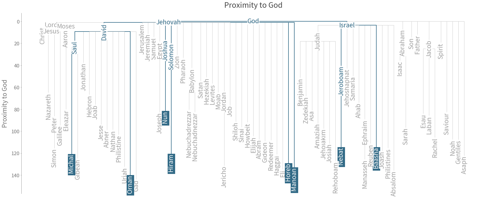
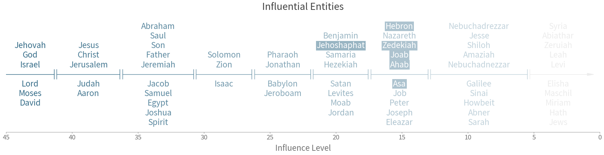

## Package Requirements

### Mac/Ubuntu Operating System
- Other OS-es have not been tested, and may cause unexpected errors.

### Git LFS
- If there exists a cache folder, you may need to install Git LFS
to pull files > 100 MB. Please follow instructions [here](https://github.com/git-lfs/git-lfs/wiki/Installation).
- After Git LFS is installed, type `git lfs pull` to download the large files in the project.


## Cloning the Repository

Cloning the repository is not as straightforward due to the presence of git submodules.

Please replicate the steps below in Terminal to ensure success.

``` sh
# Clone the repo as usual
git clone https://github.com/lemuelkumarga/bible-network

# Initialize submodule
cd bible-network
git submodule init
git submodule update

# When cloned, submodules are detached from the HEAD. We attempt to rectify this issue to prevent problems in git
cd shared
git checkout -b tmp
git checkout master
git merge tmp
git branch -d tmp

# Return to original folder if desired
cd ../../
```


# Constructing Social Networks in the Bible

### <i>Lemuel Kumarga</i>


## Problem Description

Our social circles are huge parts of our lives. They represent who we interact with, and how much we interact with them. With the digitization of communication and socialization, finding out this circle within each individual is an easier task than before. A simple glimpse into social networking sites such as Facebook and LinkedIn allows us to see who our friends are, whilst the frequency of digital communication can be used as a proxy of our closeness with them.

However, such information was not easily quantifiable in the pre-technology era. By attempting to model past lives using modern concepts, we could potentially gain further information about the past. For this project, we will use Natural Language Processing (NLP) concepts to <b>construct a social network for the bible, with the aim to depeen our understanding of the gospel.</b>


## Preliminaries

First load the necessary modules for this exercise.


```python
import sys
sys.path.append('shared/')
import defaults as _d

# Load All Main Modules
_d.load({"pd":"pandas",
         "math":"math",
         "cl":"collections",
         "np":"numpy",
         "sp":"scipy",
         "re":"re",
         "mpl":"matplotlib",
         "plotly":"plotly",
         "nltk":"nltk",
         "wordcloud":"wordcloud",
         "PIL":"PIL",
         "operator":"operator",
         "nx":"networkx",
         "pck":"pickle",
         "os":"os",
         "sklearn":"sklearn"},
         globals())

# Load All Submodules
from collections import OrderedDict
import matplotlib.pyplot as plt
import matplotlib.lines as mlines
import matplotlib.patches as mpatches
import plotly.offline as py
import plotly.graph_objs as py_go
from sklearn.cluster import MeanShift

# If you can't find the module, run nltk.download() in python
from nltk import sent_tokenize, word_tokenize

_d.stylize()
```


<script>requirejs.config({paths: { 'plotly': ['https://cdn.plot.ly/plotly-latest.min']},});if(!window.Plotly) {{require(['plotly'],function(plotly) {window.Plotly=plotly;});}}</script>


<link href="shared/css/defaults.css" rel="stylesheet"><link href="../../shared/css/definitions.css" rel="stylesheet"><link href="../../shared/css/general.css" rel="stylesheet"><link href="shared/css/python.css" rel="stylesheet"><script src="https://ajax.googleapis.com/ajax/libs/jquery/3.3.1/jquery.min.js"></script><script src="https://maxcdn.bootstrapcdn.com/bootstrap/3.3.7/js/bootstrap.min.js"></script><script src="shared/js/styles.js"></script><script src="shared/js/popover.js"></script>


We will also construct helper functions to be used later on.


```python
# -------------------------------------
# Genre-Related Functions
# -------------------------------------
def __get_genre_groups():
    global _genre_group
    if "_genre_group" not in globals():
        _genre_group = bible.groupby("Genre",sort=False)
    return _genre_group

def __get_genre_colors():
    global _genre_colors
    if "_genre_colors" not in globals():
        color_pal = _d.get_color("palette")(len(__get_genre_groups()))
        color_dict = dict()
        ind = 0
        for name, _ in __get_genre_groups():
            color_dict[name] = color_pal[ind]
            ind += 1
        _genre_colors = color_dict
    return _genre_colors

def __get_genre_legends(rev = True):
    global _genre_legends
    global _genre_legends_rev
    if "_genre_legends" not in globals():
        _genre_legends = [mpatches.Patch(color=_d.bg_color,label="Genre")]
        for name, group in __get_genre_groups():
            legend_text = name + " (" + group.index[0]
            if (len(group.index) > 1):
                legend_text += " - " + group.index[-1]
            legend_text += ")"
            _genre_legends.append(mpatches.Patch(color=__get_genre_colors()[name], label=legend_text))
        _genre_legends_rev = _genre_legends[:0:-1]
        _genre_legends_rev.insert(0,_genre_legends[0])
    
    if rev:
        return _genre_legends_rev
    else:
        return _genre_legends

# -------------------------------------
# Word-Cloud Related Functions
# -------------------------------------
def __word_cloud(input, fig_size = (20,10), image = None, colors = None):
    
    # Step 1: If there is an image specified, we need to create a mask
    mask = None
    if (image != None):
        mask = np.array(PIL.Image.open(image))
        if (colors == "image_colors"):
            colors = wordcloud.ImageColorGenerator(mask)
    
    # Step 2: Set up default colors
    def_colors = mpl.colors.ListedColormap(_d.get_color())
    
    # Step 3: Generate Word Cloud
    #https://stackoverflow.com/questions/43043437/wordcloud-python-with-generate-from-frequencies
    wc = wordcloud.WordCloud(height=fig_size[1]*100,
                             width=fig_size[0]*100,
                             background_color=_d.bg_color,
                             mask = mask,
                             colormap = def_colors,
                             color_func = colors).generate_from_frequencies(input)

    # Step 4: Plot Word Cloud
    plt.figure(figsize=fig_size)
    plt.imshow(wc, interpolation='bilinear')
    plt.axis("off")

__get_legend_separator = mpatches.Patch(color=_d.bg_color,label="")    
    
def __get_minmax_legends(input, title, key_format = "{:.2f}"):
    output = []
    output.append(mpatches.Patch(color=_d.bg_color,label=title))
    max_item = max(input.items(), key=operator.itemgetter(1))
    output.append(mlines.Line2D([0], [0], marker='o', color=_d.bg_color, label="Max: " + key_format.format(max_item[1]) + " - " + max_item[0],
                      markerfacecolor=_d.ltxt_color, markersize=20))
    min_item = min(input.items(), key=operator.itemgetter(1))
    output.append(mlines.Line2D([0], [0], marker='o', color=_d.bg_color, label="Min: " + key_format.format(min_item[1]) + " - " + min_item[0],
                      markerfacecolor=_d.ltxt_color, markersize=10))
    return output

__min_color = _d.pollute_color(_d.bg_color,_d.txt_color,0.4)
def __get_saturate_legends(title):
    output = []
    output.append(mpatches.Patch(color=_d.bg_color,label=title))
    output.append(mpatches.Patch(color=_d.get_color(0),label="Concentrated In 1 Genre"))
    output.append(mpatches.Patch(color=_d.pollute_color(__min_color,_d.get_color(0),0.3), label="Spread Out Across\nMultiple Genres"))
    return output
    
```

## Exploration

### Loading the Data

For this exercise, we will be using the bible <a data-toggle="popover" title="" data-content="A collection of texts" data-original-title="Corpus">corpus</a> from <a href="https://www.kaggle.com/oswinrh/bible/data" target="_blank">Kaggle.</a> The data will be stored in abbreviated book keys, with each book containing the following attributes:

* <span class="hl">Book Name</span>: Full name of the book
* <span class="hl">Testament</span>: New (NT) or old (OT)
* <span class="hl">Genre</span>: Genre of the book
* <span class="hl">Chapters</span>: Number of chapters
* <span class="hl">Verses</span>: Total number of verses
* <span class="hl">Text</span>: The actual text of the book


```python
# Get all book statistics
abb = pd.read_csv("data/key_abbreviations_english.csv")\
        .query('p == 1')[["a","b"]]\
        .rename(columns={"a" : "Key"})
ot_nt = pd.read_csv("data/key_english.csv")\
          .rename(columns={"n" : "Name", "t" : "Testament"})
genres = pd.read_csv("data/key_genre_english.csv")\
           .rename(columns={"n" : "Genre"})

# Load the main biblical text
bible = pd.read_csv("data/t_asv.csv")\
          .groupby("b", as_index=False)\
          .agg({"c": pd.Series.nunique, "v": "size", "t":" ".join})\
          .rename(columns={"c": "Chapters","v": "Verses","t": "Text"})
# Perform some cleaning
bible['Text'] = bible['Text'].apply(lambda t: re.sub("[`']","",t))

# Join the remaining book statistics
bible = bible.join(abb.set_index('b'), on='b')\
             .join(ot_nt.set_index('b'), on='b')\
             .join(genres.set_index('g'), on='g')\
             .drop(['b', 'g'], axis=1)\
             .set_index('Key')\
             [["Name","Testament","Genre","Chapters","Verses","Text"]]
            
# Show the first few lines
bible.head(5)
```


<div>
<style scoped>
    .dataframe tbody tr th:only-of-type {
        vertical-align: middle;
    }

    .dataframe tbody tr th {
        vertical-align: top;
    }

    .dataframe thead th {
        text-align: right;
    }
</style>
<table border="1" class="dataframe">
  <thead>
    <tr style="text-align: right;">
      <th></th>
      <th>Name</th>
      <th>Testament</th>
      <th>Genre</th>
      <th>Chapters</th>
      <th>Verses</th>
      <th>Text</th>
    </tr>
    <tr>
      <th>Key</th>
      <th></th>
      <th></th>
      <th></th>
      <th></th>
      <th></th>
      <th></th>
    </tr>
  </thead>
  <tbody>
    <tr>
      <th>Gen</th>
      <td>Genesis</td>
      <td>OT</td>
      <td>Law</td>
      <td>50</td>
      <td>1533</td>
      <td>In the beginning God created the heavens and t...</td>
    </tr>
    <tr>
      <th>Exo</th>
      <td>Exodus</td>
      <td>OT</td>
      <td>Law</td>
      <td>40</td>
      <td>1213</td>
      <td>Now these are the names of the sons of Israel,...</td>
    </tr>
    <tr>
      <th>Lev</th>
      <td>Leviticus</td>
      <td>OT</td>
      <td>Law</td>
      <td>27</td>
      <td>859</td>
      <td>And Jehovah called unto Moses, and spake unto ...</td>
    </tr>
    <tr>
      <th>Num</th>
      <td>Numbers</td>
      <td>OT</td>
      <td>Law</td>
      <td>36</td>
      <td>1288</td>
      <td>And Jehovah spake unto Moses in the wilderness...</td>
    </tr>
    <tr>
      <th>Deut</th>
      <td>Deuteronomy</td>
      <td>OT</td>
      <td>Law</td>
      <td>34</td>
      <td>959</td>
      <td>These are the words which Moses spake unto all...</td>
    </tr>
  </tbody>
</table>
</div>


### About the Data

We will also derive some language statistics from each book, mainly:

* <span class="hl">Sentences</span>: Number of sentences in each book.
* <span class="hl">Words</span>: Number of words in each book.


```python
# Add Sentences and Words columns
bible["Sentences"] = pd.Series(0, index=bible.index)
bible["Words"] = pd.Series(0, index=bible.index)

# Save Tokens
sent_tokens = OrderedDict()
word_tokens = OrderedDict()

for i, r in bible[["Text"]].iterrows():
    txt = r.str.cat()
    sent_tokens[i] = sent_tokenize(txt)
    word_tokens[i] = word_tokenize(txt)
    bible.at[i,'Sentences'] = len(sent_tokens[i])
    # Remove Punctuation
    bible.at[i,'Words'] = len([w for w in word_tokens[i] if re.match('\w+',w)])

# Show
bible[["Name","Testament","Genre","Chapters","Verses","Sentences","Words"]].head(5)
```


<div>
<style scoped>
    .dataframe tbody tr th:only-of-type {
        vertical-align: middle;
    }

    .dataframe tbody tr th {
        vertical-align: top;
    }

    .dataframe thead th {
        text-align: right;
    }
</style>
<table border="1" class="dataframe">
  <thead>
    <tr style="text-align: right;">
      <th></th>
      <th>Name</th>
      <th>Testament</th>
      <th>Genre</th>
      <th>Chapters</th>
      <th>Verses</th>
      <th>Sentences</th>
      <th>Words</th>
    </tr>
    <tr>
      <th>Key</th>
      <th></th>
      <th></th>
      <th></th>
      <th></th>
      <th></th>
      <th></th>
      <th></th>
    </tr>
  </thead>
  <tbody>
    <tr>
      <th>Gen</th>
      <td>Genesis</td>
      <td>OT</td>
      <td>Law</td>
      <td>50</td>
      <td>1533</td>
      <td>1756</td>
      <td>38097</td>
    </tr>
    <tr>
      <th>Exo</th>
      <td>Exodus</td>
      <td>OT</td>
      <td>Law</td>
      <td>40</td>
      <td>1213</td>
      <td>1116</td>
      <td>32177</td>
    </tr>
    <tr>
      <th>Lev</th>
      <td>Leviticus</td>
      <td>OT</td>
      <td>Law</td>
      <td>27</td>
      <td>859</td>
      <td>664</td>
      <td>23830</td>
    </tr>
    <tr>
      <th>Num</th>
      <td>Numbers</td>
      <td>OT</td>
      <td>Law</td>
      <td>36</td>
      <td>1288</td>
      <td>996</td>
      <td>32034</td>
    </tr>
    <tr>
      <th>Deut</th>
      <td>Deuteronomy</td>
      <td>OT</td>
      <td>Law</td>
      <td>34</td>
      <td>959</td>
      <td>745</td>
      <td>27952</td>
    </tr>
  </tbody>
</table>
</div>


#### Book Length

One of the most intuitive ways to understand the books' uneven distribution is to assume that we are doing devotions of each chapter a day. Under such a scenario, we will have the following timeline:   


```python
plt.figure(figsize=(20,5))
    
# Create Plots
yticks = []
ylabels = []
x_progress = 0
x_length = sum(bible["Chapters"])
y_progress = 0
y_length = len(bible["Chapters"])               
for name, group in __get_genre_groups():

    row_ids = [ bible.index.get_loc(i) for i in group.index ]

    # Part 1: Bars When Genre Is Still Being Read
    length = 0
    # For each book in the genre
    for idx in row_ids:

        # If we are reading this book in the anniversary 
        if (math.floor((x_progress + length)/365) < math.floor((x_progress + length + bible["Chapters"][idx])/365)):
            yticks.append(idx + 1)
            ylabels.append("{} ({}%)".format(bible.index[idx],round(idx/y_length * 100)))

        plt.broken_barh([(x_progress + length, bible["Chapters"][idx])],
                        (y_progress, (idx + 1) - y_progress),
                        facecolors = __get_genre_colors()[name])
        length += bible["Chapters"][idx]
    
    
    # Part 2: Bars When Genre has Been Read
    plt.broken_barh([(x_progress + length, x_length - x_progress - length)],
                    (y_progress, max(row_ids) + 1 - y_progress), 
                    facecolors = __get_genre_colors()[name])
    
    x_progress += length
    y_progress = max(row_ids) + 1
    

# Add Titles and Grid
plt.title("Chapter Distribution by Book")
plt.grid(color=_d.fade_color(_d.ltxt_color,0.5), linestyle='dashed')

# Add X-Axis Details
plt.xlabel("Time Since Start")
xticks = [365, 2 * 365, 3 * 365 ,sum(bible["Chapters"])]
xlabels = [ "Year 1", "Year 2", "Year 3", "Year 3\nMonth 3" ]
plt.xticks(xticks, xlabels)
plt.xlim(0,x_length)

# Add Y-Axis Details
yticks.append(y_length)
ylabels.append("{} ({}%)".format(bible.index[-1],round(1 * 100)))
plt.ylabel("% of Books Completed")
plt.yticks(yticks, ylabels)
plt.ylim(0, y_length)

# Add Legends
plt.legend(handles=__get_genre_legends(), bbox_to_anchor=[1.3, 1.0])

plt.show()
```


By the 1st year, we will have only completed 18% of the books on the bible. If this is not discouraging enough, after a further year, we would still not have completed the Old Testament (<span class="yellow-text">Law</span> to <span class="red-text">Prophets</span>). However, upon reaching the New Testament (<span class="blue-text">Gospels</span> to <span class="green-text">Apocalyptic</span>), we could complete the whole set of books within 9 months. The Old Testament is at least 3 times longer than the New Testament!

####  Chapter Length

Assuming that the average human reads <a href="http://www.readingsoft.com/" target="_blank">200 words per minute</a>, we can also estimate how long it will take to read 1 chapter every day:


```python
bible["Minutes_p_Chapter"] = bible["Words"] / bible["Chapters"] / 200.
inputs = []

deg_incr = 360. / len(bible.index)
for name, group in __get_genre_groups():
    
    # Insert Legend Item
    inputs.append(
        py_go.Scatterpolar(
            r = [0, 0, 0, 0],
            theta = [0, 0, 0, 0],
            name = name,
            legendgroup = name,
            mode = 'none',
            fill = 'toself',
            fillcolor = __get_genre_colors()[name],
            showlegend = True
        )
    
    )    
    
    # Insert Each Book
    for key, val in group["Minutes_p_Chapter"].items():
        inputs.append(
            py_go.Scatterpolar(
                r = [0, val, val, 0],
                theta = [0,bible.index.get_loc(key)*deg_incr,(bible.index.get_loc(key)+1)*deg_incr,0],
                name = bible["Name"][key],
                legendgroup = name,
                mode = 'none',
                hoverinfo ='text',
                text=bible["Name"][key] + ": " + "{:.1f}".format(val) + " min",
                fill = 'toself',
                fillcolor = __get_genre_colors()[name],
                showlegend = False
            )
        )


layout = py_go.Layout(_d.py_layout)
layout["autosize"] = False
layout["width"] = 450
layout["height"] = 350
layout["margin"] = dict(t=80,l=0,r=0,b=20)
layout["title"] = "Minutes Required to Read a Chapter"
layout["polar"]["angularaxis"]["visible"]=False

fig = py_go.Figure(data=inputs, layout=layout)
py.iplot(fig, config=_d.py_config)
```


<div id="b0432538-e1ee-4a52-845d-e85beb892a74" style="height: 350px; width: 450px;" class="plotly-graph-div"></div><script type="text/javascript">require(["plotly"], function(Plotly) { window.PLOTLYENV=window.PLOTLYENV || {};window.PLOTLYENV.BASE_URL="https://plot.ly";Plotly.newPlot("b0432538-e1ee-4a52-845d-e85beb892a74", [{"type": "scatterpolar", "r": [0, 0, 0, 0], "theta": [0, 0, 0, 0], "name": "Law", "legendgroup": "Law", "mode": "none", "fill": "toself", "fillcolor": "#e4b600", "showlegend": true}, {"type": "scatterpolar", "r": [0, 3.8097000000000003, 3.8097000000000003, 0], "theta": [0, 0.0, 5.454545454545454, 0], "name": "Genesis", "legendgroup": "Law", "mode": "none", "hoverinfo": "text", "text": "Genesis: 3.8 min", "fill": "toself", "fillcolor": "#e4b600", "showlegend": false}, {"type": "scatterpolar", "r": [0, 4.022125, 4.022125, 0], "theta": [0, 5.454545454545454, 10.909090909090908, 0], "name": "Exodus", "legendgroup": "Law", "mode": "none", "hoverinfo": "text", "text": "Exodus: 4.0 min", "fill": "toself", "fillcolor": "#e4b600", "showlegend": false}, {"type": "scatterpolar", "r": [0, 4.412962962962963, 4.412962962962963, 0], "theta": [0, 10.909090909090908, 16.363636363636363, 0], "name": "Leviticus", "legendgroup": "Law", "mode": "none", "hoverinfo": "text", "text": "Leviticus: 4.4 min", "fill": "toself", "fillcolor": "#e4b600", "showlegend": false}, {"type": "scatterpolar", "r": [0, 4.449166666666667, 4.449166666666667, 0], "theta": [0, 16.363636363636363, 21.818181818181817, 0], "name": "Numbers", "legendgroup": "Law", "mode": "none", "hoverinfo": "text", "text": "Numbers: 4.4 min", "fill": "toself", "fillcolor": "#e4b600", "showlegend": false}, {"type": "scatterpolar", "r": [0, 4.110588235294117, 4.110588235294117, 0], "theta": [0, 21.818181818181817, 27.27272727272727, 0], "name": "Deuteronomy", "legendgroup": "Law", "mode": "none", "hoverinfo": "text", "text": "Deuteronomy: 4.1 min", "fill": "toself", "fillcolor": "#e4b600", "showlegend": false}, {"type": "scatterpolar", "r": [0, 0, 0, 0], "theta": [0, 0, 0, 0], "name": "History", "legendgroup": "History", "mode": "none", "fill": "toself", "fillcolor": "#ec7436", "showlegend": true}, {"type": "scatterpolar", "r": [0, 3.892916666666667, 3.892916666666667, 0], "theta": [0, 27.27272727272727, 32.72727272727273, 0], "name": "Joshua", "legendgroup": "History", "mode": "none", "hoverinfo": "text", "text": "Joshua: 3.9 min", "fill": "toself", "fillcolor": "#ec7436", "showlegend": false}, {"type": "scatterpolar", "r": [0, 4.486190476190476, 4.486190476190476, 0], "theta": [0, 32.72727272727273, 38.18181818181818, 0], "name": "Judges", "legendgroup": "History", "mode": "none", "hoverinfo": "text", "text": "Judges: 4.5 min", "fill": "toself", "fillcolor": "#ec7436", "showlegend": false}, {"type": "scatterpolar", "r": [0, 3.15625, 3.15625, 0], "theta": [0, 38.18181818181818, 43.63636363636363, 0], "name": "Ruth", "legendgroup": "History", "mode": "none", "hoverinfo": "text", "text": "Ruth: 3.2 min", "fill": "toself", "fillcolor": "#ec7436", "showlegend": false}, {"type": "scatterpolar", "r": [0, 4.005483870967742, 4.005483870967742, 0], "theta": [0, 43.63636363636363, 49.090909090909086, 0], "name": "1 Samuel", "legendgroup": "History", "mode": "none", "hoverinfo": "text", "text": "1 Samuel: 4.0 min", "fill": "toself", "fillcolor": "#ec7436", "showlegend": false}, {"type": "scatterpolar", "r": [0, 4.287083333333333, 4.287083333333333, 0], "theta": [0, 49.090909090909086, 54.54545454545454, 0], "name": "2 Samuel", "legendgroup": "History", "mode": "none", "hoverinfo": "text", "text": "2 Samuel: 4.3 min", "fill": "toself", "fillcolor": "#ec7436", "showlegend": false}, {"type": "scatterpolar", "r": [0, 5.52, 5.52, 0], "theta": [0, 54.54545454545454, 59.99999999999999, 0], "name": "1 Kings", "legendgroup": "History", "mode": "none", "hoverinfo": "text", "text": "1 Kings: 5.5 min", "fill": "toself", "fillcolor": "#ec7436", "showlegend": false}, {"type": "scatterpolar", "r": [0, 4.6642, 4.6642, 0], "theta": [0, 59.99999999999999, 65.45454545454545, 0], "name": "2 Kings", "legendgroup": "History", "mode": "none", "hoverinfo": "text", "text": "2 Kings: 4.7 min", "fill": "toself", "fillcolor": "#ec7436", "showlegend": false}, {"type": "scatterpolar", "r": [0, 3.4732758620689657, 3.4732758620689657, 0], "theta": [0, 65.45454545454545, 70.9090909090909, 0], "name": "1 Chronicles", "legendgroup": "History", "mode": "none", "hoverinfo": "text", "text": "1 Chronicles: 3.5 min", "fill": "toself", "fillcolor": "#ec7436", "showlegend": false}, {"type": "scatterpolar", "r": [0, 3.5845833333333332, 3.5845833333333332, 0], "theta": [0, 70.9090909090909, 76.36363636363636, 0], "name": "2 Chronicles", "legendgroup": "History", "mode": "none", "hoverinfo": "text", "text": "2 Chronicles: 3.6 min", "fill": "toself", "fillcolor": "#ec7436", "showlegend": false}, {"type": "scatterpolar", "r": [0, 3.6885000000000003, 3.6885000000000003, 0], "theta": [0, 76.36363636363636, 81.81818181818181, 0], "name": "Ezra", "legendgroup": "History", "mode": "none", "hoverinfo": "text", "text": "Ezra: 3.7 min", "fill": "toself", "fillcolor": "#ec7436", "showlegend": false}, {"type": "scatterpolar", "r": [0, 4.032692307692308, 4.032692307692308, 0], "theta": [0, 81.81818181818181, 87.27272727272727, 0], "name": "Nehemiah", "legendgroup": "History", "mode": "none", "hoverinfo": "text", "text": "Nehemiah: 4.0 min", "fill": "toself", "fillcolor": "#ec7436", "showlegend": false}, {"type": "scatterpolar", "r": [0, 2.8510000000000004, 2.8510000000000004, 0], "theta": [0, 87.27272727272727, 92.72727272727272, 0], "name": "Esther", "legendgroup": "History", "mode": "none", "hoverinfo": "text", "text": "Esther: 2.9 min", "fill": "toself", "fillcolor": "#ec7436", "showlegend": false}, {"type": "scatterpolar", "r": [0, 0, 0, 0], "theta": [0, 0, 0, 0], "name": "Wisdom", "legendgroup": "Wisdom", "mode": "none", "fill": "toself", "fillcolor": "#b94628", "showlegend": true}, {"type": "scatterpolar", "r": [0, 2.176547619047619, 2.176547619047619, 0], "theta": [0, 92.72727272727272, 98.18181818181817, 0], "name": "Job", "legendgroup": "Wisdom", "mode": "none", "hoverinfo": "text", "text": "Job: 2.2 min", "fill": "toself", "fillcolor": "#b94628", "showlegend": false}, {"type": "scatterpolar", "r": [0, 1.4546999999999999, 1.4546999999999999, 0], "theta": [0, 98.18181818181817, 103.63636363636363, 0], "name": "Psalms", "legendgroup": "Wisdom", "mode": "none", "hoverinfo": "text", "text": "Psalms: 1.5 min", "fill": "toself", "fillcolor": "#b94628", "showlegend": false}, {"type": "scatterpolar", "r": [0, 2.439516129032258, 2.439516129032258, 0], "theta": [0, 103.63636363636363, 109.09090909090908, 0], "name": "Proverbs", "legendgroup": "Wisdom", "mode": "none", "hoverinfo": "text", "text": "Proverbs: 2.4 min", "fill": "toself", "fillcolor": "#b94628", "showlegend": false}, {"type": "scatterpolar", "r": [0, 2.335, 2.335, 0], "theta": [0, 109.09090909090908, 114.54545454545453, 0], "name": "Ecclesiastes", "legendgroup": "Wisdom", "mode": "none", "hoverinfo": "text", "text": "Ecclesiastes: 2.3 min", "fill": "toself", "fillcolor": "#b94628", "showlegend": false}, {"type": "scatterpolar", "r": [0, 1.67375, 1.67375, 0], "theta": [0, 114.54545454545453, 119.99999999999999, 0], "name": "Song of Solomon", "legendgroup": "Wisdom", "mode": "none", "hoverinfo": "text", "text": "Song of Solomon: 1.7 min", "fill": "toself", "fillcolor": "#b94628", "showlegend": false}, {"type": "scatterpolar", "r": [0, 0, 0, 0], "theta": [0, 0, 0, 0], "name": "Prophets", "legendgroup": "Prophets", "mode": "none", "fill": "toself", "fillcolor": "#81393c", "showlegend": true}, {"type": "scatterpolar", "r": [0, 2.7772727272727273, 2.7772727272727273, 0], "theta": [0, 119.99999999999999, 125.45454545454544, 0], "name": "Isaiah", "legendgroup": "Prophets", "mode": "none", "hoverinfo": "text", "text": "Isaiah: 2.8 min", "fill": "toself", "fillcolor": "#81393c", "showlegend": false}, {"type": "scatterpolar", "r": [0, 4.06375, 4.06375, 0], "theta": [0, 125.45454545454544, 130.9090909090909, 0], "name": "Jeremiah", "legendgroup": "Prophets", "mode": "none", "hoverinfo": "text", "text": "Jeremiah: 4.1 min", "fill": "toself", "fillcolor": "#81393c", "showlegend": false}, {"type": "scatterpolar", "r": [0, 3.424, 3.424, 0], "theta": [0, 130.9090909090909, 136.36363636363635, 0], "name": "Lamentations", "legendgroup": "Prophets", "mode": "none", "hoverinfo": "text", "text": "Lamentations: 3.4 min", "fill": "toself", "fillcolor": "#81393c", "showlegend": false}, {"type": "scatterpolar", "r": [0, 4.0934375, 4.0934375, 0], "theta": [0, 136.36363636363635, 141.8181818181818, 0], "name": "Ezekiel", "legendgroup": "Prophets", "mode": "none", "hoverinfo": "text", "text": "Ezekiel: 4.1 min", "fill": "toself", "fillcolor": "#81393c", "showlegend": false}, {"type": "scatterpolar", "r": [0, 4.86875, 4.86875, 0], "theta": [0, 141.8181818181818, 147.27272727272725, 0], "name": "Daniel", "legendgroup": "Prophets", "mode": "none", "hoverinfo": "text", "text": "Daniel: 4.9 min", "fill": "toself", "fillcolor": "#81393c", "showlegend": false}, {"type": "scatterpolar", "r": [0, 1.8496428571428571, 1.8496428571428571, 0], "theta": [0, 147.27272727272725, 152.72727272727272, 0], "name": "Hosea", "legendgroup": "Prophets", "mode": "none", "hoverinfo": "text", "text": "Hosea: 1.8 min", "fill": "toself", "fillcolor": "#81393c", "showlegend": false}, {"type": "scatterpolar", "r": [0, 3.3033333333333332, 3.3033333333333332, 0], "theta": [0, 152.72727272727272, 158.18181818181816, 0], "name": "Joel", "legendgroup": "Prophets", "mode": "none", "hoverinfo": "text", "text": "Joel: 3.3 min", "fill": "toself", "fillcolor": "#81393c", "showlegend": false}, {"type": "scatterpolar", "r": [0, 2.312222222222222, 2.312222222222222, 0], "theta": [0, 158.18181818181816, 163.63636363636363, 0], "name": "Amos", "legendgroup": "Prophets", "mode": "none", "hoverinfo": "text", "text": "Amos: 2.3 min", "fill": "toself", "fillcolor": "#81393c", "showlegend": false}, {"type": "scatterpolar", "r": [0, 3.235, 3.235, 0], "theta": [0, 163.63636363636363, 169.09090909090907, 0], "name": "Obadiah", "legendgroup": "Prophets", "mode": "none", "hoverinfo": "text", "text": "Obadiah: 3.2 min", "fill": "toself", "fillcolor": "#81393c", "showlegend": false}, {"type": "scatterpolar", "r": [0, 1.6425, 1.6425, 0], "theta": [0, 169.09090909090907, 174.54545454545453, 0], "name": "Jonah", "legendgroup": "Prophets", "mode": "none", "hoverinfo": "text", "text": "Jonah: 1.6 min", "fill": "toself", "fillcolor": "#81393c", "showlegend": false}, {"type": "scatterpolar", "r": [0, 2.225714285714286, 2.225714285714286, 0], "theta": [0, 174.54545454545453, 180.0, 0], "name": "Micah", "legendgroup": "Prophets", "mode": "none", "hoverinfo": "text", "text": "Micah: 2.2 min", "fill": "toself", "fillcolor": "#81393c", "showlegend": false}, {"type": "scatterpolar", "r": [0, 2.0533333333333332, 2.0533333333333332, 0], "theta": [0, 180.0, 185.45454545454544, 0], "name": "Nahum", "legendgroup": "Prophets", "mode": "none", "hoverinfo": "text", "text": "Nahum: 2.1 min", "fill": "toself", "fillcolor": "#81393c", "showlegend": false}, {"type": "scatterpolar", "r": [0, 2.4016666666666664, 2.4016666666666664, 0], "theta": [0, 185.45454545454544, 190.9090909090909, 0], "name": "Habakkuk", "legendgroup": "Prophets", "mode": "none", "hoverinfo": "text", "text": "Habakkuk: 2.4 min", "fill": "toself", "fillcolor": "#81393c", "showlegend": false}, {"type": "scatterpolar", "r": [0, 2.663333333333333, 2.663333333333333, 0], "theta": [0, 190.9090909090909, 196.36363636363635, 0], "name": "Zephaniah", "legendgroup": "Prophets", "mode": "none", "hoverinfo": "text", "text": "Zephaniah: 2.7 min", "fill": "toself", "fillcolor": "#81393c", "showlegend": false}, {"type": "scatterpolar", "r": [0, 2.7275, 2.7275, 0], "theta": [0, 196.36363636363635, 201.8181818181818, 0], "name": "Haggai", "legendgroup": "Prophets", "mode": "none", "hoverinfo": "text", "text": "Haggai: 2.7 min", "fill": "toself", "fillcolor": "#81393c", "showlegend": false}, {"type": "scatterpolar", "r": [0, 2.2578571428571426, 2.2578571428571426, 0], "theta": [0, 201.8181818181818, 207.27272727272725, 0], "name": "Zechariah", "legendgroup": "Prophets", "mode": "none", "hoverinfo": "text", "text": "Zechariah: 2.3 min", "fill": "toself", "fillcolor": "#81393c", "showlegend": false}, {"type": "scatterpolar", "r": [0, 2.16125, 2.16125, 0], "theta": [0, 207.27272727272725, 212.72727272727272, 0], "name": "Malachi", "legendgroup": "Prophets", "mode": "none", "hoverinfo": "text", "text": "Malachi: 2.2 min", "fill": "toself", "fillcolor": "#81393c", "showlegend": false}, {"type": "scatterpolar", "r": [0, 0, 0, 0], "theta": [0, 0, 0, 0], "name": "Gospels", "legendgroup": "Gospels", "mode": "none", "fill": "toself", "fillcolor": "#514f68", "showlegend": true}, {"type": "scatterpolar", "r": [0, 4.186964285714286, 4.186964285714286, 0], "theta": [0, 212.72727272727272, 218.18181818181816, 0], "name": "Matthew", "legendgroup": "Gospels", "mode": "none", "hoverinfo": "text", "text": "Matthew: 4.2 min", "fill": "toself", "fillcolor": "#514f68", "showlegend": false}, {"type": "scatterpolar", "r": [0, 4.6634375, 4.6634375, 0], "theta": [0, 218.18181818181816, 223.63636363636363, 0], "name": "Mark", "legendgroup": "Gospels", "mode": "none", "hoverinfo": "text", "text": "Mark: 4.7 min", "fill": "toself", "fillcolor": "#514f68", "showlegend": false}, {"type": "scatterpolar", "r": [0, 5.3525, 5.3525, 0], "theta": [0, 223.63636363636363, 229.09090909090907, 0], "name": "Luke", "legendgroup": "Gospels", "mode": "none", "hoverinfo": "text", "text": "Luke: 5.4 min", "fill": "toself", "fillcolor": "#514f68", "showlegend": false}, {"type": "scatterpolar", "r": [0, 4.536904761904762, 4.536904761904762, 0], "theta": [0, 229.09090909090907, 234.54545454545453, 0], "name": "John", "legendgroup": "Gospels", "mode": "none", "hoverinfo": "text", "text": "John: 4.5 min", "fill": "toself", "fillcolor": "#514f68", "showlegend": false}, {"type": "scatterpolar", "r": [0, 0, 0, 0], "theta": [0, 0, 0, 0], "name": "Acts", "legendgroup": "Acts", "mode": "none", "fill": "toself", "fillcolor": "#337388", "showlegend": true}, {"type": "scatterpolar", "r": [0, 4.3307142857142855, 4.3307142857142855, 0], "theta": [0, 234.54545454545453, 239.99999999999997, 0], "name": "Acts", "legendgroup": "Acts", "mode": "none", "hoverinfo": "text", "text": "Acts: 4.3 min", "fill": "toself", "fillcolor": "#337388", "showlegend": false}, {"type": "scatterpolar", "r": [0, 0, 0, 0], "theta": [0, 0, 0, 0], "name": "Epistles", "legendgroup": "Epistles", "mode": "none", "fill": "toself", "fillcolor": "#348385", "showlegend": true}, {"type": "scatterpolar", "r": [0, 2.9634375, 2.9634375, 0], "theta": [0, 239.99999999999997, 245.45454545454544, 0], "name": "Romans", "legendgroup": "Epistles", "mode": "none", "hoverinfo": "text", "text": "Romans: 3.0 min", "fill": "toself", "fillcolor": "#348385", "showlegend": false}, {"type": "scatterpolar", "r": [0, 2.9409375, 2.9409375, 0], "theta": [0, 245.45454545454544, 250.90909090909088, 0], "name": "1 Corinthians", "legendgroup": "Epistles", "mode": "none", "hoverinfo": "text", "text": "1 Corinthians: 2.9 min", "fill": "toself", "fillcolor": "#348385", "showlegend": false}, {"type": "scatterpolar", "r": [0, 2.3723076923076922, 2.3723076923076922, 0], "theta": [0, 250.90909090909088, 256.3636363636363, 0], "name": "2 Corinthians", "legendgroup": "Epistles", "mode": "none", "hoverinfo": "text", "text": "2 Corinthians: 2.4 min", "fill": "toself", "fillcolor": "#348385", "showlegend": false}, {"type": "scatterpolar", "r": [0, 2.605, 2.605, 0], "theta": [0, 256.3636363636363, 261.8181818181818, 0], "name": "Galatians", "legendgroup": "Epistles", "mode": "none", "hoverinfo": "text", "text": "Galatians: 2.6 min", "fill": "toself", "fillcolor": "#348385", "showlegend": false}, {"type": "scatterpolar", "r": [0, 2.5583333333333336, 2.5583333333333336, 0], "theta": [0, 261.8181818181818, 267.27272727272725, 0], "name": "Ephesians", "legendgroup": "Epistles", "mode": "none", "hoverinfo": "text", "text": "Ephesians: 2.6 min", "fill": "toself", "fillcolor": "#348385", "showlegend": false}, {"type": "scatterpolar", "r": [0, 2.78875, 2.78875, 0], "theta": [0, 267.27272727272725, 272.7272727272727, 0], "name": "Philippians", "legendgroup": "Epistles", "mode": "none", "hoverinfo": "text", "text": "Philippians: 2.8 min", "fill": "toself", "fillcolor": "#348385", "showlegend": false}, {"type": "scatterpolar", "r": [0, 2.5, 2.5, 0], "theta": [0, 272.7272727272727, 278.1818181818182, 0], "name": "Colossians", "legendgroup": "Epistles", "mode": "none", "hoverinfo": "text", "text": "Colossians: 2.5 min", "fill": "toself", "fillcolor": "#348385", "showlegend": false}, {"type": "scatterpolar", "r": [0, 1.837, 1.837, 0], "theta": [0, 278.1818181818182, 283.6363636363636, 0], "name": "1 Thessalonians", "legendgroup": "Epistles", "mode": "none", "hoverinfo": "text", "text": "1 Thessalonians: 1.8 min", "fill": "toself", "fillcolor": "#348385", "showlegend": false}, {"type": "scatterpolar", "r": [0, 1.75, 1.75, 0], "theta": [0, 283.6363636363636, 289.09090909090907, 0], "name": "2 Thessalonians", "legendgroup": "Epistles", "mode": "none", "hoverinfo": "text", "text": "2 Thessalonians: 1.8 min", "fill": "toself", "fillcolor": "#348385", "showlegend": false}, {"type": "scatterpolar", "r": [0, 1.9016666666666666, 1.9016666666666666, 0], "theta": [0, 289.09090909090907, 294.5454545454545, 0], "name": "1 Timothy", "legendgroup": "Epistles", "mode": "none", "hoverinfo": "text", "text": "1 Timothy: 1.9 min", "fill": "toself", "fillcolor": "#348385", "showlegend": false}, {"type": "scatterpolar", "r": [0, 2.00625, 2.00625, 0], "theta": [0, 294.5454545454545, 300.0, 0], "name": "2 Timothy", "legendgroup": "Epistles", "mode": "none", "hoverinfo": "text", "text": "2 Timothy: 2.0 min", "fill": "toself", "fillcolor": "#348385", "showlegend": false}, {"type": "scatterpolar", "r": [0, 1.4983333333333335, 1.4983333333333335, 0], "theta": [0, 300.0, 305.45454545454544, 0], "name": "Titus", "legendgroup": "Epistles", "mode": "none", "hoverinfo": "text", "text": "Titus: 1.5 min", "fill": "toself", "fillcolor": "#348385", "showlegend": false}, {"type": "scatterpolar", "r": [0, 2.19, 2.19, 0], "theta": [0, 305.45454545454544, 310.9090909090909, 0], "name": "Philemon", "legendgroup": "Epistles", "mode": "none", "hoverinfo": "text", "text": "Philemon: 2.2 min", "fill": "toself", "fillcolor": "#348385", "showlegend": false}, {"type": "scatterpolar", "r": [0, 2.7053846153846153, 2.7053846153846153, 0], "theta": [0, 310.9090909090909, 316.3636363636363, 0], "name": "Hebrews", "legendgroup": "Epistles", "mode": "none", "hoverinfo": "text", "text": "Hebrews: 2.7 min", "fill": "toself", "fillcolor": "#348385", "showlegend": false}, {"type": "scatterpolar", "r": [0, 2.3040000000000003, 2.3040000000000003, 0], "theta": [0, 316.3636363636363, 321.8181818181818, 0], "name": "James", "legendgroup": "Epistles", "mode": "none", "hoverinfo": "text", "text": "James: 2.3 min", "fill": "toself", "fillcolor": "#348385", "showlegend": false}, {"type": "scatterpolar", "r": [0, 2.419, 2.419, 0], "theta": [0, 321.8181818181818, 327.27272727272725, 0], "name": "1 Peter", "legendgroup": "Epistles", "mode": "none", "hoverinfo": "text", "text": "1 Peter: 2.4 min", "fill": "toself", "fillcolor": "#348385", "showlegend": false}, {"type": "scatterpolar", "r": [0, 2.57, 2.57, 0], "theta": [0, 327.27272727272725, 332.7272727272727, 0], "name": "2 Peter", "legendgroup": "Epistles", "mode": "none", "hoverinfo": "text", "text": "2 Peter: 2.6 min", "fill": "toself", "fillcolor": "#348385", "showlegend": false}, {"type": "scatterpolar", "r": [0, 2.484, 2.484, 0], "theta": [0, 332.7272727272727, 338.18181818181813, 0], "name": "1 John", "legendgroup": "Epistles", "mode": "none", "hoverinfo": "text", "text": "1 John: 2.5 min", "fill": "toself", "fillcolor": "#348385", "showlegend": false}, {"type": "scatterpolar", "r": [0, 1.495, 1.495, 0], "theta": [0, 338.18181818181813, 343.6363636363636, 0], "name": "2 John", "legendgroup": "Epistles", "mode": "none", "hoverinfo": "text", "text": "2 John: 1.5 min", "fill": "toself", "fillcolor": "#348385", "showlegend": false}, {"type": "scatterpolar", "r": [0, 1.495, 1.495, 0], "theta": [0, 343.6363636363636, 349.09090909090907, 0], "name": "3 John", "legendgroup": "Epistles", "mode": "none", "hoverinfo": "text", "text": "3 John: 1.5 min", "fill": "toself", "fillcolor": "#348385", "showlegend": false}, {"type": "scatterpolar", "r": [0, 3.145, 3.145, 0], "theta": [0, 349.09090909090907, 354.5454545454545, 0], "name": "Jude", "legendgroup": "Epistles", "mode": "none", "hoverinfo": "text", "text": "Jude: 3.1 min", "fill": "toself", "fillcolor": "#348385", "showlegend": false}, {"type": "scatterpolar", "r": [0, 0, 0, 0], "theta": [0, 0, 0, 0], "name": "Apocalyptic", "legendgroup": "Apocalyptic", "mode": "none", "fill": "toself", "fillcolor": "#34675c", "showlegend": true}, {"type": "scatterpolar", "r": [0, 2.7590909090909093, 2.7590909090909093, 0], "theta": [0, 354.5454545454545, 360.0, 0], "name": "Revelation", "legendgroup": "Apocalyptic", "mode": "none", "hoverinfo": "text", "text": "Revelation: 2.8 min", "fill": "toself", "fillcolor": "#34675c", "showlegend": false}], {"font": {"family": "Source Sans Pro", "color": "#424242"}, "margin": {"t": 80, "l": 0, "r": 0, "b": 20}, "paper_bgcolor": "#ffffff", "plot_bgcolor": "#ffffff", "xaxis": {"color": "#424242bf"}, "yaxis": {"color": "#424242bf"}, "polar": {"bgcolor": "#ffffff", "angularaxis": {"color": "#424242bf", "direction": "clockwise", "visible": false}, "radialaxis": {"color": "#424242bf"}}, "autosize": false, "width": 450, "height": 350, "title": "Minutes Required to Read a Chapter"}, {"showLink": true, "linkText": "Export to plot.ly", "modeBarButtonsToRemove": ["toImage", "select2d", "lasso2d", "zoomIn2d", "zoomOut2d", "autoScale2d", "toggleSpikelines", "hoverClosestCartesian", "hoverCompareCartesian", "toggleHover", "sendDataToCloud"]})});</script>


From the chart above, we conclude that chapter lengths across books are varied as well. For example, a chapter in <span class="hl orange-text">1 Kings</span> will take around 5.5 minutes to read, whilst a chapter in <span class="hl red-text">Psalms</span> will take around 1.5 minutes to read. 

### Preliminary Insights

After obtaining an overview of the bible as a text, we will proceed to investigate the occurences of various characters in the bible.

#### The Trinity

The first point of interest is how much God appears at different book in the bible:


```python
def find_occurence(regex):
    output = OrderedDict()
    for name, group in __get_genre_groups():
        l = [len(re.findall(regex,wt.str.cat())) for _, wt in group[["Text"]].iterrows()]
        output[name] = (len(l),sum(l)/len(l))
    return output

entityToSearch = OrderedDict([('God', 'God|Lord|GOD|LORD'),
                              ('Father','Jehovah|Father'),
                              ('Son','Jesus|Christ|Emmanuel'),
                              ('Spirit','Spirit')])

ind = 0
# Construct Plots for Each Entity
f, splt = plt.subplots(1,len(entityToSearch.items()), figsize=(20,5))
for title, regex in entityToSearch.items():
    occurences = find_occurence(regex)
    splt[ind].set_title(title)
    splt[ind].set_xticks([])
    splt[ind].set_yticks([])
    x = 0
    for n, v in occurences.items():
        splt[ind].bar([x + v[0]/2],
                      [v[1]],
                      color = __get_genre_colors()[n],
                      width = v[0])
        x += v[0]
    ind += 1

# Insert Legends
plt.legend(handles=__get_genre_legends(False), bbox_to_anchor = [2.2, 1.05])

plt.show()
```


Unsurprisingly, words associated with God the Father (Jehovah/Father) appears prominently in the Old Testament, while words associated with God the Son (Jesus/Christ) hits a high frequency in the Gospel narratives. Word counts of the Spirit appears the highest in Acts. This sequence is in line with the story of the Gospel, where the events first transcribed were between God the Father and His people, followed by Jesus Christ and his believers, and finally with the Holy Spirit and the church.

(Note: The limitation of such an approach is the failure to capture regular words meant to symbolize God. For example, words such as "Lamb" in Revelations correspond to Christ, but such symbols were excluded as they would introduce false positives.)

#### Major Characters

Using <a href="http://bibleblender.com/2014/biblical-lessons/biblical-history/complete-list-of-major-minor-characters-in-bible" target="_blank">external sources</a>, we can also obtain a list of the major characters in the bible. This list can then be used as a reference to detect names within the bible:


```python
# Characters obtained from http://bibleblender.com/2014/biblical-lessons/biblical-history/complete-list-of-major-minor-characters-in-bible
characters_regex = 'Adam|Seth|Enos|Kenan|Mahalalel|Jared|Enoch|Methuselah|Lamech|Noah|Shem|Adam|Cain|Enoch|Irad|Mehujael|Methusael|Lamech|Tubal-cain|Arpachshad|Shelah|Eber|Peleg|Reu|Serug|Nahor|Terah|Abraham|Isaac|Jacob|Judah|Perez|Hezron|Ram|Amminadab|Nahshon|Salmon|Boaz|Obed|Jesse|David|Abel|Kenan|Enoch|Noah |Abraham|Isaac|Jacob|Joseph|Sarah|Rebecca|Rachel|Leah|Moses|Aaron|Miriam|Eldad|Medad|Phinehas|Joshua|Deborah|Gideon|Eli|Elkanah|Hannah|Abigail|Samuel|Gad|Nathan|David|Solomon|Jeduthun|Ahijah|Elijah|Elisha|Shemaiah|Iddo|Hanani|Jehu|Micaiah|Jahaziel|Eliezer|Zechariah|Huldah|Isaiah|Jeremiah|Ezekiel|Daniel|Hosea|Joel|Amos|Obadiah|Jonah|Micah|Nahum|Habakkuk|Zephaniah|Haggai|Zechariah|Malachi|Beor|Balaam|Job|Amoz|Beeri|Baruch|Agur|Uriah|Buzi|Mordecai|Esther|Oded|Azariah|Abimelech|Saul|Ish-boseth|David|Solomon|Jeroboam|Nadab|Baasha|Elah|Zimri|Tibni|Omri|Ahab|Ahaziah|Jehoram|Jehu|Jehoahaz|Jehoash|Jeroboam|Zechariah|Shallum|Menahem|Pekahiah|Pekah|Hoshea|Rehoboam|Abijam|Asa|Jehoshaphat|Jehoram|Ahaziah|Athaliah|Jehoash|Amaziah|Uzziah|Jotham|Ahaz|Hezekiah|Manasseh|Amon|Josiah|Jehoahaz|Jehoiakim|Jeconiah|Zedekiah|Simon|John|Aristobulus|Alexander|Hyrcanus|Aristobulus|Antigonus|Herod|Herod|Herod|Philip|Salome|Agrippa|Agrippa|Simon|Aaron|Eleazar|Eli|Phinehas|Asher|Benjamin|Dan|Gad|Issachar|Joseph|Ephraim|Manasseh|Judah|Levi|Naphtali|Reuben|Simeon|Zebulun|Jesus|Mary|Joseph|James|Jude|Joses|Simon|Peter|Andrew|James|John|Philip|Bartholomew|Thomas|Matthew|James|Judas|Simon|Judas|Matthias|Paul|Barnabas|James|Jude|Caiaphas|Annas|Zechariah|Agabus|Anna|Simeon|John|Apollos|Aquila|Dionysius|Epaphras|Joseph|Lazarus|Luke|Mark|Martha|Mary|Mary|Nicodemus|Onesimus|Philemon'
character_freq = []
for name, group in __get_genre_groups():
    names = [re.findall(characters_regex,wt.str.cat()) for _, wt in group[["Text"]].iterrows()]
    l = [(w,name) for l in names for w in l]
    character_freq.extend(l)

# The frequency of each character occurence by genre
character_freq = nltk.ConditionalFreqDist(character_freq)

# Create color functions to determine the genre most associated with the character
def color_func(word, font_size, position, orientation, **kwargs):
    most_common_genre = character_freq[word].most_common(1)[0][0]
    intensity = 1. * character_freq[word][most_common_genre] / sum(character_freq[word].values())
    return _d.pollute_color(__min_color, __get_genre_colors()[most_common_genre],intensity)

# Plot word cloud for each name
inputs = {}
for n, fd in character_freq.items():
    inputs[n] = sum(fd.values())
__word_cloud(inputs, colors=color_func)

# Titles
plt.title("Major Character Occurences")

# Legends
legend_cloud = list(__get_genre_legends(False))
legend_cloud.append(__get_legend_separator)
legend_cloud.extend(__get_saturate_legends("Concentration"))
legend_cloud.append(__get_legend_separator)
legend_cloud.extend(__get_minmax_legends(inputs, "Word Count","{:d}"))
plt.legend(handles=legend_cloud, bbox_to_anchor = [1.28, 1.])
plt.show()


```


Based on the list, we conclude that <span class="hl orange-text">David</span> appears the most in the bible. In addition, his appearances seem to be concentrated within the <span class="hl orange-text">History</span> genre. This is in stark-contrast to <span class="hl">Jesus</span>, whose name appeared across multiple genres (in particular across the New Testament).

(Note: One limitation of this approach is the assumption that there is a 1-1 mapping for most names to the person. To improve the accuracy of the results, we would need to perform some name disambiguation - i.e. Does Saul refer to King Saul or Paul aka Saul? Does John refer to the disciple or the Baptist?. Unfortunately, such analysis are not within the scope of this project.) 

## Preparation

In order to construct a social network, we first need to identify the relevant entities in the bible. One approach is to find a list of characters from external sources, and then using that list to identify the entity. However, this method is <span class="hl">unscalable</span>. To illustrate this, suppose that we would like to construct a similar network for "Oliver Twist". Then, we would need to find a list of names associated with the book. But what happens if we are not able to find such a list? The project would come to a dead end.

As such, to reduce reliance on external sources, we need to develop a more robust approach in identifying the relevant characters in the bible.

### Finding the Entities

Fortunately, we are able to capture names due to the nature of English linguistics. Names fall under the category of "Proper Nouns", which we can detect using <a href="https://en.wikipedia.org/wiki/Part-of-speech_tagging" target="_blank">Part-of-Speech (POS) tagging</a>:


```python
tagged_word_tokens = OrderedDict((n, nltk.tag.pos_tag(wt)) for n, wt in word_tokens.items())
# Extract Only Proper Nouns and Add Index
proper_noun_tokens = OrderedDict((n, [(i, w[0]) for i, w in enumerate(wt) if w[1] == "NNP"]) for n, wt in tagged_word_tokens.items())
# Print 100 Most Common Words
noun_freq = nltk.FreqDist(w for n,wt in proper_noun_tokens.items() for i, w in wt)
", ".join([n for n, v in noun_freq.most_common(50)])
```


    'Jehovah, God, Israel, Lord, David, O, Jesus, Judah, Jerusalem, Thou, Moses, Egypt, Behold, Christ, Saul, Jacob, Aaron, Spirit, Babylon, Solomon, Son, Father, Abraham, Joseph, Joshua, Pharaoh, Jordan, Levites, Go, Thy, Ye, Moab, Psalm, Benjamin, Ephraim, My, Holy, A, Paul, Jews, Peter, Yea, Zion, Manasseh, Samuel, Jeremiah, Joab, John, Hezekiah, Isaac'


Based on the above, we have captured a majority of names by tagging them under Proper Nouns. However, there are also some false positive words such as <span class="hl">O, Go, Thy, Ye</span> that have to be removed. It is also interesting to see entities other than people. (For example, there are words such as <span class="hl">Jerusalem, Babylon</span> representing countries.) In the next section, we will determine how to handle each case.

### Managing the Cases

The first case to handle is the occurence of words which are not proper nouns (<span class="hl">O, Go, Thy, Ye</span>). To solve this, we simply need to exclude such words from consideration:


```python
false_npp = ['O','Thou','Behold','Go','Thy','Ye','My','A','Yea','Thus','Come',
             'Therefore','Wherefore','Be','So','Hear','ye','Psalm','Selah','Arise','Woe','King','Speak',
             'Almighty','Who','How','Chief','thy','Fear','Musician','Which','High','Take','Most',
             'Shall','Lo','Let','Praise','Make','Nay','Say','River','Art','Amen','South','Lest',
             'Bring','Oh','Remember','Did','Teacher','Sea','Whosoever','Do','Every','Unto','Know',
             'Are','Mine','See','Tell','Whoso','Gods','Wilt','Red','Holy','[',']','Mount', 'TR','Please',
             'Tent','Man','Passover','Meeting','Will','Again','Whoever','Savior','Ai','No','May','Heaven',
             'Whose','unto','Ah','Bless','Ascribe','Return','Seek','Day','Night','journeyed','Sit']
# Extract Only Proper Nouns and Add Index
proper_noun_tokens = OrderedDict((n, [(i, w) for i, w in wt if w not in false_npp]) for n, wt in proper_noun_tokens.items())
# Print 100 Most Common Words after excluding False Proper Nouns
noun_freq = nltk.FreqDist(w for n,wt in proper_noun_tokens.items() for i, w in wt)
", ".join([n for n, v in noun_freq.most_common(50)])
```


    'Jehovah, God, Israel, Lord, David, Jesus, Judah, Jerusalem, Moses, Egypt, Christ, Saul, Jacob, Aaron, Spirit, Babylon, Solomon, Son, Father, Abraham, Joseph, Joshua, Pharaoh, Jordan, Levites, Moab, Benjamin, Ephraim, Paul, Jews, Peter, Zion, Manasseh, Samuel, Jeremiah, Joab, John, Hezekiah, Isaac, Assyria, Samaria, Jonathan, Ammon, Jehovahs, Absalom, Gentiles, Jeroboam, Gilead, Philistines, Elijah'


The second case to consider is non-human entities. Some examples of these are nations (<span class="hl">Jerusalem, Babylon</span>), locations (<span class="hl">Galilee</span>) and false idols (<span class="hl">Baal</span>). Since the relationships between non-human entities can also yield useful insights, we will not be excluding such words.

The third case is symbols referencing to an entity (<span class="hl">Lord, Father, Son</span>). We will be including such words as well for the same reason as the second case.

### The Entity Cloud

Using the <span class="hl">Proper Noun</span> approach, we can subsequently plot these entities into a word cloud:


```python
# The frequency of each character occurence by genre
character_freq = nltk.ConditionalFreqDist((w[1],bible["Genre"][n]) for n,wt in proper_noun_tokens.items() for w in wt)

# Create color functions to determine the genre most associated with the character
def color_func(word, font_size, position, orientation, **kwargs):
    most_common_genre = character_freq[word].most_common(1)[0][0]
    intensity = 1. * character_freq[word][most_common_genre] / sum(character_freq[word].values())
    return _d.pollute_color(__min_color, __get_genre_colors()[most_common_genre],intensity)

# Plot word cloud for each name
inputs = {}
for n, fd in character_freq.items():
    inputs[n] = sum(fd.values())
__word_cloud(inputs, colors=color_func)

# Titles
plt.title("Entities in the Bible")

# Legends
legend_cloud = list(__get_genre_legends(False))
legend_cloud.append(__get_legend_separator)
legend_cloud.extend(__get_saturate_legends("Concentration"))
legend_cloud.append(__get_legend_separator)
legend_cloud.extend(__get_minmax_legends(inputs, "Word Count","{:d}"))
plt.legend(handles=legend_cloud, bbox_to_anchor = [1.28, 1.])
plt.show()
```


As can be seen, we have now expanded the word cloud of major characters (<span class="orange-text">David</span>, <span class="purple-text">Jesus</span>) into a larger entity of names, nations, symbols (amongst others). There are also some interesting patterns starting to emerge. For once, the word <span class="purple-text hl">Jesus</span> is dispersed across multiple genres, while the word <span class="cyan-text hl">Christ</span> is concentrated within the Epistles!

## Constructing the Network

Now that we have obtained the list of entities in the bible, we can begin constructing the network.

### Vertices and Edges

The first step is to determine the building blocks of the network. Vertices can be defined as entities obtained in the previous chapter. For simplicity, an edge between two vertices A and B (i.e. edge between A and B) exists if the two entities are within a certain number of words to each other.

Since connections can vary between acquaintance to best friends, it is also important for us to quantify the degree of connectivity between two vertices. To account for this, we will define two measures, intimacy and proximity.

#### Intimacy

Intimacy is the degree of closeness between two entities. A higher intimacy indicates that the two entities are close, while a lower intimacy suggests that the two entities are mere acquaintances.

Calculating intimacy involves the interplay of two factors: the degree of repetition and the number of words between the two entities. If two entities are close to each other multiple times in the bible, then it is reasonable to suggest that they are closer than another two entities whose relationship is only stated once.

In addition, for each time there is a connection, we also have to account for the number of words between the two entities. A distance of 0 may imply that both entities are referring to the same person (Jesus Christ), while a longer distance may imply that both entities are several generations apart (Matthew 1).

This measure is important when determining the position of each node in the graph.

#### Proximity

Proximity is similar to intimacy, except that a smaller proximity implies closeness, with a longer proximity suggests distance. It is calculated by taking the inverse of intimacy and is used to determine "how near" an entity is to another.


```python
vertices = inputs

# Construction parameters
intimacies = {}
dist_l = 50
decay = 0.25

# Calculate the Degree of Intimacy
# The closer the names are together, the higher the degree of intimacy
# The more repetitions of names being close together, the higher the degree of intimacy
# Loop Through Each Book
for k, l in proper_noun_tokens.items():
    # Loop Through Each Entity
    for i in range(len(l)):
        ind, ent = l[i]
        # On a fixed entity, compare with neighboring entities
        for i_hat in range(i+1, min(i+1+dist_l, len(l))):
            ind_hat, ent_hat = l[i_hat]
            # If the two entities are pretty close, create an edge connecting these two
            if (abs(ind - ind_hat) <= dist_l and ent != ent_hat):
                k = tuple(sorted([ent, ent_hat]))
                if (k not in intimacies):
                    intimacies[k] = np.exp(-1. * decay * abs(ind - ind_hat))
                else:
                    intimacies[k] += np.exp(-1. * decay * abs(ind - ind_hat))

# Calculate proximity, which is the inverse of intimacy
max_intimacy = max(intimacies.values())
proximities = dict((k, 1. * max_intimacy / v) for k,v in intimacies.items())
```

### The Social Network

Having defined the vertices and edges, we are now ready to construct the network.


```python
# Construct the Graph
G = nx.Graph()
G.add_nodes_from(w for w,_ in vertices.items())
sorted_vertices = sorted(vertices.items(), key=operator.itemgetter(1), reverse = True)

G.add_weighted_edges_from((k[0], k[1], v) for k, v in intimacies.items())
nx.set_edge_attributes(G, values=proximities, name="proximity")


############################### Plotly Construction ###########################

# For illustrative purposes, let us show only the top 50 entities
n_show = 50
sub_G = G.subgraph(n for n, _ in sorted_vertices[:n_show])

pos = nx.spring_layout(sub_G, k=3.0)

############################### Prepare Vertices ##############################

# Construct Vertices Information for Plotly
v_plotly = {}
for node in sub_G.nodes():
    
    # Create Hover Text
    top_edges = sorted(G[node].items(),key=lambda v: v[1]["proximity"])[:5]
    appearances = vertices[node]
    connections = G.degree(node)
    hovertext = "<b>Name: </b>{}<br>".format(node) + \
                "<b>Word Appearances:</b> {:d}<br>".format(appearances) + \
                "<b># Connections:</b> {:d}<br>".format(connections) + \
                "<b>Closest Neighbors (and Proximity):</b><br>" + \
                "<br>".join("{} ({:.0f})".format(e[0], e[1]["proximity"]) for e in top_edges)
    
    v_plotly[node] = {
        "x": pos[node][0],
        "y": pos[node][1],
        "size": min(vertices[node] / 500. * 30.,30),
        "color": _d.fade_color(_d.txt_color,0.3),
        "hovertext": hovertext,
        "rank": 9999 # To determine which color to be plotted
    }

############################### Prepare Edges ##############################
e_plotly = {}

# Define Edge Groups for Plotly
edge_groups = OrderedDict([
    ("Very Close (1-5)", {
        "range": [0, 5],
        "color": _d.get_color(0),
        "linew": 3.
    }),
    ("Close (6-25)", {
        "range": [6, 25],
        "color": _d.fade_color(_d.get_color(0),0.4),
        "linew": 2.
    }),
    ("Normal (26-75)", {
        "range": [26, 75],
        "color": _d.fade_color(_d.get_color(0),0.2),
        "linew": 1.
    }),
    ("Far (76-100)", {
        "range": [76, 100],
        "color": _d.fade_color(_d.get_color(0),0.1),
        "linew": 0.75       
    }),
    ("Very Far (>100)", {
        "range": [101, math.inf],
        "color": _d.fade_color(_d.get_color(0),0.1),
        "linew": 0.25       
    })
])

def find_edge_group_item(proximity):
    for k, v in edge_groups.items():
        l_b, u_b = v["range"]
        if l_b <= proximity and proximity <= u_b:         
            return (k, v)
        
# Construct Edges for Plotly
for edge in sub_G.edges():
    
    # Get Distance and Group
    proximity = int(G[edge[0]][edge[1]]["proximity"])
    g_name, g_attrs = find_edge_group_item(proximity)
    
    # Positions
    x0, y0 = pos[edge[0]]
    x1, y1 = pos[edge[1]]
    
    e_plotly[edge[0] + "-" + edge[1]] = {
        "nodes" : [edge[0], edge[1]],
        "x": [x0, x1],
        "y": [y0, y1],
        "group": g_name,
        "color": g_attrs["color"],
        "linewidth": g_attrs["linew"],
        "proximity": proximity
    }
    
    # Update Information on Vertices End
    v_plotly[edge[0]]["rank"] = min(proximity, v_plotly[edge[0]]["rank"])
    v_plotly[edge[1]]["rank"] = min(proximity, v_plotly[edge[1]]["rank"])
  

# Update Vertices Color Based on Ranking
for k, v in v_plotly.items():
    _, g_attr = find_edge_group_item(v["rank"])
    v["color"] = g_attr["color"]

############################### Draw Elements ##############################
# Create Elements For Plotly
data = []

# Edges First So That Vertices Are In Front of Nodes
for k,v in sorted(e_plotly.items(), key=lambda e: e[1]["proximity"], reverse=True):
    data.append(py_go.Scatter(
        mode="lines",
        line=py_go.Line(
            width=v["linewidth"],
            color=v["color"]
        ),
        
        x=v["x"],
        y=v["y"],
        
        legendgroup=v["group"],
        showlegend = False,
        
        hoverinfo="none"
    ))
    
# Vertices Next
data.append(py_go.Scatter(
    mode='markers+text',
    marker=py_go.Marker(
        color=[v["color"] for _,v in v_plotly.items()],
        size=[v["size"] for _,v in v_plotly.items()]),
    textposition='bottom',
    
    x=[v["x"] for _,v in v_plotly.items()],
    y=[v["y"] for _,v in v_plotly.items()],
    text=[k for k in v_plotly.keys()],
    
    showlegend = False,
    
    hoverinfo='text',
    hovertext= [v["hovertext"] for _,v in v_plotly.items()]
))

# Append Legends
data.append(py_go.Scatter(
                name="Proximity",
                mode="none",
                x = [0,0], y = [0,0],

                showlegend = True,

                hoverinfo="none"
            ))

data.extend([ py_go.Scatter(
                name=k,
                mode="lines",
                line=py_go.Line(
                    color=v["color"]
                ),        
                x = [0,0], y = [0,0],

                legendgroup = k,
                showlegend = True,
    
                hoverinfo="none"
            ) for k, v in edge_groups.items() ])  

# Layouts
layout = py_go.Layout(_d.py_layout)
layout["title"] = "Social Network of Top " + str(n_show) + " Entities in The Bible"
layout["hovermode"]='closest'
layout["xaxis"] = py_go.XAxis(showgrid=False, zeroline=False, showticklabels=False)
layout["yaxis"] = py_go.YAxis(showgrid=False, zeroline=False, showticklabels=False)
fig = py_go.Figure(data=data,layout=layout)

py.iplot(fig, config=_d.py_config)
```


<div id="fe2ac783-36a4-401a-a584-7272b7948f94" style="height: 525px; width: 100%;" class="plotly-graph-div"></div><script type="text/javascript">require(["plotly"], function(Plotly) { window.PLOTLYENV=window.PLOTLYENV || {};window.PLOTLYENV.BASE_URL="https://plot.ly";Plotly.newPlot("fe2ac783-36a4-401a-a584-7272b7948f94", [{"type": "scatter", "mode": "lines", "line": {"width": 0.25, "color": "#eaf0f3"}, "x": [-0.8083406404018701, -0.5144524209725948], "y": [-0.35894816637453975, 0.09286307027318677], "legendgroup": "Very Far (>100)", "showlegend": false, "hoverinfo": "none"}, {"type": "scatter", "mode": "lines", "line": {"width": 0.25, "color": "#eaf0f3"}, "x": [0.3616534749268502, 0.6050330782585417], "y": [0.5997293981541496, 0.37258140154388725], "legendgroup": "Very Far (>100)", "showlegend": false, "hoverinfo": "none"}, {"type": "scatter", "mode": "lines", "line": {"width": 0.25, "color": "#eaf0f3"}, "x": [0.6959604453852344, -0.3610867185013577], "y": [-0.15197115814752302, -0.9312928875177435], "legendgroup": "Very Far (>100)", "showlegend": false, "hoverinfo": "none"}, {"type": "scatter", "mode": "lines", "line": {"width": 0.25, "color": "#eaf0f3"}, "x": [-0.8960840322375534, 0.13079391773840032], "y": [-0.6240522246111894, -0.4011940191806208], "legendgroup": "Very Far (>100)", "showlegend": false, "hoverinfo": "none"}, {"type": "scatter", "mode": "lines", "line": {"width": 0.25, "color": "#eaf0f3"}, "x": [0.3670195904545259, -0.6266333713540214], "y": [-0.8262231477358634, -0.7375364266471731], "legendgroup": "Very Far (>100)", "showlegend": false, "hoverinfo": "none"}, {"type": "scatter", "mode": "lines", "line": {"width": 0.25, "color": "#eaf0f3"}, "x": [0.8831526788415991, -0.9550752432149667], "y": [0.05117449418579955, 0.20563901186995115], "legendgroup": "Very Far (>100)", "showlegend": false, "hoverinfo": "none"}, {"type": "scatter", "mode": "lines", "line": {"width": 0.25, "color": "#eaf0f3"}, "x": [-0.7228350616737476, -0.08228976962284634], "y": [0.1683328878334371, -1.0], "legendgroup": "Very Far (>100)", "showlegend": false, "hoverinfo": "none"}, {"type": "scatter", "mode": "lines", "line": {"width": 0.25, "color": "#eaf0f3"}, "x": [-0.8960840322375534, -0.7228350616737476], "y": [-0.6240522246111894, 0.1683328878334371], "legendgroup": "Very Far (>100)", "showlegend": false, "hoverinfo": "none"}, {"type": "scatter", "mode": "lines", "line": {"width": 0.25, "color": "#eaf0f3"}, "x": [-0.6725422775964608, -0.3610867185013577], "y": [0.4873878649928727, -0.9312928875177435], "legendgroup": "Very Far (>100)", "showlegend": false, "hoverinfo": "none"}, {"type": "scatter", "mode": "lines", "line": {"width": 0.25, "color": "#eaf0f3"}, "x": [0.6875648209447465, -0.7167836263872547], "y": [0.5101972715235124, -0.2836984736298087], "legendgroup": "Very Far (>100)", "showlegend": false, "hoverinfo": "none"}, {"type": "scatter", "mode": "lines", "line": {"width": 0.25, "color": "#eaf0f3"}, "x": [-0.8083406404018701, -0.7167836263872547], "y": [-0.35894816637453975, -0.2836984736298087], "legendgroup": "Very Far (>100)", "showlegend": false, "hoverinfo": "none"}, {"type": "scatter", "mode": "lines", "line": {"width": 0.25, "color": "#eaf0f3"}, "x": [-0.7167836263872547, 0.9217632911293522], "y": [-0.2836984736298087, -0.32788278411215305], "legendgroup": "Very Far (>100)", "showlegend": false, "hoverinfo": "none"}, {"type": "scatter", "mode": "lines", "line": {"width": 0.25, "color": "#eaf0f3"}, "x": [-0.8960840322375534, 0.38178055042857784], "y": [-0.6240522246111894, -0.000769543966892988], "legendgroup": "Very Far (>100)", "showlegend": false, "hoverinfo": "none"}, {"type": "scatter", "mode": "lines", "line": {"width": 0.25, "color": "#eaf0f3"}, "x": [-0.8083406404018701, -0.9033345269856403], "y": [-0.35894816637453975, 0.40948415162608187], "legendgroup": "Very Far (>100)", "showlegend": false, "hoverinfo": "none"}, {"type": "scatter", "mode": "lines", "line": {"width": 0.25, "color": "#eaf0f3"}, "x": [0.3670195904545259, 0.34391098842725415], "y": [-0.8262231477358634, -0.2765372434730239], "legendgroup": "Very Far (>100)", "showlegend": false, "hoverinfo": "none"}, {"type": "scatter", "mode": "lines", "line": {"width": 0.25, "color": "#eaf0f3"}, "x": [0.3086679266717186, 0.9217632911293522], "y": [0.9584832604066088, -0.32788278411215305], "legendgroup": "Very Far (>100)", "showlegend": false, "hoverinfo": "none"}, {"type": "scatter", "mode": "lines", "line": {"width": 0.25, "color": "#eaf0f3"}, "x": [0.02288353122779477, -0.08228976962284634], "y": [0.01665946971197231, -1.0], "legendgroup": "Very Far (>100)", "showlegend": false, "hoverinfo": "none"}, {"type": "scatter", "mode": "lines", "line": {"width": 0.25, "color": "#eaf0f3"}, "x": [-0.6725422775964608, 0.9947491954647053], "y": [0.4873878649928727, 0.05005268802864792], "legendgroup": "Very Far (>100)", "showlegend": false, "hoverinfo": "none"}, {"type": "scatter", "mode": "lines", "line": {"width": 0.25, "color": "#eaf0f3"}, "x": [0.3616534749268502, -0.3610867185013577], "y": [0.5997293981541496, -0.9312928875177435], "legendgroup": "Very Far (>100)", "showlegend": false, "hoverinfo": "none"}, {"type": "scatter", "mode": "lines", "line": {"width": 0.25, "color": "#eaf0f3"}, "x": [0.4939208128728679, 0.6050330782585417], "y": [-0.9115351992510519, 0.37258140154388725], "legendgroup": "Very Far (>100)", "showlegend": false, "hoverinfo": "none"}, {"type": "scatter", "mode": "lines", "line": {"width": 0.25, "color": "#eaf0f3"}, "x": [-0.5442174788348472, 0.6050330782585417], "y": [-0.35672341404609165, 0.37258140154388725], "legendgroup": "Very Far (>100)", "showlegend": false, "hoverinfo": "none"}, {"type": "scatter", "mode": "lines", "line": {"width": 0.25, "color": "#eaf0f3"}, "x": [-0.6199380008880145, -0.9494417710507101], "y": [0.856351677493732, -0.04756609474379887], "legendgroup": "Very Far (>100)", "showlegend": false, "hoverinfo": "none"}, {"type": "scatter", "mode": "lines", "line": {"width": 0.25, "color": "#eaf0f3"}, "x": [-0.45538744380996066, 0.02288353122779477], "y": [-0.7535420539209899, 0.01665946971197231], "legendgroup": "Very Far (>100)", "showlegend": false, "hoverinfo": "none"}, {"type": "scatter", "mode": "lines", "line": {"width": 0.25, "color": "#eaf0f3"}, "x": [-0.8083406404018701, 0.38178055042857784], "y": [-0.35894816637453975, -0.000769543966892988], "legendgroup": "Very Far (>100)", "showlegend": false, "hoverinfo": "none"}, {"type": "scatter", "mode": "lines", "line": {"width": 0.25, "color": "#eaf0f3"}, "x": [0.4293736261010245, -0.1918131474859119], "y": [0.18896001613383648, 0.9281139791676072], "legendgroup": "Very Far (>100)", "showlegend": false, "hoverinfo": "none"}, {"type": "scatter", "mode": "lines", "line": {"width": 0.25, "color": "#eaf0f3"}, "x": [0.779495272387276, -0.6725422775964608], "y": [-0.4987371538370552, 0.4873878649928727], "legendgroup": "Very Far (>100)", "showlegend": false, "hoverinfo": "none"}, {"type": "scatter", "mode": "lines", "line": {"width": 0.25, "color": "#eaf0f3"}, "x": [-0.6199380008880145, -0.7228350616737476], "y": [0.856351677493732, 0.1683328878334371], "legendgroup": "Very Far (>100)", "showlegend": false, "hoverinfo": "none"}, {"type": "scatter", "mode": "lines", "line": {"width": 0.25, "color": "#eaf0f3"}, "x": [0.93234489960374, -0.9550752432149667], "y": [0.2505845055340944, 0.20563901186995115], "legendgroup": "Very Far (>100)", "showlegend": false, "hoverinfo": "none"}, {"type": "scatter", "mode": "lines", "line": {"width": 0.25, "color": "#eaf0f3"}, "x": [0.8831526788415991, 0.1461406163435352], "y": [0.05117449418579955, -0.9174885565012884], "legendgroup": "Very Far (>100)", "showlegend": false, "hoverinfo": "none"}, {"type": "scatter", "mode": "lines", "line": {"width": 0.25, "color": "#eaf0f3"}, "x": [0.202635758207312, -0.1918131474859119], "y": [0.23457847769492376, 0.9281139791676072], "legendgroup": "Very Far (>100)", "showlegend": false, "hoverinfo": "none"}, {"type": "scatter", "mode": "lines", "line": {"width": 0.25, "color": "#eaf0f3"}, "x": [0.6050330782585417, 0.9947491954647053], "y": [0.37258140154388725, 0.05005268802864792], "legendgroup": "Very Far (>100)", "showlegend": false, "hoverinfo": "none"}, {"type": "scatter", "mode": "lines", "line": {"width": 0.25, "color": "#eaf0f3"}, "x": [-0.4154308162230642, 0.06842995054508479], "y": [0.4469863258808062, -0.5740605846498128], "legendgroup": "Very Far (>100)", "showlegend": false, "hoverinfo": "none"}, {"type": "scatter", "mode": "lines", "line": {"width": 0.25, "color": "#eaf0f3"}, "x": [0.93234489960374, 0.9947491954647053], "y": [0.2505845055340944, 0.05005268802864792], "legendgroup": "Very Far (>100)", "showlegend": false, "hoverinfo": "none"}, {"type": "scatter", "mode": "lines", "line": {"width": 0.25, "color": "#eaf0f3"}, "x": [0.9217632911293522, -0.7228350616737476], "y": [-0.32788278411215305, 0.1683328878334371], "legendgroup": "Very Far (>100)", "showlegend": false, "hoverinfo": "none"}, {"type": "scatter", "mode": "lines", "line": {"width": 0.25, "color": "#eaf0f3"}, "x": [0.5919577474329555, 0.9947491954647053], "y": [-0.6894602104275259, 0.05005268802864792], "legendgroup": "Very Far (>100)", "showlegend": false, "hoverinfo": "none"}, {"type": "scatter", "mode": "lines", "line": {"width": 0.25, "color": "#eaf0f3"}, "x": [-0.6725422775964608, 0.6050330782585417], "y": [0.4873878649928727, 0.37258140154388725], "legendgroup": "Very Far (>100)", "showlegend": false, "hoverinfo": "none"}, {"type": "scatter", "mode": "lines", "line": {"width": 0.25, "color": "#eaf0f3"}, "x": [0.5919577474329555, 0.6050330782585417], "y": [-0.6894602104275259, 0.37258140154388725], "legendgroup": "Very Far (>100)", "showlegend": false, "hoverinfo": "none"}, {"type": "scatter", "mode": "lines", "line": {"width": 0.25, "color": "#eaf0f3"}, "x": [0.6959604453852344, 0.02288353122779477], "y": [-0.15197115814752302, 0.01665946971197231], "legendgroup": "Very Far (>100)", "showlegend": false, "hoverinfo": "none"}, {"type": "scatter", "mode": "lines", "line": {"width": 0.25, "color": "#eaf0f3"}, "x": [-0.8083406404018701, 0.1461406163435352], "y": [-0.35894816637453975, -0.9174885565012884], "legendgroup": "Very Far (>100)", "showlegend": false, "hoverinfo": "none"}, {"type": "scatter", "mode": "lines", "line": {"width": 0.25, "color": "#eaf0f3"}, "x": [0.6875648209447465, 0.9217632911293522], "y": [0.5101972715235124, -0.32788278411215305], "legendgroup": "Very Far (>100)", "showlegend": false, "hoverinfo": "none"}, {"type": "scatter", "mode": "lines", "line": {"width": 0.25, "color": "#eaf0f3"}, "x": [-0.9550752432149667, 0.4939208128728679], "y": [0.20563901186995115, -0.9115351992510519], "legendgroup": "Very Far (>100)", "showlegend": false, "hoverinfo": "none"}, {"type": "scatter", "mode": "lines", "line": {"width": 0.25, "color": "#eaf0f3"}, "x": [-0.1960230035411943, -0.7228350616737476], "y": [0.705795666855088, 0.1683328878334371], "legendgroup": "Very Far (>100)", "showlegend": false, "hoverinfo": "none"}, {"type": "scatter", "mode": "lines", "line": {"width": 0.25, "color": "#eaf0f3"}, "x": [0.4480597060853746, -0.1918131474859119], "y": [0.7801161439845036, 0.9281139791676072], "legendgroup": "Very Far (>100)", "showlegend": false, "hoverinfo": "none"}, {"type": "scatter", "mode": "lines", "line": {"width": 0.25, "color": "#eaf0f3"}, "x": [-0.5442174788348472, 0.93234489960374], "y": [-0.35672341404609165, 0.2505845055340944], "legendgroup": "Very Far (>100)", "showlegend": false, "hoverinfo": "none"}, {"type": "scatter", "mode": "lines", "line": {"width": 0.25, "color": "#eaf0f3"}, "x": [-0.5952130643464005, 0.202635758207312], "y": [0.7575648717156507, 0.23457847769492376], "legendgroup": "Very Far (>100)", "showlegend": false, "hoverinfo": "none"}, {"type": "scatter", "mode": "lines", "line": {"width": 0.25, "color": "#eaf0f3"}, "x": [0.6875648209447465, 0.3670195904545259], "y": [0.5101972715235124, -0.8262231477358634], "legendgroup": "Very Far (>100)", "showlegend": false, "hoverinfo": "none"}, {"type": "scatter", "mode": "lines", "line": {"width": 0.25, "color": "#eaf0f3"}, "x": [0.34391098842725415, 0.9947491954647053], "y": [-0.2765372434730239, 0.05005268802864792], "legendgroup": "Very Far (>100)", "showlegend": false, "hoverinfo": "none"}, {"type": "scatter", "mode": "lines", "line": {"width": 0.25, "color": "#eaf0f3"}, "x": [-0.9550752432149667, -0.4496878808210111], "y": [0.20563901186995115, -0.047011698161904335], "legendgroup": "Very Far (>100)", "showlegend": false, "hoverinfo": "none"}, {"type": "scatter", "mode": "lines", "line": {"width": 0.25, "color": "#eaf0f3"}, "x": [0.6959604453852344, -0.7228350616737476], "y": [-0.15197115814752302, 0.1683328878334371], "legendgroup": "Very Far (>100)", "showlegend": false, "hoverinfo": "none"}, {"type": "scatter", "mode": "lines", "line": {"width": 0.25, "color": "#eaf0f3"}, "x": [0.9217632911293522, -0.9550752432149667], "y": [-0.32788278411215305, 0.20563901186995115], "legendgroup": "Very Far (>100)", "showlegend": false, "hoverinfo": "none"}, {"type": "scatter", "mode": "lines", "line": {"width": 0.25, "color": "#eaf0f3"}, "x": [0.6050330782585417, -0.7228350616737476], "y": [0.37258140154388725, 0.1683328878334371], "legendgroup": "Very Far (>100)", "showlegend": false, "hoverinfo": "none"}, {"type": "scatter", "mode": "lines", "line": {"width": 0.25, "color": "#eaf0f3"}, "x": [0.93234489960374, -0.1960230035411943], "y": [0.2505845055340944, 0.705795666855088], "legendgroup": "Very Far (>100)", "showlegend": false, "hoverinfo": "none"}, {"type": "scatter", "mode": "lines", "line": {"width": 0.25, "color": "#eaf0f3"}, "x": [-0.6266333713540214, -0.7228350616737476], "y": [-0.7375364266471731, 0.1683328878334371], "legendgroup": "Very Far (>100)", "showlegend": false, "hoverinfo": "none"}, {"type": "scatter", "mode": "lines", "line": {"width": 0.25, "color": "#eaf0f3"}, "x": [0.93234489960374, -0.7228350616737476], "y": [0.2505845055340944, 0.1683328878334371], "legendgroup": "Very Far (>100)", "showlegend": false, "hoverinfo": "none"}, {"type": "scatter", "mode": "lines", "line": {"width": 0.25, "color": "#eaf0f3"}, "x": [0.4480597060853746, -0.4154308162230642], "y": [0.7801161439845036, 0.4469863258808062], "legendgroup": "Very Far (>100)", "showlegend": false, "hoverinfo": "none"}, {"type": "scatter", "mode": "lines", "line": {"width": 0.25, "color": "#eaf0f3"}, "x": [0.1461406163435352, -0.6725422775964608], "y": [-0.9174885565012884, 0.4873878649928727], "legendgroup": "Very Far (>100)", "showlegend": false, "hoverinfo": "none"}, {"type": "scatter", "mode": "lines", "line": {"width": 0.25, "color": "#eaf0f3"}, "x": [-0.7167836263872547, -0.6266333713540214], "y": [-0.2836984736298087, -0.7375364266471731], "legendgroup": "Very Far (>100)", "showlegend": false, "hoverinfo": "none"}, {"type": "scatter", "mode": "lines", "line": {"width": 0.25, "color": "#eaf0f3"}, "x": [0.93234489960374, -0.3610867185013577], "y": [0.2505845055340944, -0.9312928875177435], "legendgroup": "Very Far (>100)", "showlegend": false, "hoverinfo": "none"}, {"type": "scatter", "mode": "lines", "line": {"width": 0.25, "color": "#eaf0f3"}, "x": [0.9217632911293522, 0.06842995054508479], "y": [-0.32788278411215305, -0.5740605846498128], "legendgroup": "Very Far (>100)", "showlegend": false, "hoverinfo": "none"}, {"type": "scatter", "mode": "lines", "line": {"width": 0.25, "color": "#eaf0f3"}, "x": [-0.8960840322375534, 0.202635758207312], "y": [-0.6240522246111894, 0.23457847769492376], "legendgroup": "Very Far (>100)", "showlegend": false, "hoverinfo": "none"}, {"type": "scatter", "mode": "lines", "line": {"width": 0.25, "color": "#eaf0f3"}, "x": [-0.2404439333853188, 0.8742456397247689], "y": [0.0577558185153835, 0.45532120196099074], "legendgroup": "Very Far (>100)", "showlegend": false, "hoverinfo": "none"}, {"type": "scatter", "mode": "lines", "line": {"width": 0.25, "color": "#eaf0f3"}, "x": [-0.7167836263872547, 0.6050330782585417], "y": [-0.2836984736298087, 0.37258140154388725], "legendgroup": "Very Far (>100)", "showlegend": false, "hoverinfo": "none"}, {"type": "scatter", "mode": "lines", "line": {"width": 0.25, "color": "#eaf0f3"}, "x": [-0.08228976962284634, 0.06842995054508479], "y": [-1.0, -0.5740605846498128], "legendgroup": "Very Far (>100)", "showlegend": false, "hoverinfo": "none"}, {"type": "scatter", "mode": "lines", "line": {"width": 0.25, "color": "#eaf0f3"}, "x": [0.05509418879173343, 0.09053163741861278], "y": [-0.177878876996411, 0.9642970092927234], "legendgroup": "Very Far (>100)", "showlegend": false, "hoverinfo": "none"}, {"type": "scatter", "mode": "lines", "line": {"width": 0.25, "color": "#eaf0f3"}, "x": [-0.8083406404018701, 0.8742456397247689], "y": [-0.35894816637453975, 0.45532120196099074], "legendgroup": "Very Far (>100)", "showlegend": false, "hoverinfo": "none"}, {"type": "scatter", "mode": "lines", "line": {"width": 0.25, "color": "#eaf0f3"}, "x": [0.3670195904545259, 0.8831526788415991], "y": [-0.8262231477358634, 0.05117449418579955], "legendgroup": "Very Far (>100)", "showlegend": false, "hoverinfo": "none"}, {"type": "scatter", "mode": "lines", "line": {"width": 0.25, "color": "#eaf0f3"}, "x": [-0.6266333713540214, -0.2404439333853188], "y": [-0.7375364266471731, 0.0577558185153835], "legendgroup": "Very Far (>100)", "showlegend": false, "hoverinfo": "none"}, {"type": "scatter", "mode": "lines", "line": {"width": 0.25, "color": "#eaf0f3"}, "x": [-0.7228350616737476, -0.9033345269856403], "y": [0.1683328878334371, 0.40948415162608187], "legendgroup": "Very Far (>100)", "showlegend": false, "hoverinfo": "none"}, {"type": "scatter", "mode": "lines", "line": {"width": 0.25, "color": "#eaf0f3"}, "x": [0.779495272387276, 0.5919577474329555], "y": [-0.4987371538370552, -0.6894602104275259], "legendgroup": "Very Far (>100)", "showlegend": false, "hoverinfo": "none"}, {"type": "scatter", "mode": "lines", "line": {"width": 0.25, "color": "#eaf0f3"}, "x": [0.6875648209447465, 0.34391098842725415], "y": [0.5101972715235124, -0.2765372434730239], "legendgroup": "Very Far (>100)", "showlegend": false, "hoverinfo": "none"}, {"type": "scatter", "mode": "lines", "line": {"width": 0.25, "color": "#eaf0f3"}, "x": [-0.8083406404018701, 0.34391098842725415], "y": [-0.35894816637453975, -0.2765372434730239], "legendgroup": "Very Far (>100)", "showlegend": false, "hoverinfo": "none"}, {"type": "scatter", "mode": "lines", "line": {"width": 0.25, "color": "#eaf0f3"}, "x": [-0.7167836263872547, 0.9947491954647053], "y": [-0.2836984736298087, 0.05005268802864792], "legendgroup": "Very Far (>100)", "showlegend": false, "hoverinfo": "none"}, {"type": "scatter", "mode": "lines", "line": {"width": 0.25, "color": "#eaf0f3"}, "x": [0.4293736261010245, -0.4496878808210111], "y": [0.18896001613383648, -0.047011698161904335], "legendgroup": "Very Far (>100)", "showlegend": false, "hoverinfo": "none"}, {"type": "scatter", "mode": "lines", "line": {"width": 0.25, "color": "#eaf0f3"}, "x": [-0.45538744380996066, 0.38178055042857784], "y": [-0.7535420539209899, -0.000769543966892988], "legendgroup": "Very Far (>100)", "showlegend": false, "hoverinfo": "none"}, {"type": "scatter", "mode": "lines", "line": {"width": 0.25, "color": "#eaf0f3"}, "x": [-0.6266333713540214, 0.06842995054508479], "y": [-0.7375364266471731, -0.5740605846498128], "legendgroup": "Very Far (>100)", "showlegend": false, "hoverinfo": "none"}, {"type": "scatter", "mode": "lines", "line": {"width": 0.25, "color": "#eaf0f3"}, "x": [0.8831526788415991, -0.1960230035411943], "y": [0.05117449418579955, 0.705795666855088], "legendgroup": "Very Far (>100)", "showlegend": false, "hoverinfo": "none"}, {"type": "scatter", "mode": "lines", "line": {"width": 0.25, "color": "#eaf0f3"}, "x": [0.4480597060853746, -0.3610867185013577], "y": [0.7801161439845036, -0.9312928875177435], "legendgroup": "Very Far (>100)", "showlegend": false, "hoverinfo": "none"}, {"type": "scatter", "mode": "lines", "line": {"width": 0.25, "color": "#eaf0f3"}, "x": [0.5919577474329555, 0.38178055042857784], "y": [-0.6894602104275259, -0.000769543966892988], "legendgroup": "Very Far (>100)", "showlegend": false, "hoverinfo": "none"}, {"type": "scatter", "mode": "lines", "line": {"width": 0.25, "color": "#eaf0f3"}, "x": [0.6875648209447465, 0.8742456397247689], "y": [0.5101972715235124, 0.45532120196099074], "legendgroup": "Very Far (>100)", "showlegend": false, "hoverinfo": "none"}, {"type": "scatter", "mode": "lines", "line": {"width": 0.25, "color": "#eaf0f3"}, "x": [-0.5442174788348472, 0.38178055042857784], "y": [-0.35672341404609165, -0.000769543966892988], "legendgroup": "Very Far (>100)", "showlegend": false, "hoverinfo": "none"}, {"type": "scatter", "mode": "lines", "line": {"width": 0.25, "color": "#eaf0f3"}, "x": [0.93234489960374, 0.1461406163435352], "y": [0.2505845055340944, -0.9174885565012884], "legendgroup": "Very Far (>100)", "showlegend": false, "hoverinfo": "none"}, {"type": "scatter", "mode": "lines", "line": {"width": 0.25, "color": "#eaf0f3"}, "x": [0.3670195904545259, -0.2404439333853188], "y": [-0.8262231477358634, 0.0577558185153835], "legendgroup": "Very Far (>100)", "showlegend": false, "hoverinfo": "none"}, {"type": "scatter", "mode": "lines", "line": {"width": 0.25, "color": "#eaf0f3"}, "x": [0.8831526788415991, 0.09053163741861278], "y": [0.05117449418579955, 0.9642970092927234], "legendgroup": "Very Far (>100)", "showlegend": false, "hoverinfo": "none"}, {"type": "scatter", "mode": "lines", "line": {"width": 0.25, "color": "#eaf0f3"}, "x": [0.5919577474329555, -0.7228350616737476], "y": [-0.6894602104275259, 0.1683328878334371], "legendgroup": "Very Far (>100)", "showlegend": false, "hoverinfo": "none"}, {"type": "scatter", "mode": "lines", "line": {"width": 0.25, "color": "#eaf0f3"}, "x": [-0.8083406404018701, 0.9947491954647053], "y": [-0.35894816637453975, 0.05005268802864792], "legendgroup": "Very Far (>100)", "showlegend": false, "hoverinfo": "none"}, {"type": "scatter", "mode": "lines", "line": {"width": 0.25, "color": "#eaf0f3"}, "x": [0.3086679266717186, -0.1960230035411943], "y": [0.9584832604066088, 0.705795666855088], "legendgroup": "Very Far (>100)", "showlegend": false, "hoverinfo": "none"}, {"type": "scatter", "mode": "lines", "line": {"width": 0.25, "color": "#eaf0f3"}, "x": [-0.8960840322375534, 0.06842995054508479], "y": [-0.6240522246111894, -0.5740605846498128], "legendgroup": "Very Far (>100)", "showlegend": false, "hoverinfo": "none"}, {"type": "scatter", "mode": "lines", "line": {"width": 0.25, "color": "#eaf0f3"}, "x": [0.202635758207312, 0.38178055042857784], "y": [0.23457847769492376, -0.000769543966892988], "legendgroup": "Very Far (>100)", "showlegend": false, "hoverinfo": "none"}, {"type": "scatter", "mode": "lines", "line": {"width": 0.25, "color": "#eaf0f3"}, "x": [-0.1960230035411943, -0.6725422775964608], "y": [0.705795666855088, 0.4873878649928727], "legendgroup": "Very Far (>100)", "showlegend": false, "hoverinfo": "none"}, {"type": "scatter", "mode": "lines", "line": {"width": 0.25, "color": "#eaf0f3"}, "x": [-0.5144524209725948, -0.9550752432149667], "y": [0.09286307027318677, 0.20563901186995115], "legendgroup": "Very Far (>100)", "showlegend": false, "hoverinfo": "none"}, {"type": "scatter", "mode": "lines", "line": {"width": 0.25, "color": "#eaf0f3"}, "x": [-0.7167836263872547, 0.5919577474329555], "y": [-0.2836984736298087, -0.6894602104275259], "legendgroup": "Very Far (>100)", "showlegend": false, "hoverinfo": "none"}, {"type": "scatter", "mode": "lines", "line": {"width": 0.25, "color": "#eaf0f3"}, "x": [0.02288353122779477, 0.13079391773840032], "y": [0.01665946971197231, -0.4011940191806208], "legendgroup": "Very Far (>100)", "showlegend": false, "hoverinfo": "none"}, {"type": "scatter", "mode": "lines", "line": {"width": 0.25, "color": "#eaf0f3"}, "x": [-0.7167836263872547, 0.6959604453852344], "y": [-0.2836984736298087, -0.15197115814752302], "legendgroup": "Very Far (>100)", "showlegend": false, "hoverinfo": "none"}, {"type": "scatter", "mode": "lines", "line": {"width": 0.25, "color": "#eaf0f3"}, "x": [0.3086679266717186, 0.09053163741861278], "y": [0.9584832604066088, 0.9642970092927234], "legendgroup": "Very Far (>100)", "showlegend": false, "hoverinfo": "none"}, {"type": "scatter", "mode": "lines", "line": {"width": 0.25, "color": "#eaf0f3"}, "x": [0.4293736261010245, 0.8742456397247689], "y": [0.18896001613383648, 0.45532120196099074], "legendgroup": "Very Far (>100)", "showlegend": false, "hoverinfo": "none"}, {"type": "scatter", "mode": "lines", "line": {"width": 0.25, "color": "#eaf0f3"}, "x": [0.779495272387276, 0.3086679266717186], "y": [-0.4987371538370552, 0.9584832604066088], "legendgroup": "Very Far (>100)", "showlegend": false, "hoverinfo": "none"}, {"type": "scatter", "mode": "lines", "line": {"width": 0.25, "color": "#eaf0f3"}, "x": [-0.1960230035411943, 0.05509418879173343], "y": [0.705795666855088, -0.177878876996411], "legendgroup": "Very Far (>100)", "showlegend": false, "hoverinfo": "none"}, {"type": "scatter", "mode": "lines", "line": {"width": 0.25, "color": "#eaf0f3"}, "x": [0.4939208128728679, -0.3610867185013577], "y": [-0.9115351992510519, -0.9312928875177435], "legendgroup": "Very Far (>100)", "showlegend": false, "hoverinfo": "none"}, {"type": "scatter", "mode": "lines", "line": {"width": 0.25, "color": "#eaf0f3"}, "x": [-0.6725422775964608, 0.027071312595736186], "y": [0.4873878649928727, 0.27189081228825296], "legendgroup": "Very Far (>100)", "showlegend": false, "hoverinfo": "none"}, {"type": "scatter", "mode": "lines", "line": {"width": 0.25, "color": "#eaf0f3"}, "x": [-0.5442174788348472, 0.13079391773840032], "y": [-0.35672341404609165, -0.4011940191806208], "legendgroup": "Very Far (>100)", "showlegend": false, "hoverinfo": "none"}, {"type": "scatter", "mode": "lines", "line": {"width": 0.25, "color": "#eaf0f3"}, "x": [0.6959604453852344, -0.9033345269856403], "y": [-0.15197115814752302, 0.40948415162608187], "legendgroup": "Very Far (>100)", "showlegend": false, "hoverinfo": "none"}, {"type": "scatter", "mode": "lines", "line": {"width": 0.25, "color": "#eaf0f3"}, "x": [-0.9494417710507101, -0.6266333713540214], "y": [-0.04756609474379887, -0.7375364266471731], "legendgroup": "Very Far (>100)", "showlegend": false, "hoverinfo": "none"}, {"type": "scatter", "mode": "lines", "line": {"width": 0.25, "color": "#eaf0f3"}, "x": [-0.9494417710507101, -0.7228350616737476], "y": [-0.04756609474379887, 0.1683328878334371], "legendgroup": "Very Far (>100)", "showlegend": false, "hoverinfo": "none"}, {"type": "scatter", "mode": "lines", "line": {"width": 0.25, "color": "#eaf0f3"}, "x": [-0.9550752432149667, -0.7228350616737476], "y": [0.20563901186995115, 0.1683328878334371], "legendgroup": "Very Far (>100)", "showlegend": false, "hoverinfo": "none"}, {"type": "scatter", "mode": "lines", "line": {"width": 0.25, "color": "#eaf0f3"}, "x": [0.6875648209447465, 0.05509418879173343], "y": [0.5101972715235124, -0.177878876996411], "legendgroup": "Very Far (>100)", "showlegend": false, "hoverinfo": "none"}, {"type": "scatter", "mode": "lines", "line": {"width": 0.25, "color": "#eaf0f3"}, "x": [0.6959604453852344, 0.027071312595736186], "y": [-0.15197115814752302, 0.27189081228825296], "legendgroup": "Very Far (>100)", "showlegend": false, "hoverinfo": "none"}, {"type": "scatter", "mode": "lines", "line": {"width": 0.25, "color": "#eaf0f3"}, "x": [-0.7167836263872547, -0.9550752432149667], "y": [-0.2836984736298087, 0.20563901186995115], "legendgroup": "Very Far (>100)", "showlegend": false, "hoverinfo": "none"}, {"type": "scatter", "mode": "lines", "line": {"width": 0.25, "color": "#eaf0f3"}, "x": [0.779495272387276, -0.9033345269856403], "y": [-0.4987371538370552, 0.40948415162608187], "legendgroup": "Very Far (>100)", "showlegend": false, "hoverinfo": "none"}, {"type": "scatter", "mode": "lines", "line": {"width": 0.25, "color": "#eaf0f3"}, "x": [0.3670195904545259, -0.1960230035411943], "y": [-0.8262231477358634, 0.705795666855088], "legendgroup": "Very Far (>100)", "showlegend": false, "hoverinfo": "none"}, {"type": "scatter", "mode": "lines", "line": {"width": 0.25, "color": "#eaf0f3"}, "x": [0.9217632911293522, 0.9947491954647053], "y": [-0.32788278411215305, 0.05005268802864792], "legendgroup": "Very Far (>100)", "showlegend": false, "hoverinfo": "none"}, {"type": "scatter", "mode": "lines", "line": {"width": 0.25, "color": "#eaf0f3"}, "x": [-0.1960230035411943, 0.13079391773840032], "y": [0.705795666855088, -0.4011940191806208], "legendgroup": "Very Far (>100)", "showlegend": false, "hoverinfo": "none"}, {"type": "scatter", "mode": "lines", "line": {"width": 0.25, "color": "#eaf0f3"}, "x": [0.3616534749268502, -0.7228350616737476], "y": [0.5997293981541496, 0.1683328878334371], "legendgroup": "Very Far (>100)", "showlegend": false, "hoverinfo": "none"}, {"type": "scatter", "mode": "lines", "line": {"width": 0.25, "color": "#eaf0f3"}, "x": [-0.6266333713540214, 0.6050330782585417], "y": [-0.7375364266471731, 0.37258140154388725], "legendgroup": "Very Far (>100)", "showlegend": false, "hoverinfo": "none"}, {"type": "scatter", "mode": "lines", "line": {"width": 0.25, "color": "#eaf0f3"}, "x": [0.6050330782585417, 0.09053163741861278], "y": [0.37258140154388725, 0.9642970092927234], "legendgroup": "Very Far (>100)", "showlegend": false, "hoverinfo": "none"}, {"type": "scatter", "mode": "lines", "line": {"width": 0.25, "color": "#eaf0f3"}, "x": [-0.5442174788348472, -0.6199380008880145], "y": [-0.35672341404609165, 0.856351677493732], "legendgroup": "Very Far (>100)", "showlegend": false, "hoverinfo": "none"}, {"type": "scatter", "mode": "lines", "line": {"width": 0.25, "color": "#eaf0f3"}, "x": [0.8831526788415991, 0.02288353122779477], "y": [0.05117449418579955, 0.01665946971197231], "legendgroup": "Very Far (>100)", "showlegend": false, "hoverinfo": "none"}, {"type": "scatter", "mode": "lines", "line": {"width": 0.25, "color": "#eaf0f3"}, "x": [0.93234489960374, 0.13079391773840032], "y": [0.2505845055340944, -0.4011940191806208], "legendgroup": "Very Far (>100)", "showlegend": false, "hoverinfo": "none"}, {"type": "scatter", "mode": "lines", "line": {"width": 0.25, "color": "#eaf0f3"}, "x": [-0.7228350616737476, 0.027071312595736186], "y": [0.1683328878334371, 0.27189081228825296], "legendgroup": "Very Far (>100)", "showlegend": false, "hoverinfo": "none"}, {"type": "scatter", "mode": "lines", "line": {"width": 0.25, "color": "#eaf0f3"}, "x": [0.4293736261010245, -0.1960230035411943], "y": [0.18896001613383648, 0.705795666855088], "legendgroup": "Very Far (>100)", "showlegend": false, "hoverinfo": "none"}, {"type": "scatter", "mode": "lines", "line": {"width": 0.25, "color": "#eaf0f3"}, "x": [0.9947491954647053, 0.06842995054508479], "y": [0.05005268802864792, -0.5740605846498128], "legendgroup": "Very Far (>100)", "showlegend": false, "hoverinfo": "none"}, {"type": "scatter", "mode": "lines", "line": {"width": 0.25, "color": "#eaf0f3"}, "x": [-0.5442174788348472, 0.6959604453852344], "y": [-0.35672341404609165, -0.15197115814752302], "legendgroup": "Very Far (>100)", "showlegend": false, "hoverinfo": "none"}, {"type": "scatter", "mode": "lines", "line": {"width": 0.25, "color": "#eaf0f3"}, "x": [-0.7167836263872547, 0.34391098842725415], "y": [-0.2836984736298087, -0.2765372434730239], "legendgroup": "Very Far (>100)", "showlegend": false, "hoverinfo": "none"}, {"type": "scatter", "mode": "lines", "line": {"width": 0.25, "color": "#eaf0f3"}, "x": [0.5919577474329555, -0.4496878808210111], "y": [-0.6894602104275259, -0.047011698161904335], "legendgroup": "Very Far (>100)", "showlegend": false, "hoverinfo": "none"}, {"type": "scatter", "mode": "lines", "line": {"width": 0.25, "color": "#eaf0f3"}, "x": [0.3616534749268502, 0.202635758207312], "y": [0.5997293981541496, 0.23457847769492376], "legendgroup": "Very Far (>100)", "showlegend": false, "hoverinfo": "none"}, {"type": "scatter", "mode": "lines", "line": {"width": 0.25, "color": "#eaf0f3"}, "x": [0.6959604453852344, -0.2404439333853188], "y": [-0.15197115814752302, 0.0577558185153835], "legendgroup": "Very Far (>100)", "showlegend": false, "hoverinfo": "none"}, {"type": "scatter", "mode": "lines", "line": {"width": 0.25, "color": "#eaf0f3"}, "x": [0.1552665750037731, -0.6199380008880145], "y": [-0.023399132488323617, 0.856351677493732], "legendgroup": "Very Far (>100)", "showlegend": false, "hoverinfo": "none"}, {"type": "scatter", "mode": "lines", "line": {"width": 0.25, "color": "#eaf0f3"}, "x": [0.6050330782585417, 0.38178055042857784], "y": [0.37258140154388725, -0.000769543966892988], "legendgroup": "Very Far (>100)", "showlegend": false, "hoverinfo": "none"}, {"type": "scatter", "mode": "lines", "line": {"width": 0.25, "color": "#eaf0f3"}, "x": [0.93234489960374, -0.4154308162230642], "y": [0.2505845055340944, 0.4469863258808062], "legendgroup": "Very Far (>100)", "showlegend": false, "hoverinfo": "none"}, {"type": "scatter", "mode": "lines", "line": {"width": 0.25, "color": "#eaf0f3"}, "x": [0.8831526788415991, 0.6050330782585417], "y": [0.05117449418579955, 0.37258140154388725], "legendgroup": "Very Far (>100)", "showlegend": false, "hoverinfo": "none"}, {"type": "scatter", "mode": "lines", "line": {"width": 0.25, "color": "#eaf0f3"}, "x": [-0.4496878808210111, 0.05509418879173343], "y": [-0.047011698161904335, -0.177878876996411], "legendgroup": "Very Far (>100)", "showlegend": false, "hoverinfo": "none"}, {"type": "scatter", "mode": "lines", "line": {"width": 0.25, "color": "#eaf0f3"}, "x": [-0.7167836263872547, 0.3616534749268502], "y": [-0.2836984736298087, 0.5997293981541496], "legendgroup": "Very Far (>100)", "showlegend": false, "hoverinfo": "none"}, {"type": "scatter", "mode": "lines", "line": {"width": 0.25, "color": "#eaf0f3"}, "x": [-0.45538744380996066, -0.9033345269856403], "y": [-0.7535420539209899, 0.40948415162608187], "legendgroup": "Very Far (>100)", "showlegend": false, "hoverinfo": "none"}, {"type": "scatter", "mode": "lines", "line": {"width": 0.25, "color": "#eaf0f3"}, "x": [0.6875648209447465, -0.8083406404018701], "y": [0.5101972715235124, -0.35894816637453975], "legendgroup": "Very Far (>100)", "showlegend": false, "hoverinfo": "none"}, {"type": "scatter", "mode": "lines", "line": {"width": 0.25, "color": "#eaf0f3"}, "x": [0.3670195904545259, 0.9947491954647053], "y": [-0.8262231477358634, 0.05005268802864792], "legendgroup": "Very Far (>100)", "showlegend": false, "hoverinfo": "none"}, {"type": "scatter", "mode": "lines", "line": {"width": 0.25, "color": "#eaf0f3"}, "x": [-0.8083406404018701, 0.3616534749268502], "y": [-0.35894816637453975, 0.5997293981541496], "legendgroup": "Very Far (>100)", "showlegend": false, "hoverinfo": "none"}, {"type": "scatter", "mode": "lines", "line": {"width": 0.25, "color": "#eaf0f3"}, "x": [-0.8083406404018701, 0.6959604453852344], "y": [-0.35894816637453975, -0.15197115814752302], "legendgroup": "Very Far (>100)", "showlegend": false, "hoverinfo": "none"}, {"type": "scatter", "mode": "lines", "line": {"width": 0.25, "color": "#eaf0f3"}, "x": [0.1461406163435352, -0.9033345269856403], "y": [-0.9174885565012884, 0.40948415162608187], "legendgroup": "Very Far (>100)", "showlegend": false, "hoverinfo": "none"}, {"type": "scatter", "mode": "lines", "line": {"width": 0.25, "color": "#eaf0f3"}, "x": [-0.9550752432149667, -0.08228976962284634], "y": [0.20563901186995115, -1.0], "legendgroup": "Very Far (>100)", "showlegend": false, "hoverinfo": "none"}, {"type": "scatter", "mode": "lines", "line": {"width": 0.25, "color": "#eaf0f3"}, "x": [0.6050330782585417, 0.06842995054508479], "y": [0.37258140154388725, -0.5740605846498128], "legendgroup": "Very Far (>100)", "showlegend": false, "hoverinfo": "none"}, {"type": "scatter", "mode": "lines", "line": {"width": 0.25, "color": "#eaf0f3"}, "x": [-0.6199380008880145, 0.8831526788415991], "y": [0.856351677493732, 0.05117449418579955], "legendgroup": "Very Far (>100)", "showlegend": false, "hoverinfo": "none"}, {"type": "scatter", "mode": "lines", "line": {"width": 0.25, "color": "#eaf0f3"}, "x": [0.6959604453852344, 0.5919577474329555], "y": [-0.15197115814752302, -0.6894602104275259], "legendgroup": "Very Far (>100)", "showlegend": false, "hoverinfo": "none"}, {"type": "scatter", "mode": "lines", "line": {"width": 0.25, "color": "#eaf0f3"}, "x": [-0.7167836263872547, 0.1461406163435352], "y": [-0.2836984736298087, -0.9174885565012884], "legendgroup": "Very Far (>100)", "showlegend": false, "hoverinfo": "none"}, {"type": "scatter", "mode": "lines", "line": {"width": 0.25, "color": "#eaf0f3"}, "x": [0.4480597060853746, 0.9947491954647053], "y": [0.7801161439845036, 0.05005268802864792], "legendgroup": "Very Far (>100)", "showlegend": false, "hoverinfo": "none"}, {"type": "scatter", "mode": "lines", "line": {"width": 0.25, "color": "#eaf0f3"}, "x": [-0.5144524209725948, 0.05509418879173343], "y": [0.09286307027318677, -0.177878876996411], "legendgroup": "Very Far (>100)", "showlegend": false, "hoverinfo": "none"}, {"type": "scatter", "mode": "lines", "line": {"width": 0.25, "color": "#eaf0f3"}, "x": [0.202635758207312, 0.4480597060853746], "y": [0.23457847769492376, 0.7801161439845036], "legendgroup": "Very Far (>100)", "showlegend": false, "hoverinfo": "none"}, {"type": "scatter", "mode": "lines", "line": {"width": 0.25, "color": "#eaf0f3"}, "x": [0.8742456397247689, -0.9033345269856403], "y": [0.45532120196099074, 0.40948415162608187], "legendgroup": "Very Far (>100)", "showlegend": false, "hoverinfo": "none"}, {"type": "scatter", "mode": "lines", "line": {"width": 0.25, "color": "#eaf0f3"}, "x": [-0.5952130643464005, 0.38178055042857784], "y": [0.7575648717156507, -0.000769543966892988], "legendgroup": "Very Far (>100)", "showlegend": false, "hoverinfo": "none"}, {"type": "scatter", "mode": "lines", "line": {"width": 0.25, "color": "#eaf0f3"}, "x": [-0.8083406404018701, -0.9494417710507101], "y": [-0.35894816637453975, -0.04756609474379887], "legendgroup": "Very Far (>100)", "showlegend": false, "hoverinfo": "none"}, {"type": "scatter", "mode": "lines", "line": {"width": 0.25, "color": "#eaf0f3"}, "x": [0.1461406163435352, 0.9217632911293522], "y": [-0.9174885565012884, -0.32788278411215305], "legendgroup": "Very Far (>100)", "showlegend": false, "hoverinfo": "none"}, {"type": "scatter", "mode": "lines", "line": {"width": 0.25, "color": "#eaf0f3"}, "x": [-0.9550752432149667, 0.06842995054508479], "y": [0.20563901186995115, -0.5740605846498128], "legendgroup": "Very Far (>100)", "showlegend": false, "hoverinfo": "none"}, {"type": "scatter", "mode": "lines", "line": {"width": 0.25, "color": "#eaf0f3"}, "x": [-0.4154308162230642, -0.9033345269856403], "y": [0.4469863258808062, 0.40948415162608187], "legendgroup": "Very Far (>100)", "showlegend": false, "hoverinfo": "none"}, {"type": "scatter", "mode": "lines", "line": {"width": 0.25, "color": "#eaf0f3"}, "x": [0.3086679266717186, 0.9947491954647053], "y": [0.9584832604066088, 0.05005268802864792], "legendgroup": "Very Far (>100)", "showlegend": false, "hoverinfo": "none"}, {"type": "scatter", "mode": "lines", "line": {"width": 0.25, "color": "#eaf0f3"}, "x": [0.3616534749268502, 0.9947491954647053], "y": [0.5997293981541496, 0.05005268802864792], "legendgroup": "Very Far (>100)", "showlegend": false, "hoverinfo": "none"}, {"type": "scatter", "mode": "lines", "line": {"width": 0.25, "color": "#eaf0f3"}, "x": [-0.9494417710507101, 0.34391098842725415], "y": [-0.04756609474379887, -0.2765372434730239], "legendgroup": "Very Far (>100)", "showlegend": false, "hoverinfo": "none"}, {"type": "scatter", "mode": "lines", "line": {"width": 0.25, "color": "#eaf0f3"}, "x": [-0.5442174788348472, -0.9550752432149667], "y": [-0.35672341404609165, 0.20563901186995115], "legendgroup": "Very Far (>100)", "showlegend": false, "hoverinfo": "none"}, {"type": "scatter", "mode": "lines", "line": {"width": 0.25, "color": "#eaf0f3"}, "x": [0.9947491954647053, 0.13079391773840032], "y": [0.05005268802864792, -0.4011940191806208], "legendgroup": "Very Far (>100)", "showlegend": false, "hoverinfo": "none"}, {"type": "scatter", "mode": "lines", "line": {"width": 0.25, "color": "#eaf0f3"}, "x": [-0.5952130643464005, -0.3610867185013577], "y": [0.7575648717156507, -0.9312928875177435], "legendgroup": "Very Far (>100)", "showlegend": false, "hoverinfo": "none"}, {"type": "scatter", "mode": "lines", "line": {"width": 0.25, "color": "#eaf0f3"}, "x": [-0.5952130643464005, 0.9217632911293522], "y": [0.7575648717156507, -0.32788278411215305], "legendgroup": "Very Far (>100)", "showlegend": false, "hoverinfo": "none"}, {"type": "scatter", "mode": "lines", "line": {"width": 0.25, "color": "#eaf0f3"}, "x": [-0.2404439333853188, -0.6725422775964608], "y": [0.0577558185153835, 0.4873878649928727], "legendgroup": "Very Far (>100)", "showlegend": false, "hoverinfo": "none"}, {"type": "scatter", "mode": "lines", "line": {"width": 0.25, "color": "#eaf0f3"}, "x": [-0.7167836263872547, 0.4939208128728679], "y": [-0.2836984736298087, -0.9115351992510519], "legendgroup": "Very Far (>100)", "showlegend": false, "hoverinfo": "none"}, {"type": "scatter", "mode": "lines", "line": {"width": 0.25, "color": "#eaf0f3"}, "x": [0.0344619291898511, -0.6199380008880145], "y": [0.08596782802407713, 0.856351677493732], "legendgroup": "Very Far (>100)", "showlegend": false, "hoverinfo": "none"}, {"type": "scatter", "mode": "lines", "line": {"width": 0.25, "color": "#eaf0f3"}, "x": [-0.9550752432149667, 0.13079391773840032], "y": [0.20563901186995115, -0.4011940191806208], "legendgroup": "Very Far (>100)", "showlegend": false, "hoverinfo": "none"}, {"type": "scatter", "mode": "lines", "line": {"width": 0.25, "color": "#eaf0f3"}, "x": [-0.5952130643464005, 0.1461406163435352], "y": [0.7575648717156507, -0.9174885565012884], "legendgroup": "Very Far (>100)", "showlegend": false, "hoverinfo": "none"}, {"type": "scatter", "mode": "lines", "line": {"width": 0.25, "color": "#eaf0f3"}, "x": [0.8831526788415991, 0.4939208128728679], "y": [0.05117449418579955, -0.9115351992510519], "legendgroup": "Very Far (>100)", "showlegend": false, "hoverinfo": "none"}, {"type": "scatter", "mode": "lines", "line": {"width": 0.25, "color": "#eaf0f3"}, "x": [-0.5952130643464005, -0.7228350616737476], "y": [0.7575648717156507, 0.1683328878334371], "legendgroup": "Very Far (>100)", "showlegend": false, "hoverinfo": "none"}, {"type": "scatter", "mode": "lines", "line": {"width": 0.25, "color": "#eaf0f3"}, "x": [0.93234489960374, 0.6959604453852344], "y": [0.2505845055340944, -0.15197115814752302], "legendgroup": "Very Far (>100)", "showlegend": false, "hoverinfo": "none"}, {"type": "scatter", "mode": "lines", "line": {"width": 0.25, "color": "#eaf0f3"}, "x": [0.3616534749268502, 0.13079391773840032], "y": [0.5997293981541496, -0.4011940191806208], "legendgroup": "Very Far (>100)", "showlegend": false, "hoverinfo": "none"}, {"type": "scatter", "mode": "lines", "line": {"width": 0.25, "color": "#eaf0f3"}, "x": [-0.5952130643464005, 0.13079391773840032], "y": [0.7575648717156507, -0.4011940191806208], "legendgroup": "Very Far (>100)", "showlegend": false, "hoverinfo": "none"}, {"type": "scatter", "mode": "lines", "line": {"width": 0.25, "color": "#eaf0f3"}, "x": [0.6875648209447465, -0.3610867185013577], "y": [0.5101972715235124, -0.9312928875177435], "legendgroup": "Very Far (>100)", "showlegend": false, "hoverinfo": "none"}, {"type": "scatter", "mode": "lines", "line": {"width": 0.25, "color": "#eaf0f3"}, "x": [0.02288353122779477, 0.4480597060853746], "y": [0.01665946971197231, 0.7801161439845036], "legendgroup": "Very Far (>100)", "showlegend": false, "hoverinfo": "none"}, {"type": "scatter", "mode": "lines", "line": {"width": 0.25, "color": "#eaf0f3"}, "x": [-0.45538744380996066, 0.13079391773840032], "y": [-0.7535420539209899, -0.4011940191806208], "legendgroup": "Very Far (>100)", "showlegend": false, "hoverinfo": "none"}, {"type": "scatter", "mode": "lines", "line": {"width": 0.25, "color": "#eaf0f3"}, "x": [0.202635758207312, -0.4154308162230642], "y": [0.23457847769492376, 0.4469863258808062], "legendgroup": "Very Far (>100)", "showlegend": false, "hoverinfo": "none"}, {"type": "scatter", "mode": "lines", "line": {"width": 0.25, "color": "#eaf0f3"}, "x": [0.3670195904545259, 0.9217632911293522], "y": [-0.8262231477358634, -0.32788278411215305], "legendgroup": "Very Far (>100)", "showlegend": false, "hoverinfo": "none"}, {"type": "scatter", "mode": "lines", "line": {"width": 0.25, "color": "#eaf0f3"}, "x": [-0.5144524209725948, 0.02288353122779477], "y": [0.09286307027318677, 0.01665946971197231], "legendgroup": "Very Far (>100)", "showlegend": false, "hoverinfo": "none"}, {"type": "scatter", "mode": "lines", "line": {"width": 0.25, "color": "#eaf0f3"}, "x": [0.34391098842725415, 0.4480597060853746], "y": [-0.2765372434730239, 0.7801161439845036], "legendgroup": "Very Far (>100)", "showlegend": false, "hoverinfo": "none"}, {"type": "scatter", "mode": "lines", "line": {"width": 0.25, "color": "#eaf0f3"}, "x": [0.779495272387276, -0.1960230035411943], "y": [-0.4987371538370552, 0.705795666855088], "legendgroup": "Very Far (>100)", "showlegend": false, "hoverinfo": "none"}, {"type": "scatter", "mode": "lines", "line": {"width": 0.25, "color": "#eaf0f3"}, "x": [-0.6199380008880145, 0.9217632911293522], "y": [0.856351677493732, -0.32788278411215305], "legendgroup": "Very Far (>100)", "showlegend": false, "hoverinfo": "none"}, {"type": "scatter", "mode": "lines", "line": {"width": 0.25, "color": "#eaf0f3"}, "x": [0.6959604453852344, 0.1461406163435352], "y": [-0.15197115814752302, -0.9174885565012884], "legendgroup": "Very Far (>100)", "showlegend": false, "hoverinfo": "none"}, {"type": "scatter", "mode": "lines", "line": {"width": 0.25, "color": "#eaf0f3"}, "x": [0.02288353122779477, 0.09053163741861278], "y": [0.01665946971197231, 0.9642970092927234], "legendgroup": "Very Far (>100)", "showlegend": false, "hoverinfo": "none"}, {"type": "scatter", "mode": "lines", "line": {"width": 0.25, "color": "#eaf0f3"}, "x": [-0.9550752432149667, 0.202635758207312], "y": [0.20563901186995115, 0.23457847769492376], "legendgroup": "Very Far (>100)", "showlegend": false, "hoverinfo": "none"}, {"type": "scatter", "mode": "lines", "line": {"width": 0.25, "color": "#eaf0f3"}, "x": [0.4939208128728679, -0.7228350616737476], "y": [-0.9115351992510519, 0.1683328878334371], "legendgroup": "Very Far (>100)", "showlegend": false, "hoverinfo": "none"}, {"type": "scatter", "mode": "lines", "line": {"width": 0.25, "color": "#eaf0f3"}, "x": [0.02288353122779477, 0.9217632911293522], "y": [0.01665946971197231, -0.32788278411215305], "legendgroup": "Very Far (>100)", "showlegend": false, "hoverinfo": "none"}, {"type": "scatter", "mode": "lines", "line": {"width": 0.25, "color": "#eaf0f3"}, "x": [0.06842995054508479, -0.9033345269856403], "y": [-0.5740605846498128, 0.40948415162608187], "legendgroup": "Very Far (>100)", "showlegend": false, "hoverinfo": "none"}, {"type": "scatter", "mode": "lines", "line": {"width": 0.25, "color": "#eaf0f3"}, "x": [0.5919577474329555, 0.8831526788415991], "y": [-0.6894602104275259, 0.05117449418579955], "legendgroup": "Very Far (>100)", "showlegend": false, "hoverinfo": "none"}, {"type": "scatter", "mode": "lines", "line": {"width": 0.25, "color": "#eaf0f3"}, "x": [0.9217632911293522, -0.6725422775964608], "y": [-0.32788278411215305, 0.4873878649928727], "legendgroup": "Very Far (>100)", "showlegend": false, "hoverinfo": "none"}, {"type": "scatter", "mode": "lines", "line": {"width": 0.25, "color": "#eaf0f3"}, "x": [0.3616534749268502, 0.9217632911293522], "y": [0.5997293981541496, -0.32788278411215305], "legendgroup": "Very Far (>100)", "showlegend": false, "hoverinfo": "none"}, {"type": "scatter", "mode": "lines", "line": {"width": 0.25, "color": "#eaf0f3"}, "x": [0.1461406163435352, 0.4939208128728679], "y": [-0.9174885565012884, -0.9115351992510519], "legendgroup": "Very Far (>100)", "showlegend": false, "hoverinfo": "none"}, {"type": "scatter", "mode": "lines", "line": {"width": 0.25, "color": "#eaf0f3"}, "x": [0.0344619291898511, -0.4154308162230642], "y": [0.08596782802407713, 0.4469863258808062], "legendgroup": "Very Far (>100)", "showlegend": false, "hoverinfo": "none"}, {"type": "scatter", "mode": "lines", "line": {"width": 0.25, "color": "#eaf0f3"}, "x": [-0.45538744380996066, -0.8960840322375534], "y": [-0.7535420539209899, -0.6240522246111894], "legendgroup": "Very Far (>100)", "showlegend": false, "hoverinfo": "none"}, {"type": "scatter", "mode": "lines", "line": {"width": 0.25, "color": "#eaf0f3"}, "x": [-0.6725422775964608, 0.38178055042857784], "y": [0.4873878649928727, -0.000769543966892988], "legendgroup": "Very Far (>100)", "showlegend": false, "hoverinfo": "none"}, {"type": "scatter", "mode": "lines", "line": {"width": 0.25, "color": "#eaf0f3"}, "x": [-0.6199380008880145, 0.8742456397247689], "y": [0.856351677493732, 0.45532120196099074], "legendgroup": "Very Far (>100)", "showlegend": false, "hoverinfo": "none"}, {"type": "scatter", "mode": "lines", "line": {"width": 0.25, "color": "#eaf0f3"}, "x": [-0.5952130643464005, -0.6266333713540214], "y": [0.7575648717156507, -0.7375364266471731], "legendgroup": "Very Far (>100)", "showlegend": false, "hoverinfo": "none"}, {"type": "scatter", "mode": "lines", "line": {"width": 0.25, "color": "#eaf0f3"}, "x": [-0.6199380008880145, -0.08228976962284634], "y": [0.856351677493732, -1.0], "legendgroup": "Very Far (>100)", "showlegend": false, "hoverinfo": "none"}, {"type": "scatter", "mode": "lines", "line": {"width": 0.25, "color": "#eaf0f3"}, "x": [0.3086679266717186, 0.027071312595736186], "y": [0.9584832604066088, 0.27189081228825296], "legendgroup": "Very Far (>100)", "showlegend": false, "hoverinfo": "none"}, {"type": "scatter", "mode": "lines", "line": {"width": 0.25, "color": "#eaf0f3"}, "x": [0.4480597060853746, 0.06842995054508479], "y": [0.7801161439845036, -0.5740605846498128], "legendgroup": "Very Far (>100)", "showlegend": false, "hoverinfo": "none"}, {"type": "scatter", "mode": "lines", "line": {"width": 0.25, "color": "#eaf0f3"}, "x": [0.38178055042857784, -0.08228976962284634], "y": [-0.000769543966892988, -1.0], "legendgroup": "Very Far (>100)", "showlegend": false, "hoverinfo": "none"}, {"type": "scatter", "mode": "lines", "line": {"width": 0.25, "color": "#eaf0f3"}, "x": [-0.5952130643464005, -0.6199380008880145], "y": [0.7575648717156507, 0.856351677493732], "legendgroup": "Very Far (>100)", "showlegend": false, "hoverinfo": "none"}, {"type": "scatter", "mode": "lines", "line": {"width": 0.25, "color": "#eaf0f3"}, "x": [0.5919577474329555, 0.3086679266717186], "y": [-0.6894602104275259, 0.9584832604066088], "legendgroup": "Very Far (>100)", "showlegend": false, "hoverinfo": "none"}, {"type": "scatter", "mode": "lines", "line": {"width": 0.25, "color": "#eaf0f3"}, "x": [-0.2404439333853188, 0.4939208128728679], "y": [0.0577558185153835, -0.9115351992510519], "legendgroup": "Very Far (>100)", "showlegend": false, "hoverinfo": "none"}, {"type": "scatter", "mode": "lines", "line": {"width": 0.25, "color": "#eaf0f3"}, "x": [-0.9494417710507101, 0.13079391773840032], "y": [-0.04756609474379887, -0.4011940191806208], "legendgroup": "Very Far (>100)", "showlegend": false, "hoverinfo": "none"}, {"type": "scatter", "mode": "lines", "line": {"width": 0.25, "color": "#eaf0f3"}, "x": [0.3616534749268502, -0.6725422775964608], "y": [0.5997293981541496, 0.4873878649928727], "legendgroup": "Very Far (>100)", "showlegend": false, "hoverinfo": "none"}, {"type": "scatter", "mode": "lines", "line": {"width": 0.25, "color": "#eaf0f3"}, "x": [-0.5442174788348472, 0.06842995054508479], "y": [-0.35672341404609165, -0.5740605846498128], "legendgroup": "Very Far (>100)", "showlegend": false, "hoverinfo": "none"}, {"type": "scatter", "mode": "lines", "line": {"width": 0.25, "color": "#eaf0f3"}, "x": [-0.6199380008880145, 0.06842995054508479], "y": [0.856351677493732, -0.5740605846498128], "legendgroup": "Very Far (>100)", "showlegend": false, "hoverinfo": "none"}, {"type": "scatter", "mode": "lines", "line": {"width": 0.25, "color": "#eaf0f3"}, "x": [-0.9494417710507101, 0.027071312595736186], "y": [-0.04756609474379887, 0.27189081228825296], "legendgroup": "Very Far (>100)", "showlegend": false, "hoverinfo": "none"}, {"type": "scatter", "mode": "lines", "line": {"width": 0.25, "color": "#eaf0f3"}, "x": [0.9217632911293522, -0.9033345269856403], "y": [-0.32788278411215305, 0.40948415162608187], "legendgroup": "Very Far (>100)", "showlegend": false, "hoverinfo": "none"}, {"type": "scatter", "mode": "lines", "line": {"width": 0.25, "color": "#eaf0f3"}, "x": [-0.5952130643464005, -0.2404439333853188], "y": [0.7575648717156507, 0.0577558185153835], "legendgroup": "Very Far (>100)", "showlegend": false, "hoverinfo": "none"}, {"type": "scatter", "mode": "lines", "line": {"width": 0.25, "color": "#eaf0f3"}, "x": [0.3670195904545259, 0.1461406163435352], "y": [-0.8262231477358634, -0.9174885565012884], "legendgroup": "Very Far (>100)", "showlegend": false, "hoverinfo": "none"}, {"type": "scatter", "mode": "lines", "line": {"width": 0.25, "color": "#eaf0f3"}, "x": [0.3616534749268502, 0.6959604453852344], "y": [0.5997293981541496, -0.15197115814752302], "legendgroup": "Very Far (>100)", "showlegend": false, "hoverinfo": "none"}, {"type": "scatter", "mode": "lines", "line": {"width": 0.25, "color": "#eaf0f3"}, "x": [0.9217632911293522, 0.4939208128728679], "y": [-0.32788278411215305, -0.9115351992510519], "legendgroup": "Very Far (>100)", "showlegend": false, "hoverinfo": "none"}, {"type": "scatter", "mode": "lines", "line": {"width": 0.25, "color": "#eaf0f3"}, "x": [-0.6199380008880145, 0.5919577474329555], "y": [0.856351677493732, -0.6894602104275259], "legendgroup": "Very Far (>100)", "showlegend": false, "hoverinfo": "none"}, {"type": "scatter", "mode": "lines", "line": {"width": 0.25, "color": "#eaf0f3"}, "x": [0.38178055042857784, -0.9033345269856403], "y": [-0.000769543966892988, 0.40948415162608187], "legendgroup": "Very Far (>100)", "showlegend": false, "hoverinfo": "none"}, {"type": "scatter", "mode": "lines", "line": {"width": 0.25, "color": "#eaf0f3"}, "x": [-0.4496878808210111, -0.9033345269856403], "y": [-0.047011698161904335, 0.40948415162608187], "legendgroup": "Very Far (>100)", "showlegend": false, "hoverinfo": "none"}, {"type": "scatter", "mode": "lines", "line": {"width": 0.25, "color": "#eaf0f3"}, "x": [0.02288353122779477, -0.8960840322375534], "y": [0.01665946971197231, -0.6240522246111894], "legendgroup": "Very Far (>100)", "showlegend": false, "hoverinfo": "none"}, {"type": "scatter", "mode": "lines", "line": {"width": 0.25, "color": "#eaf0f3"}, "x": [-0.5952130643464005, -0.7167836263872547], "y": [0.7575648717156507, -0.2836984736298087], "legendgroup": "Very Far (>100)", "showlegend": false, "hoverinfo": "none"}, {"type": "scatter", "mode": "lines", "line": {"width": 0.25, "color": "#eaf0f3"}, "x": [-0.3610867185013577, 0.027071312595736186], "y": [-0.9312928875177435, 0.27189081228825296], "legendgroup": "Very Far (>100)", "showlegend": false, "hoverinfo": "none"}, {"type": "scatter", "mode": "lines", "line": {"width": 0.25, "color": "#eaf0f3"}, "x": [0.9947491954647053, -0.7228350616737476], "y": [0.05005268802864792, 0.1683328878334371], "legendgroup": "Very Far (>100)", "showlegend": false, "hoverinfo": "none"}, {"type": "scatter", "mode": "lines", "line": {"width": 0.25, "color": "#eaf0f3"}, "x": [0.8831526788415991, 0.34391098842725415], "y": [0.05117449418579955, -0.2765372434730239], "legendgroup": "Very Far (>100)", "showlegend": false, "hoverinfo": "none"}, {"type": "scatter", "mode": "lines", "line": {"width": 0.25, "color": "#eaf0f3"}, "x": [0.6959604453852344, 0.9217632911293522], "y": [-0.15197115814752302, -0.32788278411215305], "legendgroup": "Very Far (>100)", "showlegend": false, "hoverinfo": "none"}, {"type": "scatter", "mode": "lines", "line": {"width": 0.25, "color": "#eaf0f3"}, "x": [0.02288353122779477, 0.4939208128728679], "y": [0.01665946971197231, -0.9115351992510519], "legendgroup": "Very Far (>100)", "showlegend": false, "hoverinfo": "none"}, {"type": "scatter", "mode": "lines", "line": {"width": 0.25, "color": "#eaf0f3"}, "x": [0.3670195904545259, 0.6050330782585417], "y": [-0.8262231477358634, 0.37258140154388725], "legendgroup": "Very Far (>100)", "showlegend": false, "hoverinfo": "none"}, {"type": "scatter", "mode": "lines", "line": {"width": 0.25, "color": "#eaf0f3"}, "x": [-0.5144524209725948, -0.9033345269856403], "y": [0.09286307027318677, 0.40948415162608187], "legendgroup": "Very Far (>100)", "showlegend": false, "hoverinfo": "none"}, {"type": "scatter", "mode": "lines", "line": {"width": 0.25, "color": "#eaf0f3"}, "x": [0.3086679266717186, 0.6050330782585417], "y": [0.9584832604066088, 0.37258140154388725], "legendgroup": "Very Far (>100)", "showlegend": false, "hoverinfo": "none"}, {"type": "scatter", "mode": "lines", "line": {"width": 0.25, "color": "#eaf0f3"}, "x": [-0.8083406404018701, -0.2404439333853188], "y": [-0.35894816637453975, 0.0577558185153835], "legendgroup": "Very Far (>100)", "showlegend": false, "hoverinfo": "none"}, {"type": "scatter", "mode": "lines", "line": {"width": 0.25, "color": "#eaf0f3"}, "x": [-0.4154308162230642, -0.08228976962284634], "y": [0.4469863258808062, -1.0], "legendgroup": "Very Far (>100)", "showlegend": false, "hoverinfo": "none"}, {"type": "scatter", "mode": "lines", "line": {"width": 0.25, "color": "#eaf0f3"}, "x": [-0.8960840322375534, 0.4480597060853746], "y": [-0.6240522246111894, 0.7801161439845036], "legendgroup": "Very Far (>100)", "showlegend": false, "hoverinfo": "none"}, {"type": "scatter", "mode": "lines", "line": {"width": 0.25, "color": "#eaf0f3"}, "x": [-0.2404439333853188, 0.4480597060853746], "y": [0.0577558185153835, 0.7801161439845036], "legendgroup": "Very Far (>100)", "showlegend": false, "hoverinfo": "none"}, {"type": "scatter", "mode": "lines", "line": {"width": 0.25, "color": "#eaf0f3"}, "x": [0.4939208128728679, 0.9947491954647053], "y": [-0.9115351992510519, 0.05005268802864792], "legendgroup": "Very Far (>100)", "showlegend": false, "hoverinfo": "none"}, {"type": "scatter", "mode": "lines", "line": {"width": 0.25, "color": "#eaf0f3"}, "x": [-0.5144524209725948, 0.13079391773840032], "y": [0.09286307027318677, -0.4011940191806208], "legendgroup": "Very Far (>100)", "showlegend": false, "hoverinfo": "none"}, {"type": "scatter", "mode": "lines", "line": {"width": 0.25, "color": "#eaf0f3"}, "x": [0.9217632911293522, 0.4480597060853746], "y": [-0.32788278411215305, 0.7801161439845036], "legendgroup": "Very Far (>100)", "showlegend": false, "hoverinfo": "none"}, {"type": "scatter", "mode": "lines", "line": {"width": 0.25, "color": "#eaf0f3"}, "x": [-0.1918131474859119, -0.4154308162230642], "y": [0.9281139791676072, 0.4469863258808062], "legendgroup": "Very Far (>100)", "showlegend": false, "hoverinfo": "none"}, {"type": "scatter", "mode": "lines", "line": {"width": 0.25, "color": "#eaf0f3"}, "x": [-0.5952130643464005, -0.9033345269856403], "y": [0.7575648717156507, 0.40948415162608187], "legendgroup": "Very Far (>100)", "showlegend": false, "hoverinfo": "none"}, {"type": "scatter", "mode": "lines", "line": {"width": 0.25, "color": "#eaf0f3"}, "x": [0.779495272387276, 0.93234489960374], "y": [-0.4987371538370552, 0.2505845055340944], "legendgroup": "Very Far (>100)", "showlegend": false, "hoverinfo": "none"}, {"type": "scatter", "mode": "lines", "line": {"width": 0.25, "color": "#eaf0f3"}, "x": [-0.11690893286819885, 0.09053163741861278], "y": [0.010639745729006746, 0.9642970092927234], "legendgroup": "Very Far (>100)", "showlegend": false, "hoverinfo": "none"}, {"type": "scatter", "mode": "lines", "line": {"width": 0.25, "color": "#eaf0f3"}, "x": [-0.8083406404018701, 0.8831526788415991], "y": [-0.35894816637453975, 0.05117449418579955], "legendgroup": "Very Far (>100)", "showlegend": false, "hoverinfo": "none"}, {"type": "scatter", "mode": "lines", "line": {"width": 0.25, "color": "#eaf0f3"}, "x": [-0.9494417710507101, 0.202635758207312], "y": [-0.04756609474379887, 0.23457847769492376], "legendgroup": "Very Far (>100)", "showlegend": false, "hoverinfo": "none"}, {"type": "scatter", "mode": "lines", "line": {"width": 0.25, "color": "#eaf0f3"}, "x": [0.8831526788415991, 0.9947491954647053], "y": [0.05117449418579955, 0.05005268802864792], "legendgroup": "Very Far (>100)", "showlegend": false, "hoverinfo": "none"}, {"type": "scatter", "mode": "lines", "line": {"width": 0.25, "color": "#eaf0f3"}, "x": [0.1552665750037731, -0.08228976962284634], "y": [-0.023399132488323617, -1.0], "legendgroup": "Very Far (>100)", "showlegend": false, "hoverinfo": "none"}, {"type": "scatter", "mode": "lines", "line": {"width": 0.25, "color": "#eaf0f3"}, "x": [-0.9550752432149667, -0.2404439333853188], "y": [0.20563901186995115, 0.0577558185153835], "legendgroup": "Very Far (>100)", "showlegend": false, "hoverinfo": "none"}, {"type": "scatter", "mode": "lines", "line": {"width": 0.25, "color": "#eaf0f3"}, "x": [-0.5442174788348472, -0.9494417710507101], "y": [-0.35672341404609165, -0.04756609474379887], "legendgroup": "Very Far (>100)", "showlegend": false, "hoverinfo": "none"}, {"type": "scatter", "mode": "lines", "line": {"width": 0.25, "color": "#eaf0f3"}, "x": [0.1552665750037731, -0.1918131474859119], "y": [-0.023399132488323617, 0.9281139791676072], "legendgroup": "Very Far (>100)", "showlegend": false, "hoverinfo": "none"}, {"type": "scatter", "mode": "lines", "line": {"width": 0.25, "color": "#eaf0f3"}, "x": [0.34391098842725415, 0.4939208128728679], "y": [-0.2765372434730239, -0.9115351992510519], "legendgroup": "Very Far (>100)", "showlegend": false, "hoverinfo": "none"}, {"type": "scatter", "mode": "lines", "line": {"width": 0.25, "color": "#eaf0f3"}, "x": [0.34391098842725415, -0.7228350616737476], "y": [-0.2765372434730239, 0.1683328878334371], "legendgroup": "Very Far (>100)", "showlegend": false, "hoverinfo": "none"}, {"type": "scatter", "mode": "lines", "line": {"width": 0.25, "color": "#eaf0f3"}, "x": [0.027071312595736186, 0.13079391773840032], "y": [0.27189081228825296, -0.4011940191806208], "legendgroup": "Very Far (>100)", "showlegend": false, "hoverinfo": "none"}, {"type": "scatter", "mode": "lines", "line": {"width": 0.25, "color": "#eaf0f3"}, "x": [0.5919577474329555, 0.8742456397247689], "y": [-0.6894602104275259, 0.45532120196099074], "legendgroup": "Very Far (>100)", "showlegend": false, "hoverinfo": "none"}, {"type": "scatter", "mode": "lines", "line": {"width": 0.25, "color": "#eaf0f3"}, "x": [0.3086679266717186, 0.05509418879173343], "y": [0.9584832604066088, -0.177878876996411], "legendgroup": "Very Far (>100)", "showlegend": false, "hoverinfo": "none"}, {"type": "scatter", "mode": "lines", "line": {"width": 0.25, "color": "#eaf0f3"}, "x": [-0.6199380008880145, 0.02288353122779477], "y": [0.856351677493732, 0.01665946971197231], "legendgroup": "Very Far (>100)", "showlegend": false, "hoverinfo": "none"}, {"type": "scatter", "mode": "lines", "line": {"width": 0.25, "color": "#eaf0f3"}, "x": [-0.8083406404018701, 0.779495272387276], "y": [-0.35894816637453975, -0.4987371538370552], "legendgroup": "Very Far (>100)", "showlegend": false, "hoverinfo": "none"}, {"type": "scatter", "mode": "lines", "line": {"width": 0.25, "color": "#eaf0f3"}, "x": [-0.5144524209725948, -0.7167836263872547], "y": [0.09286307027318677, -0.2836984736298087], "legendgroup": "Very Far (>100)", "showlegend": false, "hoverinfo": "none"}, {"type": "scatter", "mode": "lines", "line": {"width": 0.25, "color": "#eaf0f3"}, "x": [0.6959604453852344, 0.13079391773840032], "y": [-0.15197115814752302, -0.4011940191806208], "legendgroup": "Very Far (>100)", "showlegend": false, "hoverinfo": "none"}, {"type": "scatter", "mode": "lines", "line": {"width": 0.25, "color": "#eaf0f3"}, "x": [-0.6199380008880145, 0.05509418879173343], "y": [0.856351677493732, -0.177878876996411], "legendgroup": "Very Far (>100)", "showlegend": false, "hoverinfo": "none"}, {"type": "scatter", "mode": "lines", "line": {"width": 0.25, "color": "#eaf0f3"}, "x": [-0.5952130643464005, 0.8831526788415991], "y": [0.7575648717156507, 0.05117449418579955], "legendgroup": "Very Far (>100)", "showlegend": false, "hoverinfo": "none"}, {"type": "scatter", "mode": "lines", "line": {"width": 0.25, "color": "#eaf0f3"}, "x": [0.3616534749268502, 0.34391098842725415], "y": [0.5997293981541496, -0.2765372434730239], "legendgroup": "Very Far (>100)", "showlegend": false, "hoverinfo": "none"}, {"type": "scatter", "mode": "lines", "line": {"width": 0.25, "color": "#eaf0f3"}, "x": [0.38178055042857784, -0.4154308162230642], "y": [-0.000769543966892988, 0.4469863258808062], "legendgroup": "Very Far (>100)", "showlegend": false, "hoverinfo": "none"}, {"type": "scatter", "mode": "lines", "line": {"width": 0.25, "color": "#eaf0f3"}, "x": [0.4480597060853746, -0.08228976962284634], "y": [0.7801161439845036, -1.0], "legendgroup": "Very Far (>100)", "showlegend": false, "hoverinfo": "none"}, {"type": "scatter", "mode": "lines", "line": {"width": 0.25, "color": "#eaf0f3"}, "x": [0.1461406163435352, 0.06842995054508479], "y": [-0.9174885565012884, -0.5740605846498128], "legendgroup": "Very Far (>100)", "showlegend": false, "hoverinfo": "none"}, {"type": "scatter", "mode": "lines", "line": {"width": 0.25, "color": "#eaf0f3"}, "x": [0.4480597060853746, -0.9033345269856403], "y": [0.7801161439845036, 0.40948415162608187], "legendgroup": "Very Far (>100)", "showlegend": false, "hoverinfo": "none"}, {"type": "scatter", "mode": "lines", "line": {"width": 0.25, "color": "#eaf0f3"}, "x": [-0.6199380008880145, 0.9947491954647053], "y": [0.856351677493732, 0.05005268802864792], "legendgroup": "Very Far (>100)", "showlegend": false, "hoverinfo": "none"}, {"type": "scatter", "mode": "lines", "line": {"width": 0.25, "color": "#eaf0f3"}, "x": [-0.5442174788348472, -0.45538744380996066], "y": [-0.35672341404609165, -0.7535420539209899], "legendgroup": "Very Far (>100)", "showlegend": false, "hoverinfo": "none"}, {"type": "scatter", "mode": "lines", "line": {"width": 0.25, "color": "#eaf0f3"}, "x": [-0.7167836263872547, -0.4496878808210111], "y": [-0.2836984736298087, -0.047011698161904335], "legendgroup": "Very Far (>100)", "showlegend": false, "hoverinfo": "none"}, {"type": "scatter", "mode": "lines", "line": {"width": 0.25, "color": "#eaf0f3"}, "x": [0.4293736261010245, 0.3670195904545259], "y": [0.18896001613383648, -0.8262231477358634], "legendgroup": "Very Far (>100)", "showlegend": false, "hoverinfo": "none"}, {"type": "scatter", "mode": "lines", "line": {"width": 0.25, "color": "#eaf0f3"}, "x": [0.38178055042857784, 0.9947491954647053], "y": [-0.000769543966892988, 0.05005268802864792], "legendgroup": "Very Far (>100)", "showlegend": false, "hoverinfo": "none"}, {"type": "scatter", "mode": "lines", "line": {"width": 0.25, "color": "#eaf0f3"}, "x": [0.6050330782585417, -0.3610867185013577], "y": [0.37258140154388725, -0.9312928875177435], "legendgroup": "Very Far (>100)", "showlegend": false, "hoverinfo": "none"}, {"type": "scatter", "mode": "lines", "line": {"width": 0.25, "color": "#eaf0f3"}, "x": [0.4293736261010245, 0.9217632911293522], "y": [0.18896001613383648, -0.32788278411215305], "legendgroup": "Very Far (>100)", "showlegend": false, "hoverinfo": "none"}, {"type": "scatter", "mode": "lines", "line": {"width": 0.25, "color": "#eaf0f3"}, "x": [0.8831526788415991, -0.11690893286819885], "y": [0.05117449418579955, 0.010639745729006746], "legendgroup": "Very Far (>100)", "showlegend": false, "hoverinfo": "none"}, {"type": "scatter", "mode": "lines", "line": {"width": 0.25, "color": "#eaf0f3"}, "x": [-0.5144524209725948, 0.06842995054508479], "y": [0.09286307027318677, -0.5740605846498128], "legendgroup": "Very Far (>100)", "showlegend": false, "hoverinfo": "none"}, {"type": "scatter", "mode": "lines", "line": {"width": 0.25, "color": "#eaf0f3"}, "x": [-0.9494417710507101, 0.4480597060853746], "y": [-0.04756609474379887, 0.7801161439845036], "legendgroup": "Very Far (>100)", "showlegend": false, "hoverinfo": "none"}, {"type": "scatter", "mode": "lines", "line": {"width": 0.25, "color": "#eaf0f3"}, "x": [0.3670195904545259, -0.9550752432149667], "y": [-0.8262231477358634, 0.20563901186995115], "legendgroup": "Very Far (>100)", "showlegend": false, "hoverinfo": "none"}, {"type": "scatter", "mode": "lines", "line": {"width": 0.25, "color": "#eaf0f3"}, "x": [-0.5442174788348472, 0.202635758207312], "y": [-0.35672341404609165, 0.23457847769492376], "legendgroup": "Very Far (>100)", "showlegend": false, "hoverinfo": "none"}, {"type": "scatter", "mode": "lines", "line": {"width": 0.25, "color": "#eaf0f3"}, "x": [0.5919577474329555, 0.9217632911293522], "y": [-0.6894602104275259, -0.32788278411215305], "legendgroup": "Very Far (>100)", "showlegend": false, "hoverinfo": "none"}, {"type": "scatter", "mode": "lines", "line": {"width": 0.25, "color": "#eaf0f3"}, "x": [0.9217632911293522, 0.13079391773840032], "y": [-0.32788278411215305, -0.4011940191806208], "legendgroup": "Very Far (>100)", "showlegend": false, "hoverinfo": "none"}, {"type": "scatter", "mode": "lines", "line": {"width": 0.25, "color": "#eaf0f3"}, "x": [0.93234489960374, 0.6050330782585417], "y": [0.2505845055340944, 0.37258140154388725], "legendgroup": "Very Far (>100)", "showlegend": false, "hoverinfo": "none"}, {"type": "scatter", "mode": "lines", "line": {"width": 0.25, "color": "#eaf0f3"}, "x": [0.4293736261010245, 0.4480597060853746], "y": [0.18896001613383648, 0.7801161439845036], "legendgroup": "Very Far (>100)", "showlegend": false, "hoverinfo": "none"}, {"type": "scatter", "mode": "lines", "line": {"width": 0.25, "color": "#eaf0f3"}, "x": [0.1461406163435352, 0.8742456397247689], "y": [-0.9174885565012884, 0.45532120196099074], "legendgroup": "Very Far (>100)", "showlegend": false, "hoverinfo": "none"}, {"type": "scatter", "mode": "lines", "line": {"width": 0.25, "color": "#eaf0f3"}, "x": [-0.8960840322375534, -0.9550752432149667], "y": [-0.6240522246111894, 0.20563901186995115], "legendgroup": "Very Far (>100)", "showlegend": false, "hoverinfo": "none"}, {"type": "scatter", "mode": "lines", "line": {"width": 0.25, "color": "#eaf0f3"}, "x": [0.6875648209447465, 0.027071312595736186], "y": [0.5101972715235124, 0.27189081228825296], "legendgroup": "Very Far (>100)", "showlegend": false, "hoverinfo": "none"}, {"type": "scatter", "mode": "lines", "line": {"width": 0.25, "color": "#eaf0f3"}, "x": [-0.5144524209725948, 0.027071312595736186], "y": [0.09286307027318677, 0.27189081228825296], "legendgroup": "Very Far (>100)", "showlegend": false, "hoverinfo": "none"}, {"type": "scatter", "mode": "lines", "line": {"width": 0.25, "color": "#eaf0f3"}, "x": [0.6875648209447465, 0.779495272387276], "y": [0.5101972715235124, -0.4987371538370552], "legendgroup": "Very Far (>100)", "showlegend": false, "hoverinfo": "none"}, {"type": "scatter", "mode": "lines", "line": {"width": 0.25, "color": "#eaf0f3"}, "x": [-0.5442174788348472, 0.8831526788415991], "y": [-0.35672341404609165, 0.05117449418579955], "legendgroup": "Very Far (>100)", "showlegend": false, "hoverinfo": "none"}, {"type": "scatter", "mode": "lines", "line": {"width": 0.25, "color": "#eaf0f3"}, "x": [-0.9494417710507101, 0.05509418879173343], "y": [-0.04756609474379887, -0.177878876996411], "legendgroup": "Very Far (>100)", "showlegend": false, "hoverinfo": "none"}, {"type": "scatter", "mode": "lines", "line": {"width": 0.25, "color": "#eaf0f3"}, "x": [0.3670195904545259, 0.06842995054508479], "y": [-0.8262231477358634, -0.5740605846498128], "legendgroup": "Very Far (>100)", "showlegend": false, "hoverinfo": "none"}, {"type": "scatter", "mode": "lines", "line": {"width": 0.25, "color": "#eaf0f3"}, "x": [0.4293736261010245, 0.02288353122779477], "y": [0.18896001613383648, 0.01665946971197231], "legendgroup": "Very Far (>100)", "showlegend": false, "hoverinfo": "none"}, {"type": "scatter", "mode": "lines", "line": {"width": 0.25, "color": "#eaf0f3"}, "x": [-0.8083406404018701, 0.6050330782585417], "y": [-0.35894816637453975, 0.37258140154388725], "legendgroup": "Very Far (>100)", "showlegend": false, "hoverinfo": "none"}, {"type": "scatter", "mode": "lines", "line": {"width": 0.25, "color": "#eaf0f3"}, "x": [0.9947491954647053, -0.4496878808210111], "y": [0.05005268802864792, -0.047011698161904335], "legendgroup": "Very Far (>100)", "showlegend": false, "hoverinfo": "none"}, {"type": "scatter", "mode": "lines", "line": {"width": 0.25, "color": "#eaf0f3"}, "x": [0.34391098842725415, -0.6725422775964608], "y": [-0.2765372434730239, 0.4873878649928727], "legendgroup": "Very Far (>100)", "showlegend": false, "hoverinfo": "none"}, {"type": "scatter", "mode": "lines", "line": {"width": 0.25, "color": "#eaf0f3"}, "x": [-0.6725422775964608, 0.06842995054508479], "y": [0.4873878649928727, -0.5740605846498128], "legendgroup": "Very Far (>100)", "showlegend": false, "hoverinfo": "none"}, {"type": "scatter", "mode": "lines", "line": {"width": 0.25, "color": "#eaf0f3"}, "x": [-0.9494417710507101, -0.6725422775964608], "y": [-0.04756609474379887, 0.4873878649928727], "legendgroup": "Very Far (>100)", "showlegend": false, "hoverinfo": "none"}, {"type": "scatter", "mode": "lines", "line": {"width": 0.25, "color": "#eaf0f3"}, "x": [0.6959604453852344, 0.9947491954647053], "y": [-0.15197115814752302, 0.05005268802864792], "legendgroup": "Very Far (>100)", "showlegend": false, "hoverinfo": "none"}, {"type": "scatter", "mode": "lines", "line": {"width": 0.25, "color": "#eaf0f3"}, "x": [-0.6266333713540214, -0.1960230035411943], "y": [-0.7375364266471731, 0.705795666855088], "legendgroup": "Very Far (>100)", "showlegend": false, "hoverinfo": "none"}, {"type": "scatter", "mode": "lines", "line": {"width": 0.25, "color": "#eaf0f3"}, "x": [0.4293736261010245, 0.779495272387276], "y": [0.18896001613383648, -0.4987371538370552], "legendgroup": "Very Far (>100)", "showlegend": false, "hoverinfo": "none"}, {"type": "scatter", "mode": "lines", "line": {"width": 0.25, "color": "#eaf0f3"}, "x": [0.9217632911293522, 0.6050330782585417], "y": [-0.32788278411215305, 0.37258140154388725], "legendgroup": "Very Far (>100)", "showlegend": false, "hoverinfo": "none"}, {"type": "scatter", "mode": "lines", "line": {"width": 0.25, "color": "#eaf0f3"}, "x": [-0.45538744380996066, 0.202635758207312], "y": [-0.7535420539209899, 0.23457847769492376], "legendgroup": "Very Far (>100)", "showlegend": false, "hoverinfo": "none"}, {"type": "scatter", "mode": "lines", "line": {"width": 0.25, "color": "#eaf0f3"}, "x": [-0.1918131474859119, 0.38178055042857784], "y": [0.9281139791676072, -0.000769543966892988], "legendgroup": "Very Far (>100)", "showlegend": false, "hoverinfo": "none"}, {"type": "scatter", "mode": "lines", "line": {"width": 0.25, "color": "#eaf0f3"}, "x": [-0.5952130643464005, -0.6725422775964608], "y": [0.7575648717156507, 0.4873878649928727], "legendgroup": "Very Far (>100)", "showlegend": false, "hoverinfo": "none"}, {"type": "scatter", "mode": "lines", "line": {"width": 0.25, "color": "#eaf0f3"}, "x": [0.3616534749268502, 0.5919577474329555], "y": [0.5997293981541496, -0.6894602104275259], "legendgroup": "Very Far (>100)", "showlegend": false, "hoverinfo": "none"}, {"type": "scatter", "mode": "lines", "line": {"width": 0.25, "color": "#eaf0f3"}, "x": [-0.8083406404018701, -0.1960230035411943], "y": [-0.35894816637453975, 0.705795666855088], "legendgroup": "Very Far (>100)", "showlegend": false, "hoverinfo": "none"}, {"type": "scatter", "mode": "lines", "line": {"width": 0.25, "color": "#eaf0f3"}, "x": [-0.6266333713540214, -0.9550752432149667], "y": [-0.7375364266471731, 0.20563901186995115], "legendgroup": "Very Far (>100)", "showlegend": false, "hoverinfo": "none"}, {"type": "scatter", "mode": "lines", "line": {"width": 0.25, "color": "#eaf0f3"}, "x": [0.34391098842725415, -0.3610867185013577], "y": [-0.2765372434730239, -0.9312928875177435], "legendgroup": "Very Far (>100)", "showlegend": false, "hoverinfo": "none"}, {"type": "scatter", "mode": "lines", "line": {"width": 0.25, "color": "#eaf0f3"}, "x": [-0.1960230035411943, 0.027071312595736186], "y": [0.705795666855088, 0.27189081228825296], "legendgroup": "Very Far (>100)", "showlegend": false, "hoverinfo": "none"}, {"type": "scatter", "mode": "lines", "line": {"width": 0.25, "color": "#eaf0f3"}, "x": [-0.7167836263872547, 0.4293736261010245], "y": [-0.2836984736298087, 0.18896001613383648], "legendgroup": "Very Far (>100)", "showlegend": false, "hoverinfo": "none"}, {"type": "scatter", "mode": "lines", "line": {"width": 0.25, "color": "#eaf0f3"}, "x": [0.4293736261010245, -0.6725422775964608], "y": [0.18896001613383648, 0.4873878649928727], "legendgroup": "Very Far (>100)", "showlegend": false, "hoverinfo": "none"}, {"type": "scatter", "mode": "lines", "line": {"width": 0.25, "color": "#eaf0f3"}, "x": [0.93234489960374, 0.02288353122779477], "y": [0.2505845055340944, 0.01665946971197231], "legendgroup": "Very Far (>100)", "showlegend": false, "hoverinfo": "none"}, {"type": "scatter", "mode": "lines", "line": {"width": 0.25, "color": "#eaf0f3"}, "x": [-0.7167836263872547, -0.2404439333853188], "y": [-0.2836984736298087, 0.0577558185153835], "legendgroup": "Very Far (>100)", "showlegend": false, "hoverinfo": "none"}, {"type": "scatter", "mode": "lines", "line": {"width": 0.25, "color": "#eaf0f3"}, "x": [0.1552665750037731, -0.4154308162230642], "y": [-0.023399132488323617, 0.4469863258808062], "legendgroup": "Very Far (>100)", "showlegend": false, "hoverinfo": "none"}, {"type": "scatter", "mode": "lines", "line": {"width": 0.25, "color": "#eaf0f3"}, "x": [-0.6725422775964608, 0.202635758207312], "y": [0.4873878649928727, 0.23457847769492376], "legendgroup": "Very Far (>100)", "showlegend": false, "hoverinfo": "none"}, {"type": "scatter", "mode": "lines", "line": {"width": 0.25, "color": "#eaf0f3"}, "x": [0.4293736261010245, 0.3616534749268502], "y": [0.18896001613383648, 0.5997293981541496], "legendgroup": "Very Far (>100)", "showlegend": false, "hoverinfo": "none"}, {"type": "scatter", "mode": "lines", "line": {"width": 0.25, "color": "#eaf0f3"}, "x": [0.3086679266717186, -0.9550752432149667], "y": [0.9584832604066088, 0.20563901186995115], "legendgroup": "Very Far (>100)", "showlegend": false, "hoverinfo": "none"}, {"type": "scatter", "mode": "lines", "line": {"width": 0.25, "color": "#eaf0f3"}, "x": [0.3670195904545259, 0.5919577474329555], "y": [-0.8262231477358634, -0.6894602104275259], "legendgroup": "Very Far (>100)", "showlegend": false, "hoverinfo": "none"}, {"type": "scatter", "mode": "lines", "line": {"width": 0.25, "color": "#eaf0f3"}, "x": [-0.6266333713540214, 0.34391098842725415], "y": [-0.7375364266471731, -0.2765372434730239], "legendgroup": "Very Far (>100)", "showlegend": false, "hoverinfo": "none"}, {"type": "scatter", "mode": "lines", "line": {"width": 0.25, "color": "#eaf0f3"}, "x": [-0.7228350616737476, 0.05509418879173343], "y": [0.1683328878334371, -0.177878876996411], "legendgroup": "Very Far (>100)", "showlegend": false, "hoverinfo": "none"}, {"type": "scatter", "mode": "lines", "line": {"width": 0.25, "color": "#eaf0f3"}, "x": [-0.9494417710507101, -0.2404439333853188], "y": [-0.04756609474379887, 0.0577558185153835], "legendgroup": "Very Far (>100)", "showlegend": false, "hoverinfo": "none"}, {"type": "scatter", "mode": "lines", "line": {"width": 0.25, "color": "#eaf0f3"}, "x": [0.8742456397247689, 0.4480597060853746], "y": [0.45532120196099074, 0.7801161439845036], "legendgroup": "Very Far (>100)", "showlegend": false, "hoverinfo": "none"}, {"type": "scatter", "mode": "lines", "line": {"width": 0.25, "color": "#eaf0f3"}, "x": [-0.8083406404018701, 0.93234489960374], "y": [-0.35894816637453975, 0.2505845055340944], "legendgroup": "Very Far (>100)", "showlegend": false, "hoverinfo": "none"}, {"type": "scatter", "mode": "lines", "line": {"width": 0.25, "color": "#eaf0f3"}, "x": [0.3616534749268502, 0.3670195904545259], "y": [0.5997293981541496, -0.8262231477358634], "legendgroup": "Very Far (>100)", "showlegend": false, "hoverinfo": "none"}, {"type": "scatter", "mode": "lines", "line": {"width": 0.25, "color": "#eaf0f3"}, "x": [0.9217632911293522, 0.027071312595736186], "y": [-0.32788278411215305, 0.27189081228825296], "legendgroup": "Very Far (>100)", "showlegend": false, "hoverinfo": "none"}, {"type": "scatter", "mode": "lines", "line": {"width": 0.25, "color": "#eaf0f3"}, "x": [0.38178055042857784, -0.4496878808210111], "y": [-0.000769543966892988, -0.047011698161904335], "legendgroup": "Very Far (>100)", "showlegend": false, "hoverinfo": "none"}, {"type": "scatter", "mode": "lines", "line": {"width": 0.25, "color": "#eaf0f3"}, "x": [-0.45538744380996066, -0.1918131474859119], "y": [-0.7535420539209899, 0.9281139791676072], "legendgroup": "Very Far (>100)", "showlegend": false, "hoverinfo": "none"}, {"type": "scatter", "mode": "lines", "line": {"width": 0.25, "color": "#eaf0f3"}, "x": [-0.6199380008880145, -0.4154308162230642], "y": [0.856351677493732, 0.4469863258808062], "legendgroup": "Very Far (>100)", "showlegend": false, "hoverinfo": "none"}, {"type": "scatter", "mode": "lines", "line": {"width": 0.25, "color": "#eaf0f3"}, "x": [-0.5144524209725948, 0.38178055042857784], "y": [0.09286307027318677, -0.000769543966892988], "legendgroup": "Very Far (>100)", "showlegend": false, "hoverinfo": "none"}, {"type": "scatter", "mode": "lines", "line": {"width": 0.25, "color": "#eaf0f3"}, "x": [-0.7167836263872547, 0.202635758207312], "y": [-0.2836984736298087, 0.23457847769492376], "legendgroup": "Very Far (>100)", "showlegend": false, "hoverinfo": "none"}, {"type": "scatter", "mode": "lines", "line": {"width": 0.25, "color": "#eaf0f3"}, "x": [0.027071312595736186, 0.06842995054508479], "y": [0.27189081228825296, -0.5740605846498128], "legendgroup": "Very Far (>100)", "showlegend": false, "hoverinfo": "none"}, {"type": "scatter", "mode": "lines", "line": {"width": 0.25, "color": "#eaf0f3"}, "x": [0.5919577474329555, -0.9033345269856403], "y": [-0.6894602104275259, 0.40948415162608187], "legendgroup": "Very Far (>100)", "showlegend": false, "hoverinfo": "none"}, {"type": "scatter", "mode": "lines", "line": {"width": 0.25, "color": "#eaf0f3"}, "x": [-0.7228350616737476, 0.06842995054508479], "y": [0.1683328878334371, -0.5740605846498128], "legendgroup": "Very Far (>100)", "showlegend": false, "hoverinfo": "none"}, {"type": "scatter", "mode": "lines", "line": {"width": 0.25, "color": "#eaf0f3"}, "x": [0.38178055042857784, -0.7228350616737476], "y": [-0.000769543966892988, 0.1683328878334371], "legendgroup": "Very Far (>100)", "showlegend": false, "hoverinfo": "none"}, {"type": "scatter", "mode": "lines", "line": {"width": 0.25, "color": "#eaf0f3"}, "x": [0.5919577474329555, 0.202635758207312], "y": [-0.6894602104275259, 0.23457847769492376], "legendgroup": "Very Far (>100)", "showlegend": false, "hoverinfo": "none"}, {"type": "scatter", "mode": "lines", "line": {"width": 0.25, "color": "#eaf0f3"}, "x": [-0.5144524209725948, 0.4480597060853746], "y": [0.09286307027318677, 0.7801161439845036], "legendgroup": "Very Far (>100)", "showlegend": false, "hoverinfo": "none"}, {"type": "scatter", "mode": "lines", "line": {"width": 0.25, "color": "#eaf0f3"}, "x": [-0.9494417710507101, 0.3616534749268502], "y": [-0.04756609474379887, 0.5997293981541496], "legendgroup": "Very Far (>100)", "showlegend": false, "hoverinfo": "none"}, {"type": "scatter", "mode": "lines", "line": {"width": 0.25, "color": "#eaf0f3"}, "x": [-0.45538744380996066, 0.4480597060853746], "y": [-0.7535420539209899, 0.7801161439845036], "legendgroup": "Very Far (>100)", "showlegend": false, "hoverinfo": "none"}, {"type": "scatter", "mode": "lines", "line": {"width": 0.25, "color": "#eaf0f3"}, "x": [0.6959604453852344, 0.06842995054508479], "y": [-0.15197115814752302, -0.5740605846498128], "legendgroup": "Very Far (>100)", "showlegend": false, "hoverinfo": "none"}, {"type": "scatter", "mode": "lines", "line": {"width": 0.25, "color": "#eaf0f3"}, "x": [0.5919577474329555, -0.3610867185013577], "y": [-0.6894602104275259, -0.9312928875177435], "legendgroup": "Very Far (>100)", "showlegend": false, "hoverinfo": "none"}, {"type": "scatter", "mode": "lines", "line": {"width": 0.25, "color": "#eaf0f3"}, "x": [0.4939208128728679, 0.13079391773840032], "y": [-0.9115351992510519, -0.4011940191806208], "legendgroup": "Very Far (>100)", "showlegend": false, "hoverinfo": "none"}, {"type": "scatter", "mode": "lines", "line": {"width": 0.25, "color": "#eaf0f3"}, "x": [-0.4496878808210111, 0.13079391773840032], "y": [-0.047011698161904335, -0.4011940191806208], "legendgroup": "Very Far (>100)", "showlegend": false, "hoverinfo": "none"}, {"type": "scatter", "mode": "lines", "line": {"width": 0.25, "color": "#eaf0f3"}, "x": [-0.5144524209725948, 0.4293736261010245], "y": [0.09286307027318677, 0.18896001613383648], "legendgroup": "Very Far (>100)", "showlegend": false, "hoverinfo": "none"}, {"type": "scatter", "mode": "lines", "line": {"width": 0.25, "color": "#eaf0f3"}, "x": [-0.5442174788348472, 0.9947491954647053], "y": [-0.35672341404609165, 0.05005268802864792], "legendgroup": "Very Far (>100)", "showlegend": false, "hoverinfo": "none"}, {"type": "scatter", "mode": "lines", "line": {"width": 0.25, "color": "#eaf0f3"}, "x": [0.779495272387276, 0.02288353122779477], "y": [-0.4987371538370552, 0.01665946971197231], "legendgroup": "Very Far (>100)", "showlegend": false, "hoverinfo": "none"}, {"type": "scatter", "mode": "lines", "line": {"width": 0.25, "color": "#eaf0f3"}, "x": [-0.8960840322375534, 0.34391098842725415], "y": [-0.6240522246111894, -0.2765372434730239], "legendgroup": "Very Far (>100)", "showlegend": false, "hoverinfo": "none"}, {"type": "scatter", "mode": "lines", "line": {"width": 0.25, "color": "#eaf0f3"}, "x": [0.5919577474329555, 0.02288353122779477], "y": [-0.6894602104275259, 0.01665946971197231], "legendgroup": "Very Far (>100)", "showlegend": false, "hoverinfo": "none"}, {"type": "scatter", "mode": "lines", "line": {"width": 0.25, "color": "#eaf0f3"}, "x": [0.9217632911293522, -0.3610867185013577], "y": [-0.32788278411215305, -0.9312928875177435], "legendgroup": "Very Far (>100)", "showlegend": false, "hoverinfo": "none"}, {"type": "scatter", "mode": "lines", "line": {"width": 0.25, "color": "#eaf0f3"}, "x": [-0.6266333713540214, 0.027071312595736186], "y": [-0.7375364266471731, 0.27189081228825296], "legendgroup": "Very Far (>100)", "showlegend": false, "hoverinfo": "none"}, {"type": "scatter", "mode": "lines", "line": {"width": 0.25, "color": "#eaf0f3"}, "x": [-0.1960230035411943, -0.3610867185013577], "y": [0.705795666855088, -0.9312928875177435], "legendgroup": "Very Far (>100)", "showlegend": false, "hoverinfo": "none"}, {"type": "scatter", "mode": "lines", "line": {"width": 0.25, "color": "#eaf0f3"}, "x": [-0.7167836263872547, -0.3610867185013577], "y": [-0.2836984736298087, -0.9312928875177435], "legendgroup": "Very Far (>100)", "showlegend": false, "hoverinfo": "none"}, {"type": "scatter", "mode": "lines", "line": {"width": 0.25, "color": "#eaf0f3"}, "x": [0.4293736261010245, 0.8831526788415991], "y": [0.18896001613383648, 0.05117449418579955], "legendgroup": "Very Far (>100)", "showlegend": false, "hoverinfo": "none"}, {"type": "scatter", "mode": "lines", "line": {"width": 0.25, "color": "#eaf0f3"}, "x": [0.4293736261010245, -0.6199380008880145], "y": [0.18896001613383648, 0.856351677493732], "legendgroup": "Very Far (>100)", "showlegend": false, "hoverinfo": "none"}, {"type": "scatter", "mode": "lines", "line": {"width": 0.25, "color": "#eaf0f3"}, "x": [0.4293736261010245, -0.3610867185013577], "y": [0.18896001613383648, -0.9312928875177435], "legendgroup": "Very Far (>100)", "showlegend": false, "hoverinfo": "none"}, {"type": "scatter", "mode": "lines", "line": {"width": 0.25, "color": "#eaf0f3"}, "x": [0.34391098842725415, 0.05509418879173343], "y": [-0.2765372434730239, -0.177878876996411], "legendgroup": "Very Far (>100)", "showlegend": false, "hoverinfo": "none"}, {"type": "scatter", "mode": "lines", "line": {"width": 0.25, "color": "#eaf0f3"}, "x": [-0.8083406404018701, -0.7228350616737476], "y": [-0.35894816637453975, 0.1683328878334371], "legendgroup": "Very Far (>100)", "showlegend": false, "hoverinfo": "none"}, {"type": "scatter", "mode": "lines", "line": {"width": 0.25, "color": "#eaf0f3"}, "x": [0.3616534749268502, -0.2404439333853188], "y": [0.5997293981541496, 0.0577558185153835], "legendgroup": "Very Far (>100)", "showlegend": false, "hoverinfo": "none"}, {"type": "scatter", "mode": "lines", "line": {"width": 0.25, "color": "#eaf0f3"}, "x": [0.02288353122779477, -0.1918131474859119], "y": [0.01665946971197231, 0.9281139791676072], "legendgroup": "Very Far (>100)", "showlegend": false, "hoverinfo": "none"}, {"type": "scatter", "mode": "lines", "line": {"width": 0.25, "color": "#eaf0f3"}, "x": [-0.6725422775964608, 0.09053163741861278], "y": [0.4873878649928727, 0.9642970092927234], "legendgroup": "Very Far (>100)", "showlegend": false, "hoverinfo": "none"}, {"type": "scatter", "mode": "lines", "line": {"width": 0.25, "color": "#eaf0f3"}, "x": [-0.6725422775964608, 0.4480597060853746], "y": [0.4873878649928727, 0.7801161439845036], "legendgroup": "Very Far (>100)", "showlegend": false, "hoverinfo": "none"}, {"type": "scatter", "mode": "lines", "line": {"width": 0.25, "color": "#eaf0f3"}, "x": [0.8742456397247689, 0.6050330782585417], "y": [0.45532120196099074, 0.37258140154388725], "legendgroup": "Very Far (>100)", "showlegend": false, "hoverinfo": "none"}, {"type": "scatter", "mode": "lines", "line": {"width": 0.25, "color": "#eaf0f3"}, "x": [0.8831526788415991, -0.7228350616737476], "y": [0.05117449418579955, 0.1683328878334371], "legendgroup": "Very Far (>100)", "showlegend": false, "hoverinfo": "none"}, {"type": "scatter", "mode": "lines", "line": {"width": 0.25, "color": "#eaf0f3"}, "x": [-0.2404439333853188, -0.3610867185013577], "y": [0.0577558185153835, -0.9312928875177435], "legendgroup": "Very Far (>100)", "showlegend": false, "hoverinfo": "none"}, {"type": "scatter", "mode": "lines", "line": {"width": 0.25, "color": "#eaf0f3"}, "x": [0.1552665750037731, -0.9550752432149667], "y": [-0.023399132488323617, 0.20563901186995115], "legendgroup": "Very Far (>100)", "showlegend": false, "hoverinfo": "none"}, {"type": "scatter", "mode": "lines", "line": {"width": 0.25, "color": "#eaf0f3"}, "x": [0.4293736261010245, -0.6266333713540214], "y": [0.18896001613383648, -0.7375364266471731], "legendgroup": "Very Far (>100)", "showlegend": false, "hoverinfo": "none"}, {"type": "scatter", "mode": "lines", "line": {"width": 0.25, "color": "#eaf0f3"}, "x": [-0.45538744380996066, -0.4154308162230642], "y": [-0.7535420539209899, 0.4469863258808062], "legendgroup": "Very Far (>100)", "showlegend": false, "hoverinfo": "none"}, {"type": "scatter", "mode": "lines", "line": {"width": 0.25, "color": "#eaf0f3"}, "x": [-0.5442174788348472, -0.8960840322375534], "y": [-0.35672341404609165, -0.6240522246111894], "legendgroup": "Very Far (>100)", "showlegend": false, "hoverinfo": "none"}, {"type": "scatter", "mode": "lines", "line": {"width": 0.25, "color": "#eaf0f3"}, "x": [-0.7167836263872547, 0.06842995054508479], "y": [-0.2836984736298087, -0.5740605846498128], "legendgroup": "Very Far (>100)", "showlegend": false, "hoverinfo": "none"}, {"type": "scatter", "mode": "lines", "line": {"width": 0.25, "color": "#eaf0f3"}, "x": [0.6875648209447465, 0.9947491954647053], "y": [0.5101972715235124, 0.05005268802864792], "legendgroup": "Very Far (>100)", "showlegend": false, "hoverinfo": "none"}, {"type": "scatter", "mode": "lines", "line": {"width": 0.25, "color": "#eaf0f3"}, "x": [0.5919577474329555, -0.2404439333853188], "y": [-0.6894602104275259, 0.0577558185153835], "legendgroup": "Very Far (>100)", "showlegend": false, "hoverinfo": "none"}, {"type": "scatter", "mode": "lines", "line": {"width": 0.25, "color": "#eaf0f3"}, "x": [0.34391098842725415, -0.1960230035411943], "y": [-0.2765372434730239, 0.705795666855088], "legendgroup": "Very Far (>100)", "showlegend": false, "hoverinfo": "none"}, {"type": "scatter", "mode": "lines", "line": {"width": 0.25, "color": "#eaf0f3"}, "x": [0.02288353122779477, -0.4496878808210111], "y": [0.01665946971197231, -0.047011698161904335], "legendgroup": "Very Far (>100)", "showlegend": false, "hoverinfo": "none"}, {"type": "scatter", "mode": "lines", "line": {"width": 0.25, "color": "#eaf0f3"}, "x": [-0.2404439333853188, 0.9947491954647053], "y": [0.0577558185153835, 0.05005268802864792], "legendgroup": "Very Far (>100)", "showlegend": false, "hoverinfo": "none"}, {"type": "scatter", "mode": "lines", "line": {"width": 0.25, "color": "#eaf0f3"}, "x": [0.3670195904545259, 0.4939208128728679], "y": [-0.8262231477358634, -0.9115351992510519], "legendgroup": "Very Far (>100)", "showlegend": false, "hoverinfo": "none"}, {"type": "scatter", "mode": "lines", "line": {"width": 0.25, "color": "#eaf0f3"}, "x": [-0.6266333713540214, 0.3086679266717186], "y": [-0.7375364266471731, 0.9584832604066088], "legendgroup": "Very Far (>100)", "showlegend": false, "hoverinfo": "none"}, {"type": "scatter", "mode": "lines", "line": {"width": 0.25, "color": "#eaf0f3"}, "x": [0.6959604453852344, -0.1960230035411943], "y": [-0.15197115814752302, 0.705795666855088], "legendgroup": "Very Far (>100)", "showlegend": false, "hoverinfo": "none"}, {"type": "scatter", "mode": "lines", "line": {"width": 0.25, "color": "#eaf0f3"}, "x": [-0.6266333713540214, -0.9033345269856403], "y": [-0.7375364266471731, 0.40948415162608187], "legendgroup": "Very Far (>100)", "showlegend": false, "hoverinfo": "none"}, {"type": "scatter", "mode": "lines", "line": {"width": 0.25, "color": "#eaf0f3"}, "x": [-0.6266333713540214, -0.11690893286819885], "y": [-0.7375364266471731, 0.010639745729006746], "legendgroup": "Very Far (>100)", "showlegend": false, "hoverinfo": "none"}, {"type": "scatter", "mode": "lines", "line": {"width": 0.25, "color": "#eaf0f3"}, "x": [-0.9494417710507101, -0.08228976962284634], "y": [-0.04756609474379887, -1.0], "legendgroup": "Very Far (>100)", "showlegend": false, "hoverinfo": "none"}, {"type": "scatter", "mode": "lines", "line": {"width": 0.25, "color": "#eaf0f3"}, "x": [-0.3610867185013577, -0.7228350616737476], "y": [-0.9312928875177435, 0.1683328878334371], "legendgroup": "Very Far (>100)", "showlegend": false, "hoverinfo": "none"}, {"type": "scatter", "mode": "lines", "line": {"width": 0.25, "color": "#eaf0f3"}, "x": [-0.9494417710507101, -0.9550752432149667], "y": [-0.04756609474379887, 0.20563901186995115], "legendgroup": "Very Far (>100)", "showlegend": false, "hoverinfo": "none"}, {"type": "scatter", "mode": "lines", "line": {"width": 0.25, "color": "#eaf0f3"}, "x": [-0.45538744380996066, 0.93234489960374], "y": [-0.7535420539209899, 0.2505845055340944], "legendgroup": "Very Far (>100)", "showlegend": false, "hoverinfo": "none"}, {"type": "scatter", "mode": "lines", "line": {"width": 0.25, "color": "#eaf0f3"}, "x": [0.3086679266717186, 0.06842995054508479], "y": [0.9584832604066088, -0.5740605846498128], "legendgroup": "Very Far (>100)", "showlegend": false, "hoverinfo": "none"}, {"type": "scatter", "mode": "lines", "line": {"width": 0.25, "color": "#eaf0f3"}, "x": [-0.6725422775964608, 0.13079391773840032], "y": [0.4873878649928727, -0.4011940191806208], "legendgroup": "Very Far (>100)", "showlegend": false, "hoverinfo": "none"}, {"type": "scatter", "mode": "lines", "line": {"width": 0.25, "color": "#eaf0f3"}, "x": [0.6050330782585417, -0.9033345269856403], "y": [0.37258140154388725, 0.40948415162608187], "legendgroup": "Very Far (>100)", "showlegend": false, "hoverinfo": "none"}, {"type": "scatter", "mode": "lines", "line": {"width": 0.25, "color": "#eaf0f3"}, "x": [0.5919577474329555, 0.1461406163435352], "y": [-0.6894602104275259, -0.9174885565012884], "legendgroup": "Very Far (>100)", "showlegend": false, "hoverinfo": "none"}, {"type": "scatter", "mode": "lines", "line": {"width": 0.25, "color": "#eaf0f3"}, "x": [0.4480597060853746, -0.4496878808210111], "y": [0.7801161439845036, -0.047011698161904335], "legendgroup": "Very Far (>100)", "showlegend": false, "hoverinfo": "none"}, {"type": "scatter", "mode": "lines", "line": {"width": 0.25, "color": "#eaf0f3"}, "x": [0.4293736261010245, -0.9033345269856403], "y": [0.18896001613383648, 0.40948415162608187], "legendgroup": "Very Far (>100)", "showlegend": false, "hoverinfo": "none"}, {"type": "scatter", "mode": "lines", "line": {"width": 0.25, "color": "#eaf0f3"}, "x": [0.93234489960374, 0.3670195904545259], "y": [0.2505845055340944, -0.8262231477358634], "legendgroup": "Very Far (>100)", "showlegend": false, "hoverinfo": "none"}, {"type": "scatter", "mode": "lines", "line": {"width": 0.25, "color": "#eaf0f3"}, "x": [0.38178055042857784, 0.06842995054508479], "y": [-0.000769543966892988, -0.5740605846498128], "legendgroup": "Very Far (>100)", "showlegend": false, "hoverinfo": "none"}, {"type": "scatter", "mode": "lines", "line": {"width": 0.25, "color": "#eaf0f3"}, "x": [-0.45538744380996066, 0.027071312595736186], "y": [-0.7535420539209899, 0.27189081228825296], "legendgroup": "Very Far (>100)", "showlegend": false, "hoverinfo": "none"}, {"type": "scatter", "mode": "lines", "line": {"width": 0.25, "color": "#eaf0f3"}, "x": [-0.5442174788348472, -0.08228976962284634], "y": [-0.35672341404609165, -1.0], "legendgroup": "Very Far (>100)", "showlegend": false, "hoverinfo": "none"}, {"type": "scatter", "mode": "lines", "line": {"width": 0.25, "color": "#eaf0f3"}, "x": [-0.6266333713540214, 0.13079391773840032], "y": [-0.7375364266471731, -0.4011940191806208], "legendgroup": "Very Far (>100)", "showlegend": false, "hoverinfo": "none"}, {"type": "scatter", "mode": "lines", "line": {"width": 0.25, "color": "#eaf0f3"}, "x": [0.34391098842725415, 0.38178055042857784], "y": [-0.2765372434730239, -0.000769543966892988], "legendgroup": "Very Far (>100)", "showlegend": false, "hoverinfo": "none"}, {"type": "scatter", "mode": "lines", "line": {"width": 0.25, "color": "#eaf0f3"}, "x": [0.9217632911293522, -0.2404439333853188], "y": [-0.32788278411215305, 0.0577558185153835], "legendgroup": "Very Far (>100)", "showlegend": false, "hoverinfo": "none"}, {"type": "scatter", "mode": "lines", "line": {"width": 0.25, "color": "#eaf0f3"}, "x": [-0.4154308162230642, 0.027071312595736186], "y": [0.4469863258808062, 0.27189081228825296], "legendgroup": "Very Far (>100)", "showlegend": false, "hoverinfo": "none"}, {"type": "scatter", "mode": "lines", "line": {"width": 0.25, "color": "#eaf0f3"}, "x": [0.202635758207312, 0.9947491954647053], "y": [0.23457847769492376, 0.05005268802864792], "legendgroup": "Very Far (>100)", "showlegend": false, "hoverinfo": "none"}, {"type": "scatter", "mode": "lines", "line": {"width": 0.25, "color": "#eaf0f3"}, "x": [-0.45538744380996066, -0.08228976962284634], "y": [-0.7535420539209899, -1.0], "legendgroup": "Very Far (>100)", "showlegend": false, "hoverinfo": "none"}, {"type": "scatter", "mode": "lines", "line": {"width": 0.25, "color": "#eaf0f3"}, "x": [-0.8083406404018701, 0.13079391773840032], "y": [-0.35894816637453975, -0.4011940191806208], "legendgroup": "Very Far (>100)", "showlegend": false, "hoverinfo": "none"}, {"type": "scatter", "mode": "lines", "line": {"width": 0.25, "color": "#eaf0f3"}, "x": [0.4293736261010245, -0.7228350616737476], "y": [0.18896001613383648, 0.1683328878334371], "legendgroup": "Very Far (>100)", "showlegend": false, "hoverinfo": "none"}, {"type": "scatter", "mode": "lines", "line": {"width": 0.25, "color": "#eaf0f3"}, "x": [-0.6266333713540214, 0.8831526788415991], "y": [-0.7375364266471731, 0.05117449418579955], "legendgroup": "Very Far (>100)", "showlegend": false, "hoverinfo": "none"}, {"type": "scatter", "mode": "lines", "line": {"width": 0.25, "color": "#eaf0f3"}, "x": [-0.8083406404018701, -0.9550752432149667], "y": [-0.35894816637453975, 0.20563901186995115], "legendgroup": "Very Far (>100)", "showlegend": false, "hoverinfo": "none"}, {"type": "scatter", "mode": "lines", "line": {"width": 0.25, "color": "#eaf0f3"}, "x": [0.6875648209447465, 0.202635758207312], "y": [0.5101972715235124, 0.23457847769492376], "legendgroup": "Very Far (>100)", "showlegend": false, "hoverinfo": "none"}, {"type": "scatter", "mode": "lines", "line": {"width": 0.25, "color": "#eaf0f3"}, "x": [0.4480597060853746, 0.13079391773840032], "y": [0.7801161439845036, -0.4011940191806208], "legendgroup": "Very Far (>100)", "showlegend": false, "hoverinfo": "none"}, {"type": "scatter", "mode": "lines", "line": {"width": 0.25, "color": "#eaf0f3"}, "x": [-0.3610867185013577, 0.05509418879173343], "y": [-0.9312928875177435, -0.177878876996411], "legendgroup": "Very Far (>100)", "showlegend": false, "hoverinfo": "none"}, {"type": "scatter", "mode": "lines", "line": {"width": 0.25, "color": "#eaf0f3"}, "x": [-0.8083406404018701, 0.3670195904545259], "y": [-0.35894816637453975, -0.8262231477358634], "legendgroup": "Very Far (>100)", "showlegend": false, "hoverinfo": "none"}, {"type": "scatter", "mode": "lines", "line": {"width": 0.25, "color": "#eaf0f3"}, "x": [0.4293736261010245, -0.9550752432149667], "y": [0.18896001613383648, 0.20563901186995115], "legendgroup": "Very Far (>100)", "showlegend": false, "hoverinfo": "none"}, {"type": "scatter", "mode": "lines", "line": {"width": 0.25, "color": "#eaf0f3"}, "x": [-0.6199380008880145, -0.9550752432149667], "y": [0.856351677493732, 0.20563901186995115], "legendgroup": "Very Far (>100)", "showlegend": false, "hoverinfo": "none"}, {"type": "scatter", "mode": "lines", "line": {"width": 0.25, "color": "#eaf0f3"}, "x": [0.5919577474329555, -0.6266333713540214], "y": [-0.6894602104275259, -0.7375364266471731], "legendgroup": "Very Far (>100)", "showlegend": false, "hoverinfo": "none"}, {"type": "scatter", "mode": "lines", "line": {"width": 0.25, "color": "#eaf0f3"}, "x": [-0.7167836263872547, 0.38178055042857784], "y": [-0.2836984736298087, -0.000769543966892988], "legendgroup": "Very Far (>100)", "showlegend": false, "hoverinfo": "none"}, {"type": "scatter", "mode": "lines", "line": {"width": 0.25, "color": "#eaf0f3"}, "x": [-0.8960840322375534, -0.4154308162230642], "y": [-0.6240522246111894, 0.4469863258808062], "legendgroup": "Very Far (>100)", "showlegend": false, "hoverinfo": "none"}, {"type": "scatter", "mode": "lines", "line": {"width": 0.25, "color": "#eaf0f3"}, "x": [0.779495272387276, -0.6266333713540214], "y": [-0.4987371538370552, -0.7375364266471731], "legendgroup": "Very Far (>100)", "showlegend": false, "hoverinfo": "none"}, {"type": "scatter", "mode": "lines", "line": {"width": 0.25, "color": "#eaf0f3"}, "x": [-0.5442174788348472, 0.4293736261010245], "y": [-0.35672341404609165, 0.18896001613383648], "legendgroup": "Very Far (>100)", "showlegend": false, "hoverinfo": "none"}, {"type": "scatter", "mode": "lines", "line": {"width": 0.25, "color": "#eaf0f3"}, "x": [-0.6199380008880145, -0.8960840322375534], "y": [0.856351677493732, -0.6240522246111894], "legendgroup": "Very Far (>100)", "showlegend": false, "hoverinfo": "none"}, {"type": "scatter", "mode": "lines", "line": {"width": 0.25, "color": "#eaf0f3"}, "x": [-0.6266333713540214, 0.05509418879173343], "y": [-0.7375364266471731, -0.177878876996411], "legendgroup": "Very Far (>100)", "showlegend": false, "hoverinfo": "none"}, {"type": "scatter", "mode": "lines", "line": {"width": 0.25, "color": "#eaf0f3"}, "x": [-0.8083406404018701, -0.3610867185013577], "y": [-0.35894816637453975, -0.9312928875177435], "legendgroup": "Very Far (>100)", "showlegend": false, "hoverinfo": "none"}, {"type": "scatter", "mode": "lines", "line": {"width": 0.25, "color": "#eaf0f3"}, "x": [-0.5952130643464005, 0.4939208128728679], "y": [0.7575648717156507, -0.9115351992510519], "legendgroup": "Very Far (>100)", "showlegend": false, "hoverinfo": "none"}, {"type": "scatter", "mode": "lines", "line": {"width": 0.25, "color": "#eaf0f3"}, "x": [-0.45538744380996066, -0.7228350616737476], "y": [-0.7535420539209899, 0.1683328878334371], "legendgroup": "Very Far (>100)", "showlegend": false, "hoverinfo": "none"}, {"type": "scatter", "mode": "lines", "line": {"width": 0.25, "color": "#eaf0f3"}, "x": [-0.6199380008880145, 0.34391098842725415], "y": [0.856351677493732, -0.2765372434730239], "legendgroup": "Very Far (>100)", "showlegend": false, "hoverinfo": "none"}, {"type": "scatter", "mode": "lines", "line": {"width": 0.25, "color": "#eaf0f3"}, "x": [0.4293736261010245, 0.34391098842725415], "y": [0.18896001613383648, -0.2765372434730239], "legendgroup": "Very Far (>100)", "showlegend": false, "hoverinfo": "none"}, {"type": "scatter", "mode": "lines", "line": {"width": 0.25, "color": "#eaf0f3"}, "x": [0.6959604453852344, 0.05509418879173343], "y": [-0.15197115814752302, -0.177878876996411], "legendgroup": "Very Far (>100)", "showlegend": false, "hoverinfo": "none"}, {"type": "scatter", "mode": "lines", "line": {"width": 0.25, "color": "#eaf0f3"}, "x": [0.779495272387276, 0.05509418879173343], "y": [-0.4987371538370552, -0.177878876996411], "legendgroup": "Very Far (>100)", "showlegend": false, "hoverinfo": "none"}, {"type": "scatter", "mode": "lines", "line": {"width": 0.25, "color": "#eaf0f3"}, "x": [-0.7167836263872547, 0.05509418879173343], "y": [-0.2836984736298087, -0.177878876996411], "legendgroup": "Very Far (>100)", "showlegend": false, "hoverinfo": "none"}, {"type": "scatter", "mode": "lines", "line": {"width": 0.25, "color": "#eaf0f3"}, "x": [0.3616534749268502, -0.6266333713540214], "y": [0.5997293981541496, -0.7375364266471731], "legendgroup": "Very Far (>100)", "showlegend": false, "hoverinfo": "none"}, {"type": "scatter", "mode": "lines", "line": {"width": 0.25, "color": "#eaf0f3"}, "x": [0.93234489960374, 0.09053163741861278], "y": [0.2505845055340944, 0.9642970092927234], "legendgroup": "Very Far (>100)", "showlegend": false, "hoverinfo": "none"}, {"type": "scatter", "mode": "lines", "line": {"width": 0.25, "color": "#eaf0f3"}, "x": [-0.9033345269856403, 0.13079391773840032], "y": [0.40948415162608187, -0.4011940191806208], "legendgroup": "Very Far (>100)", "showlegend": false, "hoverinfo": "none"}, {"type": "scatter", "mode": "lines", "line": {"width": 0.25, "color": "#eaf0f3"}, "x": [-0.2404439333853188, -0.7228350616737476], "y": [0.0577558185153835, 0.1683328878334371], "legendgroup": "Very Far (>100)", "showlegend": false, "hoverinfo": "none"}, {"type": "scatter", "mode": "lines", "line": {"width": 0.25, "color": "#eaf0f3"}, "x": [-0.6725422775964608, 0.05509418879173343], "y": [0.4873878649928727, -0.177878876996411], "legendgroup": "Very Far (>100)", "showlegend": false, "hoverinfo": "none"}, {"type": "scatter", "mode": "lines", "line": {"width": 0.25, "color": "#eaf0f3"}, "x": [0.93234489960374, 0.202635758207312], "y": [0.2505845055340944, 0.23457847769492376], "legendgroup": "Very Far (>100)", "showlegend": false, "hoverinfo": "none"}, {"type": "scatter", "mode": "lines", "line": {"width": 0.25, "color": "#eaf0f3"}, "x": [0.93234489960374, -0.4496878808210111], "y": [0.2505845055340944, -0.047011698161904335], "legendgroup": "Very Far (>100)", "showlegend": false, "hoverinfo": "none"}, {"type": "scatter", "mode": "lines", "line": {"width": 0.25, "color": "#eaf0f3"}, "x": [0.4293736261010245, 0.93234489960374], "y": [0.18896001613383648, 0.2505845055340944], "legendgroup": "Very Far (>100)", "showlegend": false, "hoverinfo": "none"}, {"type": "scatter", "mode": "lines", "line": {"width": 0.25, "color": "#eaf0f3"}, "x": [0.8831526788415991, -0.2404439333853188], "y": [0.05117449418579955, 0.0577558185153835], "legendgroup": "Very Far (>100)", "showlegend": false, "hoverinfo": "none"}, {"type": "scatter", "mode": "lines", "line": {"width": 0.25, "color": "#eaf0f3"}, "x": [0.93234489960374, 0.34391098842725415], "y": [0.2505845055340944, -0.2765372434730239], "legendgroup": "Very Far (>100)", "showlegend": false, "hoverinfo": "none"}, {"type": "scatter", "mode": "lines", "line": {"width": 0.25, "color": "#eaf0f3"}, "x": [-0.8083406404018701, 0.4480597060853746], "y": [-0.35894816637453975, 0.7801161439845036], "legendgroup": "Very Far (>100)", "showlegend": false, "hoverinfo": "none"}, {"type": "scatter", "mode": "lines", "line": {"width": 0.25, "color": "#eaf0f3"}, "x": [-0.5144524209725948, 0.6959604453852344], "y": [0.09286307027318677, -0.15197115814752302], "legendgroup": "Very Far (>100)", "showlegend": false, "hoverinfo": "none"}, {"type": "scatter", "mode": "lines", "line": {"width": 0.25, "color": "#eaf0f3"}, "x": [0.6050330782585417, 0.13079391773840032], "y": [0.37258140154388725, -0.4011940191806208], "legendgroup": "Very Far (>100)", "showlegend": false, "hoverinfo": "none"}, {"type": "scatter", "mode": "lines", "line": {"width": 0.25, "color": "#eaf0f3"}, "x": [0.6959604453852344, -0.6266333713540214], "y": [-0.15197115814752302, -0.7375364266471731], "legendgroup": "Very Far (>100)", "showlegend": false, "hoverinfo": "none"}, {"type": "scatter", "mode": "lines", "line": {"width": 0.25, "color": "#eaf0f3"}, "x": [0.34391098842725415, 0.13079391773840032], "y": [-0.2765372434730239, -0.4011940191806208], "legendgroup": "Very Far (>100)", "showlegend": false, "hoverinfo": "none"}, {"type": "scatter", "mode": "lines", "line": {"width": 0.25, "color": "#eaf0f3"}, "x": [-0.5442174788348472, 0.34391098842725415], "y": [-0.35672341404609165, -0.2765372434730239], "legendgroup": "Very Far (>100)", "showlegend": false, "hoverinfo": "none"}, {"type": "scatter", "mode": "lines", "line": {"width": 0.25, "color": "#eaf0f3"}, "x": [-0.9494417710507101, -0.4496878808210111], "y": [-0.04756609474379887, -0.047011698161904335], "legendgroup": "Very Far (>100)", "showlegend": false, "hoverinfo": "none"}, {"type": "scatter", "mode": "lines", "line": {"width": 0.25, "color": "#eaf0f3"}, "x": [0.02288353122779477, -0.6725422775964608], "y": [0.01665946971197231, 0.4873878649928727], "legendgroup": "Very Far (>100)", "showlegend": false, "hoverinfo": "none"}, {"type": "scatter", "mode": "lines", "line": {"width": 0.25, "color": "#eaf0f3"}, "x": [-0.45538744380996066, 0.34391098842725415], "y": [-0.7535420539209899, -0.2765372434730239], "legendgroup": "Very Far (>100)", "showlegend": false, "hoverinfo": "none"}, {"type": "scatter", "mode": "lines", "line": {"width": 0.25, "color": "#eaf0f3"}, "x": [-0.6199380008880145, -0.2404439333853188], "y": [0.856351677493732, 0.0577558185153835], "legendgroup": "Very Far (>100)", "showlegend": false, "hoverinfo": "none"}, {"type": "scatter", "mode": "lines", "line": {"width": 0.25, "color": "#eaf0f3"}, "x": [0.9217632911293522, 0.38178055042857784], "y": [-0.32788278411215305, -0.000769543966892988], "legendgroup": "Very Far (>100)", "showlegend": false, "hoverinfo": "none"}, {"type": "scatter", "mode": "lines", "line": {"width": 0.25, "color": "#eaf0f3"}, "x": [0.3616534749268502, 0.027071312595736186], "y": [0.5997293981541496, 0.27189081228825296], "legendgroup": "Very Far (>100)", "showlegend": false, "hoverinfo": "none"}, {"type": "scatter", "mode": "lines", "line": {"width": 0.25, "color": "#eaf0f3"}, "x": [0.3086679266717186, -0.11690893286819885], "y": [0.9584832604066088, 0.010639745729006746], "legendgroup": "Very Far (>100)", "showlegend": false, "hoverinfo": "none"}, {"type": "scatter", "mode": "lines", "line": {"width": 0.25, "color": "#eaf0f3"}, "x": [0.34391098842725415, 0.06842995054508479], "y": [-0.2765372434730239, -0.5740605846498128], "legendgroup": "Very Far (>100)", "showlegend": false, "hoverinfo": "none"}, {"type": "scatter", "mode": "lines", "line": {"width": 0.25, "color": "#eaf0f3"}, "x": [0.9217632911293522, 0.202635758207312], "y": [-0.32788278411215305, 0.23457847769492376], "legendgroup": "Very Far (>100)", "showlegend": false, "hoverinfo": "none"}, {"type": "scatter", "mode": "lines", "line": {"width": 0.25, "color": "#eaf0f3"}, "x": [0.93234489960374, -0.2404439333853188], "y": [0.2505845055340944, 0.0577558185153835], "legendgroup": "Very Far (>100)", "showlegend": false, "hoverinfo": "none"}, {"type": "scatter", "mode": "lines", "line": {"width": 0.25, "color": "#eaf0f3"}, "x": [0.202635758207312, 0.06842995054508479], "y": [0.23457847769492376, -0.5740605846498128], "legendgroup": "Very Far (>100)", "showlegend": false, "hoverinfo": "none"}, {"type": "scatter", "mode": "lines", "line": {"width": 0.25, "color": "#eaf0f3"}, "x": [-0.5144524209725948, -0.9494417710507101], "y": [0.09286307027318677, -0.04756609474379887], "legendgroup": "Very Far (>100)", "showlegend": false, "hoverinfo": "none"}, {"type": "scatter", "mode": "lines", "line": {"width": 0.25, "color": "#eaf0f3"}, "x": [0.93234489960374, 0.8831526788415991], "y": [0.2505845055340944, 0.05117449418579955], "legendgroup": "Very Far (>100)", "showlegend": false, "hoverinfo": "none"}, {"type": "scatter", "mode": "lines", "line": {"width": 0.25, "color": "#eaf0f3"}, "x": [-0.8960840322375534, 0.027071312595736186], "y": [-0.6240522246111894, 0.27189081228825296], "legendgroup": "Very Far (>100)", "showlegend": false, "hoverinfo": "none"}, {"type": "scatter", "mode": "lines", "line": {"width": 0.25, "color": "#eaf0f3"}, "x": [0.5919577474329555, 0.13079391773840032], "y": [-0.6894602104275259, -0.4011940191806208], "legendgroup": "Very Far (>100)", "showlegend": false, "hoverinfo": "none"}, {"type": "scatter", "mode": "lines", "line": {"width": 0.25, "color": "#eaf0f3"}, "x": [-0.5952130643464005, 0.9947491954647053], "y": [0.7575648717156507, 0.05005268802864792], "legendgroup": "Very Far (>100)", "showlegend": false, "hoverinfo": "none"}, {"type": "scatter", "mode": "lines", "line": {"width": 0.25, "color": "#eaf0f3"}, "x": [-0.2404439333853188, 0.6050330782585417], "y": [0.0577558185153835, 0.37258140154388725], "legendgroup": "Very Far (>100)", "showlegend": false, "hoverinfo": "none"}, {"type": "scatter", "mode": "lines", "line": {"width": 0.25, "color": "#eaf0f3"}, "x": [0.6875648209447465, -0.2404439333853188], "y": [0.5101972715235124, 0.0577558185153835], "legendgroup": "Very Far (>100)", "showlegend": false, "hoverinfo": "none"}, {"type": "scatter", "mode": "lines", "line": {"width": 0.25, "color": "#eaf0f3"}, "x": [-0.11690893286819885, -0.3610867185013577], "y": [0.010639745729006746, -0.9312928875177435], "legendgroup": "Very Far (>100)", "showlegend": false, "hoverinfo": "none"}, {"type": "scatter", "mode": "lines", "line": {"width": 0.25, "color": "#eaf0f3"}, "x": [-0.5144524209725948, -0.6199380008880145], "y": [0.09286307027318677, 0.856351677493732], "legendgroup": "Very Far (>100)", "showlegend": false, "hoverinfo": "none"}, {"type": "scatter", "mode": "lines", "line": {"width": 0.25, "color": "#eaf0f3"}, "x": [0.202635758207312, 0.4939208128728679], "y": [0.23457847769492376, -0.9115351992510519], "legendgroup": "Very Far (>100)", "showlegend": false, "hoverinfo": "none"}, {"type": "scatter", "mode": "lines", "line": {"width": 0.25, "color": "#eaf0f3"}, "x": [0.6875648209447465, -0.5442174788348472], "y": [0.5101972715235124, -0.35672341404609165], "legendgroup": "Very Far (>100)", "showlegend": false, "hoverinfo": "none"}, {"type": "scatter", "mode": "lines", "line": {"width": 0.25, "color": "#eaf0f3"}, "x": [0.6959604453852344, 0.202635758207312], "y": [-0.15197115814752302, 0.23457847769492376], "legendgroup": "Very Far (>100)", "showlegend": false, "hoverinfo": "none"}, {"type": "scatter", "mode": "lines", "line": {"width": 0.25, "color": "#eaf0f3"}, "x": [0.93234489960374, 0.06842995054508479], "y": [0.2505845055340944, -0.5740605846498128], "legendgroup": "Very Far (>100)", "showlegend": false, "hoverinfo": "none"}, {"type": "scatter", "mode": "lines", "line": {"width": 0.25, "color": "#eaf0f3"}, "x": [-0.5144524209725948, 0.9947491954647053], "y": [0.09286307027318677, 0.05005268802864792], "legendgroup": "Very Far (>100)", "showlegend": false, "hoverinfo": "none"}, {"type": "scatter", "mode": "lines", "line": {"width": 0.25, "color": "#eaf0f3"}, "x": [0.202635758207312, 0.13079391773840032], "y": [0.23457847769492376, -0.4011940191806208], "legendgroup": "Very Far (>100)", "showlegend": false, "hoverinfo": "none"}, {"type": "scatter", "mode": "lines", "line": {"width": 0.25, "color": "#eaf0f3"}, "x": [0.1552665750037731, -0.9494417710507101], "y": [-0.023399132488323617, -0.04756609474379887], "legendgroup": "Very Far (>100)", "showlegend": false, "hoverinfo": "none"}, {"type": "scatter", "mode": "lines", "line": {"width": 0.25, "color": "#eaf0f3"}, "x": [0.93234489960374, 0.5919577474329555], "y": [0.2505845055340944, -0.6894602104275259], "legendgroup": "Very Far (>100)", "showlegend": false, "hoverinfo": "none"}, {"type": "scatter", "mode": "lines", "line": {"width": 0.25, "color": "#eaf0f3"}, "x": [0.02288353122779477, 0.027071312595736186], "y": [0.01665946971197231, 0.27189081228825296], "legendgroup": "Very Far (>100)", "showlegend": false, "hoverinfo": "none"}, {"type": "scatter", "mode": "lines", "line": {"width": 0.25, "color": "#eaf0f3"}, "x": [-0.8083406404018701, 0.3086679266717186], "y": [-0.35894816637453975, 0.9584832604066088], "legendgroup": "Very Far (>100)", "showlegend": false, "hoverinfo": "none"}, {"type": "scatter", "mode": "lines", "line": {"width": 0.25, "color": "#eaf0f3"}, "x": [0.779495272387276, 0.8831526788415991], "y": [-0.4987371538370552, 0.05117449418579955], "legendgroup": "Very Far (>100)", "showlegend": false, "hoverinfo": "none"}, {"type": "scatter", "mode": "lines", "line": {"width": 0.25, "color": "#eaf0f3"}, "x": [-0.8960840322375534, -0.1918131474859119], "y": [-0.6240522246111894, 0.9281139791676072], "legendgroup": "Very Far (>100)", "showlegend": false, "hoverinfo": "none"}, {"type": "scatter", "mode": "lines", "line": {"width": 0.25, "color": "#eaf0f3"}, "x": [-0.11690893286819885, -0.6725422775964608], "y": [0.010639745729006746, 0.4873878649928727], "legendgroup": "Very Far (>100)", "showlegend": false, "hoverinfo": "none"}, {"type": "scatter", "mode": "lines", "line": {"width": 0.25, "color": "#eaf0f3"}, "x": [0.1552665750037731, -0.8960840322375534], "y": [-0.023399132488323617, -0.6240522246111894], "legendgroup": "Very Far (>100)", "showlegend": false, "hoverinfo": "none"}, {"type": "scatter", "mode": "lines", "line": {"width": 0.25, "color": "#eaf0f3"}, "x": [0.1461406163435352, 0.4480597060853746], "y": [-0.9174885565012884, 0.7801161439845036], "legendgroup": "Very Far (>100)", "showlegend": false, "hoverinfo": "none"}, {"type": "scatter", "mode": "lines", "line": {"width": 0.25, "color": "#eaf0f3"}, "x": [-0.6266333713540214, 0.9947491954647053], "y": [-0.7375364266471731, 0.05005268802864792], "legendgroup": "Very Far (>100)", "showlegend": false, "hoverinfo": "none"}, {"type": "scatter", "mode": "lines", "line": {"width": 0.25, "color": "#eaf0f3"}, "x": [0.38178055042857784, 0.027071312595736186], "y": [-0.000769543966892988, 0.27189081228825296], "legendgroup": "Very Far (>100)", "showlegend": false, "hoverinfo": "none"}, {"type": "scatter", "mode": "lines", "line": {"width": 0.25, "color": "#eaf0f3"}, "x": [-0.6266333713540214, 0.38178055042857784], "y": [-0.7375364266471731, -0.000769543966892988], "legendgroup": "Very Far (>100)", "showlegend": false, "hoverinfo": "none"}, {"type": "scatter", "mode": "lines", "line": {"width": 0.25, "color": "#eaf0f3"}, "x": [-0.11690893286819885, 0.4480597060853746], "y": [0.010639745729006746, 0.7801161439845036], "legendgroup": "Very Far (>100)", "showlegend": false, "hoverinfo": "none"}, {"type": "scatter", "mode": "lines", "line": {"width": 0.25, "color": "#eaf0f3"}, "x": [-0.9494417710507101, 0.93234489960374], "y": [-0.04756609474379887, 0.2505845055340944], "legendgroup": "Very Far (>100)", "showlegend": false, "hoverinfo": "none"}, {"type": "scatter", "mode": "lines", "line": {"width": 0.25, "color": "#eaf0f3"}, "x": [0.9947491954647053, -0.9033345269856403], "y": [0.05005268802864792, 0.40948415162608187], "legendgroup": "Very Far (>100)", "showlegend": false, "hoverinfo": "none"}, {"type": "scatter", "mode": "lines", "line": {"width": 0.25, "color": "#eaf0f3"}, "x": [0.5919577474329555, 0.09053163741861278], "y": [-0.6894602104275259, 0.9642970092927234], "legendgroup": "Very Far (>100)", "showlegend": false, "hoverinfo": "none"}, {"type": "scatter", "mode": "lines", "line": {"width": 0.25, "color": "#eaf0f3"}, "x": [-0.8083406404018701, -0.6725422775964608], "y": [-0.35894816637453975, 0.4873878649928727], "legendgroup": "Very Far (>100)", "showlegend": false, "hoverinfo": "none"}, {"type": "scatter", "mode": "lines", "line": {"width": 0.25, "color": "#eaf0f3"}, "x": [0.3616534749268502, 0.4939208128728679], "y": [0.5997293981541496, -0.9115351992510519], "legendgroup": "Very Far (>100)", "showlegend": false, "hoverinfo": "none"}, {"type": "scatter", "mode": "lines", "line": {"width": 0.25, "color": "#eaf0f3"}, "x": [0.0344619291898511, -0.45538744380996066], "y": [0.08596782802407713, -0.7535420539209899], "legendgroup": "Very Far (>100)", "showlegend": false, "hoverinfo": "none"}, {"type": "scatter", "mode": "lines", "line": {"width": 0.25, "color": "#eaf0f3"}, "x": [-0.1960230035411943, 0.38178055042857784], "y": [0.705795666855088, -0.000769543966892988], "legendgroup": "Very Far (>100)", "showlegend": false, "hoverinfo": "none"}, {"type": "scatter", "mode": "lines", "line": {"width": 0.25, "color": "#eaf0f3"}, "x": [0.38178055042857784, 0.05509418879173343], "y": [-0.000769543966892988, -0.177878876996411], "legendgroup": "Very Far (>100)", "showlegend": false, "hoverinfo": "none"}, {"type": "scatter", "mode": "lines", "line": {"width": 0.25, "color": "#eaf0f3"}, "x": [0.3616534749268502, 0.06842995054508479], "y": [0.5997293981541496, -0.5740605846498128], "legendgroup": "Very Far (>100)", "showlegend": false, "hoverinfo": "none"}, {"type": "scatter", "mode": "lines", "line": {"width": 0.25, "color": "#eaf0f3"}, "x": [-0.8083406404018701, 0.4293736261010245], "y": [-0.35894816637453975, 0.18896001613383648], "legendgroup": "Very Far (>100)", "showlegend": false, "hoverinfo": "none"}, {"type": "scatter", "mode": "lines", "line": {"width": 0.25, "color": "#eaf0f3"}, "x": [-0.2404439333853188, 0.38178055042857784], "y": [0.0577558185153835, -0.000769543966892988], "legendgroup": "Very Far (>100)", "showlegend": false, "hoverinfo": "none"}, {"type": "scatter", "mode": "lines", "line": {"width": 0.25, "color": "#eaf0f3"}, "x": [-0.5144524209725948, 0.1552665750037731], "y": [0.09286307027318677, -0.023399132488323617], "legendgroup": "Very Far (>100)", "showlegend": false, "hoverinfo": "none"}, {"type": "scatter", "mode": "lines", "line": {"width": 0.25, "color": "#eaf0f3"}, "x": [0.93234489960374, 0.4939208128728679], "y": [0.2505845055340944, -0.9115351992510519], "legendgroup": "Very Far (>100)", "showlegend": false, "hoverinfo": "none"}, {"type": "scatter", "mode": "lines", "line": {"width": 0.25, "color": "#eaf0f3"}, "x": [0.1461406163435352, 0.202635758207312], "y": [-0.9174885565012884, 0.23457847769492376], "legendgroup": "Very Far (>100)", "showlegend": false, "hoverinfo": "none"}, {"type": "scatter", "mode": "lines", "line": {"width": 0.25, "color": "#eaf0f3"}, "x": [-0.5952130643464005, -0.11690893286819885], "y": [0.7575648717156507, 0.010639745729006746], "legendgroup": "Very Far (>100)", "showlegend": false, "hoverinfo": "none"}, {"type": "scatter", "mode": "lines", "line": {"width": 0.25, "color": "#eaf0f3"}, "x": [0.4293736261010245, 0.9947491954647053], "y": [0.18896001613383648, 0.05005268802864792], "legendgroup": "Very Far (>100)", "showlegend": false, "hoverinfo": "none"}, {"type": "scatter", "mode": "lines", "line": {"width": 0.25, "color": "#eaf0f3"}, "x": [0.3670195904545259, 0.8742456397247689], "y": [-0.8262231477358634, 0.45532120196099074], "legendgroup": "Very Far (>100)", "showlegend": false, "hoverinfo": "none"}, {"type": "scatter", "mode": "lines", "line": {"width": 0.25, "color": "#eaf0f3"}, "x": [0.9217632911293522, -0.11690893286819885], "y": [-0.32788278411215305, 0.010639745729006746], "legendgroup": "Very Far (>100)", "showlegend": false, "hoverinfo": "none"}, {"type": "scatter", "mode": "lines", "line": {"width": 0.25, "color": "#eaf0f3"}, "x": [0.027071312595736186, -0.08228976962284634], "y": [0.27189081228825296, -1.0], "legendgroup": "Very Far (>100)", "showlegend": false, "hoverinfo": "none"}, {"type": "scatter", "mode": "lines", "line": {"width": 0.25, "color": "#eaf0f3"}, "x": [0.4293736261010245, 0.4939208128728679], "y": [0.18896001613383648, -0.9115351992510519], "legendgroup": "Very Far (>100)", "showlegend": false, "hoverinfo": "none"}, {"type": "scatter", "mode": "lines", "line": {"width": 0.25, "color": "#eaf0f3"}, "x": [-0.8083406404018701, -0.11690893286819885], "y": [-0.35894816637453975, 0.010639745729006746], "legendgroup": "Very Far (>100)", "showlegend": false, "hoverinfo": "none"}, {"type": "scatter", "mode": "lines", "line": {"width": 0.25, "color": "#eaf0f3"}, "x": [0.6875648209447465, 0.6050330782585417], "y": [0.5101972715235124, 0.37258140154388725], "legendgroup": "Very Far (>100)", "showlegend": false, "hoverinfo": "none"}, {"type": "scatter", "mode": "lines", "line": {"width": 0.25, "color": "#eaf0f3"}, "x": [0.02288353122779477, 0.05509418879173343], "y": [0.01665946971197231, -0.177878876996411], "legendgroup": "Very Far (>100)", "showlegend": false, "hoverinfo": "none"}, {"type": "scatter", "mode": "lines", "line": {"width": 0.25, "color": "#eaf0f3"}, "x": [-0.9494417710507101, -0.8960840322375534], "y": [-0.04756609474379887, -0.6240522246111894], "legendgroup": "Very Far (>100)", "showlegend": false, "hoverinfo": "none"}, {"type": "scatter", "mode": "lines", "line": {"width": 0.25, "color": "#eaf0f3"}, "x": [-0.5442174788348472, -0.7228350616737476], "y": [-0.35672341404609165, 0.1683328878334371], "legendgroup": "Very Far (>100)", "showlegend": false, "hoverinfo": "none"}, {"type": "scatter", "mode": "lines", "line": {"width": 0.25, "color": "#eaf0f3"}, "x": [0.4939208128728679, 0.027071312595736186], "y": [-0.9115351992510519, 0.27189081228825296], "legendgroup": "Very Far (>100)", "showlegend": false, "hoverinfo": "none"}, {"type": "scatter", "mode": "lines", "line": {"width": 0.25, "color": "#eaf0f3"}, "x": [0.8831526788415991, 0.027071312595736186], "y": [0.05117449418579955, 0.27189081228825296], "legendgroup": "Very Far (>100)", "showlegend": false, "hoverinfo": "none"}, {"type": "scatter", "mode": "lines", "line": {"width": 0.25, "color": "#eaf0f3"}, "x": [-0.1918131474859119, 0.027071312595736186], "y": [0.9281139791676072, 0.27189081228825296], "legendgroup": "Very Far (>100)", "showlegend": false, "hoverinfo": "none"}, {"type": "scatter", "mode": "lines", "line": {"width": 0.25, "color": "#eaf0f3"}, "x": [0.779495272387276, 0.6050330782585417], "y": [-0.4987371538370552, 0.37258140154388725], "legendgroup": "Very Far (>100)", "showlegend": false, "hoverinfo": "none"}, {"type": "scatter", "mode": "lines", "line": {"width": 0.25, "color": "#eaf0f3"}, "x": [0.02288353122779477, 0.34391098842725415], "y": [0.01665946971197231, -0.2765372434730239], "legendgroup": "Very Far (>100)", "showlegend": false, "hoverinfo": "none"}, {"type": "scatter", "mode": "lines", "line": {"width": 0.25, "color": "#eaf0f3"}, "x": [0.93234489960374, 0.027071312595736186], "y": [0.2505845055340944, 0.27189081228825296], "legendgroup": "Very Far (>100)", "showlegend": false, "hoverinfo": "none"}, {"type": "scatter", "mode": "lines", "line": {"width": 0.25, "color": "#eaf0f3"}, "x": [0.8831526788415991, 0.05509418879173343], "y": [0.05117449418579955, -0.177878876996411], "legendgroup": "Very Far (>100)", "showlegend": false, "hoverinfo": "none"}, {"type": "scatter", "mode": "lines", "line": {"width": 0.25, "color": "#eaf0f3"}, "x": [-0.2404439333853188, 0.06842995054508479], "y": [0.0577558185153835, -0.5740605846498128], "legendgroup": "Very Far (>100)", "showlegend": false, "hoverinfo": "none"}, {"type": "scatter", "mode": "lines", "line": {"width": 0.25, "color": "#eaf0f3"}, "x": [-0.5952130643464005, 0.027071312595736186], "y": [0.7575648717156507, 0.27189081228825296], "legendgroup": "Very Far (>100)", "showlegend": false, "hoverinfo": "none"}, {"type": "scatter", "mode": "lines", "line": {"width": 0.25, "color": "#eaf0f3"}, "x": [0.8831526788415991, -0.3610867185013577], "y": [0.05117449418579955, -0.9312928875177435], "legendgroup": "Very Far (>100)", "showlegend": false, "hoverinfo": "none"}, {"type": "scatter", "mode": "lines", "line": {"width": 0.25, "color": "#eaf0f3"}, "x": [0.02288353122779477, -0.2404439333853188], "y": [0.01665946971197231, 0.0577558185153835], "legendgroup": "Very Far (>100)", "showlegend": false, "hoverinfo": "none"}, {"type": "scatter", "mode": "lines", "line": {"width": 0.25, "color": "#eaf0f3"}, "x": [-0.45538744380996066, -0.4496878808210111], "y": [-0.7535420539209899, -0.047011698161904335], "legendgroup": "Very Far (>100)", "showlegend": false, "hoverinfo": "none"}, {"type": "scatter", "mode": "lines", "line": {"width": 0.25, "color": "#eaf0f3"}, "x": [-0.5144524209725948, -0.7228350616737476], "y": [0.09286307027318677, 0.1683328878334371], "legendgroup": "Very Far (>100)", "showlegend": false, "hoverinfo": "none"}, {"type": "scatter", "mode": "lines", "line": {"width": 0.25, "color": "#eaf0f3"}, "x": [0.9217632911293522, 0.05509418879173343], "y": [-0.32788278411215305, -0.177878876996411], "legendgroup": "Very Far (>100)", "showlegend": false, "hoverinfo": "none"}, {"type": "scatter", "mode": "lines", "line": {"width": 0.25, "color": "#eaf0f3"}, "x": [-0.5144524209725948, -0.8960840322375534], "y": [0.09286307027318677, -0.6240522246111894], "legendgroup": "Very Far (>100)", "showlegend": false, "hoverinfo": "none"}, {"type": "scatter", "mode": "lines", "line": {"width": 0.25, "color": "#eaf0f3"}, "x": [-0.5144524209725948, -0.08228976962284634], "y": [0.09286307027318677, -1.0], "legendgroup": "Very Far (>100)", "showlegend": false, "hoverinfo": "none"}, {"type": "scatter", "mode": "lines", "line": {"width": 0.25, "color": "#eaf0f3"}, "x": [-0.2404439333853188, 0.05509418879173343], "y": [0.0577558185153835, -0.177878876996411], "legendgroup": "Very Far (>100)", "showlegend": false, "hoverinfo": "none"}, {"type": "scatter", "mode": "lines", "line": {"width": 0.25, "color": "#eaf0f3"}, "x": [0.5919577474329555, 0.027071312595736186], "y": [-0.6894602104275259, 0.27189081228825296], "legendgroup": "Very Far (>100)", "showlegend": false, "hoverinfo": "none"}, {"type": "scatter", "mode": "lines", "line": {"width": 0.25, "color": "#eaf0f3"}, "x": [-0.8960840322375534, -0.2404439333853188], "y": [-0.6240522246111894, 0.0577558185153835], "legendgroup": "Very Far (>100)", "showlegend": false, "hoverinfo": "none"}, {"type": "scatter", "mode": "lines", "line": {"width": 0.25, "color": "#eaf0f3"}, "x": [-0.11690893286819885, 0.4939208128728679], "y": [0.010639745729006746, -0.9115351992510519], "legendgroup": "Very Far (>100)", "showlegend": false, "hoverinfo": "none"}, {"type": "scatter", "mode": "lines", "line": {"width": 0.25, "color": "#eaf0f3"}, "x": [-0.8083406404018701, 0.202635758207312], "y": [-0.35894816637453975, 0.23457847769492376], "legendgroup": "Very Far (>100)", "showlegend": false, "hoverinfo": "none"}, {"type": "scatter", "mode": "lines", "line": {"width": 0.25, "color": "#eaf0f3"}, "x": [0.93234489960374, -0.6725422775964608], "y": [0.2505845055340944, 0.4873878649928727], "legendgroup": "Very Far (>100)", "showlegend": false, "hoverinfo": "none"}, {"type": "scatter", "mode": "lines", "line": {"width": 0.25, "color": "#eaf0f3"}, "x": [0.34391098842725415, -0.1918131474859119], "y": [-0.2765372434730239, 0.9281139791676072], "legendgroup": "Very Far (>100)", "showlegend": false, "hoverinfo": "none"}, {"type": "scatter", "mode": "lines", "line": {"width": 0.25, "color": "#eaf0f3"}, "x": [-0.5952130643464005, 0.5919577474329555], "y": [0.7575648717156507, -0.6894602104275259], "legendgroup": "Very Far (>100)", "showlegend": false, "hoverinfo": "none"}, {"type": "scatter", "mode": "lines", "line": {"width": 0.25, "color": "#eaf0f3"}, "x": [0.0344619291898511, 0.4480597060853746], "y": [0.08596782802407713, 0.7801161439845036], "legendgroup": "Very Far (>100)", "showlegend": false, "hoverinfo": "none"}, {"type": "scatter", "mode": "lines", "line": {"width": 0.25, "color": "#eaf0f3"}, "x": [0.4293736261010245, 0.5919577474329555], "y": [0.18896001613383648, -0.6894602104275259], "legendgroup": "Very Far (>100)", "showlegend": false, "hoverinfo": "none"}, {"type": "scatter", "mode": "lines", "line": {"width": 0.25, "color": "#eaf0f3"}, "x": [0.779495272387276, -0.11690893286819885], "y": [-0.4987371538370552, 0.010639745729006746], "legendgroup": "Very Far (>100)", "showlegend": false, "hoverinfo": "none"}, {"type": "scatter", "mode": "lines", "line": {"width": 0.25, "color": "#eaf0f3"}, "x": [-0.4496878808210111, 0.06842995054508479], "y": [-0.047011698161904335, -0.5740605846498128], "legendgroup": "Very Far (>100)", "showlegend": false, "hoverinfo": "none"}, {"type": "scatter", "mode": "lines", "line": {"width": 0.25, "color": "#eaf0f3"}, "x": [-0.2404439333853188, -0.9033345269856403], "y": [0.0577558185153835, 0.40948415162608187], "legendgroup": "Very Far (>100)", "showlegend": false, "hoverinfo": "none"}, {"type": "scatter", "mode": "lines", "line": {"width": 0.25, "color": "#eaf0f3"}, "x": [0.34391098842725415, 0.027071312595736186], "y": [-0.2765372434730239, 0.27189081228825296], "legendgroup": "Very Far (>100)", "showlegend": false, "hoverinfo": "none"}, {"type": "scatter", "mode": "lines", "line": {"width": 0.25, "color": "#eaf0f3"}, "x": [0.1552665750037731, -0.45538744380996066], "y": [-0.023399132488323617, -0.7535420539209899], "legendgroup": "Very Far (>100)", "showlegend": false, "hoverinfo": "none"}, {"type": "scatter", "mode": "lines", "line": {"width": 0.25, "color": "#eaf0f3"}, "x": [0.8742456397247689, 0.202635758207312], "y": [0.45532120196099074, 0.23457847769492376], "legendgroup": "Very Far (>100)", "showlegend": false, "hoverinfo": "none"}, {"type": "scatter", "mode": "lines", "line": {"width": 0.25, "color": "#eaf0f3"}, "x": [0.8742456397247689, 0.9947491954647053], "y": [0.45532120196099074, 0.05005268802864792], "legendgroup": "Very Far (>100)", "showlegend": false, "hoverinfo": "none"}, {"type": "scatter", "mode": "lines", "line": {"width": 0.25, "color": "#eaf0f3"}, "x": [0.34391098842725415, -0.08228976962284634], "y": [-0.2765372434730239, -1.0], "legendgroup": "Very Far (>100)", "showlegend": false, "hoverinfo": "none"}, {"type": "scatter", "mode": "lines", "line": {"width": 0.25, "color": "#eaf0f3"}, "x": [0.38178055042857784, 0.13079391773840032], "y": [-0.000769543966892988, -0.4011940191806208], "legendgroup": "Very Far (>100)", "showlegend": false, "hoverinfo": "none"}, {"type": "scatter", "mode": "lines", "line": {"width": 0.25, "color": "#eaf0f3"}, "x": [-0.45538744380996066, -0.2404439333853188], "y": [-0.7535420539209899, 0.0577558185153835], "legendgroup": "Very Far (>100)", "showlegend": false, "hoverinfo": "none"}, {"type": "scatter", "mode": "lines", "line": {"width": 0.25, "color": "#eaf0f3"}, "x": [-0.9494417710507101, 0.38178055042857784], "y": [-0.04756609474379887, -0.000769543966892988], "legendgroup": "Very Far (>100)", "showlegend": false, "hoverinfo": "none"}, {"type": "scatter", "mode": "lines", "line": {"width": 0.25, "color": "#eaf0f3"}, "x": [0.202635758207312, -0.7228350616737476], "y": [0.23457847769492376, 0.1683328878334371], "legendgroup": "Very Far (>100)", "showlegend": false, "hoverinfo": "none"}, {"type": "scatter", "mode": "lines", "line": {"width": 0.25, "color": "#eaf0f3"}, "x": [0.4293736261010245, 0.202635758207312], "y": [0.18896001613383648, 0.23457847769492376], "legendgroup": "Very Far (>100)", "showlegend": false, "hoverinfo": "none"}, {"type": "scatter", "mode": "lines", "line": {"width": 0.25, "color": "#eaf0f3"}, "x": [-0.2404439333853188, 0.13079391773840032], "y": [0.0577558185153835, -0.4011940191806208], "legendgroup": "Very Far (>100)", "showlegend": false, "hoverinfo": "none"}, {"type": "scatter", "mode": "lines", "line": {"width": 0.25, "color": "#eaf0f3"}, "x": [0.1461406163435352, 0.027071312595736186], "y": [-0.9174885565012884, 0.27189081228825296], "legendgroup": "Very Far (>100)", "showlegend": false, "hoverinfo": "none"}, {"type": "scatter", "mode": "lines", "line": {"width": 0.25, "color": "#eaf0f3"}, "x": [0.05509418879173343, 0.06842995054508479], "y": [-0.177878876996411, -0.5740605846498128], "legendgroup": "Very Far (>100)", "showlegend": false, "hoverinfo": "none"}, {"type": "scatter", "mode": "lines", "line": {"width": 0.25, "color": "#eaf0f3"}, "x": [-0.8083406404018701, 0.4939208128728679], "y": [-0.35894816637453975, -0.9115351992510519], "legendgroup": "Very Far (>100)", "showlegend": false, "hoverinfo": "none"}, {"type": "scatter", "mode": "lines", "line": {"width": 0.25, "color": "#eaf0f3"}, "x": [0.1461406163435352, -0.11690893286819885], "y": [-0.9174885565012884, 0.010639745729006746], "legendgroup": "Very Far (>100)", "showlegend": false, "hoverinfo": "none"}, {"type": "scatter", "mode": "lines", "line": {"width": 0.25, "color": "#eaf0f3"}, "x": [-0.7228350616737476, -0.4154308162230642], "y": [0.1683328878334371, 0.4469863258808062], "legendgroup": "Very Far (>100)", "showlegend": false, "hoverinfo": "none"}, {"type": "scatter", "mode": "lines", "line": {"width": 0.25, "color": "#eaf0f3"}, "x": [0.0344619291898511, 0.09053163741861278], "y": [0.08596782802407713, 0.9642970092927234], "legendgroup": "Very Far (>100)", "showlegend": false, "hoverinfo": "none"}, {"type": "scatter", "mode": "lines", "line": {"width": 0.25, "color": "#eaf0f3"}, "x": [-0.6199380008880145, -0.45538744380996066], "y": [0.856351677493732, -0.7535420539209899], "legendgroup": "Very Far (>100)", "showlegend": false, "hoverinfo": "none"}, {"type": "scatter", "mode": "lines", "line": {"width": 0.25, "color": "#eaf0f3"}, "x": [-0.5442174788348472, 0.027071312595736186], "y": [-0.35672341404609165, 0.27189081228825296], "legendgroup": "Very Far (>100)", "showlegend": false, "hoverinfo": "none"}, {"type": "scatter", "mode": "lines", "line": {"width": 0.25, "color": "#eaf0f3"}, "x": [0.05509418879173343, -0.9033345269856403], "y": [-0.177878876996411, 0.40948415162608187], "legendgroup": "Very Far (>100)", "showlegend": false, "hoverinfo": "none"}, {"type": "scatter", "mode": "lines", "line": {"width": 0.25, "color": "#eaf0f3"}, "x": [-0.11690893286819885, 0.9947491954647053], "y": [0.010639745729006746, 0.05005268802864792], "legendgroup": "Very Far (>100)", "showlegend": false, "hoverinfo": "none"}, {"type": "scatter", "mode": "lines", "line": {"width": 0.25, "color": "#eaf0f3"}, "x": [-0.6266333713540214, 0.02288353122779477], "y": [-0.7375364266471731, 0.01665946971197231], "legendgroup": "Very Far (>100)", "showlegend": false, "hoverinfo": "none"}, {"type": "scatter", "mode": "lines", "line": {"width": 0.25, "color": "#eaf0f3"}, "x": [0.1552665750037731, -0.6725422775964608], "y": [-0.023399132488323617, 0.4873878649928727], "legendgroup": "Very Far (>100)", "showlegend": false, "hoverinfo": "none"}, {"type": "scatter", "mode": "lines", "line": {"width": 0.25, "color": "#eaf0f3"}, "x": [0.3670195904545259, 0.202635758207312], "y": [-0.8262231477358634, 0.23457847769492376], "legendgroup": "Very Far (>100)", "showlegend": false, "hoverinfo": "none"}, {"type": "scatter", "mode": "lines", "line": {"width": 0.25, "color": "#eaf0f3"}, "x": [0.4939208128728679, 0.38178055042857784], "y": [-0.9115351992510519, -0.000769543966892988], "legendgroup": "Very Far (>100)", "showlegend": false, "hoverinfo": "none"}, {"type": "scatter", "mode": "lines", "line": {"width": 0.25, "color": "#eaf0f3"}, "x": [0.1552665750037731, 0.34391098842725415], "y": [-0.023399132488323617, -0.2765372434730239], "legendgroup": "Very Far (>100)", "showlegend": false, "hoverinfo": "none"}, {"type": "scatter", "mode": "lines", "line": {"width": 0.25, "color": "#eaf0f3"}, "x": [-0.11690893286819885, -0.9550752432149667], "y": [0.010639745729006746, 0.20563901186995115], "legendgroup": "Very Far (>100)", "showlegend": false, "hoverinfo": "none"}, {"type": "scatter", "mode": "lines", "line": {"width": 0.25, "color": "#eaf0f3"}, "x": [0.5919577474329555, 0.4480597060853746], "y": [-0.6894602104275259, 0.7801161439845036], "legendgroup": "Very Far (>100)", "showlegend": false, "hoverinfo": "none"}, {"type": "scatter", "mode": "lines", "line": {"width": 0.25, "color": "#eaf0f3"}, "x": [0.1552665750037731, -0.6266333713540214], "y": [-0.023399132488323617, -0.7375364266471731], "legendgroup": "Very Far (>100)", "showlegend": false, "hoverinfo": "none"}, {"type": "scatter", "mode": "lines", "line": {"width": 0.25, "color": "#eaf0f3"}, "x": [0.8831526788415991, -0.6725422775964608], "y": [0.05117449418579955, 0.4873878649928727], "legendgroup": "Very Far (>100)", "showlegend": false, "hoverinfo": "none"}, {"type": "scatter", "mode": "lines", "line": {"width": 0.25, "color": "#eaf0f3"}, "x": [-0.5442174788348472, -0.2404439333853188], "y": [-0.35672341404609165, 0.0577558185153835], "legendgroup": "Very Far (>100)", "showlegend": false, "hoverinfo": "none"}, {"type": "scatter", "mode": "lines", "line": {"width": 0.25, "color": "#eaf0f3"}, "x": [0.3086679266717186, -0.3610867185013577], "y": [0.9584832604066088, -0.9312928875177435], "legendgroup": "Very Far (>100)", "showlegend": false, "hoverinfo": "none"}, {"type": "scatter", "mode": "lines", "line": {"width": 0.25, "color": "#eaf0f3"}, "x": [-0.5952130643464005, 0.05509418879173343], "y": [0.7575648717156507, -0.177878876996411], "legendgroup": "Very Far (>100)", "showlegend": false, "hoverinfo": "none"}, {"type": "scatter", "mode": "lines", "line": {"width": 0.25, "color": "#eaf0f3"}, "x": [0.34391098842725415, 0.202635758207312], "y": [-0.2765372434730239, 0.23457847769492376], "legendgroup": "Very Far (>100)", "showlegend": false, "hoverinfo": "none"}, {"type": "scatter", "mode": "lines", "line": {"width": 0.25, "color": "#eaf0f3"}, "x": [0.4293736261010245, 0.1461406163435352], "y": [0.18896001613383648, -0.9174885565012884], "legendgroup": "Very Far (>100)", "showlegend": false, "hoverinfo": "none"}, {"type": "scatter", "mode": "lines", "line": {"width": 0.25, "color": "#eaf0f3"}, "x": [-0.8083406404018701, 0.02288353122779477], "y": [-0.35894816637453975, 0.01665946971197231], "legendgroup": "Very Far (>100)", "showlegend": false, "hoverinfo": "none"}, {"type": "scatter", "mode": "lines", "line": {"width": 0.25, "color": "#eaf0f3"}, "x": [0.0344619291898511, 0.3086679266717186], "y": [0.08596782802407713, 0.9584832604066088], "legendgroup": "Very Far (>100)", "showlegend": false, "hoverinfo": "none"}, {"type": "scatter", "mode": "lines", "line": {"width": 0.25, "color": "#eaf0f3"}, "x": [-0.5144524209725948, -0.45538744380996066], "y": [0.09286307027318677, -0.7535420539209899], "legendgroup": "Very Far (>100)", "showlegend": false, "hoverinfo": "none"}, {"type": "scatter", "mode": "lines", "line": {"width": 0.25, "color": "#eaf0f3"}, "x": [0.0344619291898511, -0.6725422775964608], "y": [0.08596782802407713, 0.4873878649928727], "legendgroup": "Very Far (>100)", "showlegend": false, "hoverinfo": "none"}, {"type": "scatter", "mode": "lines", "line": {"width": 0.25, "color": "#eaf0f3"}, "x": [-0.5952130643464005, 0.4480597060853746], "y": [0.7575648717156507, 0.7801161439845036], "legendgroup": "Very Far (>100)", "showlegend": false, "hoverinfo": "none"}, {"type": "scatter", "mode": "lines", "line": {"width": 0.25, "color": "#eaf0f3"}, "x": [0.1552665750037731, 0.4939208128728679], "y": [-0.023399132488323617, -0.9115351992510519], "legendgroup": "Very Far (>100)", "showlegend": false, "hoverinfo": "none"}, {"type": "scatter", "mode": "lines", "line": {"width": 0.25, "color": "#eaf0f3"}, "x": [0.4480597060853746, 0.05509418879173343], "y": [0.7801161439845036, -0.177878876996411], "legendgroup": "Very Far (>100)", "showlegend": false, "hoverinfo": "none"}, {"type": "scatter", "mode": "lines", "line": {"width": 0.25, "color": "#eaf0f3"}, "x": [0.027071312595736186, 0.09053163741861278], "y": [0.27189081228825296, 0.9642970092927234], "legendgroup": "Very Far (>100)", "showlegend": false, "hoverinfo": "none"}, {"type": "scatter", "mode": "lines", "line": {"width": 0.25, "color": "#eaf0f3"}, "x": [-0.9550752432149667, 0.027071312595736186], "y": [0.20563901186995115, 0.27189081228825296], "legendgroup": "Very Far (>100)", "showlegend": false, "hoverinfo": "none"}, {"type": "scatter", "mode": "lines", "line": {"width": 0.25, "color": "#eaf0f3"}, "x": [-0.9550752432149667, 0.05509418879173343], "y": [0.20563901186995115, -0.177878876996411], "legendgroup": "Very Far (>100)", "showlegend": false, "hoverinfo": "none"}, {"type": "scatter", "mode": "lines", "line": {"width": 0.25, "color": "#eaf0f3"}, "x": [-0.5144524209725948, 0.202635758207312], "y": [0.09286307027318677, 0.23457847769492376], "legendgroup": "Very Far (>100)", "showlegend": false, "hoverinfo": "none"}, {"type": "scatter", "mode": "lines", "line": {"width": 0.25, "color": "#eaf0f3"}, "x": [-0.6199380008880145, -0.1918131474859119], "y": [0.856351677493732, 0.9281139791676072], "legendgroup": "Very Far (>100)", "showlegend": false, "hoverinfo": "none"}, {"type": "scatter", "mode": "lines", "line": {"width": 0.25, "color": "#eaf0f3"}, "x": [0.1461406163435352, 0.6050330782585417], "y": [-0.9174885565012884, 0.37258140154388725], "legendgroup": "Very Far (>100)", "showlegend": false, "hoverinfo": "none"}, {"type": "scatter", "mode": "lines", "line": {"width": 0.25, "color": "#eaf0f3"}, "x": [0.3616534749268502, 0.05509418879173343], "y": [0.5997293981541496, -0.177878876996411], "legendgroup": "Very Far (>100)", "showlegend": false, "hoverinfo": "none"}, {"type": "scatter", "mode": "lines", "line": {"width": 0.25, "color": "#eaf0f3"}, "x": [-0.5442174788348472, 0.1552665750037731], "y": [-0.35672341404609165, -0.023399132488323617], "legendgroup": "Very Far (>100)", "showlegend": false, "hoverinfo": "none"}, {"type": "scatter", "mode": "lines", "line": {"width": 0.25, "color": "#eaf0f3"}, "x": [0.1552665750037731, 0.9947491954647053], "y": [-0.023399132488323617, 0.05005268802864792], "legendgroup": "Very Far (>100)", "showlegend": false, "hoverinfo": "none"}, {"type": "scatter", "mode": "lines", "line": {"width": 0.25, "color": "#eaf0f3"}, "x": [0.202635758207312, -0.4496878808210111], "y": [0.23457847769492376, -0.047011698161904335], "legendgroup": "Very Far (>100)", "showlegend": false, "hoverinfo": "none"}, {"type": "scatter", "mode": "lines", "line": {"width": 0.25, "color": "#eaf0f3"}, "x": [0.0344619291898511, 0.5919577474329555], "y": [0.08596782802407713, -0.6894602104275259], "legendgroup": "Very Far (>100)", "showlegend": false, "hoverinfo": "none"}, {"type": "scatter", "mode": "lines", "line": {"width": 0.25, "color": "#eaf0f3"}, "x": [0.02288353122779477, -0.3610867185013577], "y": [0.01665946971197231, -0.9312928875177435], "legendgroup": "Very Far (>100)", "showlegend": false, "hoverinfo": "none"}, {"type": "scatter", "mode": "lines", "line": {"width": 0.25, "color": "#eaf0f3"}, "x": [0.1552665750037731, -0.7228350616737476], "y": [-0.023399132488323617, 0.1683328878334371], "legendgroup": "Very Far (>100)", "showlegend": false, "hoverinfo": "none"}, {"type": "scatter", "mode": "lines", "line": {"width": 0.25, "color": "#eaf0f3"}, "x": [0.202635758207312, -0.9033345269856403], "y": [0.23457847769492376, 0.40948415162608187], "legendgroup": "Very Far (>100)", "showlegend": false, "hoverinfo": "none"}, {"type": "scatter", "mode": "lines", "line": {"width": 0.25, "color": "#eaf0f3"}, "x": [0.0344619291898511, -0.3610867185013577], "y": [0.08596782802407713, -0.9312928875177435], "legendgroup": "Very Far (>100)", "showlegend": false, "hoverinfo": "none"}, {"type": "scatter", "mode": "lines", "line": {"width": 0.25, "color": "#eaf0f3"}, "x": [0.93234489960374, 0.05509418879173343], "y": [0.2505845055340944, -0.177878876996411], "legendgroup": "Very Far (>100)", "showlegend": false, "hoverinfo": "none"}, {"type": "scatter", "mode": "lines", "line": {"width": 0.25, "color": "#eaf0f3"}, "x": [-0.9494417710507101, -0.11690893286819885], "y": [-0.04756609474379887, 0.010639745729006746], "legendgroup": "Very Far (>100)", "showlegend": false, "hoverinfo": "none"}, {"type": "scatter", "mode": "lines", "line": {"width": 0.25, "color": "#eaf0f3"}, "x": [-0.7228350616737476, -0.4496878808210111], "y": [0.1683328878334371, -0.047011698161904335], "legendgroup": "Very Far (>100)", "showlegend": false, "hoverinfo": "none"}, {"type": "scatter", "mode": "lines", "line": {"width": 0.25, "color": "#eaf0f3"}, "x": [0.6050330782585417, 0.05509418879173343], "y": [0.37258140154388725, -0.177878876996411], "legendgroup": "Very Far (>100)", "showlegend": false, "hoverinfo": "none"}, {"type": "scatter", "mode": "lines", "line": {"width": 0.25, "color": "#eaf0f3"}, "x": [-0.2404439333853188, -0.1918131474859119], "y": [0.0577558185153835, 0.9281139791676072], "legendgroup": "Very Far (>100)", "showlegend": false, "hoverinfo": "none"}, {"type": "scatter", "mode": "lines", "line": {"width": 0.25, "color": "#eaf0f3"}, "x": [-0.11690893286819885, 0.8742456397247689], "y": [0.010639745729006746, 0.45532120196099074], "legendgroup": "Very Far (>100)", "showlegend": false, "hoverinfo": "none"}, {"type": "scatter", "mode": "lines", "line": {"width": 0.25, "color": "#eaf0f3"}, "x": [0.0344619291898511, 0.779495272387276], "y": [0.08596782802407713, -0.4987371538370552], "legendgroup": "Very Far (>100)", "showlegend": false, "hoverinfo": "none"}, {"type": "scatter", "mode": "lines", "line": {"width": 0.25, "color": "#eaf0f3"}, "x": [0.1552665750037731, -0.9033345269856403], "y": [-0.023399132488323617, 0.40948415162608187], "legendgroup": "Very Far (>100)", "showlegend": false, "hoverinfo": "none"}, {"type": "scatter", "mode": "lines", "line": {"width": 0.25, "color": "#eaf0f3"}, "x": [0.5919577474329555, -0.11690893286819885], "y": [-0.6894602104275259, 0.010639745729006746], "legendgroup": "Very Far (>100)", "showlegend": false, "hoverinfo": "none"}, {"type": "scatter", "mode": "lines", "line": {"width": 0.25, "color": "#eaf0f3"}, "x": [0.93234489960374, -0.8960840322375534], "y": [0.2505845055340944, -0.6240522246111894], "legendgroup": "Very Far (>100)", "showlegend": false, "hoverinfo": "none"}, {"type": "scatter", "mode": "lines", "line": {"width": 0.25, "color": "#eaf0f3"}, "x": [0.4293736261010245, -0.2404439333853188], "y": [0.18896001613383648, 0.0577558185153835], "legendgroup": "Very Far (>100)", "showlegend": false, "hoverinfo": "none"}, {"type": "scatter", "mode": "lines", "line": {"width": 0.25, "color": "#eaf0f3"}, "x": [0.3670195904545259, -0.11690893286819885], "y": [-0.8262231477358634, 0.010639745729006746], "legendgroup": "Very Far (>100)", "showlegend": false, "hoverinfo": "none"}, {"type": "scatter", "mode": "lines", "line": {"width": 0.25, "color": "#eaf0f3"}, "x": [0.5919577474329555, -0.6725422775964608], "y": [-0.6894602104275259, 0.4873878649928727], "legendgroup": "Very Far (>100)", "showlegend": false, "hoverinfo": "none"}, {"type": "scatter", "mode": "lines", "line": {"width": 0.25, "color": "#eaf0f3"}, "x": [0.6959604453852344, -0.11690893286819885], "y": [-0.15197115814752302, 0.010639745729006746], "legendgroup": "Very Far (>100)", "showlegend": false, "hoverinfo": "none"}, {"type": "scatter", "mode": "lines", "line": {"width": 0.25, "color": "#eaf0f3"}, "x": [0.8742456397247689, 0.4939208128728679], "y": [0.45532120196099074, -0.9115351992510519], "legendgroup": "Very Far (>100)", "showlegend": false, "hoverinfo": "none"}, {"type": "scatter", "mode": "lines", "line": {"width": 0.25, "color": "#eaf0f3"}, "x": [-0.8960840322375534, -0.11690893286819885], "y": [-0.6240522246111894, 0.010639745729006746], "legendgroup": "Very Far (>100)", "showlegend": false, "hoverinfo": "none"}, {"type": "scatter", "mode": "lines", "line": {"width": 0.25, "color": "#eaf0f3"}, "x": [0.3670195904545259, 0.027071312595736186], "y": [-0.8262231477358634, 0.27189081228825296], "legendgroup": "Very Far (>100)", "showlegend": false, "hoverinfo": "none"}, {"type": "scatter", "mode": "lines", "line": {"width": 0.25, "color": "#eaf0f3"}, "x": [0.93234489960374, 0.38178055042857784], "y": [0.2505845055340944, -0.000769543966892988], "legendgroup": "Very Far (>100)", "showlegend": false, "hoverinfo": "none"}, {"type": "scatter", "mode": "lines", "line": {"width": 0.25, "color": "#eaf0f3"}, "x": [-0.9550752432149667, 0.9947491954647053], "y": [0.20563901186995115, 0.05005268802864792], "legendgroup": "Very Far (>100)", "showlegend": false, "hoverinfo": "none"}, {"type": "scatter", "mode": "lines", "line": {"width": 0.25, "color": "#eaf0f3"}, "x": [0.779495272387276, 0.027071312595736186], "y": [-0.4987371538370552, 0.27189081228825296], "legendgroup": "Very Far (>100)", "showlegend": false, "hoverinfo": "none"}, {"type": "scatter", "mode": "lines", "line": {"width": 0.25, "color": "#eaf0f3"}, "x": [0.0344619291898511, 0.06842995054508479], "y": [0.08596782802407713, -0.5740605846498128], "legendgroup": "Very Far (>100)", "showlegend": false, "hoverinfo": "none"}, {"type": "scatter", "mode": "lines", "line": {"width": 0.25, "color": "#eaf0f3"}, "x": [0.4293736261010245, 0.027071312595736186], "y": [0.18896001613383648, 0.27189081228825296], "legendgroup": "Very Far (>100)", "showlegend": false, "hoverinfo": "none"}, {"type": "scatter", "mode": "lines", "line": {"width": 0.25, "color": "#eaf0f3"}, "x": [0.1552665750037731, 0.8742456397247689], "y": [-0.023399132488323617, 0.45532120196099074], "legendgroup": "Very Far (>100)", "showlegend": false, "hoverinfo": "none"}, {"type": "scatter", "mode": "lines", "line": {"width": 0.25, "color": "#eaf0f3"}, "x": [0.5919577474329555, 0.06842995054508479], "y": [-0.6894602104275259, -0.5740605846498128], "legendgroup": "Very Far (>100)", "showlegend": false, "hoverinfo": "none"}, {"type": "scatter", "mode": "lines", "line": {"width": 0.25, "color": "#eaf0f3"}, "x": [0.202635758207312, -0.3610867185013577], "y": [0.23457847769492376, -0.9312928875177435], "legendgroup": "Very Far (>100)", "showlegend": false, "hoverinfo": "none"}, {"type": "scatter", "mode": "lines", "line": {"width": 0.25, "color": "#eaf0f3"}, "x": [0.93234489960374, -0.11690893286819885], "y": [0.2505845055340944, 0.010639745729006746], "legendgroup": "Very Far (>100)", "showlegend": false, "hoverinfo": "none"}, {"type": "scatter", "mode": "lines", "line": {"width": 0.25, "color": "#eaf0f3"}, "x": [0.8831526788415991, 0.202635758207312], "y": [0.05117449418579955, 0.23457847769492376], "legendgroup": "Very Far (>100)", "showlegend": false, "hoverinfo": "none"}, {"type": "scatter", "mode": "lines", "line": {"width": 0.25, "color": "#eaf0f3"}, "x": [0.3670195904545259, 0.05509418879173343], "y": [-0.8262231477358634, -0.177878876996411], "legendgroup": "Very Far (>100)", "showlegend": false, "hoverinfo": "none"}, {"type": "scatter", "mode": "lines", "line": {"width": 0.25, "color": "#eaf0f3"}, "x": [0.6875648209447465, 0.1552665750037731], "y": [0.5101972715235124, -0.023399132488323617], "legendgroup": "Very Far (>100)", "showlegend": false, "hoverinfo": "none"}, {"type": "scatter", "mode": "lines", "line": {"width": 0.25, "color": "#eaf0f3"}, "x": [0.1552665750037731, 0.3086679266717186], "y": [-0.023399132488323617, 0.9584832604066088], "legendgroup": "Very Far (>100)", "showlegend": false, "hoverinfo": "none"}, {"type": "scatter", "mode": "lines", "line": {"width": 0.25, "color": "#eaf0f3"}, "x": [0.0344619291898511, -0.7167836263872547], "y": [0.08596782802407713, -0.2836984736298087], "legendgroup": "Very Far (>100)", "showlegend": false, "hoverinfo": "none"}, {"type": "scatter", "mode": "lines", "line": {"width": 0.25, "color": "#eaf0f3"}, "x": [0.8742456397247689, 0.027071312595736186], "y": [0.45532120196099074, 0.27189081228825296], "legendgroup": "Very Far (>100)", "showlegend": false, "hoverinfo": "none"}, {"type": "scatter", "mode": "lines", "line": {"width": 0.25, "color": "#eaf0f3"}, "x": [0.1552665750037731, -0.4496878808210111], "y": [-0.023399132488323617, -0.047011698161904335], "legendgroup": "Very Far (>100)", "showlegend": false, "hoverinfo": "none"}, {"type": "scatter", "mode": "lines", "line": {"width": 0.25, "color": "#eaf0f3"}, "x": [0.4293736261010245, 0.6050330782585417], "y": [0.18896001613383648, 0.37258140154388725], "legendgroup": "Very Far (>100)", "showlegend": false, "hoverinfo": "none"}, {"type": "scatter", "mode": "lines", "line": {"width": 0.25, "color": "#eaf0f3"}, "x": [0.3670195904545259, 0.6959604453852344], "y": [-0.8262231477358634, -0.15197115814752302], "legendgroup": "Very Far (>100)", "showlegend": false, "hoverinfo": "none"}, {"type": "scatter", "mode": "lines", "line": {"width": 0.25, "color": "#eaf0f3"}, "x": [-0.11690893286819885, -0.1960230035411943], "y": [0.010639745729006746, 0.705795666855088], "legendgroup": "Very Far (>100)", "showlegend": false, "hoverinfo": "none"}, {"type": "scatter", "mode": "lines", "line": {"width": 0.25, "color": "#eaf0f3"}, "x": [-0.7167836263872547, 0.1552665750037731], "y": [-0.2836984736298087, -0.023399132488323617], "legendgroup": "Very Far (>100)", "showlegend": false, "hoverinfo": "none"}, {"type": "scatter", "mode": "lines", "line": {"width": 0.25, "color": "#eaf0f3"}, "x": [-0.8083406404018701, 0.5919577474329555], "y": [-0.35894816637453975, -0.6894602104275259], "legendgroup": "Very Far (>100)", "showlegend": false, "hoverinfo": "none"}, {"type": "scatter", "mode": "lines", "line": {"width": 0.25, "color": "#eaf0f3"}, "x": [-0.11690893286819885, -0.08228976962284634], "y": [0.010639745729006746, -1.0], "legendgroup": "Very Far (>100)", "showlegend": false, "hoverinfo": "none"}, {"type": "scatter", "mode": "lines", "line": {"width": 0.25, "color": "#eaf0f3"}, "x": [-0.1960230035411943, 0.202635758207312], "y": [0.705795666855088, 0.23457847769492376], "legendgroup": "Very Far (>100)", "showlegend": false, "hoverinfo": "none"}, {"type": "scatter", "mode": "lines", "line": {"width": 0.25, "color": "#eaf0f3"}, "x": [0.1552665750037731, 0.8831526788415991], "y": [-0.023399132488323617, 0.05117449418579955], "legendgroup": "Very Far (>100)", "showlegend": false, "hoverinfo": "none"}, {"type": "scatter", "mode": "lines", "line": {"width": 0.25, "color": "#eaf0f3"}, "x": [-0.6266333713540214, 0.202635758207312], "y": [-0.7375364266471731, 0.23457847769492376], "legendgroup": "Very Far (>100)", "showlegend": false, "hoverinfo": "none"}, {"type": "scatter", "mode": "lines", "line": {"width": 0.25, "color": "#eaf0f3"}, "x": [0.6875648209447465, 0.13079391773840032], "y": [0.5101972715235124, -0.4011940191806208], "legendgroup": "Very Far (>100)", "showlegend": false, "hoverinfo": "none"}, {"type": "scatter", "mode": "lines", "line": {"width": 0.25, "color": "#eaf0f3"}, "x": [-0.5952130643464005, 0.8742456397247689], "y": [0.7575648717156507, 0.45532120196099074], "legendgroup": "Very Far (>100)", "showlegend": false, "hoverinfo": "none"}, {"type": "scatter", "mode": "lines", "line": {"width": 0.25, "color": "#eaf0f3"}, "x": [0.4939208128728679, 0.05509418879173343], "y": [-0.9115351992510519, -0.177878876996411], "legendgroup": "Very Far (>100)", "showlegend": false, "hoverinfo": "none"}, {"type": "scatter", "mode": "lines", "line": {"width": 0.25, "color": "#eaf0f3"}, "x": [0.4480597060853746, 0.027071312595736186], "y": [0.7801161439845036, 0.27189081228825296], "legendgroup": "Very Far (>100)", "showlegend": false, "hoverinfo": "none"}, {"type": "scatter", "mode": "lines", "line": {"width": 0.25, "color": "#eaf0f3"}, "x": [0.1461406163435352, 0.05509418879173343], "y": [-0.9174885565012884, -0.177878876996411], "legendgroup": "Very Far (>100)", "showlegend": false, "hoverinfo": "none"}, {"type": "scatter", "mode": "lines", "line": {"width": 0.25, "color": "#eaf0f3"}, "x": [0.05509418879173343, 0.13079391773840032], "y": [-0.177878876996411, -0.4011940191806208], "legendgroup": "Very Far (>100)", "showlegend": false, "hoverinfo": "none"}, {"type": "scatter", "mode": "lines", "line": {"width": 0.25, "color": "#eaf0f3"}, "x": [0.1552665750037731, 0.779495272387276], "y": [-0.023399132488323617, -0.4987371538370552], "legendgroup": "Very Far (>100)", "showlegend": false, "hoverinfo": "none"}, {"type": "scatter", "mode": "lines", "line": {"width": 0.25, "color": "#eaf0f3"}, "x": [-0.8083406404018701, 0.027071312595736186], "y": [-0.35894816637453975, 0.27189081228825296], "legendgroup": "Very Far (>100)", "showlegend": false, "hoverinfo": "none"}, {"type": "scatter", "mode": "lines", "line": {"width": 0.25, "color": "#eaf0f3"}, "x": [-0.5952130643464005, 0.0344619291898511], "y": [0.7575648717156507, 0.08596782802407713], "legendgroup": "Very Far (>100)", "showlegend": false, "hoverinfo": "none"}, {"type": "scatter", "mode": "lines", "line": {"width": 0.25, "color": "#eaf0f3"}, "x": [0.3670195904545259, 0.38178055042857784], "y": [-0.8262231477358634, -0.000769543966892988], "legendgroup": "Very Far (>100)", "showlegend": false, "hoverinfo": "none"}, {"type": "scatter", "mode": "lines", "line": {"width": 0.25, "color": "#eaf0f3"}, "x": [-0.11690893286819885, -0.1918131474859119], "y": [0.010639745729006746, 0.9281139791676072], "legendgroup": "Very Far (>100)", "showlegend": false, "hoverinfo": "none"}, {"type": "scatter", "mode": "lines", "line": {"width": 0.25, "color": "#eaf0f3"}, "x": [0.4293736261010245, 0.05509418879173343], "y": [0.18896001613383648, -0.177878876996411], "legendgroup": "Very Far (>100)", "showlegend": false, "hoverinfo": "none"}, {"type": "scatter", "mode": "lines", "line": {"width": 0.25, "color": "#eaf0f3"}, "x": [0.34391098842725415, -0.4154308162230642], "y": [-0.2765372434730239, 0.4469863258808062], "legendgroup": "Very Far (>100)", "showlegend": false, "hoverinfo": "none"}, {"type": "scatter", "mode": "lines", "line": {"width": 0.25, "color": "#eaf0f3"}, "x": [0.0344619291898511, 0.4939208128728679], "y": [0.08596782802407713, -0.9115351992510519], "legendgroup": "Very Far (>100)", "showlegend": false, "hoverinfo": "none"}, {"type": "scatter", "mode": "lines", "line": {"width": 0.25, "color": "#eaf0f3"}, "x": [0.93234489960374, 0.3616534749268502], "y": [0.2505845055340944, 0.5997293981541496], "legendgroup": "Very Far (>100)", "showlegend": false, "hoverinfo": "none"}, {"type": "scatter", "mode": "lines", "line": {"width": 0.25, "color": "#eaf0f3"}, "x": [-0.6199380008880145, -0.11690893286819885], "y": [0.856351677493732, 0.010639745729006746], "legendgroup": "Very Far (>100)", "showlegend": false, "hoverinfo": "none"}, {"type": "scatter", "mode": "lines", "line": {"width": 0.25, "color": "#eaf0f3"}, "x": [-0.8083406404018701, 0.0344619291898511], "y": [-0.35894816637453975, 0.08596782802407713], "legendgroup": "Very Far (>100)", "showlegend": false, "hoverinfo": "none"}, {"type": "scatter", "mode": "lines", "line": {"width": 0.25, "color": "#eaf0f3"}, "x": [-0.5952130643464005, 0.1552665750037731], "y": [0.7575648717156507, -0.023399132488323617], "legendgroup": "Very Far (>100)", "showlegend": false, "hoverinfo": "none"}, {"type": "scatter", "mode": "lines", "line": {"width": 0.25, "color": "#eaf0f3"}, "x": [0.0344619291898511, 0.8831526788415991], "y": [0.08596782802407713, 0.05117449418579955], "legendgroup": "Very Far (>100)", "showlegend": false, "hoverinfo": "none"}, {"type": "scatter", "mode": "lines", "line": {"width": 0.25, "color": "#eaf0f3"}, "x": [-0.2404439333853188, 0.027071312595736186], "y": [0.0577558185153835, 0.27189081228825296], "legendgroup": "Very Far (>100)", "showlegend": false, "hoverinfo": "none"}, {"type": "scatter", "mode": "lines", "line": {"width": 0.25, "color": "#eaf0f3"}, "x": [-0.5144524209725948, -0.1918131474859119], "y": [0.09286307027318677, 0.9281139791676072], "legendgroup": "Very Far (>100)", "showlegend": false, "hoverinfo": "none"}, {"type": "scatter", "mode": "lines", "line": {"width": 0.25, "color": "#eaf0f3"}, "x": [-0.6199380008880145, -0.4496878808210111], "y": [0.856351677493732, -0.047011698161904335], "legendgroup": "Very Far (>100)", "showlegend": false, "hoverinfo": "none"}, {"type": "scatter", "mode": "lines", "line": {"width": 0.25, "color": "#eaf0f3"}, "x": [-0.6199380008880145, 0.027071312595736186], "y": [0.856351677493732, 0.27189081228825296], "legendgroup": "Very Far (>100)", "showlegend": false, "hoverinfo": "none"}, {"type": "scatter", "mode": "lines", "line": {"width": 0.25, "color": "#eaf0f3"}, "x": [0.202635758207312, 0.09053163741861278], "y": [0.23457847769492376, 0.9642970092927234], "legendgroup": "Very Far (>100)", "showlegend": false, "hoverinfo": "none"}, {"type": "scatter", "mode": "lines", "line": {"width": 0.25, "color": "#eaf0f3"}, "x": [0.0344619291898511, 0.1461406163435352], "y": [0.08596782802407713, -0.9174885565012884], "legendgroup": "Very Far (>100)", "showlegend": false, "hoverinfo": "none"}, {"type": "scatter", "mode": "lines", "line": {"width": 0.25, "color": "#eaf0f3"}, "x": [-0.8083406404018701, 0.06842995054508479], "y": [-0.35894816637453975, -0.5740605846498128], "legendgroup": "Very Far (>100)", "showlegend": false, "hoverinfo": "none"}, {"type": "scatter", "mode": "lines", "line": {"width": 0.25, "color": "#eaf0f3"}, "x": [0.027071312595736186, -0.4496878808210111], "y": [0.27189081228825296, -0.047011698161904335], "legendgroup": "Very Far (>100)", "showlegend": false, "hoverinfo": "none"}, {"type": "scatter", "mode": "lines", "line": {"width": 0.25, "color": "#eaf0f3"}, "x": [-0.11690893286819885, 0.06842995054508479], "y": [0.010639745729006746, -0.5740605846498128], "legendgroup": "Very Far (>100)", "showlegend": false, "hoverinfo": "none"}, {"type": "scatter", "mode": "lines", "line": {"width": 0.25, "color": "#eaf0f3"}, "x": [-0.8960840322375534, -0.4496878808210111], "y": [-0.6240522246111894, -0.047011698161904335], "legendgroup": "Very Far (>100)", "showlegend": false, "hoverinfo": "none"}, {"type": "scatter", "mode": "lines", "line": {"width": 0.25, "color": "#eaf0f3"}, "x": [-0.1918131474859119, -0.4496878808210111], "y": [0.9281139791676072, -0.047011698161904335], "legendgroup": "Very Far (>100)", "showlegend": false, "hoverinfo": "none"}, {"type": "scatter", "mode": "lines", "line": {"width": 0.25, "color": "#eaf0f3"}, "x": [0.3616534749268502, -0.11690893286819885], "y": [0.5997293981541496, 0.010639745729006746], "legendgroup": "Very Far (>100)", "showlegend": false, "hoverinfo": "none"}, {"type": "scatter", "mode": "lines", "line": {"width": 0.25, "color": "#eaf0f3"}, "x": [-0.2404439333853188, 0.202635758207312], "y": [0.0577558185153835, 0.23457847769492376], "legendgroup": "Very Far (>100)", "showlegend": false, "hoverinfo": "none"}, {"type": "scatter", "mode": "lines", "line": {"width": 0.25, "color": "#eaf0f3"}, "x": [0.779495272387276, 0.09053163741861278], "y": [-0.4987371538370552, 0.9642970092927234], "legendgroup": "Very Far (>100)", "showlegend": false, "hoverinfo": "none"}, {"type": "scatter", "mode": "lines", "line": {"width": 0.25, "color": "#eaf0f3"}, "x": [0.1552665750037731, 0.09053163741861278], "y": [-0.023399132488323617, 0.9642970092927234], "legendgroup": "Very Far (>100)", "showlegend": false, "hoverinfo": "none"}, {"type": "scatter", "mode": "lines", "line": {"width": 0.25, "color": "#eaf0f3"}, "x": [0.93234489960374, 0.9217632911293522], "y": [0.2505845055340944, -0.32788278411215305], "legendgroup": "Very Far (>100)", "showlegend": false, "hoverinfo": "none"}, {"type": "scatter", "mode": "lines", "line": {"width": 0.25, "color": "#eaf0f3"}, "x": [0.4293736261010245, 0.6959604453852344], "y": [0.18896001613383648, -0.15197115814752302], "legendgroup": "Very Far (>100)", "showlegend": false, "hoverinfo": "none"}, {"type": "scatter", "mode": "lines", "line": {"width": 0.25, "color": "#eaf0f3"}, "x": [0.6875648209447465, 0.6959604453852344], "y": [0.5101972715235124, -0.15197115814752302], "legendgroup": "Very Far (>100)", "showlegend": false, "hoverinfo": "none"}, {"type": "scatter", "mode": "lines", "line": {"width": 0.25, "color": "#eaf0f3"}, "x": [-0.5952130643464005, 0.4293736261010245], "y": [0.7575648717156507, 0.18896001613383648], "legendgroup": "Very Far (>100)", "showlegend": false, "hoverinfo": "none"}, {"type": "scatter", "mode": "lines", "line": {"width": 0.25, "color": "#eaf0f3"}, "x": [0.4939208128728679, 0.06842995054508479], "y": [-0.9115351992510519, -0.5740605846498128], "legendgroup": "Very Far (>100)", "showlegend": false, "hoverinfo": "none"}, {"type": "scatter", "mode": "lines", "line": {"width": 0.25, "color": "#eaf0f3"}, "x": [-0.6725422775964608, 0.4939208128728679], "y": [0.4873878649928727, -0.9115351992510519], "legendgroup": "Very Far (>100)", "showlegend": false, "hoverinfo": "none"}, {"type": "scatter", "mode": "lines", "line": {"width": 0.25, "color": "#eaf0f3"}, "x": [-0.5144524209725948, 0.34391098842725415], "y": [0.09286307027318677, -0.2765372434730239], "legendgroup": "Very Far (>100)", "showlegend": false, "hoverinfo": "none"}, {"type": "scatter", "mode": "lines", "line": {"width": 0.25, "color": "#eaf0f3"}, "x": [0.1552665750037731, -0.3610867185013577], "y": [-0.023399132488323617, -0.9312928875177435], "legendgroup": "Very Far (>100)", "showlegend": false, "hoverinfo": "none"}, {"type": "scatter", "mode": "lines", "line": {"width": 0.25, "color": "#eaf0f3"}, "x": [0.6875648209447465, -0.11690893286819885], "y": [0.5101972715235124, 0.010639745729006746], "legendgroup": "Very Far (>100)", "showlegend": false, "hoverinfo": "none"}, {"type": "scatter", "mode": "lines", "line": {"width": 0.25, "color": "#eaf0f3"}, "x": [0.5919577474329555, 0.05509418879173343], "y": [-0.6894602104275259, -0.177878876996411], "legendgroup": "Very Far (>100)", "showlegend": false, "hoverinfo": "none"}, {"type": "scatter", "mode": "lines", "line": {"width": 0.25, "color": "#eaf0f3"}, "x": [0.34391098842725415, -0.4496878808210111], "y": [-0.2765372434730239, -0.047011698161904335], "legendgroup": "Very Far (>100)", "showlegend": false, "hoverinfo": "none"}, {"type": "scatter", "mode": "lines", "line": {"width": 0.25, "color": "#eaf0f3"}, "x": [0.6050330782585417, 0.027071312595736186], "y": [0.37258140154388725, 0.27189081228825296], "legendgroup": "Very Far (>100)", "showlegend": false, "hoverinfo": "none"}, {"type": "scatter", "mode": "lines", "line": {"width": 0.25, "color": "#eaf0f3"}, "x": [-0.2404439333853188, -0.08228976962284634], "y": [0.0577558185153835, -1.0], "legendgroup": "Very Far (>100)", "showlegend": false, "hoverinfo": "none"}, {"type": "scatter", "mode": "lines", "line": {"width": 0.25, "color": "#eaf0f3"}, "x": [0.8831526788415991, 0.9217632911293522], "y": [0.05117449418579955, -0.32788278411215305], "legendgroup": "Very Far (>100)", "showlegend": false, "hoverinfo": "none"}, {"type": "scatter", "mode": "lines", "line": {"width": 0.25, "color": "#eaf0f3"}, "x": [0.02288353122779477, -0.11690893286819885], "y": [0.01665946971197231, 0.010639745729006746], "legendgroup": "Very Far (>100)", "showlegend": false, "hoverinfo": "none"}, {"type": "scatter", "mode": "lines", "line": {"width": 0.25, "color": "#eaf0f3"}, "x": [0.0344619291898511, -0.9494417710507101], "y": [0.08596782802407713, -0.04756609474379887], "legendgroup": "Very Far (>100)", "showlegend": false, "hoverinfo": "none"}, {"type": "scatter", "mode": "lines", "line": {"width": 0.25, "color": "#eaf0f3"}, "x": [0.06842995054508479, 0.13079391773840032], "y": [-0.5740605846498128, -0.4011940191806208], "legendgroup": "Very Far (>100)", "showlegend": false, "hoverinfo": "none"}, {"type": "scatter", "mode": "lines", "line": {"width": 0.25, "color": "#eaf0f3"}, "x": [0.4293736261010245, 0.13079391773840032], "y": [0.18896001613383648, -0.4011940191806208], "legendgroup": "Very Far (>100)", "showlegend": false, "hoverinfo": "none"}, {"type": "scatter", "mode": "lines", "line": {"width": 0.25, "color": "#eaf0f3"}, "x": [-0.11690893286819885, -0.9033345269856403], "y": [0.010639745729006746, 0.40948415162608187], "legendgroup": "Very Far (>100)", "showlegend": false, "hoverinfo": "none"}, {"type": "scatter", "mode": "lines", "line": {"width": 0.25, "color": "#eaf0f3"}, "x": [0.9947491954647053, 0.05509418879173343], "y": [0.05005268802864792, -0.177878876996411], "legendgroup": "Very Far (>100)", "showlegend": false, "hoverinfo": "none"}, {"type": "scatter", "mode": "lines", "line": {"width": 0.25, "color": "#eaf0f3"}, "x": [-0.45538744380996066, -0.11690893286819885], "y": [-0.7535420539209899, 0.010639745729006746], "legendgroup": "Very Far (>100)", "showlegend": false, "hoverinfo": "none"}, {"type": "scatter", "mode": "lines", "line": {"width": 0.25, "color": "#eaf0f3"}, "x": [0.1552665750037731, 0.93234489960374], "y": [-0.023399132488323617, 0.2505845055340944], "legendgroup": "Very Far (>100)", "showlegend": false, "hoverinfo": "none"}, {"type": "scatter", "mode": "lines", "line": {"width": 0.25, "color": "#eaf0f3"}, "x": [0.1552665750037731, 0.06842995054508479], "y": [-0.023399132488323617, -0.5740605846498128], "legendgroup": "Very Far (>100)", "showlegend": false, "hoverinfo": "none"}, {"type": "scatter", "mode": "lines", "line": {"width": 0.75, "color": "#eaf0f3"}, "x": [-0.7228350616737476, 0.13079391773840032], "y": [0.1683328878334371, -0.4011940191806208], "legendgroup": "Far (76-100)", "showlegend": false, "hoverinfo": "none"}, {"type": "scatter", "mode": "lines", "line": {"width": 0.75, "color": "#eaf0f3"}, "x": [0.1552665750037731, 0.5919577474329555], "y": [-0.023399132488323617, -0.6894602104275259], "legendgroup": "Far (76-100)", "showlegend": false, "hoverinfo": "none"}, {"type": "scatter", "mode": "lines", "line": {"width": 0.75, "color": "#eaf0f3"}, "x": [0.34391098842725415, -0.2404439333853188], "y": [-0.2765372434730239, 0.0577558185153835], "legendgroup": "Far (76-100)", "showlegend": false, "hoverinfo": "none"}, {"type": "scatter", "mode": "lines", "line": {"width": 0.75, "color": "#eaf0f3"}, "x": [0.1552665750037731, 0.9217632911293522], "y": [-0.023399132488323617, -0.32788278411215305], "legendgroup": "Far (76-100)", "showlegend": false, "hoverinfo": "none"}, {"type": "scatter", "mode": "lines", "line": {"width": 0.75, "color": "#eaf0f3"}, "x": [0.0344619291898511, -0.6266333713540214], "y": [0.08596782802407713, -0.7375364266471731], "legendgroup": "Far (76-100)", "showlegend": false, "hoverinfo": "none"}, {"type": "scatter", "mode": "lines", "line": {"width": 0.75, "color": "#eaf0f3"}, "x": [-0.11690893286819885, 0.6050330782585417], "y": [0.010639745729006746, 0.37258140154388725], "legendgroup": "Far (76-100)", "showlegend": false, "hoverinfo": "none"}, {"type": "scatter", "mode": "lines", "line": {"width": 0.75, "color": "#eaf0f3"}, "x": [0.027071312595736186, -0.9033345269856403], "y": [0.27189081228825296, 0.40948415162608187], "legendgroup": "Far (76-100)", "showlegend": false, "hoverinfo": "none"}, {"type": "scatter", "mode": "lines", "line": {"width": 0.75, "color": "#eaf0f3"}, "x": [-0.5144524209725948, -0.5442174788348472], "y": [0.09286307027318677, -0.35672341404609165], "legendgroup": "Far (76-100)", "showlegend": false, "hoverinfo": "none"}, {"type": "scatter", "mode": "lines", "line": {"width": 0.75, "color": "#eaf0f3"}, "x": [0.0344619291898511, -0.7228350616737476], "y": [0.08596782802407713, 0.1683328878334371], "legendgroup": "Far (76-100)", "showlegend": false, "hoverinfo": "none"}, {"type": "scatter", "mode": "lines", "line": {"width": 0.75, "color": "#eaf0f3"}, "x": [-0.08228976962284634, -0.4496878808210111], "y": [-1.0, -0.047011698161904335], "legendgroup": "Far (76-100)", "showlegend": false, "hoverinfo": "none"}, {"type": "scatter", "mode": "lines", "line": {"width": 0.75, "color": "#eaf0f3"}, "x": [0.1552665750037731, -0.1960230035411943], "y": [-0.023399132488323617, 0.705795666855088], "legendgroup": "Far (76-100)", "showlegend": false, "hoverinfo": "none"}, {"type": "scatter", "mode": "lines", "line": {"width": 0.75, "color": "#eaf0f3"}, "x": [0.1552665750037731, 0.02288353122779477], "y": [-0.023399132488323617, 0.01665946971197231], "legendgroup": "Far (76-100)", "showlegend": false, "hoverinfo": "none"}, {"type": "scatter", "mode": "lines", "line": {"width": 0.75, "color": "#eaf0f3"}, "x": [0.3616534749268502, 0.38178055042857784], "y": [0.5997293981541496, -0.000769543966892988], "legendgroup": "Far (76-100)", "showlegend": false, "hoverinfo": "none"}, {"type": "scatter", "mode": "lines", "line": {"width": 0.75, "color": "#eaf0f3"}, "x": [0.4293736261010245, 0.38178055042857784], "y": [0.18896001613383648, -0.000769543966892988], "legendgroup": "Far (76-100)", "showlegend": false, "hoverinfo": "none"}, {"type": "scatter", "mode": "lines", "line": {"width": 0.75, "color": "#eaf0f3"}, "x": [0.1552665750037731, 0.6959604453852344], "y": [-0.023399132488323617, -0.15197115814752302], "legendgroup": "Far (76-100)", "showlegend": false, "hoverinfo": "none"}, {"type": "scatter", "mode": "lines", "line": {"width": 1.0, "color": "#d6e1e7"}, "x": [-0.8960840322375534, -0.08228976962284634], "y": [-0.6240522246111894, -1.0], "legendgroup": "Normal (26-75)", "showlegend": false, "hoverinfo": "none"}, {"type": "scatter", "mode": "lines", "line": {"width": 1.0, "color": "#d6e1e7"}, "x": [-0.8083406404018701, 0.1552665750037731], "y": [-0.35894816637453975, -0.023399132488323617], "legendgroup": "Normal (26-75)", "showlegend": false, "hoverinfo": "none"}, {"type": "scatter", "mode": "lines", "line": {"width": 1.0, "color": "#d6e1e7"}, "x": [0.779495272387276, 0.202635758207312], "y": [-0.4987371538370552, 0.23457847769492376], "legendgroup": "Normal (26-75)", "showlegend": false, "hoverinfo": "none"}, {"type": "scatter", "mode": "lines", "line": {"width": 1.0, "color": "#d6e1e7"}, "x": [0.202635758207312, 0.05509418879173343], "y": [0.23457847769492376, -0.177878876996411], "legendgroup": "Normal (26-75)", "showlegend": false, "hoverinfo": "none"}, {"type": "scatter", "mode": "lines", "line": {"width": 1.0, "color": "#d6e1e7"}, "x": [-0.5442174788348472, 0.0344619291898511], "y": [-0.35672341404609165, 0.08596782802407713], "legendgroup": "Normal (26-75)", "showlegend": false, "hoverinfo": "none"}, {"type": "scatter", "mode": "lines", "line": {"width": 1.0, "color": "#d6e1e7"}, "x": [0.0344619291898511, 0.93234489960374], "y": [0.08596782802407713, 0.2505845055340944], "legendgroup": "Normal (26-75)", "showlegend": false, "hoverinfo": "none"}, {"type": "scatter", "mode": "lines", "line": {"width": 1.0, "color": "#d6e1e7"}, "x": [0.0344619291898511, 0.9217632911293522], "y": [0.08596782802407713, -0.32788278411215305], "legendgroup": "Normal (26-75)", "showlegend": false, "hoverinfo": "none"}, {"type": "scatter", "mode": "lines", "line": {"width": 1.0, "color": "#d6e1e7"}, "x": [0.4293736261010245, 0.06842995054508479], "y": [0.18896001613383648, -0.5740605846498128], "legendgroup": "Normal (26-75)", "showlegend": false, "hoverinfo": "none"}, {"type": "scatter", "mode": "lines", "line": {"width": 1.0, "color": "#d6e1e7"}, "x": [0.1552665750037731, 0.3670195904545259], "y": [-0.023399132488323617, -0.8262231477358634], "legendgroup": "Normal (26-75)", "showlegend": false, "hoverinfo": "none"}, {"type": "scatter", "mode": "lines", "line": {"width": 1.0, "color": "#d6e1e7"}, "x": [-0.5442174788348472, -0.4154308162230642], "y": [-0.35672341404609165, 0.4469863258808062], "legendgroup": "Normal (26-75)", "showlegend": false, "hoverinfo": "none"}, {"type": "scatter", "mode": "lines", "line": {"width": 1.0, "color": "#d6e1e7"}, "x": [0.6875648209447465, 0.06842995054508479], "y": [0.5101972715235124, -0.5740605846498128], "legendgroup": "Normal (26-75)", "showlegend": false, "hoverinfo": "none"}, {"type": "scatter", "mode": "lines", "line": {"width": 1.0, "color": "#d6e1e7"}, "x": [0.6875648209447465, 0.38178055042857784], "y": [0.5101972715235124, -0.000769543966892988], "legendgroup": "Normal (26-75)", "showlegend": false, "hoverinfo": "none"}, {"type": "scatter", "mode": "lines", "line": {"width": 1.0, "color": "#d6e1e7"}, "x": [0.9947491954647053, 0.027071312595736186], "y": [0.05005268802864792, 0.27189081228825296], "legendgroup": "Normal (26-75)", "showlegend": false, "hoverinfo": "none"}, {"type": "scatter", "mode": "lines", "line": {"width": 1.0, "color": "#d6e1e7"}, "x": [0.202635758207312, 0.027071312595736186], "y": [0.23457847769492376, 0.27189081228825296], "legendgroup": "Normal (26-75)", "showlegend": false, "hoverinfo": "none"}, {"type": "scatter", "mode": "lines", "line": {"width": 1.0, "color": "#d6e1e7"}, "x": [0.0344619291898511, 0.3670195904545259], "y": [0.08596782802407713, -0.8262231477358634], "legendgroup": "Normal (26-75)", "showlegend": false, "hoverinfo": "none"}, {"type": "scatter", "mode": "lines", "line": {"width": 1.0, "color": "#d6e1e7"}, "x": [0.0344619291898511, 0.8742456397247689], "y": [0.08596782802407713, 0.45532120196099074], "legendgroup": "Normal (26-75)", "showlegend": false, "hoverinfo": "none"}, {"type": "scatter", "mode": "lines", "line": {"width": 1.0, "color": "#d6e1e7"}, "x": [0.4293736261010245, -0.11690893286819885], "y": [0.18896001613383648, 0.010639745729006746], "legendgroup": "Normal (26-75)", "showlegend": false, "hoverinfo": "none"}, {"type": "scatter", "mode": "lines", "line": {"width": 1.0, "color": "#d6e1e7"}, "x": [-0.11690893286819885, 0.05509418879173343], "y": [0.010639745729006746, -0.177878876996411], "legendgroup": "Normal (26-75)", "showlegend": false, "hoverinfo": "none"}, {"type": "scatter", "mode": "lines", "line": {"width": 1.0, "color": "#d6e1e7"}, "x": [0.1552665750037731, 0.4480597060853746], "y": [-0.023399132488323617, 0.7801161439845036], "legendgroup": "Normal (26-75)", "showlegend": false, "hoverinfo": "none"}, {"type": "scatter", "mode": "lines", "line": {"width": 1.0, "color": "#d6e1e7"}, "x": [-0.5144524209725948, -0.4154308162230642], "y": [0.09286307027318677, 0.4469863258808062], "legendgroup": "Normal (26-75)", "showlegend": false, "hoverinfo": "none"}, {"type": "scatter", "mode": "lines", "line": {"width": 1.0, "color": "#d6e1e7"}, "x": [-0.5442174788348472, -0.4496878808210111], "y": [-0.35672341404609165, -0.047011698161904335], "legendgroup": "Normal (26-75)", "showlegend": false, "hoverinfo": "none"}, {"type": "scatter", "mode": "lines", "line": {"width": 1.0, "color": "#d6e1e7"}, "x": [0.202635758207312, 0.6050330782585417], "y": [0.23457847769492376, 0.37258140154388725], "legendgroup": "Normal (26-75)", "showlegend": false, "hoverinfo": "none"}, {"type": "scatter", "mode": "lines", "line": {"width": 1.0, "color": "#d6e1e7"}, "x": [0.6875648209447465, 0.0344619291898511], "y": [0.5101972715235124, 0.08596782802407713], "legendgroup": "Normal (26-75)", "showlegend": false, "hoverinfo": "none"}, {"type": "scatter", "mode": "lines", "line": {"width": 1.0, "color": "#d6e1e7"}, "x": [0.0344619291898511, 0.9947491954647053], "y": [0.08596782802407713, 0.05005268802864792], "legendgroup": "Normal (26-75)", "showlegend": false, "hoverinfo": "none"}, {"type": "scatter", "mode": "lines", "line": {"width": 1.0, "color": "#d6e1e7"}, "x": [0.1552665750037731, 0.6050330782585417], "y": [-0.023399132488323617, 0.37258140154388725], "legendgroup": "Normal (26-75)", "showlegend": false, "hoverinfo": "none"}, {"type": "scatter", "mode": "lines", "line": {"width": 1.0, "color": "#d6e1e7"}, "x": [0.8742456397247689, 0.05509418879173343], "y": [0.45532120196099074, -0.177878876996411], "legendgroup": "Normal (26-75)", "showlegend": false, "hoverinfo": "none"}, {"type": "scatter", "mode": "lines", "line": {"width": 1.0, "color": "#d6e1e7"}, "x": [0.1552665750037731, 0.1461406163435352], "y": [-0.023399132488323617, -0.9174885565012884], "legendgroup": "Normal (26-75)", "showlegend": false, "hoverinfo": "none"}, {"type": "scatter", "mode": "lines", "line": {"width": 1.0, "color": "#d6e1e7"}, "x": [0.1552665750037731, -0.2404439333853188], "y": [-0.023399132488323617, 0.0577558185153835], "legendgroup": "Normal (26-75)", "showlegend": false, "hoverinfo": "none"}, {"type": "scatter", "mode": "lines", "line": {"width": 1.0, "color": "#d6e1e7"}, "x": [0.0344619291898511, 0.13079391773840032], "y": [0.08596782802407713, -0.4011940191806208], "legendgroup": "Normal (26-75)", "showlegend": false, "hoverinfo": "none"}, {"type": "scatter", "mode": "lines", "line": {"width": 1.0, "color": "#d6e1e7"}, "x": [0.3086679266717186, 0.202635758207312], "y": [0.9584832604066088, 0.23457847769492376], "legendgroup": "Normal (26-75)", "showlegend": false, "hoverinfo": "none"}, {"type": "scatter", "mode": "lines", "line": {"width": 1.0, "color": "#d6e1e7"}, "x": [-0.2404439333853188, -0.4154308162230642], "y": [0.0577558185153835, 0.4469863258808062], "legendgroup": "Normal (26-75)", "showlegend": false, "hoverinfo": "none"}, {"type": "scatter", "mode": "lines", "line": {"width": 1.0, "color": "#d6e1e7"}, "x": [-0.8083406404018701, 0.05509418879173343], "y": [-0.35894816637453975, -0.177878876996411], "legendgroup": "Normal (26-75)", "showlegend": false, "hoverinfo": "none"}, {"type": "scatter", "mode": "lines", "line": {"width": 1.0, "color": "#d6e1e7"}, "x": [-0.7167836263872547, -0.11690893286819885], "y": [-0.2836984736298087, 0.010639745729006746], "legendgroup": "Normal (26-75)", "showlegend": false, "hoverinfo": "none"}, {"type": "scatter", "mode": "lines", "line": {"width": 1.0, "color": "#d6e1e7"}, "x": [0.1552665750037731, 0.027071312595736186], "y": [-0.023399132488323617, 0.27189081228825296], "legendgroup": "Normal (26-75)", "showlegend": false, "hoverinfo": "none"}, {"type": "scatter", "mode": "lines", "line": {"width": 1.0, "color": "#d6e1e7"}, "x": [0.0344619291898511, 0.02288353122779477], "y": [0.08596782802407713, 0.01665946971197231], "legendgroup": "Normal (26-75)", "showlegend": false, "hoverinfo": "none"}, {"type": "scatter", "mode": "lines", "line": {"width": 1.0, "color": "#d6e1e7"}, "x": [0.02288353122779477, -0.1960230035411943], "y": [0.01665946971197231, 0.705795666855088], "legendgroup": "Normal (26-75)", "showlegend": false, "hoverinfo": "none"}, {"type": "scatter", "mode": "lines", "line": {"width": 1.0, "color": "#d6e1e7"}, "x": [0.1552665750037731, 0.13079391773840032], "y": [-0.023399132488323617, -0.4011940191806208], "legendgroup": "Normal (26-75)", "showlegend": false, "hoverinfo": "none"}, {"type": "scatter", "mode": "lines", "line": {"width": 1.0, "color": "#d6e1e7"}, "x": [-0.11690893286819885, 0.38178055042857784], "y": [0.010639745729006746, -0.000769543966892988], "legendgroup": "Normal (26-75)", "showlegend": false, "hoverinfo": "none"}, {"type": "scatter", "mode": "lines", "line": {"width": 1.0, "color": "#d6e1e7"}, "x": [0.1552665750037731, 0.3616534749268502], "y": [-0.023399132488323617, 0.5997293981541496], "legendgroup": "Normal (26-75)", "showlegend": false, "hoverinfo": "none"}, {"type": "scatter", "mode": "lines", "line": {"width": 1.0, "color": "#d6e1e7"}, "x": [0.5919577474329555, 0.4939208128728679], "y": [-0.6894602104275259, -0.9115351992510519], "legendgroup": "Normal (26-75)", "showlegend": false, "hoverinfo": "none"}, {"type": "scatter", "mode": "lines", "line": {"width": 1.0, "color": "#d6e1e7"}, "x": [-0.4154308162230642, -0.4496878808210111], "y": [0.4469863258808062, -0.047011698161904335], "legendgroup": "Normal (26-75)", "showlegend": false, "hoverinfo": "none"}, {"type": "scatter", "mode": "lines", "line": {"width": 1.0, "color": "#d6e1e7"}, "x": [0.4293736261010245, 0.1552665750037731], "y": [0.18896001613383648, -0.023399132488323617], "legendgroup": "Normal (26-75)", "showlegend": false, "hoverinfo": "none"}, {"type": "scatter", "mode": "lines", "line": {"width": 1.0, "color": "#d6e1e7"}, "x": [0.0344619291898511, 0.34391098842725415], "y": [0.08596782802407713, -0.2765372434730239], "legendgroup": "Normal (26-75)", "showlegend": false, "hoverinfo": "none"}, {"type": "scatter", "mode": "lines", "line": {"width": 1.0, "color": "#d6e1e7"}, "x": [0.0344619291898511, -0.9033345269856403], "y": [0.08596782802407713, 0.40948415162608187], "legendgroup": "Normal (26-75)", "showlegend": false, "hoverinfo": "none"}, {"type": "scatter", "mode": "lines", "line": {"width": 1.0, "color": "#d6e1e7"}, "x": [-0.11690893286819885, 0.027071312595736186], "y": [0.010639745729006746, 0.27189081228825296], "legendgroup": "Normal (26-75)", "showlegend": false, "hoverinfo": "none"}, {"type": "scatter", "mode": "lines", "line": {"width": 1.0, "color": "#d6e1e7"}, "x": [0.3086679266717186, 0.02288353122779477], "y": [0.9584832604066088, 0.01665946971197231], "legendgroup": "Normal (26-75)", "showlegend": false, "hoverinfo": "none"}, {"type": "scatter", "mode": "lines", "line": {"width": 1.0, "color": "#d6e1e7"}, "x": [-0.7167836263872547, 0.13079391773840032], "y": [-0.2836984736298087, -0.4011940191806208], "legendgroup": "Normal (26-75)", "showlegend": false, "hoverinfo": "none"}, {"type": "scatter", "mode": "lines", "line": {"width": 1.0, "color": "#d6e1e7"}, "x": [0.0344619291898511, 0.6050330782585417], "y": [0.08596782802407713, 0.37258140154388725], "legendgroup": "Normal (26-75)", "showlegend": false, "hoverinfo": "none"}, {"type": "scatter", "mode": "lines", "line": {"width": 1.0, "color": "#d6e1e7"}, "x": [0.6875648209447465, 0.4293736261010245], "y": [0.5101972715235124, 0.18896001613383648], "legendgroup": "Normal (26-75)", "showlegend": false, "hoverinfo": "none"}, {"type": "scatter", "mode": "lines", "line": {"width": 1.0, "color": "#d6e1e7"}, "x": [-0.11690893286819885, 0.34391098842725415], "y": [0.010639745729006746, -0.2765372434730239], "legendgroup": "Normal (26-75)", "showlegend": false, "hoverinfo": "none"}, {"type": "scatter", "mode": "lines", "line": {"width": 2.0, "color": "#adc3cf"}, "x": [0.0344619291898511, 0.4293736261010245], "y": [0.08596782802407713, 0.18896001613383648], "legendgroup": "Close (6-25)", "showlegend": false, "hoverinfo": "none"}, {"type": "scatter", "mode": "lines", "line": {"width": 2.0, "color": "#adc3cf"}, "x": [0.0344619291898511, 0.3616534749268502], "y": [0.08596782802407713, 0.5997293981541496], "legendgroup": "Close (6-25)", "showlegend": false, "hoverinfo": "none"}, {"type": "scatter", "mode": "lines", "line": {"width": 2.0, "color": "#adc3cf"}, "x": [-0.11690893286819885, 0.13079391773840032], "y": [0.010639745729006746, -0.4011940191806208], "legendgroup": "Close (6-25)", "showlegend": false, "hoverinfo": "none"}, {"type": "scatter", "mode": "lines", "line": {"width": 2.0, "color": "#adc3cf"}, "x": [0.0344619291898511, -0.1960230035411943], "y": [0.08596782802407713, 0.705795666855088], "legendgroup": "Close (6-25)", "showlegend": false, "hoverinfo": "none"}, {"type": "scatter", "mode": "lines", "line": {"width": 2.0, "color": "#adc3cf"}, "x": [0.0344619291898511, -0.9550752432149667], "y": [0.08596782802407713, 0.20563901186995115], "legendgroup": "Close (6-25)", "showlegend": false, "hoverinfo": "none"}, {"type": "scatter", "mode": "lines", "line": {"width": 2.0, "color": "#adc3cf"}, "x": [-0.7167836263872547, -0.7228350616737476], "y": [-0.2836984736298087, 0.1683328878334371], "legendgroup": "Close (6-25)", "showlegend": false, "hoverinfo": "none"}, {"type": "scatter", "mode": "lines", "line": {"width": 2.0, "color": "#adc3cf"}, "x": [0.0344619291898511, 0.6959604453852344], "y": [0.08596782802407713, -0.15197115814752302], "legendgroup": "Close (6-25)", "showlegend": false, "hoverinfo": "none"}, {"type": "scatter", "mode": "lines", "line": {"width": 2.0, "color": "#adc3cf"}, "x": [-0.11690893286819885, 0.202635758207312], "y": [0.010639745729006746, 0.23457847769492376], "legendgroup": "Close (6-25)", "showlegend": false, "hoverinfo": "none"}, {"type": "scatter", "mode": "lines", "line": {"width": 2.0, "color": "#adc3cf"}, "x": [0.1552665750037731, 0.38178055042857784], "y": [-0.023399132488323617, -0.000769543966892988], "legendgroup": "Close (6-25)", "showlegend": false, "hoverinfo": "none"}, {"type": "scatter", "mode": "lines", "line": {"width": 2.0, "color": "#adc3cf"}, "x": [-0.11690893286819885, -0.4154308162230642], "y": [0.010639745729006746, 0.4469863258808062], "legendgroup": "Close (6-25)", "showlegend": false, "hoverinfo": "none"}, {"type": "scatter", "mode": "lines", "line": {"width": 2.0, "color": "#adc3cf"}, "x": [-0.5442174788348472, -0.11690893286819885], "y": [-0.35672341404609165, 0.010639745729006746], "legendgroup": "Close (6-25)", "showlegend": false, "hoverinfo": "none"}, {"type": "scatter", "mode": "lines", "line": {"width": 2.0, "color": "#adc3cf"}, "x": [-0.11690893286819885, -0.7228350616737476], "y": [0.010639745729006746, 0.1683328878334371], "legendgroup": "Close (6-25)", "showlegend": false, "hoverinfo": "none"}, {"type": "scatter", "mode": "lines", "line": {"width": 2.0, "color": "#adc3cf"}, "x": [0.0344619291898511, 0.05509418879173343], "y": [0.08596782802407713, -0.177878876996411], "legendgroup": "Close (6-25)", "showlegend": false, "hoverinfo": "none"}, {"type": "scatter", "mode": "lines", "line": {"width": 2.0, "color": "#adc3cf"}, "x": [0.1552665750037731, 0.202635758207312], "y": [-0.023399132488323617, 0.23457847769492376], "legendgroup": "Close (6-25)", "showlegend": false, "hoverinfo": "none"}, {"type": "scatter", "mode": "lines", "line": {"width": 2.0, "color": "#adc3cf"}, "x": [0.02288353122779477, 0.202635758207312], "y": [0.01665946971197231, 0.23457847769492376], "legendgroup": "Close (6-25)", "showlegend": false, "hoverinfo": "none"}, {"type": "scatter", "mode": "lines", "line": {"width": 2.0, "color": "#adc3cf"}, "x": [0.0344619291898511, 0.027071312595736186], "y": [0.08596782802407713, 0.27189081228825296], "legendgroup": "Close (6-25)", "showlegend": false, "hoverinfo": "none"}, {"type": "scatter", "mode": "lines", "line": {"width": 2.0, "color": "#adc3cf"}, "x": [-0.5144524209725948, -0.11690893286819885], "y": [0.09286307027318677, 0.010639745729006746], "legendgroup": "Close (6-25)", "showlegend": false, "hoverinfo": "none"}, {"type": "scatter", "mode": "lines", "line": {"width": 2.0, "color": "#adc3cf"}, "x": [0.1552665750037731, 0.05509418879173343], "y": [-0.023399132488323617, -0.177878876996411], "legendgroup": "Close (6-25)", "showlegend": false, "hoverinfo": "none"}, {"type": "scatter", "mode": "lines", "line": {"width": 2.0, "color": "#adc3cf"}, "x": [-0.11690893286819885, -0.2404439333853188], "y": [0.010639745729006746, 0.0577558185153835], "legendgroup": "Close (6-25)", "showlegend": false, "hoverinfo": "none"}, {"type": "scatter", "mode": "lines", "line": {"width": 2.0, "color": "#adc3cf"}, "x": [-0.11690893286819885, -0.4496878808210111], "y": [0.010639745729006746, -0.047011698161904335], "legendgroup": "Close (6-25)", "showlegend": false, "hoverinfo": "none"}, {"type": "scatter", "mode": "lines", "line": {"width": 2.0, "color": "#adc3cf"}, "x": [-0.5144524209725948, -0.2404439333853188], "y": [0.09286307027318677, 0.0577558185153835], "legendgroup": "Close (6-25)", "showlegend": false, "hoverinfo": "none"}, {"type": "scatter", "mode": "lines", "line": {"width": 2.0, "color": "#adc3cf"}, "x": [0.027071312595736186, 0.05509418879173343], "y": [0.27189081228825296, -0.177878876996411], "legendgroup": "Close (6-25)", "showlegend": false, "hoverinfo": "none"}, {"type": "scatter", "mode": "lines", "line": {"width": 2.0, "color": "#adc3cf"}, "x": [0.6959604453852344, 0.38178055042857784], "y": [-0.15197115814752302, -0.000769543966892988], "legendgroup": "Close (6-25)", "showlegend": false, "hoverinfo": "none"}, {"type": "scatter", "mode": "lines", "line": {"width": 2.0, "color": "#adc3cf"}, "x": [0.0344619291898511, 0.202635758207312], "y": [0.08596782802407713, 0.23457847769492376], "legendgroup": "Close (6-25)", "showlegend": false, "hoverinfo": "none"}, {"type": "scatter", "mode": "lines", "line": {"width": 3.0, "color": "#336b87"}, "x": [-0.2404439333853188, -0.4496878808210111], "y": [0.0577558185153835, -0.047011698161904335], "legendgroup": "Very Close (1-5)", "showlegend": false, "hoverinfo": "none"}, {"type": "scatter", "mode": "lines", "line": {"width": 3.0, "color": "#336b87"}, "x": [-0.5144524209725948, -0.4496878808210111], "y": [0.09286307027318677, -0.047011698161904335], "legendgroup": "Very Close (1-5)", "showlegend": false, "hoverinfo": "none"}, {"type": "scatter", "mode": "lines", "line": {"width": 3.0, "color": "#336b87"}, "x": [0.0344619291898511, 0.1552665750037731], "y": [0.08596782802407713, -0.023399132488323617], "legendgroup": "Very Close (1-5)", "showlegend": false, "hoverinfo": "none"}, {"type": "scatter", "mode": "lines", "line": {"width": 3.0, "color": "#336b87"}, "x": [0.0344619291898511, 0.38178055042857784], "y": [0.08596782802407713, -0.000769543966892988], "legendgroup": "Very Close (1-5)", "showlegend": false, "hoverinfo": "none"}, {"type": "scatter", "mode": "lines", "line": {"width": 3.0, "color": "#336b87"}, "x": [0.1552665750037731, -0.11690893286819885], "y": [-0.023399132488323617, 0.010639745729006746], "legendgroup": "Very Close (1-5)", "showlegend": false, "hoverinfo": "none"}, {"type": "scatter", "mode": "lines", "line": {"width": 3.0, "color": "#336b87"}, "x": [0.0344619291898511, -0.2404439333853188], "y": [0.08596782802407713, 0.0577558185153835], "legendgroup": "Very Close (1-5)", "showlegend": false, "hoverinfo": "none"}, {"type": "scatter", "mode": "lines", "line": {"width": 3.0, "color": "#336b87"}, "x": [0.0344619291898511, -0.11690893286819885], "y": [0.08596782802407713, 0.010639745729006746], "legendgroup": "Very Close (1-5)", "showlegend": false, "hoverinfo": "none"}, {"type": "scatter", "mode": "markers+text", "marker": {"color": ["#d6e1e7", "#eaf0f3", "#d6e1e7", "#336b87", "#adc3cf", "#336b87", "#adc3cf", "#adc3cf", "#336b87", "#d6e1e7", "#eaf0f3", "#eaf0f3", "#eaf0f3", "#d6e1e7", "#adc3cf", "#d6e1e7", "#adc3cf", "#d6e1e7", "#eaf0f3", "#d6e1e7", "#eaf0f3", "#d6e1e7", "#adc3cf", "#d6e1e7", "#d6e1e7", "#336b87", "#d6e1e7", "#adc3cf", "#336b87", "#d6e1e7", "#adc3cf", "#eaf0f3", "#adc3cf", "#d6e1e7", "#d6e1e7", "#eaf0f3", "#d6e1e7", "#eaf0f3", "#336b87", "#d6e1e7", "#adc3cf", "#adc3cf", "#adc3cf", "#d6e1e7", "#336b87", "#adc3cf", "#d6e1e7", "#eaf0f3", "#d6e1e7", "#adc3cf"], "size": [12.959999999999999, 7.4399999999999995, 9.84, 29.82, 15.600000000000001, 30, 7.68, 30, 30, 8.100000000000001, 9.06, 5.7, 6.0, 11.82, 13.14, 11.58, 19.5, 9.780000000000001, 6.359999999999999, 6.96, 6.359999999999999, 5.94, 23.400000000000002, 10.260000000000002, 7.86, 30, 17.34, 8.4, 30, 7.74, 8.459999999999999, 5.88, 30, 8.639999999999999, 7.32, 9.12, 16.26, 5.7, 30, 17.16, 13.620000000000001, 13.8, 30, 9.06, 30, 30, 13.5, 6.119999999999999, 8.76, 21.18]}, "textposition": "bottom", "x": [0.6875648209447465, -0.5952130643464005, -0.8083406404018701, -0.5144524209725948, -0.5442174788348472, 0.0344619291898511, -0.7167836263872547, 0.4293736261010245, 0.1552665750037731, 0.779495272387276, -0.6199380008880145, -0.9494417710507101, -0.45538744380996066, 0.93234489960374, 0.3616534749268502, 0.3670195904545259, 0.6959604453852344, 0.5919577474329555, -0.6266333713540214, 0.3086679266717186, 0.8831526788415991, 0.1461406163435352, 0.02288353122779477, 0.9217632911293522, -0.8960840322375534, -0.11690893286819885, 0.34391098842725415, -0.9550752432149667, -0.2404439333853188, 0.8742456397247689, -0.1960230035411943, -0.6725422775964608, 0.202635758207312, 0.4939208128728679, 0.4480597060853746, -0.1918131474859119, 0.6050330782585417, -0.3610867185013577, 0.38178055042857784, 0.9947491954647053, -0.7228350616737476, -0.4154308162230642, 0.027071312595736186, -0.08228976962284634, -0.4496878808210111, 0.05509418879173343, 0.06842995054508479, 0.09053163741861278, -0.9033345269856403, 0.13079391773840032], "y": [0.5101972715235124, 0.7575648717156507, -0.35894816637453975, 0.09286307027318677, -0.35672341404609165, 0.08596782802407713, -0.2836984736298087, 0.18896001613383648, -0.023399132488323617, -0.4987371538370552, 0.856351677493732, -0.04756609474379887, -0.7535420539209899, 0.2505845055340944, 0.5997293981541496, -0.8262231477358634, -0.15197115814752302, -0.6894602104275259, -0.7375364266471731, 0.9584832604066088, 0.05117449418579955, -0.9174885565012884, 0.01665946971197231, -0.32788278411215305, -0.6240522246111894, 0.010639745729006746, -0.2765372434730239, 0.20563901186995115, 0.0577558185153835, 0.45532120196099074, 0.705795666855088, 0.4873878649928727, 0.23457847769492376, -0.9115351992510519, 0.7801161439845036, 0.9281139791676072, 0.37258140154388725, -0.9312928875177435, -0.000769543966892988, 0.05005268802864792, 0.1683328878334371, 0.4469863258808062, 0.27189081228825296, -1.0, -0.047011698161904335, -0.177878876996411, -0.5740605846498128, 0.9642970092927234, 0.40948415162608187, -0.4011940191806208], "text": ["Pharaoh", "Assyria", "Benjamin", "Christ", "Son", "Jehovah", "Isaac", "Egypt", "Israel", "Joab", "Jews", "Elijah", "Gentiles", "Jordan", "Joshua", "Levites", "Aaron", "Ephraim", "Jehovahs", "Jonathan", "Ammon", "Jeroboam", "Saul", "Moab", "John", "God", "Spirit", "Jeremiah", "Lord", "Hezekiah", "Samuel", "Gilead", "David", "Manasseh", "Samaria", "Paul", "Solomon", "Philistines", "Moses", "Babylon", "Abraham", "Father", "Jerusalem", "Peter", "Jesus", "Judah", "Joseph", "Absalom", "Zion", "Jacob"], "showlegend": false, "hoverinfo": "text", "hovertext": ["<b>Name: </b>Pharaoh<br><b>Word Appearances:</b> 216<br><b># Connections:</b> 148<br><b>Closest Neighbors (and Proximity):</b><br>Egypt (27)<br>Jehovah (56)<br>Joseph (68)<br>Moses (69)<br>God (123)", "<b>Name: </b>Assyria<br><b>Word Appearances:</b> 124<br><b># Connections:</b> 205<br><b>Closest Neighbors (and Proximity):</b><br>Egypt (137)<br>Sennacherib (166)<br>Israel (171)<br>Jehovah (196)<br>Hezekiah (211)", "<b>Name: </b>Benjamin<br><b>Word Appearances:</b> 164<br><b># Connections:</b> 528<br><b>Closest Neighbors (and Proximity):</b><br>Judah (46)<br>Israel (74)<br>Gibeah (123)<br>Joseph (154)<br>Jehovah (173)", "<b>Name: </b>Christ<br><b>Word Appearances:</b> 497<br><b># Connections:</b> 246<br><b>Closest Neighbors (and Proximity):</b><br>Jesus (3)<br>Lord (11)<br>God (14)<br>Father (56)<br>Son (91)", "<b>Name: </b>Son<br><b>Word Appearances:</b> 260<br><b># Connections:</b> 154<br><b>Closest Neighbors (and Proximity):</b><br>God (19)<br>Jesus (56)<br>Father (70)<br>Jehovah (73)<br>Christ (91)", "<b>Name: </b>Jehovah<br><b>Word Appearances:</b> 6667<br><b># Connections:</b> 1640<br><b>Closest Neighbors (and Proximity):</b><br>God (1)<br>Lord (2)<br>Israel (3)<br>Moses (4)<br>David (9)", "<b>Name: </b>Isaac<br><b>Word Appearances:</b> 128<br><b># Connections:</b> 198<br><b>Closest Neighbors (and Proximity):</b><br>Abraham (24)<br>Jacob (32)<br>God (44)<br>Esau (134)<br>Rebekah (186)", "<b>Name: </b>Egypt<br><b>Word Appearances:</b> 618<br><b># Connections:</b> 494<br><b>Closest Neighbors (and Proximity):</b><br>Jehovah (25)<br>Pharaoh (27)<br>Israel (38)<br>God (63)<br>Joseph (72)", "<b>Name: </b>Israel<br><b>Word Appearances:</b> 2570<br><b># Connections:</b> 1381<br><b>Closest Neighbors (and Proximity):</b><br>Jehovah (3)<br>God (4)<br>Judah (15)<br>David (18)<br>Moses (21)", "<b>Name: </b>Joab<br><b>Word Appearances:</b> 135<br><b># Connections:</b> 254<br><b>Closest Neighbors (and Proximity):</b><br>David (74)<br>Zeruiah (119)<br>Abishai (141)<br>Absalom (144)<br>Israel (201)", "<b>Name: </b>Jews<br><b>Word Appearances:</b> 151<br><b># Connections:</b> 236<br><b>Closest Neighbors (and Proximity):</b><br>Greeks (138)<br>Jerusalem (159)<br>Jesus (162)<br>God (175)<br>Pilate (335)", "<b>Name: </b>Elijah<br><b>Word Appearances:</b> 95<br><b># Connections:</b> 152<br><b>Closest Neighbors (and Proximity):</b><br>Jehovah (111)<br>Ahab (170)<br>Elisha (233)<br>Tishbite (252)<br>God (324)", "<b>Name: </b>Gentiles<br><b>Word Appearances:</b> 100<br><b># Connections:</b> 125<br><b>Closest Neighbors (and Proximity):</b><br>God (103)<br>Christ (396)<br>Harosheth (432)<br>Jews (473)<br>Lord (523)", "<b>Name: </b>Jordan<br><b>Word Appearances:</b> 197<br><b># Connections:</b> 330<br><b>Closest Neighbors (and Proximity):</b><br>Jericho (68)<br>Jehovah (72)<br>Israel (103)<br>Moab (142)<br>Joshua (175)", "<b>Name: </b>Joshua<br><b>Word Appearances:</b> 219<br><b># Connections:</b> 214<br><b>Closest Neighbors (and Proximity):</b><br>Jehovah (26)<br>Israel (39)<br>Nun (62)<br>Moses (82)<br>God (149)", "<b>Name: </b>Levites<br><b>Word Appearances:</b> 193<br><b># Connections:</b> 342<br><b>Closest Neighbors (and Proximity):</b><br>Jehovah (65)<br>Israel (71)<br>Moses (191)<br>Aaron (229)<br>Judah (241)", "<b>Name: </b>Aaron<br><b>Word Appearances:</b> 325<br><b># Connections:</b> 272<br><b>Closest Neighbors (and Proximity):</b><br>Moses (11)<br>Jehovah (23)<br>Israel (77)<br>Eleazar (86)<br>Pharaoh (137)", "<b>Name: </b>Ephraim<br><b>Word Appearances:</b> 163<br><b># Connections:</b> 373<br><b>Closest Neighbors (and Proximity):</b><br>Manasseh (40)<br>Israel (98)<br>Judah (122)<br>Benjamin (221)<br>Joseph (251)", "<b>Name: </b>Jehovahs<br><b>Word Appearances:</b> 106<br><b># Connections:</b> 141<br><b>Closest Neighbors (and Proximity):</b><br>Jehovah (94)<br>David (217)<br>Israel (414)<br>Saul (457)<br>Haggai (514)", "<b>Name: </b>Jonathan<br><b>Word Appearances:</b> 116<br><b># Connections:</b> 286<br><b>Closest Neighbors (and Proximity):</b><br>Saul (34)<br>David (47)<br>Israel (240)<br>Sauls (260)<br>Davids (288)", "<b>Name: </b>Ammon<br><b>Word Appearances:</b> 106<br><b># Connections:</b> 196<br><b>Closest Neighbors (and Proximity):</b><br>Moab (118)<br>Jehovah (171)<br>Israel (218)<br>David (245)<br>Hanun (257)", "<b>Name: </b>Jeroboam<br><b>Word Appearances:</b> 99<br><b># Connections:</b> 142<br><b>Closest Neighbors (and Proximity):</b><br>Israel (52)<br>Nebat (69)<br>Jehovah (156)<br>Rehoboam (193)<br>Abijah (198)", "<b>Name: </b>Saul<br><b>Word Appearances:</b> 390<br><b># Connections:</b> 327<br><b>Closest Neighbors (and Proximity):</b><br>David (16)<br>Jonathan (34)<br>Samuel (41)<br>Jehovah (42)<br>Israel (86)", "<b>Name: </b>Moab<br><b>Word Appearances:</b> 171<br><b># Connections:</b> 298<br><b>Closest Neighbors (and Proximity):</b><br>Jehovah (71)<br>Israel (97)<br>Ammon (118)<br>Jordan (142)<br>Edom (194)", "<b>Name: </b>John<br><b>Word Appearances:</b> 131<br><b># Connections:</b> 149<br><b>Closest Neighbors (and Proximity):</b><br>James (60)<br>Peter (75)<br>Baptist (84)<br>Jesus (151)<br>Zebedee (228)", "<b>Name: </b>God<br><b>Word Appearances:</b> 3985<br><b># Connections:</b> 1471<br><b>Closest Neighbors (and Proximity):</b><br>Jehovah (1)<br>Israel (4)<br>Lord (12)<br>Jesus (13)<br>Christ (14)", "<b>Name: </b>Spirit<br><b>Word Appearances:</b> 289<br><b># Connections:</b> 263<br><b>Closest Neighbors (and Proximity):</b><br>God (26)<br>Jehovah (37)<br>Lord (98)<br>Jesus (120)<br>Christ (127)", "<b>Name: </b>Jeremiah<br><b>Word Appearances:</b> 140<br><b># Connections:</b> 239<br><b>Closest Neighbors (and Proximity):</b><br>Jehovah (23)<br>Zedekiah (124)<br>Baruch (254)<br>Babylon (258)<br>Hananiah (262)", "<b>Name: </b>Lord<br><b>Word Appearances:</b> 1102<br><b># Connections:</b> 554<br><b>Closest Neighbors (and Proximity):</b><br>Jehovah (2)<br>Jesus (6)<br>Christ (11)<br>God (12)<br>Father (47)", "<b>Name: </b>Hezekiah<br><b>Word Appearances:</b> 129<br><b># Connections:</b> 187<br><b>Closest Neighbors (and Proximity):</b><br>Judah (56)<br>Jehovah (63)<br>Isaiah (100)<br>Ahaz (194)<br>Assyria (211)", "<b>Name: </b>Samuel<br><b>Word Appearances:</b> 141<br><b># Connections:</b> 137<br><b>Closest Neighbors (and Proximity):</b><br>Jehovah (24)<br>Saul (41)<br>Israel (87)<br>Eli (203)<br>David (221)", "<b>Name: </b>Gilead<br><b>Word Appearances:</b> 98<br><b># Connections:</b> 329<br><b>Closest Neighbors (and Proximity):</b><br>Machir (114)<br>Manasseh (127)<br>Bashan (141)<br>Jephthah (165)<br>Ramoth (252)", "<b>Name: </b>David<br><b>Word Appearances:</b> 1087<br><b># Connections:</b> 809<br><b>Closest Neighbors (and Proximity):</b><br>Jehovah (9)<br>Saul (16)<br>Israel (18)<br>God (21)<br>Jonathan (47)", "<b>Name: </b>Manasseh<br><b>Word Appearances:</b> 144<br><b># Connections:</b> 403<br><b>Closest Neighbors (and Proximity):</b><br>Ephraim (40)<br>Gilead (127)<br>Joseph (134)<br>Machir (158)<br>Jehovah (178)", "<b>Name: </b>Samaria<br><b>Word Appearances:</b> 122<br><b># Connections:</b> 187<br><b>Closest Neighbors (and Proximity):</b><br>Israel (57)<br>Ahab (110)<br>Jerusalem (206)<br>Judah (369)<br>Judaea (387)", "<b>Name: </b>Paul<br><b>Word Appearances:</b> 152<br><b># Connections:</b> 169<br><b>Closest Neighbors (and Proximity):</b><br>Barnabas (87)<br>Silas (144)<br>Jesus (150)<br>Christ (164)<br>God (190)", "<b>Name: </b>Solomon<br><b>Word Appearances:</b> 271<br><b># Connections:</b> 268<br><b>Closest Neighbors (and Proximity):</b><br>Jehovah (32)<br>Israel (55)<br>David (56)<br>God (92)<br>Hiram (104)", "<b>Name: </b>Philistines<br><b>Word Appearances:</b> 95<br><b># Connections:</b> 192<br><b>Closest Neighbors (and Proximity):</b><br>Israel (125)<br>David (246)<br>Jehovah (326)<br>Saul (341)<br>Jonathan (403)", "<b>Name: </b>Moses<br><b>Word Appearances:</b> 660<br><b># Connections:</b> 407<br><b>Closest Neighbors (and Proximity):</b><br>Jehovah (4)<br>Aaron (11)<br>Israel (21)<br>God (41)<br>Pharaoh (69)", "<b>Name: </b>Babylon<br><b>Word Appearances:</b> 286<br><b># Connections:</b> 272<br><b>Closest Neighbors (and Proximity):</b><br>Nebuchadrezzar (49)<br>Nebuchadnezzar (51)<br>Jehovah (55)<br>Jerusalem (69)<br>Judah (107)", "<b>Name: </b>Abraham<br><b>Word Appearances:</b> 227<br><b># Connections:</b> 249<br><b>Closest Neighbors (and Proximity):</b><br>God (20)<br>Isaac (24)<br>Jehovah (88)<br>Sarah (101)<br>Jacob (101)", "<b>Name: </b>Father<br><b>Word Appearances:</b> 230<br><b># Connections:</b> 123<br><b>Closest Neighbors (and Proximity):</b><br>God (21)<br>Jesus (39)<br>Lord (47)<br>Christ (56)<br>Son (70)", "<b>Name: </b>Jerusalem<br><b>Word Appearances:</b> 808<br><b># Connections:</b> 806<br><b>Closest Neighbors (and Proximity):</b><br>Judah (12)<br>Jehovah (15)<br>God (36)<br>Israel (44)<br>David (68)", "<b>Name: </b>Peter<br><b>Word Appearances:</b> 151<br><b># Connections:</b> 129<br><b>Closest Neighbors (and Proximity):</b><br>Simon (33)<br>John (75)<br>Jesus (87)<br>Lord (120)<br>James (136)", "<b>Name: </b>Jesus<br><b>Word Appearances:</b> 913<br><b># Connections:</b> 417<br><b>Closest Neighbors (and Proximity):</b><br>Christ (3)<br>Lord (6)<br>God (13)<br>Father (39)<br>Son (56)", "<b>Name: </b>Judah<br><b>Word Appearances:</b> 818<br><b># Connections:</b> 938<br><b>Closest Neighbors (and Proximity):</b><br>Jerusalem (12)<br>Israel (15)<br>Jehovah (19)<br>Benjamin (46)<br>Hezekiah (56)", "<b>Name: </b>Joseph<br><b>Word Appearances:</b> 225<br><b># Connections:</b> 410<br><b>Closest Neighbors (and Proximity):</b><br>Pharaoh (68)<br>Egypt (72)<br>Israel (101)<br>Jacob (108)<br>Manasseh (134)", "<b>Name: </b>Absalom<br><b>Word Appearances:</b> 102<br><b># Connections:</b> 114<br><b>Closest Neighbors (and Proximity):</b><br>Ahithophel (140)<br>Israel (143)<br>Joab (144)<br>David (158)<br>Hushai (168)", "<b>Name: </b>Zion<br><b>Word Appearances:</b> 146<br><b># Connections:</b> 135<br><b>Closest Neighbors (and Proximity):</b><br>Jehovah (36)<br>Jerusalem (92)<br>God (106)<br>Israel (301)<br>David (333)", "<b>Name: </b>Jacob<br><b>Word Appearances:</b> 353<br><b># Connections:</b> 304<br><b>Closest Neighbors (and Proximity):</b><br>God (25)<br>Isaac (32)<br>Israel (40)<br>Jehovah (49)<br>Esau (79)"]}, {"type": "scatter", "name": "Proximity", "mode": "none", "x": [0, 0], "y": [0, 0], "showlegend": true, "hoverinfo": "none"}, {"type": "scatter", "name": "Very Close (1-5)", "mode": "lines", "line": {"color": "#336b87"}, "x": [0, 0], "y": [0, 0], "legendgroup": "Very Close (1-5)", "showlegend": true, "hoverinfo": "none"}, {"type": "scatter", "name": "Close (6-25)", "mode": "lines", "line": {"color": "#adc3cf"}, "x": [0, 0], "y": [0, 0], "legendgroup": "Close (6-25)", "showlegend": true, "hoverinfo": "none"}, {"type": "scatter", "name": "Normal (26-75)", "mode": "lines", "line": {"color": "#d6e1e7"}, "x": [0, 0], "y": [0, 0], "legendgroup": "Normal (26-75)", "showlegend": true, "hoverinfo": "none"}, {"type": "scatter", "name": "Far (76-100)", "mode": "lines", "line": {"color": "#eaf0f3"}, "x": [0, 0], "y": [0, 0], "legendgroup": "Far (76-100)", "showlegend": true, "hoverinfo": "none"}, {"type": "scatter", "name": "Very Far (>100)", "mode": "lines", "line": {"color": "#eaf0f3"}, "x": [0, 0], "y": [0, 0], "legendgroup": "Very Far (>100)", "showlegend": true, "hoverinfo": "none"}], {"font": {"family": "Source Sans Pro", "color": "#424242"}, "margin": {"t": 50, "r": 30, "b": 80, "l": 50}, "paper_bgcolor": "#ffffff", "plot_bgcolor": "#ffffff", "xaxis": {"showgrid": false, "zeroline": false, "showticklabels": false}, "yaxis": {"showgrid": false, "zeroline": false, "showticklabels": false}, "polar": {"bgcolor": "#ffffff", "angularaxis": {"color": "#424242bf", "direction": "clockwise"}, "radialaxis": {"color": "#424242bf"}}, "title": "Social Network of Top 50 Entities in The Bible", "hovermode": "closest"}, {"showLink": true, "linkText": "Export to plot.ly", "modeBarButtonsToRemove": ["toImage", "select2d", "lasso2d", "zoomIn2d", "zoomOut2d", "autoScale2d", "toggleSpikelines", "hoverClosestCartesian", "hoverCompareCartesian", "toggleHover", "sendDataToCloud"]})});</script>


The above chart provides a bird's eye view of the social network. Some of these relationships are expected, such as how <span class="hl">God, Jehovah, Lord, Jesus and Christ</span> are closely interconnected to each other. Some relationships are surprising when compared against another (For example, <span class='hl'>Moses</span> has a closer proximity to God than both <span class='hl'>Abraham</span> and <span class='hl'>David</span>.). It is also interesting to see some of the lesser-known relationships surfacing in the network (e.g. Joseph's children, <span class='hl'>Ephraim</span> and <span class='hl'>Manasseh</span>).

It can be extremely difficult to digest information just by referencing the chart above. In the next section, we will be studying the network by compressing the information into more palatable formats.

#### How Close is Each Entity to God?

One important application of social network analysis is the ability to understand how "close" you are to other strangers. For example, suppose you wanted to pass a letter to the President through "a friend-of-a-friend approach". How many intermediaries must the letter be passed to before reaching the President's hands? This number is what the psychologist Stanley Migram defines as the degree of separation between you and the President. According to his <a href="https://en.wikipedia.org/wiki/Small-world_experiment" target="_blank">small-world experiment</a>, any two people can be connected to via a maximum of <b>six degrees of separation</b>.

In this section, we will study how close each entity is to the most important person in the bible - <b>God</b>. By calculating the shortest path between God and the entity, we can subsequently deduce how close their relationships are.


```python
# Calculate Entities' Proximity To Each Other
filename = "cache/all_dijkstra_paths.pkl"
if (os.path.isfile(filename)):
    with open(filename, 'rb') as f:
        proximity_to = pck.load(f)
        f.close()
else:
    proximity_to = dict(nx.all_pairs_dijkstra_path_length(G, weight='proximity'))
    with open(filename, 'wb') as f:
        pck.dump(proximity_to, f, pck.HIGHEST_PROTOCOL)
        f.close()

# Save Proximity To Root Nodes
def proximity_tree(root_node="God",
                   max_distance = 150,
                   horizontal_nodes = ['God','Jehovah','Israel','Lord','Jesus','Moses'],
                   max_size_highlight = 30,
                   exclude_highlight_nodes = ['Nazareth','Saviour','Redeemer']):
    
    to_root = proximity_to[root_node]

    # Find Entities that are Within max_distance distances away from root node
    to_root_sorted = sorted(to_root.items(), key=operator.itemgetter(1))
    to_root_sorted = [(k,v) for k,v in to_root_sorted if v <= max_distance]

    # Create Graph
    G_to_root = nx.DiGraph()
    G_to_root.add_node(root_node)
    for k,v in to_root_sorted:
        G_to_root.add_path(nx.dijkstra_path(G,root_node,k, "proximity"))

    # Determine Positions For Each Node
    def get_width(n):
        # Base Case: Leaf of Tree
        if (not G_to_root[n]):
            return 1
        else:
            width = 0
            for neighbor in G_to_root[n].keys():
                width += get_width(neighbor)
            return width

    pos = {}
    def get_position(root=root_node, start=0., width=100.):

        pos[root] = (start + width / 2.,-1.*to_root[root])
        neighbors = sorted(G_to_root[root].keys(), key=lambda k: to_root[k])
        widths = dict((n,get_width(n)) for n in neighbors)
        total_width = sum(widths.values())

        s = start
        for n in neighbors:
            get_position(n, s, widths[n] / total_width * width)
            s += widths[n] / total_width * width

    get_position() 

    # Plot on matplotlib
    plt.figure(figsize=(30,12))
    ax = plt.subplot(111)

    plt.title("Proximity to " + root_node)

    ax.spines['right'].set_visible(False)
    ax.spines['top'].set_visible(False)
    ax.spines['bottom'].set_visible(False)
    plt.xticks([])

    plt.ylabel("Proximity to " + root_node)
    plt.yticks(range(0,-1 * max_distance,-20),range(0, max_distance,20))

    # Plot edges
    highlighted_nodes = [ k for k in G_to_root.nodes() if vertices[k] <= max_size_highlight and k not in exclude_highlight_nodes]

    def plot_edges(root=root_node):
        for n in G_to_root[root].keys():
            plot_edges(n)
            is_highlighted = any(nx.has_path(G_to_root,n,hn) for hn in highlighted_nodes)
            plt.plot([pos[root][0],pos[n][0],pos[n][0]],
                     [pos[root][1],pos[root][1],pos[n][1]],
                    color=_d.get_color(0) if is_highlighted else _d.fade_color(_d.txt_color,0.3),
                    linewidth= 2. if is_highlighted else 1.)
    plot_edges()

    # Plot vertices
    def plot_vertices():
        for n, p in pos.items():

            if (n in highlighted_nodes):
                bg_color = _d.get_color(0)
                color = _d.bg_color
                prefix = " "
                pad = 2
            else:
                if (any(nx.has_path(G_to_root,n,hn) for hn in highlighted_nodes)):
                    color = _d.get_color(0)
                else:
                    color = _d.fade_color(_d.txt_color,0.5)
                bg_color = _d.bg_color + "dd"
                prefix = ""
                pad = 1

            plt.text(p[0],p[1],prefix + n,
                     size = 25,
                     rotation=0 if n in horizontal_nodes else 90,
                     ha='center',va='center',
                     bbox={'facecolor': bg_color,'edgecolor':'none','pad': pad},
                     color=color)
    plot_vertices()

proximity_tree()
plt.show()
```





The chart above shows the entities which are within 150 distances away from God. Unsurprisingly, a lot of the major characters in the bible have close relationships with God (<span class="hl">Jesus, Moses, David, Abraham</span>). 

However, we also notice some minor entities which are closely connected to God, yet whose names we may barely heard of:

* <span class="hl">Ornan</span> provided a threshing floor for David to build his altar on. (<a href="https://www.bible.com/bible/12/1CH.21.18-25" target="_blank">1 Chronicles 21:18-25</a>)
* <span class="hl">Nun</span> is the father of Joshua, who led the Israelites to the promised land. (<a href="https://www.bible.com/bible/12/EXO.33.10-11" target="_blank">Exodus 33:10-11</a>)
* <span class="hl">Hiram</span>, King of Tyre, provided Solomon with the cedar and fir for the construction of the Lord's Temple. (<a href="https://www.bible.com/bible/12/1KI.5.1-12" target="_blank">1 Kings 5:1-12</a>)
* <span class="hl">Horeb</span> is the mountain where Moses encountered the burning bush. (<a href="https://www.bible.com/bible/12/EXO.3.1-2" target="_blank">Exodus 3:1-2</a>)
* <span class="hl">Manoah</span> is the father of Samson. (<a href="https://www.bible.com/bible/12/JDG.13.1-5" target="_blank">Judges 13:1-5</a>)
* <span class="hl">Nebat</span> was Jeroboam's father, a king over the Northern Kingdom of Israel who disobeyed the Lord. (<a href="https://www.bible.com/bible/12/1KI.11.26-28" target="_blank">1 Kings 11:26-28</a>)
* <span class="hl">Baasha</span> killed Nadab, Jeroboam's successor, to succeed him as king. (<a href="https://www.bible.com/bible/12/1KI.15.25-32" target="_blank">1 Kings 15:25-32</a>)

As can be seen, through the study of the network, we have uncovered a list of entities that would otherwise be overlooked in our reading of the bible!

#### How Much Influence Does Each Entity Have?

Another important application of social network analysis is the ability to understand which individuals yield the most influence. For example, suppose you would like someone to post an endorsement video on YouTube. Which individual should you seek to get the highest number of views? Typically, these individuals should be closely connected to a large group of people and many ardent followers (close proximity). Similarly, we would like to investigate which entities in the bible yield a strong influence on the others based on the number of connections it has and its proximity to other entities. 


```python
# We assume that for evey 50 distances, the chances of information being passed on gets reduced
# by 50%
half_life = 50
inf_decay = math.log(2) / half_life 

influence = {}
for k, v in proximity_to.items():
    influence[k] = sum(math.exp(-1. * inf_decay * v1) for _, v1 in v.items())

# Cluster influences using MeanShift (with flat kernel and adjusted bandwidth)
#https://spin.atomicobject.com/2015/05/26/mean-shift-clustering/
#https://stackoverflow.com/questions/35094454/how-would-one-use-kernel-density-estimation-as-a-1d-clustering-method-in-scikit
sorted_influence = sorted(influence.items(),key=operator.itemgetter(1), reverse=True)
ms = MeanShift(bandwidth=2.5)
ms.fit(np.array([v for _,v in sorted_influence]).reshape(-1,1))
cluster_ind = ms.labels_
# Reorder clusters based on influence
cluster_set = []
for c_i in cluster_ind:
    if c_i not in cluster_set:
        cluster_set.insert(0,c_i)
cluster_ind = [cluster_set.index(c_i) for c_i in cluster_ind]
clusters = {}
# Add Groupings
for c_i in np.unique(cluster_ind):
    clusters[c_i] = [sorted_influence[i] for i in range(len(sorted_influence)) if cluster_ind[i] == c_i]

# Create Color Palette for Clusters
color_pal = _d.get_color("palette")(len(cluster_set)-1)
def get_cluster_color(group):
    if (group == 0):
        return _d.fade_color(_d.ltxt_color,0.1)
    else:
        return _d.fade_color(_d.get_color(1),0.2 + (1.0-0.2) * group / max(cluster_set))

# Plot    
plt.figure(figsize=(30,6))

ax = plt.subplot(111)

plt.title("Influential Entities")

ax.spines['right'].set_visible(False)
ax.spines['top'].set_visible(False)
ax.spines['left'].set_visible(False)
plt.yticks([])
plt.ylim([-1.2, 1.2])
plt.xlim([0, 45])
plt.xlabel("Influence Level")

entities_to_highlight = ["Hebron","Joab","Ahab","Zedekiah","Asa","Jehoshaphat"]

for c_i in np.unique(cluster_ind):
    
    cluster_values = [v for _,v in clusters[c_i]]
    
    # Plot Lines
    if (c_i == 0):
        min_x = min(cluster_values)
        plt.arrow(min_x,0,-0.05,0, 
                  head_width=0.05, head_length=0.5,
                  edgecolor=get_cluster_color(c_i),
                  facecolor=get_cluster_color(c_i))
    else:
        min_x = min(cluster_values)-(min(cluster_values) - max(v for _,v in clusters[c_i-1]))/2. + 0.1
        plt.plot([min_x, min_x],[-0.1,0.1], color=get_cluster_color(c_i))
    
    if (c_i == max(cluster_ind)):
        max_x = max(cluster_values)
        plt.arrow(max_x,0,0.05,0, 
                  head_width=0.05, head_length=0.5,
                  edgecolor=get_cluster_color(c_i),
                  facecolor=get_cluster_color(c_i))
    else:
        max_x = max(cluster_values) + (min(v for _,v in clusters[c_i+1])-max(cluster_values))/2. - 0.1
        plt.plot([max_x, max_x],[-0.1,0.1], color=get_cluster_color(c_i))
    plt.plot([min_x, max_x],[0,0],color=get_cluster_color(c_i))
    
    # Plot Text
    cluster_texts = [k for k,_ in clusters[c_i]][:10]
    cutoff = math.ceil(len(cluster_texts)/2)
    for i in range(len(cluster_texts)):
        if cluster_texts[i] in entities_to_highlight:
            bg_color = get_cluster_color(c_i)
            fg_color = _d.bg_color
        else:
            bg_color = _d.bg_color
            fg_color = get_cluster_color(c_i)
        plt.text((min_x + max_x)/2.,
                 (cutoff - i - (1 if i >= cutoff else 0))*0.2,
                 cluster_texts[i],
                 size = 25,
                 ha='center',va='center',
                 bbox={'facecolor': bg_color,'edgecolor':'none','pad': 2},
                 color=fg_color)
 
plt.show()
```





```python
# comp = nx.algorithms.community.asyn_lpa_communities(G.subgraph(n for n, _ in sorted_vertices[:2000]), weight="weight")
#for d in comp:
#    if len(d) < 30 and len(d) >= 10:
#        print(d)
```


#### Influence

### Network Slices

## Summary of Results
