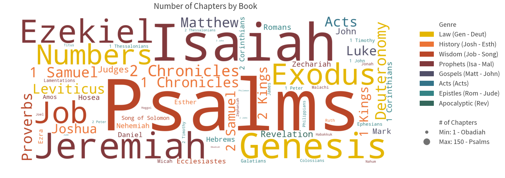
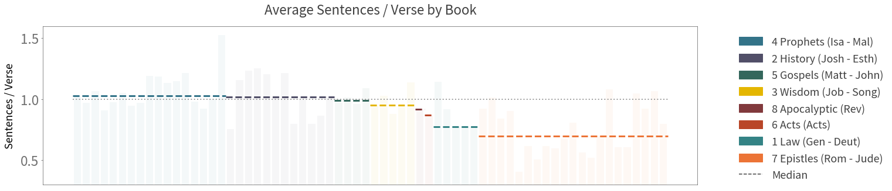

## Package Requirements

### Mac/Ubuntu Operating System
- Other OS-es have not been tested, and may cause unexpected errors.

## Cloning the Repository

Cloning the repository is not as straightforward due to the presence of git submodules.

Please replicate the steps below in Terminal to ensure success.

``` sh
# Clone the repo as usual
git clone https://github.com/lemuelkumarga/bible-network

# Initialize submodule
cd bible-network
git submodule init
git submodule update

# When cloned, submodules are detached from the HEAD. We attempt to rectify this issue to prevent problems in git
cd shared
git checkout -b tmp
git checkout master
git merge tmp
git branch -d tmp

# Return to original folder if desired
cd ../../
```


# Constructing Social Networks in the Bible

### <i>Lemuel Kumarga</i>


## Problem Description

Our social circles are huge parts of our lives. They represent who we interact with, and how much we interact with them. With the digitization of communication and socialization, finding out this circle within each individual is an easier task than before. A simple glimpse into social networking sites such as Facebook and LinkedIn allows us to see who our friends are, whilst the frequency of digital communication can be used as a proxy of our closeness with them.

However, such information was not easily quantifiable in the pre-technology era. By attempting to model past lives using modern concepts, we could potentially gain further information about the past. For this project, we will use Natural Language Processing (NLP) concepts to <b>construct a social network for the bible, with the aim to depeen our understanding of the gospel.</b>


## Preliminaries

First load the necessary modules for this exercise.


```python
import sys
sys.path.append('shared/')
from defaults import *

# Load All Main Modules
load({"pd":"pandas",
      "cl":"collections",
      "np":"numpy",
      "sp":"scipy",
      "mpl":"matplotlib",
      "nltk":"nltk"})

# Load All Submodules
from collections import OrderedDict

import matplotlib.pyplot as plt
import matplotlib.lines as mlines
import matplotlib.patches as mpatches
# If you can't find the module, run nltk.download() in python
from nltk import sent_tokenize, word_tokenize

defaults()
```


<link href="shared/css/defaults.css" rel="stylesheet"><link href="../../shared/css/definitions.css" rel="stylesheet"><link href="../../shared/css/general.css" rel="stylesheet"><link href="shared/css/python.css" rel="stylesheet"><script src="https://ajax.googleapis.com/ajax/libs/jquery/3.3.1/jquery.min.js"></script><script src="https://maxcdn.bootstrapcdn.com/bootstrap/3.3.7/js/bootstrap.min.js"></script><script src="shared/js/styles.js"></script><script src="shared/js/popover.js"></script>


## Exploration

### Loading the Data

For this exercise, we will be using the bible <a data-toggle="popover" title="" data-content="A collection of texts" data-original-title="Corpus">corpus</a> from <a href="https://www.kaggle.com/oswinrh/bible/data">Kaggle.</a> The data will be stored in abbreviated book keys, with each book containing the following attributes:

* <span class="hl">Book Name</span>: Full name of the book
* <span class="hl">Testament</span>: New (NT) or old (OT)
* <span class="hl">Genre</span>: Genre of the book
* <span class="hl">Chapters</span>: Number of chapters
* <span class="hl">Verses</span>: Total number of verses
* <span class="hl">Text</span>: The actual text of the book


```python
# Get all book statistics
abb = pd.read_csv("data/key_abbreviations_english.csv")\
        .query('p == 1')[["a","b"]]\
        .rename(columns={"a" : "Key"})
ot_nt = pd.read_csv("data/key_english.csv")\
          .rename(columns={"n" : "Name", "t" : "Testament"})
genres = pd.read_csv("data/key_genre_english.csv")\
           .rename(columns={"n" : "Genre"})
genres["Genre"] = genres["g"].map(str) + " " + genres["Genre"]

# Load the main biblical text
bible = pd.read_csv("data/t_asv.csv")\
          .groupby("b", as_index=False)\
          .agg({"c": pd.Series.nunique, "v": "size", "t":" ".join})\
          .rename(columns={"c": "Chapters","v": "Verses","t": "Text"})

# Join the remaining book statistics
bible = bible.join(abb.set_index('b'), on='b')\
             .join(ot_nt.set_index('b'), on='b')\
             .join(genres.set_index('g'), on='g')\
             .drop(['b', 'g'], axis=1)\
             .set_index('Key')\
             [["Name","Testament","Genre","Chapters","Verses","Text"]]
            
# Show the first few lines
bible.head(5)
```


<div>
<style scoped>
    .dataframe tbody tr th:only-of-type {
        vertical-align: middle;
    }

    .dataframe tbody tr th {
        vertical-align: top;
    }

    .dataframe thead th {
        text-align: right;
    }
</style>
<table border="1" class="dataframe">
  <thead>
    <tr style="text-align: right;">
      <th></th>
      <th>Name</th>
      <th>Testament</th>
      <th>Genre</th>
      <th>Chapters</th>
      <th>Verses</th>
      <th>Text</th>
    </tr>
    <tr>
      <th>Key</th>
      <th></th>
      <th></th>
      <th></th>
      <th></th>
      <th></th>
      <th></th>
    </tr>
  </thead>
  <tbody>
    <tr>
      <th>Gen</th>
      <td>Genesis</td>
      <td>OT</td>
      <td>1 Law</td>
      <td>50</td>
      <td>1533</td>
      <td>In the beginning God created the heavens and t...</td>
    </tr>
    <tr>
      <th>Exo</th>
      <td>Exodus</td>
      <td>OT</td>
      <td>1 Law</td>
      <td>40</td>
      <td>1213</td>
      <td>Now these are the names of the sons of Israel,...</td>
    </tr>
    <tr>
      <th>Lev</th>
      <td>Leviticus</td>
      <td>OT</td>
      <td>1 Law</td>
      <td>27</td>
      <td>859</td>
      <td>And Jehovah called unto Moses, and spake unto ...</td>
    </tr>
    <tr>
      <th>Num</th>
      <td>Numbers</td>
      <td>OT</td>
      <td>1 Law</td>
      <td>36</td>
      <td>1288</td>
      <td>And Jehovah spake unto Moses in the wilderness...</td>
    </tr>
    <tr>
      <th>Deut</th>
      <td>Deuteronomy</td>
      <td>OT</td>
      <td>1 Law</td>
      <td>34</td>
      <td>959</td>
      <td>These are the words which Moses spake unto all...</td>
    </tr>
  </tbody>
</table>
</div>


### About the Data

We will also derive some language statistics from each book, mainly:

* <span class="hl">Sentences</span>: Number of sentences in each book.
* <span class="hl">Words</span>: Number of words in each book.


```python
# Add Sentences and Words columns
bible["Sentences"] = pd.Series(0, index=bible.index)
bible["Words"] = pd.Series(0, index=bible.index)

# Save Tokens
sent_tokens = OrderedDict()
word_tokens = OrderedDict()

for i, r in bible[["Text"]].iterrows():
    txt = r.str.cat()
    sent_tokens[i] = sent_tokenize(txt)
    word_tokens[i] = word_tokenize(txt)
    bible.at[i,'Sentences'] = len(sent_tokens[i])
    bible.at[i,'Words'] = len(word_tokens[i])

# Show
bible[["Name","Testament","Genre","Chapters","Verses","Sentences","Words"]].head(5)
```


<div>
<style scoped>
    .dataframe tbody tr th:only-of-type {
        vertical-align: middle;
    }

    .dataframe tbody tr th {
        vertical-align: top;
    }

    .dataframe thead th {
        text-align: right;
    }
</style>
<table border="1" class="dataframe">
  <thead>
    <tr style="text-align: right;">
      <th></th>
      <th>Name</th>
      <th>Testament</th>
      <th>Genre</th>
      <th>Chapters</th>
      <th>Verses</th>
      <th>Sentences</th>
      <th>Words</th>
    </tr>
    <tr>
      <th>Key</th>
      <th></th>
      <th></th>
      <th></th>
      <th></th>
      <th></th>
      <th></th>
      <th></th>
    </tr>
  </thead>
  <tbody>
    <tr>
      <th>Gen</th>
      <td>Genesis</td>
      <td>OT</td>
      <td>1 Law</td>
      <td>50</td>
      <td>1533</td>
      <td>1756</td>
      <td>44879</td>
    </tr>
    <tr>
      <th>Exo</th>
      <td>Exodus</td>
      <td>OT</td>
      <td>1 Law</td>
      <td>40</td>
      <td>1213</td>
      <td>1116</td>
      <td>37232</td>
    </tr>
    <tr>
      <th>Lev</th>
      <td>Leviticus</td>
      <td>OT</td>
      <td>1 Law</td>
      <td>27</td>
      <td>859</td>
      <td>664</td>
      <td>27278</td>
    </tr>
    <tr>
      <th>Num</th>
      <td>Numbers</td>
      <td>OT</td>
      <td>1 Law</td>
      <td>36</td>
      <td>1288</td>
      <td>996</td>
      <td>37053</td>
    </tr>
    <tr>
      <th>Deut</th>
      <td>Deuteronomy</td>
      <td>OT</td>
      <td>1 Law</td>
      <td>34</td>
      <td>959</td>
      <td>745</td>
      <td>32120</td>
    </tr>
  </tbody>
</table>
</div>


```python
def plot_overview_stats(attribute, title, ylabel):

    groups = bible.groupby("Genre",sort=False)

    # Get Colors
    color_pal = get_color("palette")(len(groups))
    color_dict = { }
    ind = 0
    for name in groups.groups.keys():
        color_dict[name] = color_pal[ind]
        ind += 1
    
    plt.figure(figsize=(20,5))

    # Add Titles and Labels
    plt.title(title)
    plt.xticks([])
    plt.ylabel(ylabel)

    # Legend container
    ind = 0
    legends = []
    
    for name, group in sorted(groups, key=lambda g: np.mean(g[1][attribute]), reverse=True):
        
        row_ids = list(range(ind, ind + len(group.index)))
        middle = np.mean(group[attribute])
        
        # Plot the Bar Graphs
        plt.bar(row_ids,
                group[attribute],
                color= fade_color(color_dict[name],0.05))

        # Plot Average Lines
        plt.plot([min(row_ids) - 0.5, max(row_ids) + 0.5],
                 [middle, middle],
                 color = color_dict[name],
                 linestyle = "dashed",
                 linewidth = 3)

        # Configure Legends
        legend_text = name + " (" + group.index[0]
        if (len(group.index) > 1):
            legend_text += " - " + group.index[-1]
        legend_text += ")"
        legends.append(mpatches.Patch(color=color_dict[name], label=legend_text))
        ind += len(group.index)

    # Add Line Legend
    legends.append(mlines.Line2D([],[],color=txt_color, label='Average', linestyle ="dashed"))
    plt.legend(handles=legends, bbox_to_anchor=[1.3, 1.])

    
plot_overview_stats("Chapters", "Number of Chapters by Book", "# of Chapters")
plt.ylim(0,50)
plt.show()
```





```python
bible["Verses_p_Chapter"] = bible["Verses"] / bible["Chapters"]
plot_overview_stats("Verses_p_Chapter", "Average Verses / Chapter by Book", "Verses / Chapter")
plt.ylim(10,50)
plt.show()
```


```python
bible["Sentences_p_Verse"] = bible["Sentences"] / bible["Verses"]
plot_overview_stats("Sentences_p_Verse", "Average Sentences / Verse by Book", "Sentences / Verse")
plt.plot([0-0.5, len(bible.index)-0.5],
         [1, 1],
         color = fade_color(ltxt_color,0.5),
         linestyle = "dotted",
         linewidth = 2)
plt.ylim(0.3,1.6)
plt.show()
```





```python
bible["Words_p_Sentence"] = bible["Words"] / bible["Sentences"]
plot_overview_stats("Words_p_Sentence", "Average Words / Sentence by Book", "Words / Sentence")
plt.ylim(15,60)
plt.show()

```


### Preliminary Insights

## Preparation

### Finding the Characters

### Cleaning Up the Errors

### Insights

## Constructing the Network

### Building Networks and Edges

### The Social Network

### Network Slices

## Summary of Results
